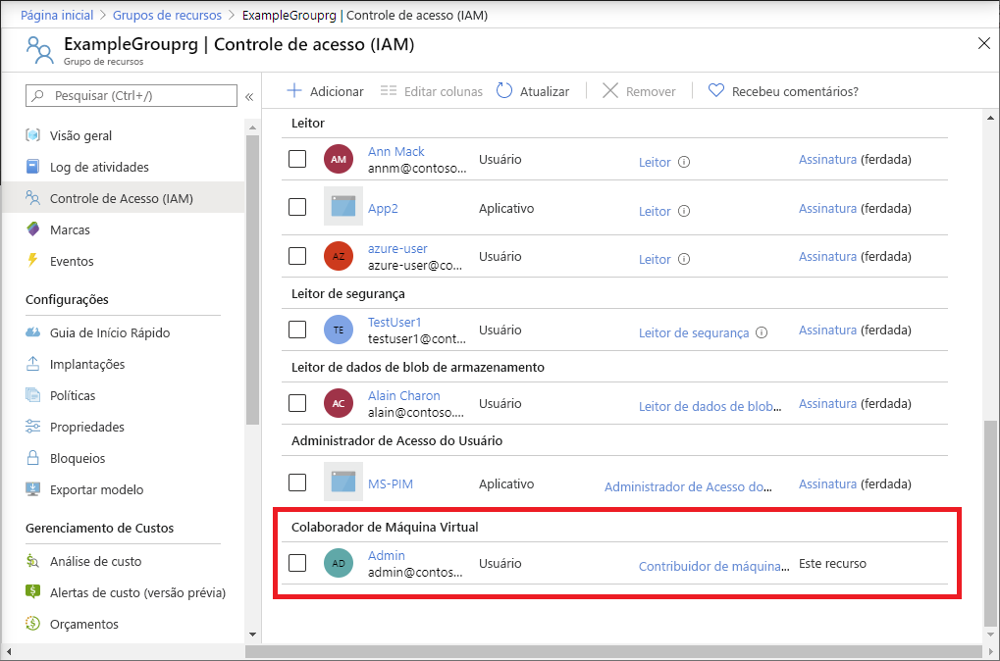

# <a name="quickstart-assign-an-azure-role-using-an-arm-template"></a>Início rápido: Atribuir uma função do Azure usando um modelo do ARM

O [Azure RBAC (controle de acesso baseado em função do Azure)](overview.md) é a maneira usada para gerenciar o acesso aos recursos no Azure. Neste início rápido, você cria um grupo de recursos e permite acesso a um usuário para criar e gerenciar máquinas virtuais no grupo de recursos. Este guia de início rápido usa um modelo do ARM (Azure Resource Manager) para permitir o acesso.

[!INCLUDE [About Azure Resource Manager](../../includes/resource-manager-quickstart-introduction.md)]

Se seu ambiente atender aos pré-requisitos e você estiver familiarizado com o uso de modelos ARM, selecione o botão **Implantar no Azure**. O modelo será aberto no portal do Azure.

[](https://portal.azure.com/#create/Microsoft.Template/uri/https%3A%2F%2Fraw.githubusercontent.com%2FAzure%2Fazure-quickstart-templates%2Fmaster%2F101-rbac-builtinrole-resourcegroup%2Fazuredeploy.json)

## <a name="prerequisites"></a>Pré-requisitos

Para atribuir funções do Azure e remover atribuições de função, você precisa ter:

- Se você não tiver uma assinatura do Azure, crie uma [conta gratuita](https://azure.microsoft.com/free/?WT.mc_id=A261C142F) antes de começar.
- as permissões `Microsoft.Authorization/roleAssignments/write` e `Microsoft.Authorization/roleAssignments/delete`, como [Administrador de Acesso do Usuário](built-in-roles.md#user-access-administrator) ou [Proprietário](built-in-roles.md#owner)
- Para atribuir uma função você precisa especificar três elementos: entidade de segurança, definição de função e escopo. Para este início rápido, a entidade de segurança é você ou outro usuário no seu diretório, a definição de função é [Colaborador de Máquina Virtual](built-in-roles.md#virtual-machine-contributor) e o escopo é um grupo de recursos especificado por você.

## <a name="review-the-template"></a>Examinar o modelo

O modelo usado neste início rápido é proveniente dos [Modelos de Início Rápido do Azure](https://azure.microsoft.com/resources/templates/101-rbac-builtinrole-resourcegroup/). O modelo tem três parâmetros e uma seção de recursos. Na seção de recursos, observe se ele tem os três elementos de uma atribuição de função: entidade de segurança, definição de função e escopo.

:::code language="json" source="~/quickstart-templates/101-rbac-builtinrole-resourcegroup/azuredeploy.json":::

O recurso definido no modelo inclui:

- [Microsoft.Authorization/roleAssignments](/azure/templates/Microsoft.Authorization/roleAssignments)

## <a name="deploy-the-template"></a>Implantar o modelo

1. Entre no [portal do Azure](https://portal.azure.com).

1. Determine o seu endereço de email associado à sua assinatura do Azure. Ou determine o endereço de email de outro usuário no seu diretório.

1. Abra o Azure Cloud Shell para PowerShell.

1. Copie e cole o script a seguir no Cloud Shell.

    ```azurepowershell
    $resourceGroupName = Read-Host -Prompt "Enter a resource group name (i.e. ExampleGrouprg)"
    $emailAddress = Read-Host -Prompt "Enter an email address for a user in your directory"
    $location = Read-Host -Prompt "Enter a location (i.e. centralus)"
    
    $roleAssignmentName = New-Guid
    $principalId = (Get-AzAdUser -Mail $emailAddress).id
    $roleDefinitionId = (Get-AzRoleDefinition -name "Virtual Machine Contributor").id
    $templateUri = "https://raw.githubusercontent.com/Azure/azure-quickstart-templates/master/101-rbac-builtinrole-resourcegroup/azuredeploy.json"
    
    New-AzResourceGroup -Name $resourceGroupName -Location $location
    New-AzResourceGroupDeployment -ResourceGroupName $resourceGroupName -TemplateUri $templateUri -roleAssignmentName $roleAssignmentName -roleDefinitionID $roleDefinitionId -principalId $principalId
    ```

1. Insira um nome do grupo de recursos, como ExampleGrouprg.

1. Insira um endereço de email para você mesmo ou para outro usuário no seu diretório.

1. Insira uma localização para o grupo de recursos, como centralus.

1. Se necessário, pressione Enter para executar o comando New-AzResourceGroupDeployment.

    O comando [New-AzResourceGroup](/powershell/module/az.resources/new-azresourcegroup) cria um grupo de recursos e o comando [New-AzResourceGroupDeployment](/powershell/module/az.resources/new-azresourcegroupdeployment) implanta o modelo para adicionar a atribuição de função.

    Será exibida uma saída semelhante à seguinte:

    ```azurepowershell
    PS> New-AzResourceGroupDeployment -ResourceGroupName $resourceGroupName -TemplateUri $templateUri -roleAssignmentName $roleAssignmentName -roleDefinitionID $roleDefinitionId -principalId $principalId
    
    DeploymentName          : azuredeploy
    ResourceGroupName       : ExampleGrouprg
    ProvisioningState       : Succeeded
    Timestamp               : 5/22/2020 9:01:30 PM
    Mode                    : Incremental
    TemplateLink            :
                              Uri            : https://raw.githubusercontent.com/Azure/azure-quickstart-templates/master/101-rbac-builtinrole-resourcegroup/azuredeploy.json
                              ContentVersion : 1.0.0.0
    
    Parameters              :
                              Name                  Type                       Value
                              ====================  =========================  ==========
                              roleAssignmentName    String                     {roleAssignmentName}
                              roleDefinitionID      String                     9980e02c-c2be-4d73-94e8-173b1dc7cf3c
                              principalId           String                     {principalId}
    
    Outputs                 :
    DeploymentDebugLogLevel :
    ```

## <a name="review-deployed-resources"></a>Examinar os recursos implantados

1. No portal do Azure, abra o grupo de recursos que você criou.

1. No menu à esquerda, clique em **Controle de acesso (IAM)** .

1. Clique na guia **Atribuições de função**.

1. Verifique se a função **Colaborador de Máquina Virtual** está atribuída ao usuário especificado.

   

## <a name="clean-up-resources"></a>Limpar os recursos

Para remover a atribuição de função e o grupo de recursos que você criou, siga estas etapas.

1. Copie e cole o script a seguir no Cloud Shell.

    ```azurepowershell
    $emailAddress = Read-Host -Prompt "Enter the email address of the user with the role assignment to remove"
    $resourceGroupName = Read-Host -Prompt "Enter the resource group name to remove (i.e. ExampleGrouprg)"
    
    $principalId = (Get-AzAdUser -Mail $emailAddress).id
    
    Remove-AzRoleAssignment -ObjectId $principalId -RoleDefinitionName "Virtual Machine Contributor" -ResourceGroupName $resourceGroupName
    Remove-AzResourceGroup -Name $resourceGroupName
    ```
    
1. Insira o endereço de email do usuário com a atribuição de função a ser removida.

1. Insira um nome do grupo de recursos a ser removido, como ExampleGrouprg.

1. Se necessário, pressione Enter para executar o comando Remove-AzResourceGroup.

1. Insira **Y** para confirmar que deseja remover o grupo de recursos.

## <a name="next-steps"></a>Próximas etapas

> [!div class="nextstepaction"]
> [Tutorial: Conceder a um usuário acesso aos recursos do Azure usando o Azure PowerShell](tutorial-role-assignments-user-powershell.md)