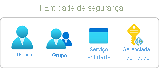
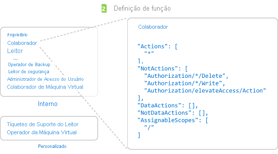
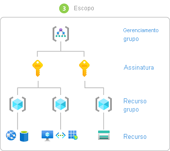

# Etapas para adicionar uma atribuição de função

[!INCLUDE [Azure RBAC definition grant access](../../includes/role-based-access-control/definition-grant.md)] Este artigo descreve as etapas de alto nível para adicionar uma atribuição de função usando o [portal do Azure](role-assignments-portal.md), [Azure PowerShell](role-assignments-powershell.md), [CLI do Azure](role-assignments-cli.md)ou a [API REST](role-assignments-rest.md).

## Etapa 1: determinar quem precisa de acesso

Primeiro, você precisa determinar quem precisa de acesso. Você pode atribuir uma função a um usuário, grupo, entidade de serviço ou identidade gerenciada. Isso também é chamado de *entidade de segurança*.

- Usuário – Um indivíduo que tem um perfil no Azure Active Directory. Você também pode atribuir funções a usuários em outros locatários. Para obter informações sobre usuários de outras organizações, consulte [Azure Active Directory B2B](../active-directory/external-identities/what-is-b2b.md).
- Grupo - Um grupo de usuários criados no Azure Active Directory. Quando você atribuir uma função a um grupo, todos os usuários dentro desse grupo têm essa função. 
- Entidade de serviço - Uma identidade de segurança usada por aplicativos ou serviços para acessar recursos específicos do Azure. Você pode pensar nela como uma *identidade do usuário* (nome de usuário e senha ou certificado) para um aplicativo.
- Identidade gerenciada - uma identidade no Azure Active Directory que é gerenciada automaticamente pelo Azure. Normalmente, você usa [identidades gerenciadas](../active-directory/managed-identities-azure-resources/overview.md) durante o desenvolvimento de aplicativos em nuvem para gerenciar as credenciais de autenticação nos serviços do Azure.

## Etapa 2: selecionar a função apropriada

As permissões são agrupadas em uma *definição de função*. Normalmente ela é chamada apenas de *função*. Você pode selecionar em uma lista de várias funções internas. Se as funções internas não atenderem às necessidades específicas da sua organização, você poderá criar suas próprias funções personalizadas.

A seguir são listadas quatro funções internas fundamentais. As três primeiras se aplicam a todos os tipos de recursos.

- [Proprietário](built-in-roles.md#owner) - Possui acesso total a todos os recursos, inclusive o direito de delegar acesso a outros usuários.
- [Colaborador](built-in-roles.md#contributor) – Pode criar e gerenciar todos os tipos de recursos do Azure, mas não pode permitir acesso a outras pessoas.
- [Leitor](built-in-roles.md#reader) - Pode exibir os recursos existentes do Azure.
- [Administrador de Acesso do Usuário](built-in-roles.md#user-access-administrator) - Permite gerenciar o acesso do usuário aos recursos do Azure.

As demais funções internas permitem o gerenciamento de recursos específicos do Azure. Por exemplo, a função [Colaborador de Máquina Virtual](built-in-roles.md#virtual-machine-contributor) permite que um usuário crie e gerencie máquinas virtuais.

1. Comece com o artigo abrangente, [Funções internas do Azure](built-in-roles.md). A tabela na parte superior do artigo é um índice dos detalhes presentes mais adiante neste artigo.

1. Nesse artigo, navegue até a categoria de serviço (como computação, armazenamento e bancos de dados) para o recurso ao qual você deseja conceder permissões. Normalmente, a maneira mais fácil de encontrar o que você está procurando é pesquisar a página em busca de uma palavra-chave relevante, como "blob", "máquina virtual" e assim por diante.

1. Examine as funções listadas para a categoria de serviço e identifique as operações específicas de que você precisa. Novamente, sempre comece com a função mais restritiva.

    Por exemplo, se uma entidade de segurança precisar ler BLOBs em uma conta de armazenamento do Azure, mas não precisar de acesso de gravação, escolha [leitor de dados de armazenamento](built-in-roles.md#storage-blob-data-reader) de BLOB em vez de colaborador de dados de blob de [armazenamento](built-in-roles.md#storage-blob-data-contributor) (e definitivamente não a função de proprietário de dados de [blob de armazenamento](built-in-roles.md#storage-blob-data-owner) no nível de administrador). Você sempre pode atualizar as atribuições de função posteriormente, conforme necessário.

1. Se você não encontrar uma função adequada, poderá criar uma [função personalizada](custom-roles.md).

## Etapa 3: identificar o escopo necessário

*Escopo* é o conjunto de recursos ao qual o acesso se aplica. No Azure, você pode especificar um escopo em quatro níveis: [grupo de gerenciamento](../governance/management-groups/overview.md), assinatura, [grupo de recursos](../azure-resource-manager/management/overview.md#resource-groups)e recurso. Os escopos são estruturados em uma relação pai-filho. Cada nível de hierarquia torna o escopo mais específico. Você pode atribuir funções em qualquer um desses níveis de escopo. O nível selecionado determina o quanto a função é amplamente aplicada. Níveis inferiores herdam permissões de função de níveis superiores. 

Quando você atribui uma função em um escopo pai, essas permissões são herdadas para os escopos filho. Por exemplo:

- Se você atribuir a função [leitor](built-in-roles.md#reader) a um usuário no escopo do grupo de gerenciamento, esse usuário poderá ler tudo em todas as assinaturas no grupo de gerenciamento.
- Se você atribuir a função de [leitor de cobrança](built-in-roles.md#billing-reader) a um grupo no escopo da assinatura, os membros desse grupo poderão ler dados de cobrança para cada grupo de recursos e recurso na assinatura.
- Se você atribuir a função [Colaborador](built-in-roles.md#contributor) a um aplicativo no escopo do grupo de recursos, ele pode gerenciar recursos de todos os tipos nesse mesmo grupo de recursos, mas não em outros grupos de recursos na assinatura.

 Para obter mais informações, consulte [entender o escopo](scope-overview.md).

## Etapa 4. Verifique seus pré-requisitos

Para atribuir funções, você deve estar conectado com um usuário que recebe uma função com permissão de gravação de atribuições de função, como [proprietário](built-in-roles.md#owner) ou [administrador de acesso do usuário](built-in-roles.md#user-access-administrator) no escopo ao qual você está tentando atribuir a função. Da mesma forma, para remover uma atribuição de função, você deve ter a permissão de exclusão de atribuições de função.

- `Microsoft.Authorization/roleAssignments/write`
- `Microsoft.Authorization/roleAssignments/delete`

Se a sua conta de usuário não tiver permissão para atribuir uma função na sua assinatura, você verá uma mensagem de erro informando que sua conta "não tem autorização para executar a ação 'Microsoft.Authorization/roleAssignments/write'." Nesse caso, entre em contato com os administradores da sua assinatura, pois eles podem atribuir as permissões em seu nome.

## Etapa 5. Adicionar atribuição de função

Depois de saber a entidade de segurança, a função e o escopo, você pode atribuir a função. Você pode adicionar atribuições de função usando o portal do Azure, Azure PowerShell, CLI do Azure, SDKs do Azure ou APIs REST. Em cada assinatura, você pode ter até **2 mil** atribuições de função. Esse limite inclui atribuições de função na assinatura, no grupo de recursos e nos escopos de recursos. Você pode ter até **500** atribuições de função em cada grupo de gerenciamento.

Confira os artigos a seguir para obter as etapas detalhadas de como adicionar atribuições de função.

- [Adicionar ou remover atribuições de função do Azure usando o portal do Azure](role-assignments-portal.md)
- [Adicionar ou remover atribuições de função do Azure usando o Azure PowerShell](role-assignments-powershell.md)
- [Adicionar ou remover atribuições de função do Azure usando a CLI do Azure](role-assignments-cli.md)
- [Adicionar ou remover atribuições de função do Azure usando a API REST](role-assignments-rest.md)

## Próximas etapas

- [Tutorial: Conceder acesso aos recursos do Azure para um usuário usando o portal do Azure](quickstart-assign-role-user-portal.md)