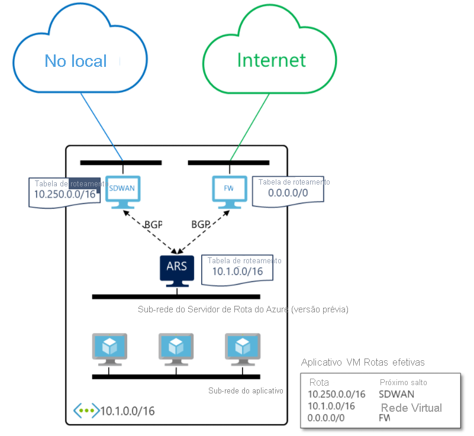

# O que é o Servidor de Rota do Azure (versão prévia)? 

O Servidor de Rota do Azure simplifica o roteamento dinâmico entre a NVA (solução de virtualização de rede) e a rede virtual. Permite trocar informações de roteamento diretamente por meio do protocolo de roteamento BGP (Border Gateway Protocol) entre qualquer NVA que dê suporte ao protocolo de roteamento BGP e a SDN (rede definida pelo software) do Azure na rede virtual do Azure (VNET), sem a necessidade de configurar ou manter manualmente as tabelas de rotas. O Servidor de Rota do Azure é um serviço totalmente gerenciado, além de ser configurado com alta disponibilidade.

> [!IMPORTANT]
> No momento, o Servidor de Rota do Azure (versão prévia) está na versão prévia pública.
> Essa versão prévia é fornecida sem um contrato de nível de serviço e não é recomendada para cargas de trabalho de produção. Alguns recursos podem não ter suporte ou podem ter restrição de recursos.
> Para obter mais informações, consulte [Termos de Uso Complementares de Versões Prévias do Microsoft Azure](https://azure.microsoft.com/support/legal/preview-supplemental-terms/).

## Como ele funciona?

O diagrama a seguir ilustra como o Servidor de Rota do Azure funciona com uma NVA de SD-WAN e uma NVA de segurança em uma rede virtual. Depois de estabelecer o emparelhamento via protocolo BGP, o Servidor de Rota do Azure receberá uma rota local (10.250.0.0/16) do dispositivo de SD-WAN e uma rota padrão (0.0.0.0/0) do firewall. Essas rotas são configuradas automaticamente nas VMs na rede virtual. Como resultado, todo o tráfego destinado à rede local será enviado para o dispositivo de SD-WAN. Enquanto todo o tráfego de entrada na Internet será enviado ao firewall. Na direção oposta, o Servidor de Rota do Azure enviará o endereço de rede virtual (10.1.0.0/16) para ambas as NVAs. O dispositivo de SD-WAN pode propagá-lo também para a rede local.

## Principais benefícios 

O Servidor de Rota do Azure simplifica a configuração, o gerenciamento e a implantação da NVA na rede virtual.  

* Você não precisa mais atualizar manualmente a tabela de roteamento na NVA sempre que os endereços de rede virtual forem atualizados. 

* Você não precisa mais atualizar as [rotas definidas pelo usuário](../virtual-network/virtual-networks-udr-overview.md) manualmente sempre que a NVA anunciar novas rotas ou retirar as antigas. 

* Você pode emparelhar várias instâncias do seu NVA com o Servidor de Rota do Azure. Você pode configurar os atributos de BGP no seu NVA e, dependendo do seu design (por exemplo, ativo-ativo para desempenho ou ativo-passivo para resiliência), informe ao Servidor de Rota do Azure qual instância NVA está ativa ou qual é passiva. 

* A interface entre a NVA e o Servidor de Rota do Azure é baseada em um protocolo padrão comum. Contanto que a NVA dê suporte ao BGP, pode ser emparelhada com o Servidor de Rota do Azure. Para obter mais informações, confira [Protocolos de roteamento com suporte do Servidor de Rota](route-server-faq.md#protocol).

* Você pode implantar o Servidor de Rota do Azure em qualquer uma das redes virtuais novas ou existentes. 

## Perguntas frequentes

Para perguntas frequentes sobre o Servidor de Rotas do Azure, confira [Perguntas frequentes sobre o Servidor de Rota do Azure](route-server-faq.md).

## Próximas etapas

- [Saiba como configurar o Servidor de Rota do Azure](quickstart-configure-route-server-powershell.md)
- [Saiba como o Servidor de Rota do Azure funciona com o Azure ExpressRoute e a VPN do Azure](expressroute-vpn-support.md)
