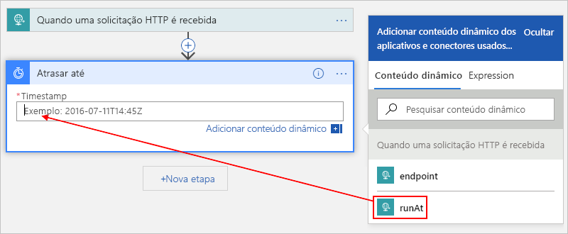
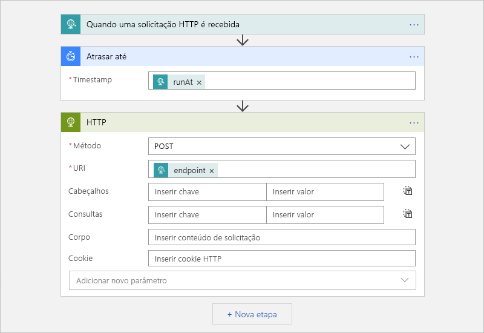

# <a name="migrate-azure-scheduler-jobs-to-azure-logic-apps"></a>Migrar trabalhos do Agendador do Azure para Aplicativos Lógicos do Azure

> [!IMPORTANT]
> O [aplicativo lógico do Azure](../logic-apps/logic-apps-overview.md) está substituindo o Agendador do Azure, que está [sendo desativado](#retire-date). Para continuar trabalhando com os trabalhos que você configurou no Agendador, migre para o aplicativo lógico do Azure assim que possível, seguindo este artigo. 
>
> O Agendador não está mais disponível na portal do Azure, mas a [API REST](/rest/api/scheduler) e os [cmdlets do PowerShell do Agendador do Azure](scheduler-powershell-reference.md) permanecem disponíveis no momento para que você possa gerenciar seus trabalhos e coleções de trabalhos.

Este artigo mostra como é possível agendar trabalhos únicos e recorrentes criando fluxos de trabalho automatizados com os Aplicativos Lógicos do Azure, em vez de com o Agendador do Azure. Quando você cria trabalhos agendados com Aplicativos Lógicos, você tem estes benefícios:

* Crie seu trabalho usando um designer visual e [conectores prontos para uso](../connectors/apis-list.md) de centenas de serviços, como o armazenamento de BLOBs do Azure, o barramento de serviço do Azure, o Office 365 Outlook e o SAP.

* Gerencie cada fluxo de trabalho agendado como um recurso do Azure de primeira classe. Você não precisa se preocupar com o conceito de uma *coleção de trabalhos* porque cada aplicativo lógico é um recurso individual do Azure.

* Execute vários trabalhos únicos usando um único aplicativo lógico.

* Defina agendas que dão suporte a fusos horários e se ajustem automaticamente para o horário de Verão (DST).

Para saber mais, confira [o que são os aplicativos lógicos do Azure?](../logic-apps/logic-apps-overview.md) ou tente criar seu primeiro aplicativo lógico neste guia de início rápido: [crie seu primeiro aplicativo lógico](../logic-apps/quickstart-create-first-logic-app-workflow.md).

## <a name="prerequisites"></a>Pré-requisitos

* Uma assinatura do Azure. Se você não tiver uma assinatura do Azure, [inscreva-se em uma conta gratuita do Azure](https://azure.microsoft.com/free/).

* Para disparar seu aplicativo lógico enviando solicitações HTTP, use uma ferramenta como o [aplicativo da área de trabalho Postman](https://www.getpostman.com/apps).

## <a name="migrate-by-using-a-script"></a>Migrar usando um script

Cada trabalho do Agendador é exclusivo, portanto, não existe uma ferramenta de tamanho único para migrar trabalhos do Agendador para os aplicativos lógicos do Azure. No entanto, você pode [Editar esse script](https://github.com/Azure/logicapps/tree/master/scripts/scheduler-migration) para atender às suas necessidades.

## <a name="schedule-one-time-jobs"></a>Agendar trabalhos únicos

É possível executar trabalhos únicos criando apenas um único aplicativo lógico.

1. No [portal do Azure](https://portal.azure.com), crie um aplicativo lógico em branco no Designer de Aplicativo Lógico.

   Para obter as etapas básicas, siga [Início Rápido: Crie seu primeiro aplicativo lógico](../logic-apps/quickstart-create-first-logic-app-workflow.md).

1. Na caixa de pesquisa, insira `when a http request` para localizar o gatilho de solicitação. Na lista de gatilhos, selecione este gatilho: **Quando uma solicitação HTTP for recebida**

   

1. Para o gatilho de solicitação, você pode opcionalmente fornecer um esquema JSON, que ajuda o designer de aplicativo lógico a entender a estrutura das entradas incluídas na chamada de entrada para o gatilho de solicitação e torna as saídas mais fáceis de selecionar posteriormente no fluxo de trabalho.

   Na caixa **esquema JSON do corpo da solicitação** , insira o esquema, por exemplo:

   

   Se você não tem um esquema, mas tem um conteúdo de exemplo no formato JSON, você pode gerar um esquema com base nesse conteúdo.

   1. No gatilho de Solicitação, selecione **Usar o conteúdo de amostra para gerar o esquema**.

   1. Em **Inserir ou colar um exemplo de carga JSON**, forneça seu conteúdo de exemplo e selecione **concluído**, por exemplo:

      

      ```json
      {
         "runat": "2012-08-04T00:00Z",
         "endpoint": "https://www.bing.com"
      }
      ```

1. No gatilho, selecione **próxima etapa**.

1. Na caixa de pesquisa, insira `delay until` como o filtro. Na lista de ações, selecione esta ação: **Atrasar até**

   Essa ação pausa seu fluxo de trabalho do aplicativo lógico até uma data e hora especificadas.

   

1. Insira o carimbo de data/hora para quando você desejar iniciar o fluxo de trabalho d aplicativo lógico.

   Quando você clica dentro da caixa **timestamp** , a lista de conteúdo dinâmico é exibida para que você possa, opcionalmente, selecionar uma saída do gatilho.

   

1. Adicione outras ações que você deseja executar selecionando entre [centenas de conectores prontos para uso](../connectors/apis-list.md).

   Por exemplo, é possível incluir uma ação HTTP que envia uma solicitação para uma URL ou ações que funcionam com Filas de Armazenamento, filas ou tópicos de Barramento de Serviço:

   

1. Quando terminar, salve o aplicativo lógico.

   

   Quando você salva seu aplicativo lógico pela primeira vez, a URL do ponto de extremidade do Gatilho de solicitação do seu aplicativo lógico é exibido na caixa **URL DE HTTP POST**. Quando você desejar chamar seu aplicativo lógico e enviar entradas para ele processar, use esta URL como o destino da chamada.

   

1. Copie e salve esta URL de ponto de extremidade para poder enviar posteriormente uma solicitação manual que dispara seu aplicativo lógico.

## <a name="start-a-one-time-job"></a>Iniciar um trabalho único

Para executar manualmente ou disparar um trabalho único, envie uma chamada para a URL de ponto de extremidade para o Gatilho de solicitação do seu aplicativo lógico. Nessa chamada, especifique a entrada ou o conteúdo a ser enviado, que talvez você tenha descrito anteriormente especificando um esquema.

Por exemplo, usando o aplicativo de postmaster, você pode criar uma solicitação POST com as configurações semelhantes a este exemplo e, em seguida, selecione **Enviar** para fazer a solicitação.

| Método de solicitação | URL | Corpo | headers |
|----------------|-----|------|---------|
| **POST** | <*ponto de extremidade-URL*> | **recebem** <p>**JSON(aplicativo/json)** <p>Na caixa **bruto** , insira a carga que você deseja enviar na solicitação. <p>**Observação**: essa configuração define automaticamente os valores **Cabeçalhos**. | **Chave**: tipo de conteúdo <br>**Valor**: aplicativo/JSON |
|||||


Após enviar a chamada, a resposta do seu aplicativo lógico será exibida na caixa **raw** na guia **Corpo**. 

<a name="workflow-run-id"></a>

> [!IMPORTANT]
>
> Se você quiser cancelar o trabalho mais tarde, selecione a guia **cabeçalhos** . Localize e copie o valor do cabeçalho **x-MS-Workflow-Run-ID** na resposta. 
>
> 

## <a name="cancel-a-one-time-job"></a>Cancelar um trabalho único

Nos Aplicativos Lógicos, cada trabalho único é executado como uma instância de execução de aplicativo lógico individual. Para cancelar um trabalho único, é possível usar [Execuções de fluxo de trabalho – Cancelar](https://docs.microsoft.com/rest/api/logic/workflowruns/cancel) na API REST dos Aplicativos Lógicos. Quando você envia uma chamada para o gatilho, forneça a [ID de execução do fluxo de trabalho](#workflow-run-id).

## <a name="schedule-recurring-jobs"></a>Agendar trabalhos recorrentes

1. No [portal do Azure](https://portal.azure.com), crie um aplicativo lógico em branco no Designer de Aplicativo Lógico.

   Para obter as etapas básicas, siga [Início Rápido: Crie seu primeiro aplicativo lógico](../logic-apps/quickstart-create-first-logic-app-workflow.md).

1. Na caixa de pesquisa, insira "recorrência" como filtro. Na lista de gatilhos, selecione este gatilho: **Recorrência**

   

1. Configure um agendamento mais avançado se desejar.

   

   Para obter mais informações sobre opções de agendamento avançadas, consulte [criar e executar tarefas recorrentes e fluxos de trabalho com aplicativos lógicos do Azure](../connectors/connectors-native-recurrence.md).

1. Adicione outras ações desejadas, selecionando entre [centenas de pronto para uso](../connectors/apis-list.md). No gatilho, selecione **próxima etapa**. Localize e selecione as ações desejadas.

   Por exemplo, é possível incluir uma ação HTTP que envia uma solicitação para uma URL ou ações que funcionam com Filas de Armazenamento, filas ou tópicos de Barramento de Serviço:

   

1. Quando terminar, salve o aplicativo lógico.

   

## <a name="advanced-setup"></a>Configuração avançada

Veja outras maneiras como você pode personalizar seus trabalhos.

### <a name="retry-policy"></a>Política de repetição

Para controlar a maneira como uma ação tenta ser executada novamente em seu aplicativo lógico quando ocorrem falhas intermitentes, é possível definir a [política de repetição](../logic-apps/logic-apps-exception-handling.md#retry-policies) nas configurações de cada ação, por exemplo:

1. Abra o menu de reticências da ação (**...**) e selecione **configurações**.

   

1. Selecione a política de repetição que você deseja. Para obter informações sobre cada política, confira [Políticas de repetição](../logic-apps/logic-apps-exception-handling.md#retry-policies).

   

## <a name="handle-exceptions-and-errors"></a>Manipular exceções e erros

No Agendador do Azure, se a ação padrão não for executada, será possível executar uma ação alternativa que resolva a condição de erro. Nos Aplicativos Lógicos do Azure, também é possível realizar a mesma tarefa.

1. No designer de aplicativo lógico, acima da ação que você deseja manipular, mova o ponteiro sobre a seta entre as etapas e selecione **Adicionar uma ramificação paralela**.

   

1. Localize e selecione a ação que você deseja executa como a ação alternativa.

   

1. Na ação alternativa, abra o menu de reticências (**...**) e selecione **configurar execução após**.

   

1. Desmarque a caixa da propriedade **for bem-sucedida**. Selecione estas propriedades: **tiver falhado**, **for ignorada** e **tiver atingido o tempo limite**

   

1. Quando tiver terminado, selecione **Concluído**.

Para saber mais sobre a manipulação da exceção, confira [Lidar com erros e exceções – Propriedade RunAfter](../logic-apps/logic-apps-exception-handling.md#control-run-after-behavior).

## <a name="faq"></a>Perguntas frequentes

<a name="retire-date"></a>

**P**: quando o Agendador do Azure será desativado? <br>
**R: o**Agendador do Azure está agendado para ser totalmente desativado em 31 de dezembro de 2019. Para ver as etapas importantes a serem seguidas antes dessa data e uma linha do tempo detalhada, consulte [estendendo a data de aposentadoria do Agendador para 31 de dezembro de 2019](https://azure.microsoft.com/updates/extending-retirement-date-of-scheduler/). Para atualizações gerais, consulte [atualizações do Azure – Agendador](https://azure.microsoft.com/updates/?product=scheduler).

**P**: o que acontece com minhas coleções de trabalho e trabalhos depois que o serviço se aposenta? <br>
**R**: todas as coleções de trabalhos e trabalhos do Agendador param de executar e são excluídos do sistema.

**P**: é necessário fazer backup ou executar outras tarefas antes de migrar meus trabalhos do Agendador para o Aplicativos Lógicos? <br>
**R**: como melhor prática, sempre faça backup do seu trabalho. Verifique se os aplicativos lógicos criados estão sendo executados conforme o esperado antes de excluir ou desabilitar seus trabalhos do Agendador.

**P**: há uma ferramenta que possa me ajudar a migrar meus trabalhos do Agendador para o Aplicativos Lógicos? <br>
**R**: cada trabalho do Agendador é único, portanto não há uma ferramenta uniformizada. No entanto, com base em suas necessidades, você pode [Editar esse script para migrar trabalhos do Agendador do Azure para aplicativos lógicos do Azure](https://github.com/Azure/logicapps/tree/master/scripts/scheduler-migration).

**P**: onde posso obter suporte para a migração dos meus trabalhos do Agendador? <br>
**R**: veja algumas maneiras de obter suporte:

**Azure portal**

Se a assinatura do Azure tiver um plano de suporte pago, será possível criar uma solicitação de suporte técnico no portal do Azure. Caso contrário, será possível selecionar uma opção de suporte diferente.

1. No menu principal do [Portal do Azure](https://portal.azure.com), selecione **Ajuda + suporte**.

1. No menu de **suporte** , selecione **nova solicitação de suporte**. Forneça essas informações sobre para sua solicitação:

   | Propriedade | Valor |
   |---------|-------|
   | **Tipo de problema** | **Técnicos** |
   | **Assinatura** | <*sua assinatura do Azure*> |
   | **Serviço** | Em **Monitoramento e gerenciamento**, selecione **Agendador**. Se você não conseguir localizar o **Agendador**, selecione **todos os serviços** primeiro. |
   ||| 

1. Selecione a opção de suporte desejada. Se você tiver um plano de suporte pago, selecione **Avançar**.

**Comunidade**

* [Fórum dos Aplicativos Lógicos do Azure](https://social.msdn.microsoft.com/Forums/en-US/home?forum=azurelogicapps)
* [Stack Overflow](https://stackoverflow.com/questions/tagged/azure-scheduler)

## <a name="next-steps"></a>Próximas etapas

* [Crie tarefas e fluxos de trabalho de execução regular com os Aplicativos Lógicos do Azure](../connectors/connectors-native-recurrence.md)