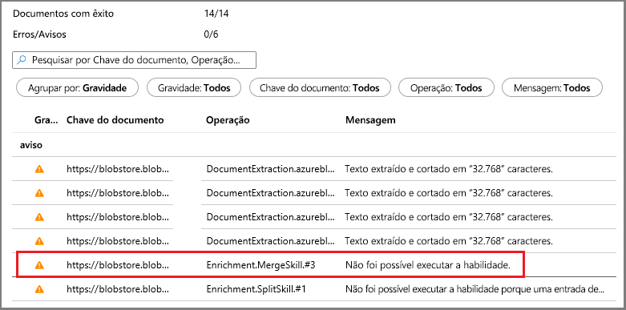
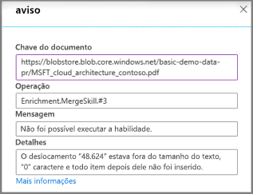

# Início Rápido: Criar um conjunto de habilidades cognitivas da Pesquisa Cognitiva do Azure no portal do Azure

Um conjunto de habilidades é um recurso de IA que extrai informações e estrutura de grandes arquivos de texto não diferenciado ou de imagens e as torna indexáveis e pesquisáveis para consultas de pesquisa de texto completo na Pesquisa Cognitiva do Azure. 

Neste início rápido, você combinará serviços e dados na nuvem do Azure para criar o conjunto de habilidades. Quando tudo estiver configurado, você executará o assistente **Importar dados** no portal para reunir tudo. O resultado final é um índice pesquisável populado com dados criados pelo processamento de IA que você pode consultar no portal ([Gerenciador de pesquisa](search-explorer.md)).

Se você não tiver uma assinatura do Azure, crie uma [conta gratuita](https://azure.microsoft.com/free/?WT.mc_id=A261C142F) antes de começar.

## Criar serviços e carregar dados

Este início rápido usa o Azure Cognitive Search, o [Armazenamento de Blobs do Azure](https://docs.microsoft.com/azure/storage/blobs/) e os [Serviços Cognitivos do Azure](https://azure.microsoft.com/services/cognitive-services/) para a IA. 

Como a carga de trabalho é muito pequena, os Serviços Cognitivos são acionados nos bastidores para fornecer processamento gratuito para até 20 transações diárias por indexador quando invocados pelo Azure Cognitive Search. Desde que use os dados de exemplo que fornecemos, você pode ignorar a criação ou anexação de um recurso dos Serviços Cognitivas.

1. [Fazer o download de dados de exemplo](https://1drv.ms/f/s!As7Oy81M_gVPa-LCb5lC_3hbS-4) consiste em um conjunto de pequenos arquivos de tipos diferentes. Descompacte os arquivos.

1. [Criar uma conta de armazenamento do Azure](https://docs.microsoft.com/azure/storage/common/storage-quickstart-create-account?tabs=azure-portal) ou [localizar uma conta](https://ms.portal.azure.com/#blade/HubsExtension/BrowseResourceBlade/resourceType/Microsoft.Storage%2storageAccounts/). 

   Escolha a mesma região do Azure Cognitive Search para evitar preços de largura de banda. 
   
   Escolha o tipo de conta StorageV2 (uso geral V2) se quiser experimentar o recurso de repositório de conhecimento mais tarde, em outro passo a passo. Caso contrário, escolha qualquer tipo.

1. Abra as páginas dos serviços Blob e crie um contêiner. Você pode usar o nível de acesso público padrão. 

1. No contêiner, clique em **Carregar** para carregar os arquivos de exemplo baixados na primeira etapa. Observe que você tem uma ampla variedade de tipos de conteúdo, incluindo arquivos de aplicativo e imagens que não são pesquisáveis com texto completo em seus formatos nativos.

   

1. [Crie um serviço do Azure Cognitive Search](search-create-service-portal.md) ou [localize um serviço existente](https://ms.portal.azure.com/#blade/HubsExtension/BrowseResourceBlade/resourceType/Microsoft.Search%2FsearchServices). É possível usar um serviço gratuito para este início rápido.

Agora, você está pronto prosseguir para assistente de Importação de dados.

## Executar o assistente de Importação de dados

Na página de Visão geral do serviço de pesquisa, clique em **Importar dados** na barra de comandos para definir o enriquecimento cognitivo em quatro etapas.

  

### Etapa 1: Criar uma fonte de dados

1. Em **Conectar-se aos seus dados**, escolha **Armazenamento de Blobs do Azure** e selecione a conta de Armazenamento e o contêiner criados. Dê um nome de fonte de dados e use valores padrão para o restante. 

   

    Continue para a próxima página.

### Etapa 2: Adicionar habilidades cognitivas

Em seguida, configure o enriquecimento de IA para invocar o OCR, a análise de imagem e o processamento em idioma natural. 

1. Para este início rápido, estamos usando o recurso **gratuito** dos Serviços Cognitivos. Os dados de exemplo consistem em 14 arquivos e, portanto, a alocação gratuita de 20 transações nos Serviços Cognitivos é suficiente para este início rápido. 

   

1. Expanda **Adicionar enriquecimentos** e faça quatro seleções. 

   Habilite o OCR para adicionar habilidades de análise de imagem à página do assistente.

   Defina a granularidade como Páginas para dividir o texto em partes menores. Várias habilidades de texto são limitadas a entradas de 5 KB.

   Escolha reconhecimento de entidade (pessoas, organizações, localizações) e habilidades de análise de imagem.

   

   Continue para a próxima página.

### Etapa 3: Configurar o índice

Um índice inclui o conteúdo pesquisável e o assistente **Importar dados** normalmente pode criar o esquema para você por meio da amostragem da fonte de dados. Nesta etapa, revise o esquema gerado e, potencialmente, revise as configurações. Veja abaixo o esquema padrão criado para o conjunto de dados de Blob de demonstração.

Para este guia de início rápido, o assistente faz um bom trabalho configurando padrões razoáveis:  

+ Os campos padrão são baseados nas propriedades de blobs existentes, além de novos campos para conter a saída de enriquecimento (por exemplo, `people`, `organizations`, `locations`). Os tipos de dados são inferidos dos metadados e pela amostragem de dados.

+ A chave do documento padrão é *metadata_storage_path* (selecionado porque o campo contém valores exclusivos).

+ Os atributos padrão são **Recuperável** e **Pesquisável**. **Pesquisável** permite a pesquisa de texto completo de um campo. **Recuperável** significa que os valores de campo podem ser retornados nos resultados. O assistente pressupõe que você deseja que esses campos sejam recuperáveis e pesquisáveis porque você os criou por meio de um conjunto de qualificações esses campos.

  

Note que o ponto de interrogação e tachado no atributo **Recuperável** ao lado do campo `content`. Para documentos de blob com muito texto, o campo `content` contém a maior parte do arquivo, potencialmente em execução em milhares de linhas. Um campo como esse é complicado nos resultados da pesquisa. Você deve excluí-lo nesta demonstração. 

No entanto, caso precise transmitir o conteúdo do arquivo para o código do cliente, verifique se **Recuperável** permanece selecionado. Caso contrário, considere a possibilidade de limpar esse atributo em `content` se os elementos extraídos (como `people`, `organizations`, `locations` etc.) forem suficientes.

Marcar um campo como **Recuperável** não significa que ele *deve* estar presente nos resultados da pesquisa. Você pode controlar com precisão a composição de resultados da pesquisa usando o parâmetro de consulta **$select** para especificar quais campos serão incluídos. Para campos de texto com uso intenso, como `content`, o parâmetro **$select** é sua solução para fornecer resultados da pesquisa gerenciáveis para usuários humanos do seu aplicativo, ao mesmo tempo garantindo que o código do cliente tenha acesso a todas as informações necessárias por meio do atributo **Recuperável**.
  
Continue para a próxima página.

### Etapa 4: Configurar o indexador

O indexador é um recurso de alto nível que orienta o processo de indexação. Ele especifica o nome da fonte de dados, um índice de destino e a frequência de execução. O assistente **Importar dados** cria vários objetos, e um deles sempre é um indexador que você pode executar várias vezes.

1. Na página **Indexador**, você pode aceitar o nome padrão clicar na opção de agenda **Uma Vez** para executá-lo imediatamente. 

   

1. Clique em **Enviar** para criar e executar simultaneamente o indexador.

## Monitorar status

A indexação de habilidades cognitivas leva mais tempo para ser concluída em relação à indexação típica baseada em texto, especialmente, o OCR e a análise de imagem. Para monitorar o progresso, vá para a página Visão geral e clique em **Indexadores** no meio da página.

  

Os avisos são normais, considerando a ampla variedade de tipos de conteúdo. Alguns tipos de conteúdo não são válidos para determinadas habilidades e, em camadas inferiores, é comum encontrar [limites de indexador](search-limits-quotas-capacity.md#indexer-limits). Por exemplo, as notificações de truncamento de 32 mil caracteres são um limite de indexador na Camada gratuita. Se você executar esta demonstração em um nível superior, muitos avisos de truncamento desaparecerão.

Para verificar avisos ou erros, clique no status Aviso na lista Indexadores para abrir a página Histórico de Execução.

Nessa página, clique no status Aviso novamente para ver a lista de avisos semelhante à mostrada abaixo. 

  

Os detalhes são exibidos quando você clica em uma linha de status específica. Esse aviso indica que a mesclagem foi parada depois de atingir um limite máximo (esse PDF específico é grande).

  

## Consultar no Gerenciador de pesquisa

Depois que um índice é criado, você pode executar consultas para retornar os resultados. No portal, use o **Gerenciador de pesquisa** para essa tarefa. 

1. Na página de painel do serviço de pesquisa, clique em **Gerenciador de pesquisa** na barra de comandos.

1. Clique em **Alterar índice** na parte superior para selecionar o índice que você criou.

1. Insira uma cadeia de caracteres de pesquisa para consultar o índice, como `search=Microsoft&$select=people,organizations,locations,imageTags`.

Os resultados são retornados em JSON, que podem ser detalhados e difíceis de serem lidos, especialmente em documentos grandes provenientes de blobs do Azure. Algumas dicas para pesquisa nessa ferramenta incluem as seguintes técnicas:

+ Acrescente `$select` para especificar quais campos serão incluídos nos resultados. 
+ Use CTRL-F para pesquisa no JSON em busca de propriedades ou termos específicos.

As cadeias de consulta diferenciam maiúsculas de minúsculas e, portanto, se você receber uma mensagem "campo desconhecido", verifique **Campos** ou **Definição de Índice (JSON)** para verificar o nome e as maiúsculas e as minúsculas. 

  

## Observações

Agora, você criou seu primeiro conjunto de habilidades e aprendeu conceitos importantes que são úteis para criar um protótipo de uma solução de pesquisa enriquecida usando seus próprios dados.

Alguns conceitos-chave Esperamos que você pegou incluem a dependência em fontes de dados do Azure. Um conjunto de habilidades é associado a um indexador e os indexadores são específicos do Azure e de origem. Embora este guia de início rápido Use o armazenamento de BLOBs do Azure, outras fontes de dados do Azure são possíveis. Para obter mais informações, consulte [Indexadores na Pesquisa Cognitiva do Azure](search-indexer-overview.md). 

Outro conceito importante é que as habilidades operam sobre tipos de conteúdo e, ao trabalhar com um conteúdo heterogêneo, algumas entradas serão ignoradas. Além disso, arquivos ou campos grandes podem exceder os limites de indexador da sua camada de serviço. É normal ver avisos quando esses eventos ocorrem. 

A saída é direcionada para um índice de pesquisa e há um mapeamento entre pares nome-valor criados durante a indexação e campos individuais no índice. Internamente, o portal configura [anotações](cognitive-search-concept-annotations-syntax.md) e define uma [conjunto de qualificações](cognitive-search-defining-skillset.md), estabelecendo a ordem das operações e o fluxo geral. Essas etapas estão ocultos no portal, mas quando você começar a escrever código, esses conceitos tornam-se importantes.

Por fim, você aprendeu que pode verificar o conteúdo consultando o índice. No final, o que a Pesquisa Cognitiva do Azure fornece é um índice pesquisável, que pode ser consultado usando a [sintaxe de consulta totalmente estendida](https://docs.microsoft.com/rest/api/searchservice/simple-query-syntax-in-azure-search) ou [simples](https://docs.microsoft.com/rest/api/searchservice/lucene-query-syntax-in-azure-search). Um índice que contém campos enriquecidos é como qualquer outro. Se quiser incorporar [analisadores personalizados](search-analyzers.md) ou padrão, [perfis de pontuação](https://docs.microsoft.com/rest/api/searchservice/add-scoring-profiles-to-a-search-index), [sinônimos](search-synonyms.md), [filtros facetados](search-filters-facets.md), pesquisa geográfica ou qualquer outro recurso da Pesquisa Cognitiva do Azure, você certamente poderá fazê-lo.

## Limpar os recursos

Quando você está trabalhando em sua própria assinatura, é uma boa ideia identificar, no final de um projeto, se você ainda precisa dos recursos criados. Recursos deixados em execução podem custar dinheiro. Você pode excluir os recursos individualmente ou excluir o grupo de recursos para excluir todo o conjunto de recursos.

Você pode localizar e gerenciar recursos no portal usando o link **Todos os recursos** ou **Grupos de recursos** no painel de navegação à esquerda.

Se você estiver usando um serviço gratuito, estará limitado a três índices, indexadores e fontes de dados. Você pode excluir itens individuais no portal para permanecer abaixo do limite. 

> [!Tip]
> Se desejar repetir esse exercício ou experimentar um passo a passo de enriquecimento de IA diferente, exclua o indexador no portal. A exclusão do indexador redefine o contador de transações diárias gratuito para zero para o processamento dos Serviços Cognitivos.

## Próximas etapas

Você pode criar conjuntos de habilidades usando o portal, o SDK do .NET ou a API REST. Para expandir ainda mais seus conhecimentos, experimente a API REST usando o Postman e mais dados de exemplo.

> [!div class="nextstepaction"]
> [Tutorial: Extrair o texto e a estrutura de blobs JSON usando APIs REST ](cognitive-search-tutorial-blob.md)