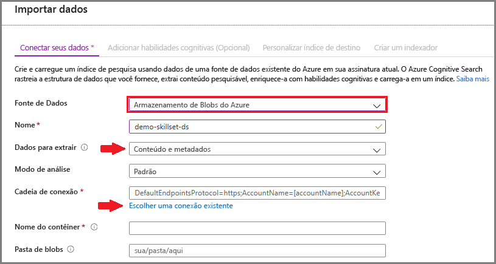
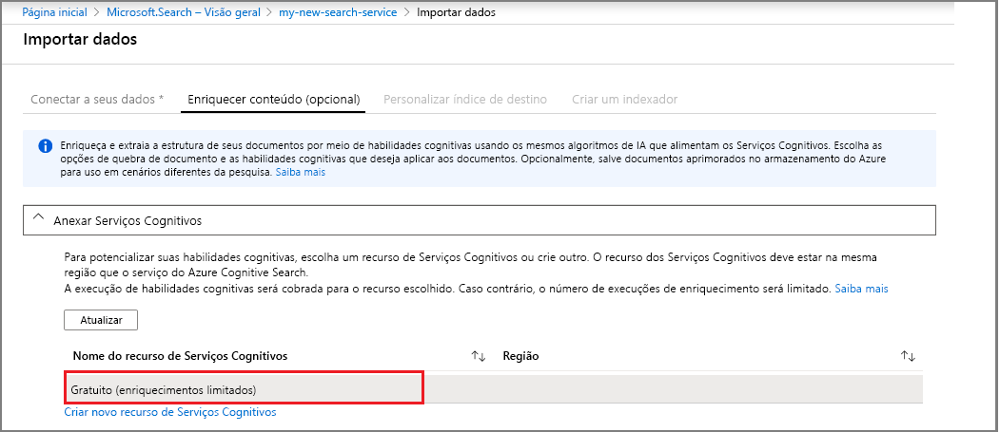
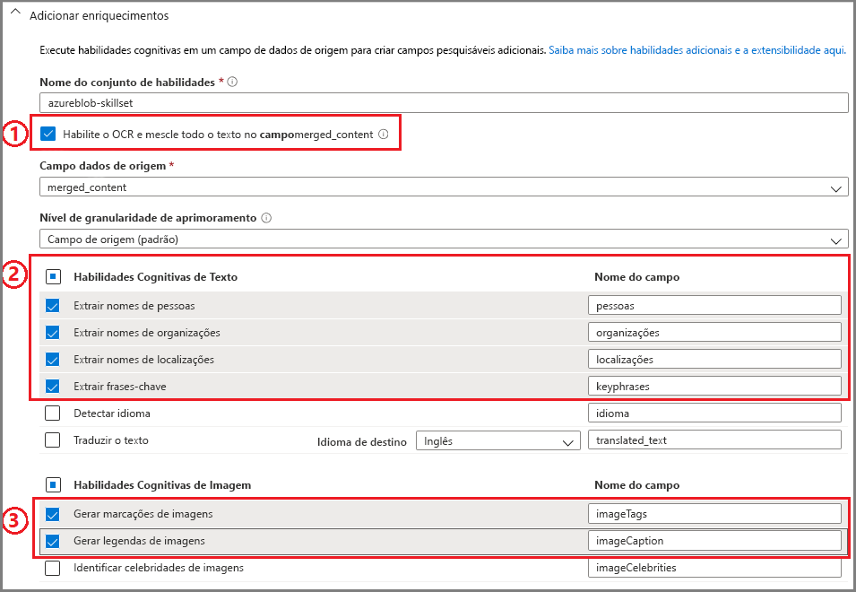
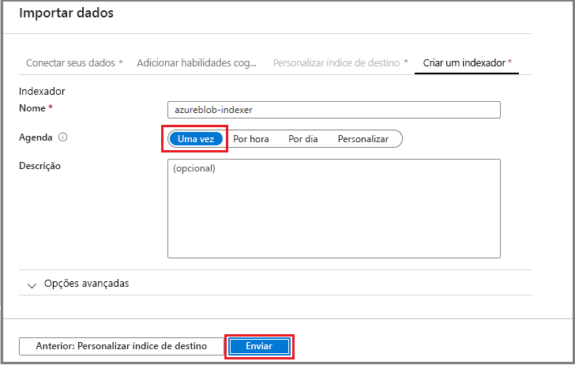
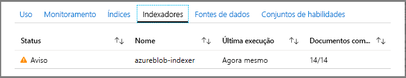
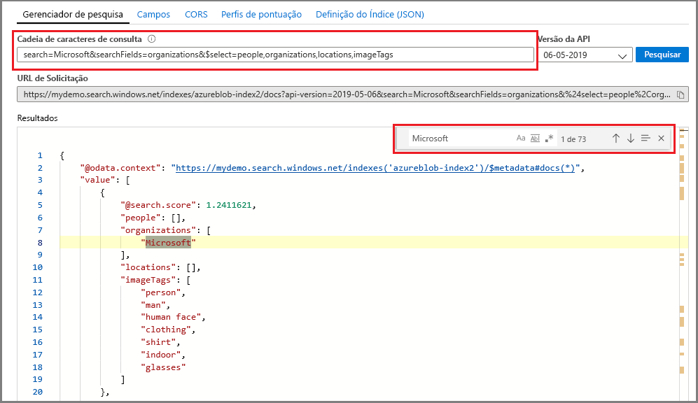

# Início Rápido: Criar um conjunto de habilidades cognitivas da Pesquisa Cognitiva do Azure no portal do Azure

Um conjunto de habilidades é um recurso de IA que extrai informações e estrutura de grandes arquivos de texto não diferenciado ou de imagens e as torna indexáveis e pesquisáveis para consultas de pesquisa de texto completo na Pesquisa Cognitiva do Azure. 

Neste início rápido, você combinará serviços e dados na nuvem do Azure para criar o conjunto de habilidades. Quando tudo estiver configurado, você executará o assistente **Importar dados** no portal para reunir tudo. O resultado final é um índice pesquisável populado com dados criados pelo processamento de IA que você pode consultar no portal ([Gerenciador de pesquisa](search-explorer.md)).

Se você não tiver uma assinatura do Azure, crie uma [conta gratuita](https://azure.microsoft.com/free/?WT.mc_id=A261C142F) antes de começar.

## Criar serviços e carregar dados

Este início rápido usa a Pesquisa Cognitiva do Azure, o Armazenamento de Blobs do Azure e os [Serviços Cognitivos do Azure](https://azure.microsoft.com/services/cognitive-services/) para IA. 

Como a carga de trabalho é muito pequena, os Serviços Cognitivos são acionados nos bastidores para fornecer processamento gratuito para até 20 transações diárias quando invocados pela Pesquisa Cognitiva do Azure. Desde que use os dados de exemplo que fornecemos, você pode ignorar a criação ou anexação de um recurso dos Serviços Cognitivas.

1. [Fazer o download de dados de exemplo](https://1drv.ms/f/s!As7Oy81M_gVPa-LCb5lC_3hbS-4) consiste em um conjunto de pequenos arquivos de tipos diferentes. Descompacte os arquivos.

1. [Crie uma conta de armazenamento do Azure](https://docs.microsoft.com/azure/storage/common/storage-quickstart-create-account?tabs=azure-portal) ou [localize uma conta existente](https://ms.portal.azure.com/#blade/HubsExtension/BrowseResourceBlade/resourceType/Microsoft.Storage%2storageAccounts/) na assinatura atual. 

   Escolha a mesma região que a Pesquisa Cognitiva do Azure. Escolha o tipo de conta StorageV2 (uso geral V2) se quiser experimentar o recurso de repositório de conhecimento mais tarde, em outro passo a passo. Caso contrário, escolha qualquer tipo.

1. Abra as páginas dos serviços Blob e crie um contêiner. Você pode usar o nível de acesso público padrão. 

1. No contêiner, clique em **Carregar** para carregar os arquivos de exemplo baixados na primeira etapa. Observe que você tem uma ampla variedade de tipos de conteúdo, incluindo arquivos de aplicativo e imagens que não são pesquisáveis com texto completo em seus formatos nativos.

   

1. [Crie um serviço da Pesquisa Cognitiva do Azure](search-create-service-portal.md) ou [localize um serviço existente](https://ms.portal.azure.com/#blade/HubsExtension/BrowseResourceBlade/resourceType/Microsoft.Search%2FsearchServices) na mesma assinatura. É possível usar um serviço gratuito para este início rápido.

<!-- 1. You are almost done with this resource, but before you leave these pages, use a link on the left navigation pane to open the **Access Keys** page. In many tutorials, especially those that use the REST API, you will need a connection string to retrieve data from Blob storage. A connection string looks similar to the following example: `DefaultEndpointsProtocol=https;AccountName=<YOUR-ACCOUNT-NAME>;AccountKey=<YOUR-ACCOUNT-KEY>;EndpointSuffix=core.windows.net` -->

Agora, você está pronto prosseguir para assistente de Importação de dados.

## Executar o assistente de Importação de dados

Na página de Visão geral do serviço de pesquisa, clique em **Importar dados** na barra de comandos para definir o enriquecimento cognitivo em quatro etapas.

  

### Etapa 1: Criar uma fonte de dados

1. Em **Conectar-se aos seus dados**, escolha **Armazenamento de Blobs do Azure** e selecione a conta de Armazenamento e o contêiner criados. Dê um nome de fonte de dados e use valores padrão para o restante. 

   

1. Continue para a próxima página.

### Etapa 2: Adicionar habilidades cognitivas

Em seguida, adicione habilidades cognitivas para invocar o processamento de linguagem natural. Os dados de exemplo são compostos por 12 arquivos, portanto, a alocação gratuita de 20 transações dos Serviços Cognitivos é suficiente para este início rápido. Como não estamos usando o OCR, somente os arquivos que não são de imagem serão contados, abertos e usados nesse processo.

1. Para este início rápido, estamos usando o recurso **gratuito** dos Serviços Cognitivos.

   

1. Expanda **Adicionar habilidades** e selecione as habilidades que executam o processamento de linguagem natural. Para este guia de início rápido, escolha o reconhecimento de entidade para pessoas, empresas e locais.

   

1. Aceite o campo de origem padrão: `content`. Pode parecer um destino pequeno, mas, para blobs do Azure, o campo `content` contém a maior parte do documento de blob (por exemplo, um documento do Word ou deck do PowerPoint), o que faz dele um bom candidato.

1. Continue para a próxima página.

> [!NOTE]
> Capacidade de processamento de idioma natural opera em conteúdo de texto do conjunto de dados de exemplo. Como não selecionamos a opção de OCR, os arquivos JPEG e PNG encontrados no conjunto de dados de exemplo não serão processados neste início rápido. 

### Etapa 3: Configurar o índice

Na Pesquisa Cognitiva do Azure, um índice contém seu conteúdo pesquisável e o assistente **Importar dados** normalmente pode criar o esquema para você por meio da amostragem da fonte de dados. Nesta etapa, revise o esquema gerado e, potencialmente, revise as configurações. Veja abaixo o esquema padrão criado para o conjunto de dados de Blob de demonstração.

Para este guia de início rápido, o assistente faz um bom trabalho configurando padrões razoáveis: 

+ O nome padrão é *azureblob-index* com base no tipo de fonte de dados. 

+ Campos padrão baseiam-se no campo de dados de origem original (`content`), além dos campos de saída (`people`, `organizations` e `locations`) criados pelas habilidades cognitivas. Tipos de dados padrão são inferidos de amostragem de dados e metadados.

+ A chave do documento padrão é *metadata_storage_path* (selecionado porque o campo contém valores exclusivos).

+ Os atributos padrão são **Recuperável** e **Pesquisável** para esses campos. **Pesquisável** indica que um campo pode ser pesquisado. **Recuperável** significa que ele pode ser retornado nos resultados. O assistente pressupõe que você deseja que esses campos sejam recuperáveis e pesquisáveis porque você os criou por meio de um conjunto de qualificações esses campos.

  

Note que o ponto de interrogação e tachado no atributo **Recuperável** ao lado do campo `content`. Para documentos de blob com muito texto, o campo `content` contém a maior parte do arquivo, potencialmente em execução em milhares de linhas. Se você precisar transmitir o conteúdo do arquivo para o código de cliente, verifique se **Recuperável** permanece selecionada. Caso contrário, considere limpar esse atributo em `content` se os elementos extraídos (`people`, `organizations` e `locations`) forem suficientes para suas finalidades.

Marcar um campo como **Recuperável** não significa que ele *deve* estar presente nos resultados da pesquisa. Você pode controlar com precisão a composição de resultados da pesquisa usando o parâmetro de consulta **$select** para especificar quais campos serão incluídos. Para campos de texto com uso intenso, como `content`, o parâmetro **$select** é sua solução para fornecer resultados da pesquisa gerenciáveis para usuários humanos do seu aplicativo, ao mesmo tempo garantindo que o código do cliente tenha acesso a todas as informações necessárias por meio do atributo **Recuperável**.
  
Continue para a próxima página.

### Etapa 4: Configurar o indexador

O indexador é um recurso de alto nível que orienta o processo de indexação. Ele especifica o nome da fonte de dados, um índice de destino e a frequência de execução. O assistente **Importar dados** cria vários objetos, e um deles sempre é um indexador que você pode executar várias vezes.

1. Na página **Indexador**, você pode aceitar o nome padrão clicar na opção de agenda **Uma Vez** para executá-lo imediatamente. 

   

1. Clique em **Enviar** para criar e executar simultaneamente o indexador.

## Monitorar status

A indexação de habilidades cognitivas leva mais tempo para ser concluída em comparação à indexação típica baseada em texto. Para monitorar o progresso, vá para a página Visão geral e clique em **Indexadores** no meio da página.

O aviso ocorre porque arquivos de imagem JPG e PNG estão na fonte de dados e nós omitimos a habilidade de OCR nesse pipeline. Você também encontrará notificações de truncamento. A extração é limitada a 32.000 caracteres na Camada gratuita.

  

A indexação e enriquecimento podem levar tempo, por isso, os conjuntos de dados menores são recomendados para exploração inicial. 

No portal do Azure, também é possível monitorar o log de atividades de Notificações para obter um link de status de **notificação da Pesquisa Cognitiva do Azure** clicável. A execução pode levar vários minutos para ser concluída.

## Consultar no Gerenciador de pesquisa

Depois que um índice é criado, você pode enviar consultas para retornar os documentos do índice. No portal, use **Gerenciador de pesquisa** para executar consultas e exibir os resultados. 

1. Na página de painel do serviço de pesquisa, clique em **Gerenciador de pesquisa** na barra de comandos.

1. Clique em **Alterar índice** na parte superior para selecionar o índice que você criou.

1. Insira uma cadeia de caracteres de pesquisa para consultar o índice, como `search=Microsoft&searchFields=Organizations`.

Os resultados são retornados em JSON, que pode ser difíceis de ler, especialmente em documentos grandes provenientes de blobs do Azure e detalhado. Se você não pode examinar os resultados facilmente, use CTRL-F para pesquisar dentro de documentos. Para essa consulta, você poderá pesquisar termos específicos no JSON. 

CTRL + F pode ajudá-lo a determinar quantos documentos estão em um determinado resultado definidos. Para blobs do Azure, o portal escolhe "metadata_storage_path" como a chave, porque cada valor é exclusivo para o documento. Usar CTRL + F, pesquise "metadata_storage_path" obter uma contagem de documentos. 

  

## Observações

Agora, você criou seu primeiro conjunto de habilidades e aprendeu conceitos importantes que são úteis para criar um protótipo de uma solução de pesquisa enriquecida usando seus próprios dados.

Alguns conceitos-chave Esperamos que você pegou incluem a dependência em fontes de dados do Azure. Um conjunto de habilidades é associado a um indexador e os indexadores são específicos do Azure e de origem. Embora este guia de início rápido Use o armazenamento de BLOBs do Azure, outras fontes de dados do Azure são possíveis. Para obter mais informações, consulte [Indexadores na Pesquisa Cognitiva do Azure](search-indexer-overview.md).

Outro conceito importante é que as habilidades operam em campos de entrada. No portal, você precisa escolher um campo de origem única para todas as habilidades. No código, entradas podem ser outros campos, ou a saída de uma habilidade de upstream.

A saída é direcionada para um índice de pesquisa e há um mapeamento entre pares nome-valor criados durante a indexação e campos individuais no índice. Internamente, o portal configura [anotações](cognitive-search-concept-annotations-syntax.md) e define uma [conjunto de qualificações](cognitive-search-defining-skillset.md), estabelecendo a ordem das operações e o fluxo geral. Essas etapas estão ocultos no portal, mas quando você começar a escrever código, esses conceitos tornam-se importantes.

Por fim, você aprendeu que pode verificar o conteúdo consultando o índice. No final, o que a Pesquisa Cognitiva do Azure fornece é um índice pesquisável, que pode ser consultado usando a [sintaxe de consulta totalmente estendida](https://docs.microsoft.com/rest/api/searchservice/simple-query-syntax-in-azure-search) ou [simples](https://docs.microsoft.com/rest/api/searchservice/lucene-query-syntax-in-azure-search). Um índice que contém campos enriquecidos é como qualquer outro. Se quiser incorporar [analisadores personalizados](search-analyzers.md) ou padrão, [perfis de pontuação](https://docs.microsoft.com/rest/api/searchservice/add-scoring-profiles-to-a-search-index), [sinônimos](search-synonyms.md), [filtros facetados](search-filters-facets.md), pesquisa geográfica ou qualquer outro recurso da Pesquisa Cognitiva do Azure, você certamente poderá fazê-lo.

## Limpar

Quando você está trabalhando em sua própria assinatura, é uma boa ideia identificar, no final de um projeto, se você ainda precisa dos recursos criados. Recursos deixados em execução podem custar dinheiro. Você pode excluir os recursos individualmente ou excluir o grupo de recursos para excluir todo o conjunto de recursos.

Você pode localizar e gerenciar recursos no portal usando o link **Todos os recursos** ou **Grupos de recursos** no painel de navegação à esquerda.

Se você estiver usando um serviço gratuito, estará limitado a três índices, indexadores e fontes de dados. Você pode excluir itens individuais no portal para permanecer abaixo do limite. 

## Próximas etapas

Você pode criar conjuntos de habilidades usando o portal, o SDK do .NET ou a API REST. Para expandir ainda mais seus conhecimentos, experimente a API REST usando o Postman e mais dados de exemplo.

> [!div class="nextstepaction"]
> [Tutorial: Adicionar uma estrutura ao "conteúdo não estruturado" com o enriquecimento de IA](cognitive-search-tutorial-blob.md)

> [!Tip]
> Se desejar repetir esse exercício ou experimentar um passo a passo de enriquecimento de IA diferente, exclua o indexador no portal. A exclusão do indexador redefine o contador de transações diárias gratuito para zero para o processamento dos Serviços Cognitivos.