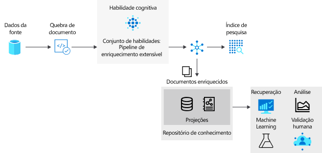

# <a name="skillset-concepts-in-azure-cognitive-search"></a>Conceitos do Skills no Azure Pesquisa Cognitiva

Este artigo é para os desenvolvedores que precisam de uma compreensão mais profunda dos conceitos e da composição do Skills e pressupõem familiaridade com o processo de enriquecimento do ia. Se você for novo nesse conceito, comece com o [enriquecimento de ia no Azure pesquisa cognitiva](cognitive-search-concept-intro.md).

## <a name="introducing-skillsets"></a>Apresentando o habilidades

Um conjunto de qualificações é um recurso reutilizável no Azure Pesquisa Cognitiva que é anexado a um indexador e especifica uma coleção de habilidades usadas para analisar, transformar e enriquecer o conteúdo de texto ou imagem durante a indexação. As habilidades têm entradas e saídas e, muitas vezes, a saída de uma habilidade se torna a entrada de outra em uma cadeia ou sequência de processos.

Um qualificable tem três propriedades principais:

+ `skills`, uma coleção não ordenada de habilidades para as quais a plataforma determina a sequência de execução com base nas entradas necessárias para cada habilidade.
+ `cognitiveServices`, a chave de um recurso de serviços cognitivas que executa o processamento de imagem e texto para habilidades que incluem habilidades internas.
+ `knowledgeStore`, (opcional) uma conta de armazenamento do Azure em que seus documentos aprimorados serão projetados. Os documentos aprimorados também são consumidos por índices de pesquisa.

Os conjuntos de habilidades são criados em JSON. O exemplo a seguir é uma versão ligeiramente simplificada deste [Hotel-revisa o qualificable](https://github.com/Azure-Samples/azure-search-sample-data/blob/master/hotelreviews/HotelReviews_skillset.json), usado para ilustrar os conceitos neste artigo. 

As duas primeiras habilidades são mostradas abaixo:

+ A #1 de habilidades é uma [habilidade de divisão de texto](cognitive-search-skill-textsplit.md) que aceita o conteúdo do campo "reviews_text" como entrada e divide esse conteúdo em "páginas" de 5000 caracteres como saída.
+ A #2 de habilidades é uma [habilidade de detecção de sentimentos](cognitive-search-skill-sentiment.md) que aceita "páginas" como entrada e produz um novo campo chamado "Comentários" como saída que contém os resultados da análise de sentimentos.


```json
{
    "skills": [
        {
            "@odata.type": "#Microsoft.Skills.Text.SplitSkill",
            "name": "#1",
            "description": null,
            "context": "/document/reviews_text",
            "defaultLanguageCode": "en",
            "textSplitMode": "pages",
            "maximumPageLength": 5000,
            "inputs": [
                {
                    "name": "text",
                    "source": "/document/reviews_text"
                }
            ],
            "outputs": [
                {
                    "name": "textItems",
                    "targetName": "pages"
                }
            ]
        },
        {
            "@odata.type": "#Microsoft.Skills.Text.SentimentSkill",
            "name": "#2",
            "description": null,
            "context": "/document/reviews_text/pages/*",
            "defaultLanguageCode": "en",
            "inputs": [
                {
                    "name": "text",
                    "source": "/document/reviews_text/pages/*",
                }
            ],
            "outputs": [
                {
                    "name": "score",
                    "targetName": "Sentiment"
                }
            ]
        },
  "cognitiveServices": null,
  "knowledgeStore": {  }
}
```
> [!NOTE]
> Você pode criar habilidades complexas com loop e ramificação, usando a [habilidade condicional](cognitive-search-skill-conditional.md) para criar as expressões. A sintaxe é baseada na notação de caminho do [ponteiro JSON](https://tools.ietf.org/html/rfc6901) , com algumas modificações para identificar nós na árvore de enriquecimento. Um `"/"` percorre um nível mais baixo na árvore e `"*"` atua como um operador for-each no contexto. Vários exemplos neste artigo ilustram a sintaxe. 

### <a name="enrichment-tree"></a>Árvore de enriquecimento

Na progressão de [etapas em um pipeline de enriquecimento](cognitive-search-concept-intro.md#enrichment-steps), o processamento de conteúdo segue a fase de *quebra de documento* onde o texto e as imagens são extraídos da origem. O conteúdo da imagem pode ser roteado para habilidades que especificam o processamento de imagens, enquanto o conteúdo do texto é colocado na fila para processamento de texto. Para documentos de origem que contêm grandes quantidades de texto, você pode definir um *modo de análise* no indexador para segmentar o texto em partes menores para um processamento mais ideal. 



Quando um documento está no pipeline de enriquecimento, ele é representado como uma árvore de conteúdo e enriquecimentos associados. Essa árvore é instanciada como a saída da quebra de documento.  O formato da árvore de enriquecimento permite ao pipeline de enriquecimento anexar metadados até mesmo aos tipos de dados primitivos. Ele não é um objeto JSON válido, mas pode ser projetado em um formato JSON válido. A tabela a seguir mostra o estado de um documento em sua entrada no pipeline de enriquecimento:

|Fonte de dados\Modo de análise|Padrão|JSON, linhas JSON & CSV|
|---|---|---|
|Armazenamento de Blobs|/document/content<br>/document/normalized_images/*<br>…|/document/{key1}<br>/document/{key2}<br>…|
|SQL|/document/{column1}<br>/document/{column2}<br>…|N/D |
|Cosmos DB|/document/{key1}<br>/document/{key2}<br>…|N/D|

 À medida que as habilidades são executadas, novos nós são adicionados à árvore de enriquecimento. Esses novos nós podem ser usados como entradas para habilidades de downstream, projeção para o repositório de conhecimento ou mapeamento para campos de índice. Os enriquecimentos não são mutáveis: uma vez criados, os nós não podem ser editados. À medida que seus conjuntos de habilidades se tornam mais complexos, a árvore de enriquecimento também aumenta, mas nem todos os nós da árvore de enriquecimento precisam chegar ao índice ou ao repositório de conhecimento. 

Você pode manter seletivamente apenas um subconjunto dos enriquecimentos no índice ou no repositório de conhecimento.

### <a name="context"></a>Contexto

Cada habilidade requer um contexto. Um contexto determina:

+ O número de vezes que a habilidade é executada, com base nos nós selecionados. Para valores de contexto da coleção de tipos, adicionar um `/*` no final resultará na invocação da habilidade uma vez para cada instância da coleção. 

+ Onde são adicionadas as saídas de habilidades na árvore de enriquecimento. As saídas são sempre adicionadas à árvore como filhos do nó de contexto. 

+ A forma das entradas. Para coleções de vários níveis, a configuração do contexto para a coleção pai afetará a forma da entrada da habilidade. Por exemplo, se você tiver uma árvore de enriquecimento com uma lista de países/regiões, cada um deles será aprimorado com uma lista de Estados que contêm uma lista de CEPs.

|Contexto|Entrada|Forma da entrada|Invocação de habilidades|
|-------|-----|--------------|----------------|
|`/document/countries/*` |`/document/countries/*/states/*/zipcodes/*` |Uma lista de todos os CEPs no país/região |Uma vez por país/região |
|`/document/countries/*/states/*` |'/Document/countries/*/States/*/ZipCodes/* ' ' |Uma lista de CEPs no estado | Uma vez por combinação de país/região e estado|

## <a name="generate-enriched-data"></a>Gerar dados enriquecidos 

Usando o [Hotel Reviews Skill](https://github.com/Azure-Samples/azure-search-sample-data/blob/master/hotelreviews/HotelReviews_skillset.json) como um ponto de referência, vamos examinar:

+ Como a árvore de enriquecimento evolui com a execução de cada habilidade
+ Como o contexto e as entradas funcionam para determinar quantas vezes uma habilidade é executada
+ Qual a forma da entrada é baseada no contexto

Um "documento" dentro do processo de enriquecimento representa uma única linha (uma revisão de Hotel) dentro do arquivo de origem hotel_reviews.csv.

### <a name="skill-1-split-skill"></a>Habilidade nº 1: divisão da habilidade

Quando o conteúdo de origem consiste em grandes partes de texto, é útil dividi-lo em componentes menores para maior precisão de linguagem, de sentimentos e de detecção de frases-chave. Há duas granulações disponíveis: páginas e sentenças. Uma página consiste em aproximadamente 5000 caracteres.

Uma habilidade de divisão de texto normalmente é primeiro em um contratador.

```json
      "@odata.type": "#Microsoft.Skills.Text.SplitSkill",
      "name": "#1",
      "description": null,
      "context": "/document/reviews_text",
      "defaultLanguageCode": "en",
      "textSplitMode": "pages",
      "maximumPageLength": 5000,
      "inputs": [
        {
          "name": "text",
          "source": "/document/reviews_text"
        }
      ],
      "outputs": [
        {
          "name": "textItems",
          "targetName": "pages"
        }
```

Com o contexto de habilidade do `"/document/reviews_text"` , a habilidade de divisão será executada uma vez para o `reviews_text` . A saída de habilidade é uma lista em que `reviews_text` é dividido em segmentos de 5000 caracteres. A saída da habilidade de divisão é nomeada `pages` e adicionada à árvore de enriquecimento. O recurso `targetName` permite renomear uma saída de habilidade antes que ela seja adicionada à árvore de enriquecimento.

A árvore de enriquecimento agora tem um novo nó colocado no contexto da habilidade. Este nó está disponível para qualquer habilidade, projeção ou mapeamento de campo de saída. Conceitualmente, a árvore tem a seguinte aparência:


O nó raiz de todos os enriquecimentos é `"/document"`. Ao trabalhar com indexadores de blob, o nó `"/document"` terá nós filhos de `"/document/content"` e `"/document/normalized_images"`. Ao trabalhar com dados CSV, como neste exemplo, os nomes das colunas serão mapeados para os nós abaixo de `"/document"`. 

Para acessar qualquer um dos enriquecimentos adicionados a um nó por uma habilidade, é necessário o caminho completo para o enriquecimento. Por exemplo, se você deseja usar o texto do nó ```pages``` como uma entrada para outra habilidade, precisará especificá-lo como ```"/document/reviews_text/pages/*"```.
 
 

### <a name="skill-2-language-detection"></a>Habilidade nº 2: detecção de idioma

Os documentos de revisão do Hotel incluem comentários de clientes expressos em vários idiomas. A habilidade de detecção de idioma determina qual idioma é usado. Em seguida, o resultado é passado para a extração de frases-chave e detecção de sentimentos, levando o idioma em consideração ao detectar sentimentos e frases.

Embora a habilidade de detecção de idioma seja a terceira (habilidade nº 3) definida no conjunto de habilidades, é a próxima habilidade a ser executada. Como ela não é bloqueada pela exigência de qualquer entrada, ela será executada em paralelo com a habilidade anterior. Como a habilidade de divisão que a precedeu, a habilidade de detecção de idioma também é invocada uma vez para cada documento. A árvore de enriquecimento agora tem um novo nó para o idioma.

 
 
 ### <a name="skill-3-key-phrases-skill"></a>Habilidade nº 3: habilidade de frases-chave 

Dado o contexto de `/document/reviews_text/pages/*`, a habilidade das frases-chave será invocada uma vez para cada um dos itens na coleção `pages`. A saída da habilidade será um nó no elemento de página associado. 

 Agora você deve poder examinar o restante das habilidades no conjunto de habilidades e visualizar como a árvore de enriquecimentos continuará a crescer com a execução de cada habilidade. Algumas habilidades, como a de mesclagem e a de formatação, também criam novos nós, mas apenas usam dados de nós existentes e não criam novos enriquecimentos.


As cores dos conectores na árvore acima indicam que os enriquecimentos foram criados por diferentes habilidades e os nós precisarão ser endereçados individualmente e não farão parte do objeto retornado ao selecionar o nó pai.

## <a name="save-enrichments"></a>Economize os aprimoramentos

No Azure Pesquisa Cognitiva, um indexador salva a saída que ele cria. Uma das saídas é sempre um [índice pesquisável](search-what-is-an-index.md). A especificação de um índice é um requisito e, quando você anexa um configurador de habilidades, os dados ingeridos por um índice incluem a substância dos aprimoramentos. Normalmente, as saídas de habilidades específicas, como frases-chave ou pontuações de sentimentos, são ingeridas no índice em um campo criado para essa finalidade.

Opcionalmente, um indexador também pode enviar a saída para um [repositório de conhecimento](knowledge-store-concept-intro.md) para consumo em outras ferramentas ou processos. Uma loja de conhecimento é definida como parte do contratador de qualificações. Sua definição determina se seus documentos aprimorados são projetados como tabelas ou objetos (arquivos ou BLOBs). As projeções de tabela são bem adequadas para análise interativa em ferramentas como Power BI, enquanto os arquivos e BLOBs são normalmente usados em ciência de dados ou processos semelhantes. Nesta seção, você aprenderá como a composição do Configurador de habilidades pode formatar as tabelas ou os objetos que você deseja projetar.

### <a name="projections"></a>Projeções

Para o conteúdo direcionado a uma loja de conhecimento, você desejará considerar como o conteúdo é estruturado. *Projeção* é o processo de selecionar os nós da árvore de enriquecimento e criar uma expressão física deles na loja de conhecimento. Projeções são formas personalizadas do documento (conteúdo e enriquecimentos) que podem ser exibidas como projeções de tabela ou objeto. Para saber mais sobre como trabalhar com projeções, confira [Trabalhar com projeções](knowledge-store-projection-overview.md).


### <a name="sourcecontext"></a>SourceContext

O `sourceContext` elemento só é usado em projeções e entradas de habilidades. Ele é usado para construir objetos aninhados de vários níveis. Talvez seja necessário criar um novo objeto para transmiti-lo como uma entrada para uma habilidade ou projeto no repositório de conhecimento. Como os nós de enriquecimento podem não ser um objeto JSON válido na árvore de enriquecimento e a referência a um nó na árvore só retorna esse estado do nó quando ele foi criado, usar os enriquecimentos como entradas ou projeções de habilidades requer que você crie um objeto JSON bem formado. O `sourceContext` permite construir um objeto de tipo anônimo e hierárquico, que exigiria várias habilidades se você estivesse usando apenas o contexto. 

O uso do `sourceContext` é mostrado nos exemplos a seguir. Observe a saída de habilidade que gerou um enriquecimento para determinar se é um objeto JSON válido e não um tipo primitivo.

### <a name="slicing-projections"></a>Fracionar projeções

Ao definir um grupo de projeção de tabela, um único nó na árvore de enriquecimento pode ser fracionado em várias tabelas relacionadas. Se você adicionar uma tabela com um caminho de origem que seja filho de uma projeção de tabela existente, o nó filho resultante não será um filho da projeção de tabela existente, mas, em vez disso, será projetado para a nova tabela relacionada. Essa técnica de fracionamento permite definir um único nó em uma habilidade de formatação que pode ser a origem de todas as suas projeções de tabela. 

### <a name="shaping-projections"></a>Formatar projeções

Há duas maneiras de definir uma projeção:

+ Use a habilidade de forma de texto para criar um novo nó que é o nó raiz para todos os aprimoramentos que você está projetando. Então, em suas projeções, você faria referência apenas à saída da habilidade de formatação.

+ Use uma forma embutida em uma projeção dentro da própria definição de projeção.

A abordagem de formatação é mais detalhada do que a formatação embutida, mas garante que todas as mutações da árvore de enriquecimento estejam contidas nas habilidades e que a saída seja um objeto que possa ser reutilizado. Por outro lado, o Shaping embutido permite que você crie a forma de que precisa, mas é um objeto anônimo e só está disponível para a projeção para a qual ela está definida. As abordagens podem ser usadas juntas ou separadamente. O conjunto de habilidades criado para você no fluxo de trabalho do portal contém ambas. Ele usa uma habilidade de formatação para as projeções de tabela, mas também usa a formatação embutida para projetar a tabela de frases-chave.

Para estender o exemplo, você pode optar por remover a formatação embutida e usar uma habilidade de formatação para criar um novo nó para as frases-chave. Para criar uma forma projetada em três tabelas, isto é, `hotelReviewsDocument`, `hotelReviewsPages` e `hotelReviewsKeyPhrases`, as duas opções são descritas nas seções a seguir.

#### <a name="shaper-skill-and-projection"></a>Habilidade de formatação e projeção

> [!Note]
> Para sermos breves, algumas das colunas da tabela de documentos foram removidas deste exemplo.
>
```json
{
    "@odata.type": "#Microsoft.Skills.Util.ShaperSkill",
    "name": "#5",
    "description": null,
    "context": "/document",
    "inputs": [        
        {
            "name": "reviews_text",
            "source": "/document/reviews_text",
            "sourceContext": null,
            "inputs": []
        },
        {
            "name": "reviews_title",
            "source": "/document/reviews_title",
            "sourceContext": null,
            "inputs": []
        },
        {
            "name": "AzureSearch_DocumentKey",
            "source": "/document/AzureSearch_DocumentKey",
            "sourceContext": null,
            "inputs": []
        },  
        {
            "name": "pages",
            "source": null,
            "sourceContext": "/document/reviews_text/pages/*",
            "inputs": [
                {
                    "name": "SentimentScore",
                    "source": "/document/reviews_text/pages/*/Sentiment",
                    "sourceContext": null,
                    "inputs": []
                },
                {
                    "name": "LanguageCode",
                    "source": "/document/Language",
                    "sourceContext": null,
                    "inputs": []
                },
                {
                    "name": "Page",
                    "source": "/document/reviews_text/pages/*",
                    "sourceContext": null,
                    "inputs": []
                },
                {
                    "name": "keyphrase",
                    "sourceContext": "/document/reviews_text/pages/*/Keyphrases/*",
                    "inputs": [
                        {
                            "source": "/document/reviews_text/pages/*/Keyphrases/*",
                            "name": "Keyphrases"
                        }
                    ]
                }
            ]
        }
    ],
    "outputs": [
        {
            "name": "output",
            "targetName": "tableprojection"
        }
    ]
}
```

Com o nó `tableprojection` definido na seção `outputs` acima, agora podemos usar o recurso de fracionamento para projetar partes do nó `tableprojection` em diferentes tabelas:

> [!Note]
> Este é apenas um trecho da projeção na configuração do repositório de conhecimento.
>
```json
"projections": [
    {
        "tables": [
            {
                "tableName": "hotelReviewsDocument",
                "generatedKeyName": "Documentid",
                "source": "/document/tableprojection"
            },
            {
                "tableName": "hotelReviewsPages",
                "generatedKeyName": "Pagesid",
                "source": "/document/tableprojection/pages/*"
            },
            {
                "tableName": "hotelReviewsKeyPhrases",
                "generatedKeyName": "KeyPhrasesid",
                "source": "/document/tableprojection/pages/*/keyphrase/*"
            }
        ]
    }
]
```

#### <a name="inline-shaping-projections"></a>Projeção de formatação embutida

A abordagem de formatação embutida não requer uma habilidade de formatação, pois todas as formas necessárias para as projeções são criadas no momento em que são necessárias. Para projetar os mesmos dados do exemplo anterior, a opção de projeção embutida seria assim:

```json
"projections": [
    {
        "tables": [
            {
                "tableName": "hotelReviewsInlineDocument",
                "generatedKeyName": "Documentid",
                "sourceContext": "/document",     
                "inputs": [
                    {
                        "name": "reviews_text",
                        "source": "/document/reviews_text"
                    },
                    {
                        "name": "reviews_title",
                        "source": "/document/reviews_title"
                    },
                    {
                        "name": "AzureSearch_DocumentKey",
                        "source": "/document/AzureSearch_DocumentKey"
                    }                             
                ]
            },
            {
                "tableName": "hotelReviewsInlinePages",
                "generatedKeyName": "Pagesid",
                "sourceContext": "/document/reviews_text/pages/*",
                "inputs": [
                        {
                    "name": "SentimentScore",
                    "source": "/document/reviews_text/pages/*/Sentiment"
                    },
                    {
                        "name": "LanguageCode",
                        "source": "/document/Language"
                    },
                    {
                        "name": "Page",
                        "source": "/document/reviews_text/pages/*"
                    }
                ]
            },
            {
                "tableName": "hotelReviewsInlineKeyPhrases",
                "generatedKeyName": "KeyPhraseId",
                "sourceContext": "/document/reviews_text/pages/*/Keyphrases/*",
                "inputs": [
                    {
                        "name": "Keyphrases",
                        "source": "/document/reviews_text/pages/*/Keyphrases/*"
                    }
                ]
            }
        ]
    }
]
```
  
Uma observação de ambas as abordagens é como os valores de `"Keyphrases"` são projetados usando o `"sourceContext"`. O nó `"Keyphrases"`, que contém uma coleção de cadeias, é filho do texto da página. No entanto, como as projeções exigem um objeto JSON e a página é do tipo primitivo (cadeia de caracteres), `"sourceContext"` é usado para encapsular a frase-chave em um objeto com uma propriedade nomeada. Essa técnica permite que mesmo tipos primitivos sejam projetados independentemente.

## <a name="next-steps"></a>Próximas etapas

Como próximo passo, crie seu primeiro conjunto de habilidades com habilidades cognitivas.

> [!div class="nextstepaction"]
> [Crie seu primeiro conjunto de habilidades](cognitive-search-defining-skillset.md).
