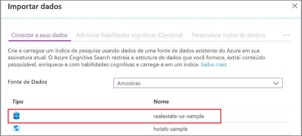
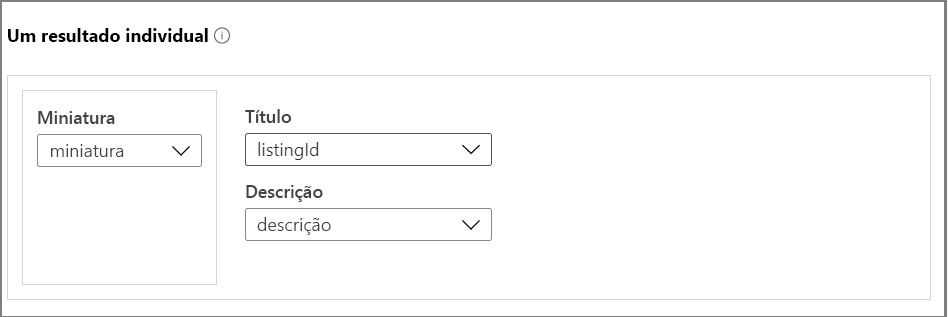
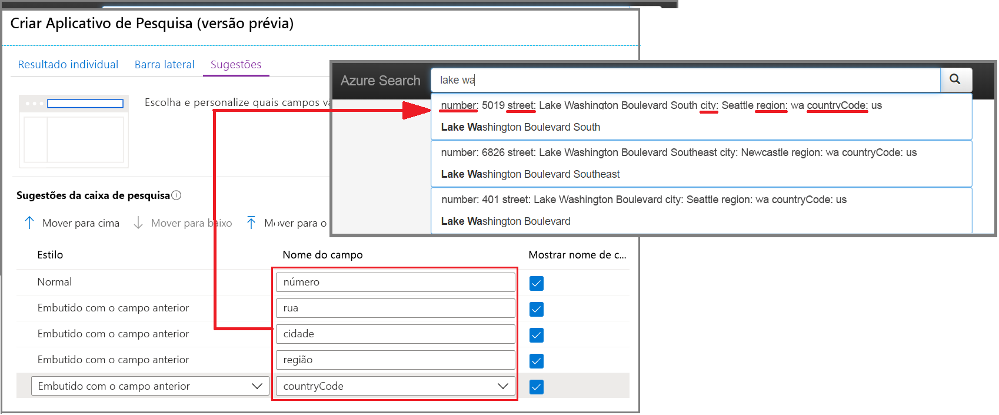
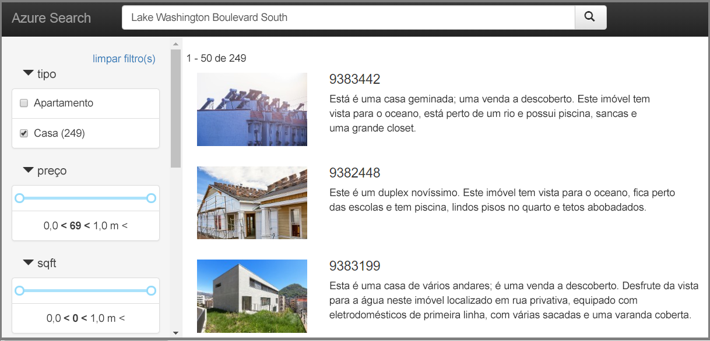

# Início Rápido: Criar um aplicativo de pesquisa no portal (Azure Cognitive Search)

Use o assistente **Criar aplicativo de pesquisa** para gerar um aplicativo Web no estilo "localhost" para download que seja executado em um navegador. Dependendo de sua configuração, o aplicativo gerado está operacional no primeiro uso, com uma conexão dinâmica com um índice remoto. Um aplicativo padrão pode incluir uma barra de pesquisa, uma área de resultados, filtros de barra lateral e suporte para typeahead.

Se você não tiver uma assinatura do Azure, crie uma [conta gratuita](https://azure.microsoft.com/free/?WT.mc_id=A261C142F) antes de começar. 

## Prerequisites

Convirá atualizar para a versão [mais recente do Microsoft Edge](https://www.microsoft.com/edge) ou usar o navegador Google Chrome para este guia de início rápido neste momento.

[Crie um serviço da Pesquisa Cognitiva do Azure](search-create-service-portal.md) ou [localize um serviço existente](https://ms.portal.azure.com/#blade/HubsExtension/BrowseResourceBlade/resourceType/Microsoft.Search%2FsearchServices) na assinatura atual. É possível usar um serviço gratuito para este início rápido. 

[Crie um índice](search-create-index-portal.md) para usar como base do seu aplicativo. 

Este guia de início rápido usa os dados de exemplo internos de Imóvel e o índice porque tem imagens em miniatura. Para criar o índice usado neste exercício, execute o assistente **Importar dados**, escolhendo a fonte de dados *realestate-us-sample*.

Quando o índice estiver pronto para uso, prossiga para a próxima etapa.

## Iniciar o assistente

1. Entre no [portal do Azure](https://portal.azure.com) e [localize seu serviço de pesquisa](https://ms.portal.azure.com/#blade/HubsExtension/BrowseResourceBlade/resourceType/Microsoft.Search%2FsearchServices).

1. Na página Visão Geral, nos links no meio da página, selecione **Índices**. 

1. Escolha *realestate-us-sample-index* na lista de índices existentes.

1. Na página Índice, na parte superior, selecione **Criar aplicativo de pesquisa (versão prévia)** para iniciar o assistente.

1. Na primeira página do assistente, selecione **Habilitar CORS (Compartilhamento de Recursos Entre Origens)** para adicionar suporte a CORS à definição de índice. Esta etapa é opcional, mas seu aplicativo Web local não se conectará ao índice remoto sem ela.

## Configurar resultados da pesquisa

O assistente fornece um layout básico para resultados da pesquisa renderizados que incluem espaço para uma imagem em miniatura, um título e uma descrição. O backup de cada um desses elementos é um campo no índice que fornece os dados. 

1. Em Miniatura, escolha o campo *miniatura* no índice *realestate-us-sample*. Este exemplo inclui miniaturas de imagem na forma de imagens endereçadas por URL armazenadas em um campo chamado *miniatura*. Caso seu índice não tenha imagens, deixe este campo em branco.

1. Em Título, escolha um campo que transmita a exclusividade de cada documento. Neste exemplo, a ID de listagem é uma seleção razoável.

1. Em Descrição, escolha um campo que dê detalhes para ajudar uma pessoa a decidir se ela deseja clicar nesse documento específico.

## Adicionar uma barra lateral

O serviço de pesquisa dá suporte à navegação facetada, que geralmente é renderizada como uma barra lateral. As facetas são baseadas em campos filtráveis e facetáveis, conforme expresso no esquema de índice.

No Azure Cognitive Search, a navegação facetada é uma experiência de filtragem cumulativa. Dentro de uma categoria, selecionar vários filtros expande os resultados (por exemplo, selecionar Seattle e Bellevue dentro de Cidade). Nas categorias, selecionar vários filtros reduz os resultados.

> [!TIP]
> Você pode exibir todo o esquema do índice no portal. Procure o link **definição do índice (JSON)** na página de visão geral de cada índice. Os campos que se qualificam para navegação facetada têm atributos "filtrable: true" e "facetable: true".

Aceite a seleção atual de facetas e prossiga para próxima página.

## Adicionar typeahead

A funcionalidade typeahead está disponível na forma de preenchimento automático e sugestões de consulta. O assistente dá suporte a sugestões de consulta. Com base nas entradas de pressionamento de teclas fornecidas pelo usuário, o serviço de pesquisa retorna uma lista de cadeias de consulta "concluídas" que podem ser selecionadas como entrada.

As sugestões são habilitadas em definições de campo específicas. O assistente fornece opções para configurar a quantidade de informações incluídas em uma sugestão. 

A captura de tela a seguir mostra as opções no assistente, justapostas a uma página renderizada no aplicativo. Você pode ver como as seleções de campo são usadas e como "Mostrar nome do campo" é usado para incluir ou excluir rótulos dentro da sugestão.

## Criar, baixar e executar

1. Selecione **Criar aplicativo de pesquisa** para gerar o arquivo HTML.

1. Quando solicitado, selecione **Baixar seu aplicativo** para baixar o arquivo.

1. Abra o arquivo. Você deverá ver uma página semelhante à seguinte captura de tela. Insira um termo e use filtros para restringir os resultados. 

O índice subjacente é composto por dados fictícios e gerados que foram duplicados em documentos, e as descrições às vezes não correspondem à imagem. Você pode esperar uma experiência mais coesa ao criar um aplicativo com base em seus próprios índices.

## Limpar os recursos

Quando você está trabalhando em sua própria assinatura, é uma boa ideia identificar, no final de um projeto, se você ainda precisa dos recursos criados. Recursos deixados em execução podem custar dinheiro. Você pode excluir os recursos individualmente ou excluir o grupo de recursos para excluir todo o conjunto de recursos.

Você pode localizar e gerenciar recursos no portal usando o link **Todos os recursos** ou **Grupos de recursos** no painel de navegação à esquerda.

Se você estiver usando um serviço gratuito, estará limitado a três índices, indexadores e fontes de dados. Você pode excluir itens individuais no portal para permanecer abaixo do limite. 

## Próximas etapas

Embora o aplicativo padrão seja útil para a exploração inicial e tarefas pequenas, a revisão das APIs logo no início ajudará você a entender os conceitos e o fluxo de trabalho em um nível mais profundo:

> [!div class="nextstepaction"]
> [Criar um índice usando o SDK do .NET](https://docs.microsoft.com/azure/search/search-create-index-dotnet)