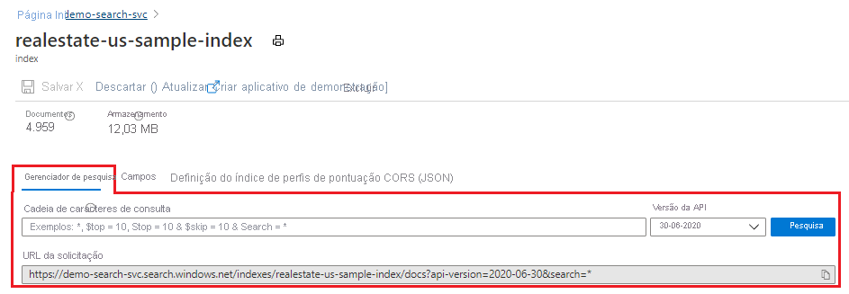
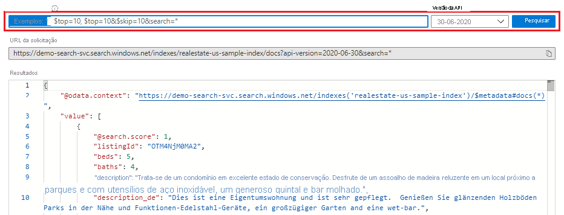
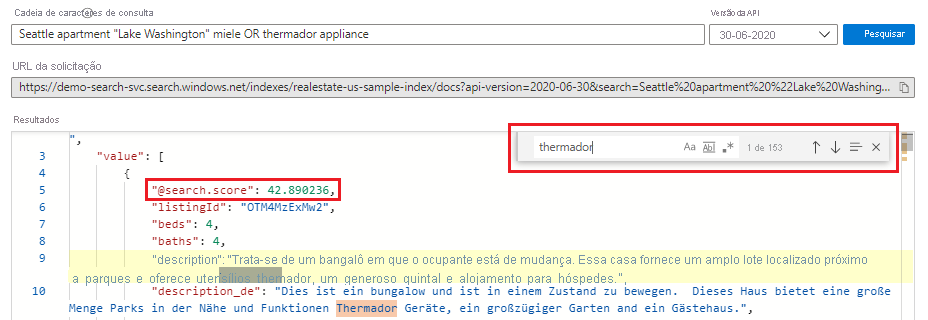
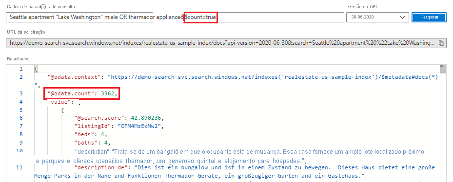
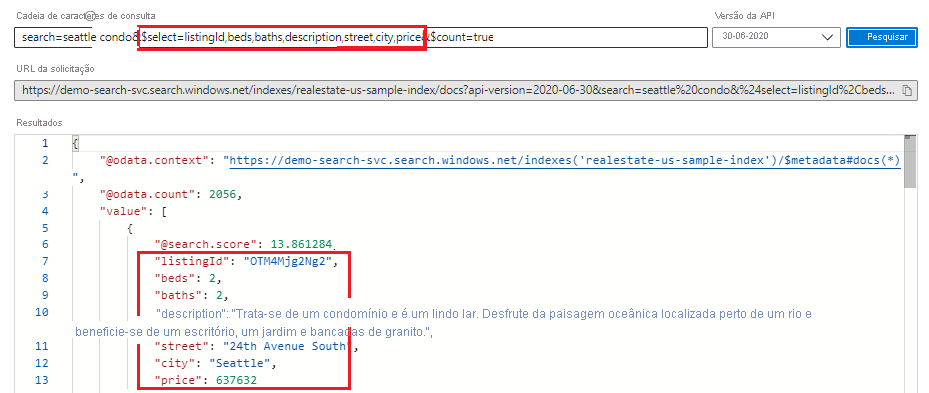
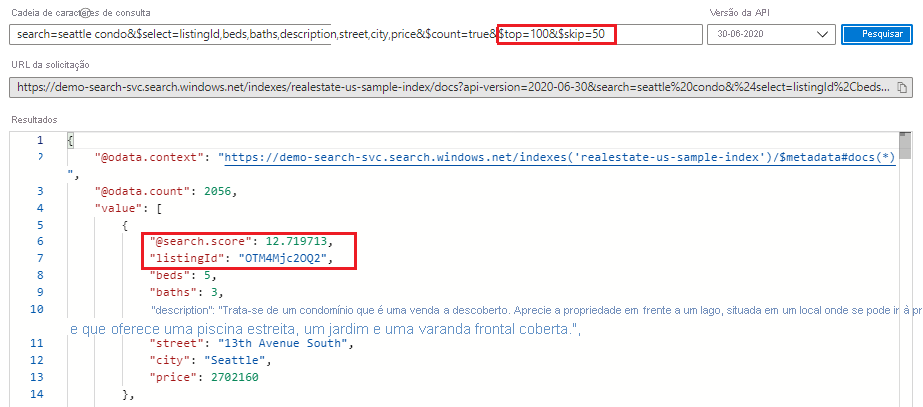
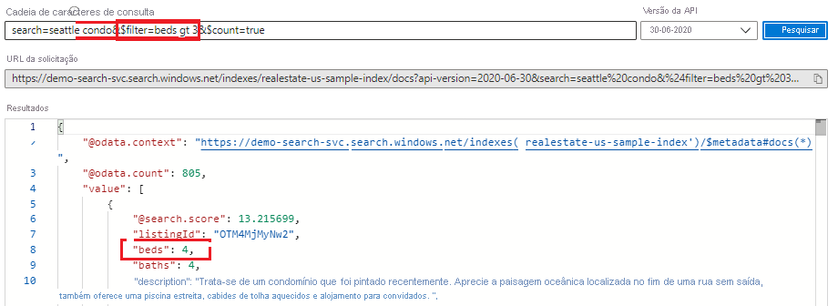
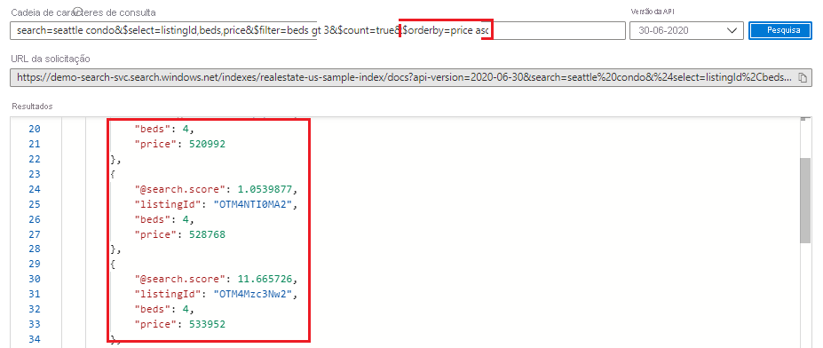

# <a name="quickstart-use-search-explorer-to-run-queries-in-the-portal"></a>Início Rápido: Usar o Gerenciador de pesquisa para executar consultas no portal

O **Gerenciador de pesquisa** é uma ferramenta de consulta interna usada para executar consultas em um índice de pesquisa no Azure Cognitive Search. Essa ferramenta facilita a aprendizagem da sintaxe de consulta, o teste de uma expressão de consulta ou filtro ou a confirmação dos resultados de uma atualização de índice verificando se há conteúdo mais recente.

Este início rápido usa **realestate-us-sample-index** para demonstrar o Gerenciador de pesquisa. As solicitações são formuladas usando a [API REST de Pesquisa](https://docs.microsoft.com/rest/api/searchservice/), com respostas retornadas como documentos JSON.

## <a name="prerequisites"></a>Pré-requisitos

+ [Crie um serviço da Pesquisa Cognitiva do Azure](search-create-service-portal.md) ou [localize um serviço existente](https://ms.portal.azure.com/#blade/HubsExtension/BrowseResourceBlade/resourceType/Microsoft.Search%2FsearchServices) na assinatura atual. É possível usar um serviço gratuito para este início rápido.

+ **realestate-us-sample-index** é usado neste início rápido. Percorra o assistente para [**Importar dados**](search-import-data-portal.md) a fim de gerar o índice da fonte de dados de exemplos interna.

## <a name="start-search-explorer"></a>Iniciar o Gerenciador de pesquisa

1. No [portal do Azure](https://portal.azure.com), abra a página do serviço de pesquisa no painel ou [localize seu serviço](https://ms.portal.azure.com/#blade/HubsExtension/BrowseResourceBlade/resourceType/Microsoft.Search%2FsearchServices).

1. Abra o Gerenciador de pesquisa por meio da barra de comandos:

   

    Ou use a guia inserida do **Gerenciador de pesquisa** em um índice aberto:

   

## <a name="unspecified-query"></a>Consulta não especificada

Na primeira observação do conteúdo, execute uma pesquisa vazia clicando em **Pesquisar** sem nenhum termo fornecido. Uma pesquisa vazia é útil como uma primeira consulta porque ela retorna documentos inteiros para que você possa examinar a composição do documento. Em uma pesquisa vazia, não há nenhuma classificação de pesquisa e os documentos são retornados em ordem arbitrária (`"@search.score": 1` para todos os documentos). Por padrão, são retornados 50 documentos em uma solicitação de pesquisa.

Uma sintaxe equivalente para uma pesquisa vazia é `*` ou `search=*`.
   
   ```http
   search=*
   ```

   **Resultados**
   
   

## <a name="free-text-search"></a>Pesquisa de texto livre

Consultas de forma livre, com ou sem operadores, são úteis para simular consultas definidas pelo usuário enviadas de um aplicativo personalizado para o Azure Cognitive Search. Somente esses campos atribuídos como **Pesquisáveis** na definição do índice são verificados quanto a correspondências. 

Observe que, quando você fornece critérios de pesquisa, como expressões ou termos de consulta, a classificação de pesquisa entra em cena. O exemplo a seguir ilustra uma pesquisa de texto livre.

   ```http
   Seattle apartment "Lake Washington" miele OR thermador appliance
   ```

   **Resultados**

   Você pode usar Ctrl-F para pesquisar termos específicos de interesse nos resultados.

   

## <a name="count-of-matching-documents"></a>Contagem de documentos correspondentes 

Adicione **$count=true** para obter o número de correspondências encontradas em um índice. Em uma pesquisa vazia, a contagem é o número total de documentos no índice. Em uma pesquisa qualificada, é o número de documentos que correspondem à entrada da consulta.

   ```http
   $count=true
   ```

   **Resultados**

   

## <a name="limit-fields-in-search-results"></a>Limitar campos nos resultados da pesquisa

Adicione [ **$select**](search-query-odata-select.md) para limitar os resultados aos campos nomeados explicitamente para que a leitura fique mais legível no **Gerenciador de pesquisa**. Para manter a cadeia de caracteres de pesquisa e **$count=true**, coloque **&** como prefixo dos argumentos. 

   ```http
   search=seattle condo&$select=listingId,beds,baths,description,street,city,price&$count=true
   ```

   **Resultados**

   

## <a name="return-next-batch-of-results"></a>Retornar o próximo lote de resultados

O Azure Cognitive Search retorna as primeiras 50 correspondências com base na classificação de pesquisa. Para obter o próximo conjunto de documentos correspondentes, acrescente **$top=100,&$skip=50** para aumentar o conjunto de resultados para 100 documentos (o padrão é 50, o máximo é 1000), ignorando os primeiros 50 documentos. Lembre-se de que você precisa fornecer critérios de pesquisa, como um termo ou expressão de consulta, para obter os resultados classificados. Observe que as pontuações de pesquisa diminuem quanto mais você avança nos resultados da pesquisa.

   ```http
   search=seattle condo&$select=listingId,beds,baths,description,street,city,price&$count=true&$top=100&$skip=50
   ```

   **Resultados**

   

## <a name="filter-expressions-greater-than-less-than-equal-to"></a>Expressões de filtro (maior que, menor que, igual a)

Use o parâmetro [ **$filter**](search-query-odata-filter.md) quando desejar especificar critérios precisos em vez da pesquisa de texto livre. O campo deve ser atribuído como **Filtrável** no índice. Este exemplo pesquisa quartos maiores que 3:

   ```http
   search=seattle condo&$filter=beds gt 3&$count=true
   ```
   
   **Resultados**

   

## <a name="order-by-expressions"></a>Expressões orderby

Adicione [ **$orderby**](search-query-odata-orderby.md) para classificar os resultados por outro campo além da pontuação de pesquisa. O campo deve ser atribuído como **Classificável** no índice. Uma expressão de exemplo que você pode usar para testar isso é:

   ```http
   search=seattle condo&$select=listingId,beds,price&$filter=beds gt 3&$count=true&$orderby=price asc
   ```
   
   **Resultados**

   

As expressões **$filter** e **$orderby** são construções do OData. Para saber mais, confira [Sintaxe de filtro OData](https://docs.microsoft.com/rest/api/searchservice/odata-expression-syntax-for-azure-search).

<a name="start-search-explorer"></a>

## <a name="takeaways"></a>Observações

Neste início rápido, você usou o **Gerenciador de pesquisa** para consultar um índice usando a API REST.

+ Os resultados são retornados como documentos JSON detalhados para que você possa exibir o conteúdo e a construção do documento na totalidade. Você pode usar expressões de consulta, mostradas nos exemplos, para limitar quais campos são retornados.

+ Os documentos contêm todos os campos marcados como **Recuperáveis** no índice. Para exibir atributos de índice no portal, clique em *realestate-us-sample* na lista **Índices** na página de visão geral da pesquisa.

+ As consultas de forma livre, semelhantes ao que você pode digitar em um navegador da Web comercial, são úteis para testar uma experiência do usuário final. Por exemplo, supondo o índice de exemplo realestate interno, você poderia digitar "Apartamentos Seattle lago washington" e, em seguida, usar Ctrl-F para localizar termos nos resultados da pesquisa. 

+ As expressões de consulta e de filtro são articuladas em uma sintaxe compatível com o Azure Cognitive Search. O padrão é uma [sintaxe simples](https://docs.microsoft.com/rest/api/searchservice/simple-query-syntax-in-azure-search), mas você pode opcionalmente usar uma [Lucene completa](https://docs.microsoft.com/rest/api/searchservice/lucene-query-syntax-in-azure-search) para consultas mais poderosas. [Expressões de filtro](https://docs.microsoft.com/rest/api/searchservice/odata-expression-syntax-for-azure-search) são uma sintaxe de OData.

## <a name="clean-up-resources"></a>Limpar os recursos

Quando você está trabalhando em sua própria assinatura, é uma boa ideia identificar, no final de um projeto, se você ainda precisa dos recursos criados. Recursos deixados em execução podem custar dinheiro. Você pode excluir os recursos individualmente ou excluir o grupo de recursos para excluir todo o conjunto de recursos.

Você pode localizar e gerenciar recursos no portal usando o link **Todos os recursos** ou **Grupos de recursos** no painel de navegação à esquerda.

Se você estiver usando um serviço gratuito, estará limitado a três índices, indexadores e fontes de dados. Você pode excluir itens individuais no portal para permanecer abaixo do limite. 

## <a name="next-steps"></a>Próximas etapas

Para saber mais sobre estruturas de consulta e sintaxe, use o Postman ou uma ferramenta equivalente para criar expressões de consulta que utilizem mais partes da API. A [API REST de Pesquisa](https://docs.microsoft.com/rest/api/searchservice/) é útil principalmente para aprendizado e exploração.

> [!div class="nextstepaction"]
> [Criar uma consulta básica no Postman](search-query-simple-examples.md)