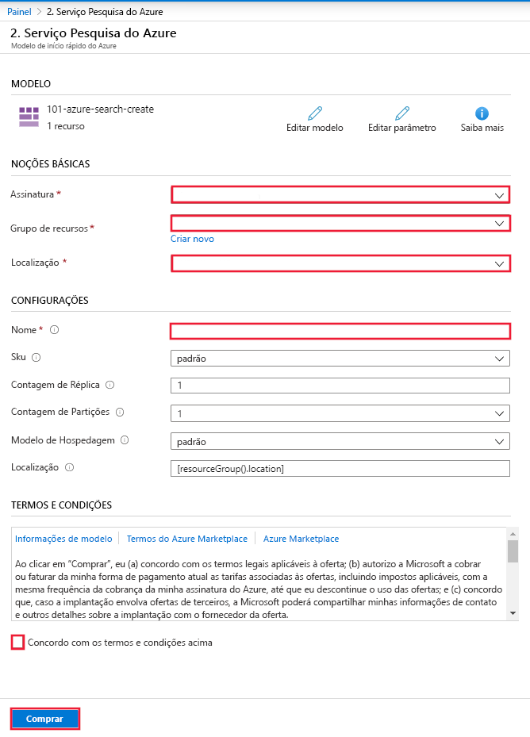

# Início Rápido: Implantar o Cognitive Search usando um modelo do Resource Manager

Este artigo descreve o processo de uso de um modelo do Azure Resource Manager para implantar um recurso do Azure Cognitive Search no portal do Azure.

[!INCLUDE [About Azure Resource Manager](../../includes/resource-manager-quickstart-introduction.md)]

Se seu ambiente atender aos pré-requisitos e você estiver familiarizado com o uso de modelos ARM, selecione o botão **Implantar no Azure**. O modelo será aberto no portal do Azure.

## Pré-requisitos

Se você não tiver uma assinatura do Azure, crie uma [conta gratuita](https://azure.microsoft.com/free/?WT.mc_id=A261C142F) antes de começar.

## Examinar o modelo

O modelo usado neste início rápido é proveniente dos [Modelos de Início Rápido do Azure](https://azure.microsoft.com/resources/templates/101-azure-search-create/).

:::code language="json" source="~/quickstart-templates/101-azure-search-create/azuredeploy.json":::

O recurso do Azure definido neste modelo:

- [Microsoft.Search/searchServices](/azure/templates/Microsoft.Search/searchServices): cria um serviço do Azure Cognitive Search

## Implantar o modelo

Selecione a imagem a seguir para entrar no Azure e abrir um modelo. O modelo cria um recurso do Azure Cognitive Search.

O portal exibe um formulário que permite fornecer valores de parâmetro com facilidade. Alguns parâmetros são preenchidos previamente com os valores padrão do modelo. Você precisará fornecer a assinatura, o grupo de recursos, a localização e o nome do serviço. Caso deseje usar os Serviços Cognitivos em um pipeline de [enriquecimento de IA](cognitive-search-concept-intro.md), por exemplo, para analisar o texto de arquivos de imagem binária, escolha uma localização que ofereça o Cognitive Search e os Serviços Cognitivos. Os dois serviços devem estar na mesma região para cargas de trabalho de enriquecimento de IA. Depois de completar o formulário, você precisará concordar com os termos e as condições e, em seguida, selecionar o botão Comprar para concluir a implantação.

> [!div class="mx-imgBorder"]
> 

## Examinar os recursos implantados

Quando a implantação for concluída, você poderá acessar o novo grupo de recursos e o novo serviço de pesquisa no portal.

## Limpar os recursos

Outros tutoriais e guias de início rápido do Cognitive Search complementam este início rápido. Se você pretende continuar trabalhando com os tutoriais e os guias de início rápido a seguir, o ideal é manter esse recurso em vigor. Quando ele não for mais necessário, você poderá excluir o grupo de recursos, o que exclui o serviço do Cognitive Search e os recursos relacionados.

## Próximas etapas

Neste guia de início rápido, você criou um serviço do Cognitive Search usando um modelo do Resource Manager e validou a implantação. Para saber mais sobre o Cognitive Search e o Azure Resource Manager, prossiga para os artigos abaixo.

- Leia uma [visão geral do Azure Cognitive Search](search-what-is-azure-search.md).
- [Crie um índice](search-get-started-portal.md) para o serviço de pesquisa.
- [Crie um aplicativo de demonstração](search-create-app-portal.md) usando o assistente do portal.
- [Crie um conjunto de habilidades](cognitive-search-quickstart-blob.md) para extrair informações dos seus dados.
