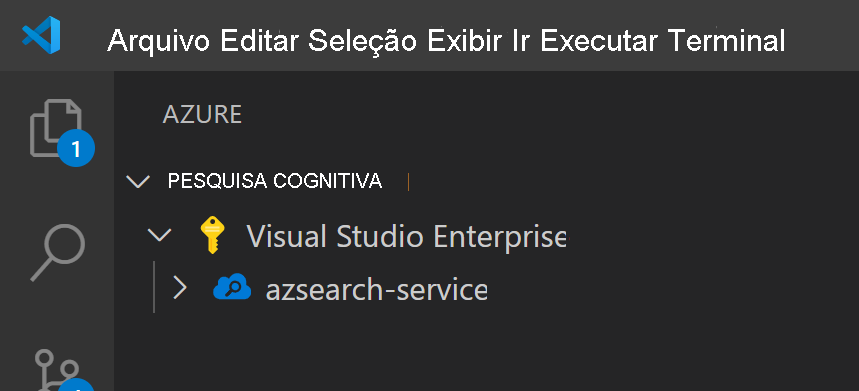
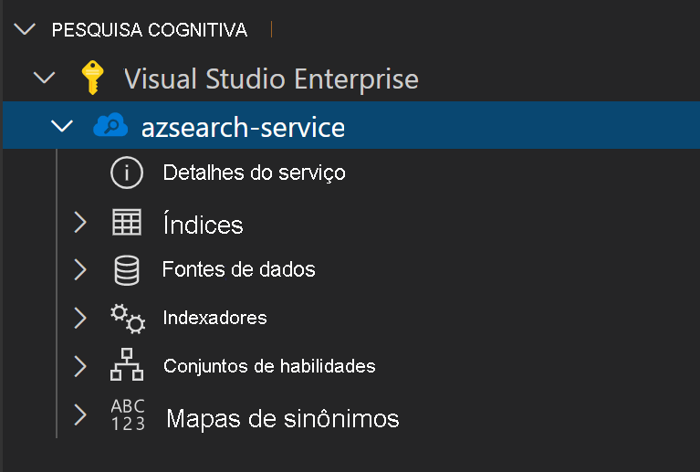
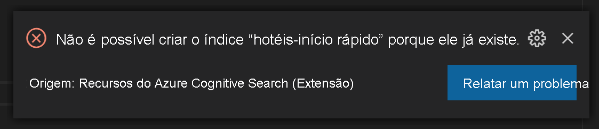
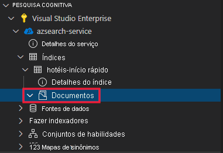
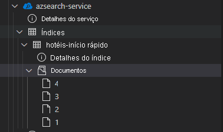

# <a name="get-started-with-azure-cognitive-search-using-visual-studio-code"></a>Introdução ao Azure Cognitive Search usando Visual Studio Code

Este artigo explica como formular solicitações à API REST de maneira interativa usando as [APIs REST do Azure Cognitive Search](/rest/api/searchservice) e o [Visual Studio Code](https://marketplace.visualstudio.com/items?itemName=ms-azuretools.vscode-azurecognitivesearch). Com a [extensão do Visual Studio Code para o Azure Cognitive Search (versão prévia)](https://marketplace.visualstudio.com/items?itemName=ms-azuretools.vscode-azurecognitivesearch) e estas instruções, você pode enviar solicitações e ver as respostas sem necessidade de escrever código.

Se você não tiver uma assinatura do Azure, crie uma [conta gratuita](https://azure.microsoft.com/free/?WT.mc_id=A261C142F) antes de começar.

> [!IMPORTANT] 
> Esse recurso está atualmente em visualização pública. A funcionalidade de versão prévia é fornecida sem um Contrato de Nível de Serviço e, portanto, não é recomendada para cargas de trabalho de produção. Para obter mais informações, consulte [Termos de Uso Complementares de Versões Prévias do Microsoft Azure](https://azure.microsoft.com/support/legal/preview-supplemental-terms/). 

## <a name="prerequisites"></a>Pré-requisitos

Os serviços e as ferramentas a seguir são necessários para este início rápido. 

+ [Visual Studio Code](https://code.visualstudio.com/download)

+ [Azure Cognitive Search para Visual Studio Code (versão prévia)](https://marketplace.visualstudio.com/items?itemName=ms-azuretools.vscode-azurecognitivesearch)

+ [Crie um serviço da Pesquisa Cognitiva do Azure](search-create-service-portal.md) ou [localize um serviço existente](https://ms.portal.azure.com/#blade/HubsExtension/BrowseResourceBlade/resourceType/Microsoft.Search%2FsearchServices) na assinatura atual. É possível usar um serviço gratuito para este início rápido. 

## <a name="install-the-extension"></a>Instalar a extensão

Comece abrindo o [VS Code](https://code.visualstudio.com). Selecione a guia **Extensões** na barra de atividade e pesquise *Azure Cognitive Search*. Localize a extensão nos resultados da pesquisa e selecione **Instalar**.


Como alternativa, você pode instalar a [extensão do Azure Cognitive Search](https://aka.ms/vscode-search) do marketplace do VS Code em um navegador da Web.

Você deverá ver uma nova guia do Azure ser exibida na barra de atividades se isso ainda não tiver acontecido.


## <a name="connect-to-your-subscription"></a>Conecte-se as suas assinaturas

Selecione **Entrar no Azure...** e faça logon na sua conta do Azure.

Você deve ver suas assinaturas serem exibidas. Selecione a assinatura para ver uma lista dos serviços de pesquisa na assinatura.



Para limitar as assinaturas exibidas, abra a paleta de comandos (Ctrl+Shift+P ou Cmd+Shift+P) e pesquise *Azure* ou *Selecione Assinaturas*. Também há comandos disponíveis para entrar e sair da sua conta do Azure.

Ao expandir o serviço de pesquisa, você verá itens de árvore para cada um dos recursos do Cognitive Search: índices, fontes de dados, indexadores, conjuntos de habilidades e mapas de sinônimos.



Esses itens de árvore podem ser expandidos para mostrar os recursos que você tem em seu serviço de pesquisa

## <a name="1---create-an-index"></a>1 - Criar um índice

Para começar a usar o Azure Cognitive Search, primeiro você precisa criar um índice de pesquisa. Isso é feito usando a [API REST Criar Índice](/rest/api/searchservice/create-index). 

Com a extensão do VS Code, você só precisa se preocupar com o corpo da solicitação. Neste guia de início rápido, fornecemos uma definição de índice de exemplo e os documentos correspondentes.

### <a name="index-definition"></a>Definição do índice

A definição de índice abaixo é um esquema de exemplo para hotéis fictícios.

A coleção `fields` define a estrutura de documentos no índice de pesquisa. Cada campo tem um tipo de dados e vários atributos adicionais que determinam como o campo pode ser usado.

```json
{
    "name": "hotels-quickstart",
    "fields": [
        {
            "name": "HotelId",
            "type": "Edm.String",
            "key": true,
            "filterable": true
        },
        {
            "name": "HotelName",
            "type": "Edm.String",
            "searchable": true,
            "filterable": false,
            "sortable": true,
            "facetable": false
        },
        {
            "name": "Description",
            "type": "Edm.String",
            "searchable": true,
            "filterable": false,
            "sortable": false,
            "facetable": false,
            "analyzer": "en.lucene"
        },
        {
            "name": "Description_fr",
            "type": "Edm.String",
            "searchable": true,
            "filterable": false,
            "sortable": false,
            "facetable": false,
            "analyzer": "fr.lucene"
        },
        {
            "name": "Category",
            "type": "Edm.String",
            "searchable": true,
            "filterable": true,
            "sortable": true,
            "facetable": true
        },
        {
            "name": "Tags",
            "type": "Collection(Edm.String)",
            "searchable": true,
            "filterable": true,
            "sortable": false,
            "facetable": true
        },
        {
            "name": "ParkingIncluded",
            "type": "Edm.Boolean",
            "filterable": true,
            "sortable": true,
            "facetable": true
        },
        {
            "name": "LastRenovationDate",
            "type": "Edm.DateTimeOffset",
            "filterable": true,
            "sortable": true,
            "facetable": true
        },
        {
            "name": "Rating",
            "type": "Edm.Double",
            "filterable": true,
            "sortable": true,
            "facetable": true
        },
        {
            "name": "Address",
            "type": "Edm.ComplexType",
            "fields": [
                {
                    "name": "StreetAddress",
                    "type": "Edm.String",
                    "filterable": false,
                    "sortable": false,
                    "facetable": false,
                    "searchable": true
                },
                {
                    "name": "City",
                    "type": "Edm.String",
                    "searchable": true,
                    "filterable": true,
                    "sortable": true,
                    "facetable": true
                },
                {
                    "name": "StateProvince",
                    "type": "Edm.String",
                    "searchable": true,
                    "filterable": true,
                    "sortable": true,
                    "facetable": true
                },
                {
                    "name": "PostalCode",
                    "type": "Edm.String",
                    "searchable": true,
                    "filterable": true,
                    "sortable": true,
                    "facetable": true
                },
                {
                    "name": "Country",
                    "type": "Edm.String",
                    "searchable": true,
                    "filterable": true,
                    "sortable": true,
                    "facetable": true
                }
            ]
        }
    ],
    "suggesters": [
        {
            "name": "sg",
            "searchMode": "analyzingInfixMatching",
            "sourceFields": [
                "HotelName"
            ]
        }
    ]
}
```

Para criar um índice, clique com o botão direito do mouse em **Índices** e, em seguida, selecione **Criar índice**. Um editor com um nome semelhante a `indexes-new-28c972f661.azsindex` será exibido. 

Cole a definição de índice acima na janela. Salve o arquivo e selecione **Carregar** quando for solicitado se você quiser atualizar o índice. Isso criará o índice e ele estará disponível no modo de exibição de árvore.


Se houver um problema com a definição de índice, você deverá ver uma mensagem de erro ser exibida explicando o erro.



Se isso acontecer, corrija o problema e salve o arquivo novamente.

## <a name="2---load-documents"></a>2 - Carregar documentos

Criar o índice e popular o índice são etapas separadas. No Azure Cognitive Search, o índice contém todos os dados pesquisáveis. Nesse cenário, os dados são fornecidos como documentos JSON. A [API REST Adicionar, Atualizar ou Excluir Documentos ](/rest/api/searchservice/addupdate-or-delete-documents) é usada para essa tarefa. 

Para adicionar novos documentos no VS Code:

1. Expanda o índice `hotels-quickstart` que você criou. Clique com o botão direito do mouse em **Documentos** e selecione **Criar documento**.

    

2. Isso abrirá um editor JSON que inferiu o esquema do índice.

    

3. Cole no JSON abaixo e salve o arquivo. Um prompt será aberto solicitando que você confirme suas alterações. Selecione **Carregar** para salvar as alterações.

    ```json
    {
        "HotelId": "1",
        "HotelName": "Secret Point Motel",
        "Description": "The hotel is ideally located on the main commercial artery of the city in the heart of New York. A few minutes away is Time's Square and the historic centre of the city, as well as other places of interest that make New York one of America's most attractive and cosmopolitan cities.",
        "Category": "Boutique",
        "Tags": [ "pool", "air conditioning", "concierge" ],
        "ParkingIncluded": false,
        "LastRenovationDate": "1970-01-18T00:00:00Z",
        "Rating": 3.60,
        "Address": {
            "StreetAddress": "677 5th Ave",
            "City": "New York",
            "StateProvince": "NY",
            "PostalCode": "10022",
            "Country": "USA"
        } 
    }
    ```

4. Repita esse processo para os três documentos restantes

    Documento 2:
    ```json
    {
        "HotelId": "2",
        "HotelName": "Twin Dome Motel",
        "Description": "The hotel is situated in a  nineteenth century plaza, which has been expanded and renovated to the highest architectural standards to create a modern, functional and first-class hotel in which art and unique historical elements coexist with the most modern comforts.",
        "Category": "Boutique",
        "Tags": [ "pool", "free wifi", "concierge" ],
        "ParkingIncluded": false,
        "LastRenovationDate": "1979-02-18T00:00:00Z",
        "Rating": 3.60,
        "Address": {
            "StreetAddress": "140 University Town Center Dr",
            "City": "Sarasota",
            "StateProvince": "FL",
            "PostalCode": "34243",
            "Country": "USA"
        } 
    }
    ```

    Documento 3:
    ```json
    {
        "HotelId": "3",
        "HotelName": "Triple Landscape Hotel",
        "Description": "The Hotel stands out for its gastronomic excellence under the management of William Dough, who advises on and oversees all of the Hotel’s restaurant services.",
        "Category": "Resort and Spa",
        "Tags": [ "air conditioning", "bar", "continental breakfast" ],
        "ParkingIncluded": true,
        "LastRenovationDate": "2015-09-20T00:00:00Z",
        "Rating": 4.80,
        "Address": {
            "StreetAddress": "3393 Peachtree Rd",
            "City": "Atlanta",
            "StateProvince": "GA",
            "PostalCode": "30326",
            "Country": "USA"
        } 
    }
    ```

    Documento 4:
    ```json
    {
        "HotelId": "4",
        "HotelName": "Sublime Cliff Hotel",
        "Description": "Sublime Cliff Hotel is located in the heart of the historic center of Sublime in an extremely vibrant and lively area within short walking distance to the sites and landmarks of the city and is surrounded by the extraordinary beauty of churches, buildings, shops and monuments. Sublime Cliff is part of a lovingly restored 1800 palace.",
        "Category": "Boutique",
        "Tags": [ "concierge", "view", "24-hour front desk service" ],
        "ParkingIncluded": true,
        "LastRenovationDate": "1960-02-06T00:00:00Z",
        "Rating": 4.60,
        "Address": {
            "StreetAddress": "7400 San Pedro Ave",
            "City": "San Antonio",
            "StateProvince": "TX",
            "PostalCode": "78216",
            "Country": "USA"
        }
    }
    ```

Neste ponto, você deve ver todos os quatro documentos disponíveis na seção de documentos.



## <a name="3---search-an-index"></a>3 - Pesquisar um índice

Agora que o índice e o conjunto de documentos foram carregados, você poderá emitir consultas neles usando a [API REST Pesquisar Documentos](/rest/api/searchservice/search-documents).

Para fazer isso no VS Code:

1. Clique com o botão direito do mouse no índice a ser pesquisado e selecione **Pesquisar índice**. Isso abrirá um editor com um nome semelhante a `sandbox-b946dcda48.azs`.

    

2. Uma consulta simples é preenchida automaticamente. Pressione **Ctrl+Alt+R** ou **Cmd+Alt+R** para enviar a consulta. Você verá os resultados aparecem em uma janela à esquerda.

    


### <a name="example-queries"></a>Consultas de exemplo

Experimente alguns outros exemplos de consulta para ter uma ideia da sintaxe. Há quatro consultas adicionais abaixo para você experimentar. Você pode adicionar várias consultas a um mesmo editor. Quando você pressiona **Ctrl+Alt+R** ou **Cmd+Alt+R**, a linha do seu cursor determina qual consulta será enviada.


Na primeira consulta, pesquisamos `boutique` e `select` apenas em determinados campos. É uma prática recomendada a apenas `select` dos campos de que você precisa, pois a extração de dados desnecessários pode adicionar latência às suas consultas. A consulta também configura `$count=true` para retornar o número total de resultados com os resultados da pesquisa.

```
// Query example 1 - Search `boutique` with select and return count
search=boutique&$count=true&$select=HotelId,HotelName,Rating,Category
```

Na próxima consulta, especificamos o termo de pesquisa `wifi` e incluímos um filtro para retornar apenas os resultados em que o estado é igual a `'FL'`. Os resultados também são ordenados pela `Rating` do hotel.

```
// Query example 2 - Search with filter, orderBy, select, and count
search=wifi&$filter=Address/StateProvince eq 'FL'&$select=HotelId,HotelName,Rating&$orderby=Rating desc
```

Em seguida, a pesquisa é limitada a um único campo pesquisável usando o parâmetro `searchFields`. Essa é uma ótima opção para tornar sua consulta mais eficiente, se você souber que está interessado apenas em correspondências em determinados campos.

```
// Query example 3 - Limit searchFields
search=submlime cliff&$select=HotelId,HotelName,Rating&searchFields=HotelName
```

Outra opção comum a ser incluída em uma consulta é `facets`. As facetas permitem que você crie filtros em sua interface do usuário para tornar mais fácil para os usuários saberem quais valores eles podem filtrar.

```
// Query example 4 - Take the top two results, and show only HotelName and Category in the results
search=*&$select=HotelId,HotelName,Rating&searchFields=HotelName&facet=Category
```

## <a name="open-index-in-the-portal"></a>Abrir índice no portal

Se você quiser exibir o serviço de pesquisa no portal, clique com o botão direito do mouse no nome do serviço de pesquisa e selecione **Abrir no Portal**. Isso levará você ao serviço de pesquisa no portal do Azure.

## <a name="clean-up-resources"></a>Limpar os recursos

Quando você está trabalhando em sua própria assinatura, é uma boa ideia identificar, no final de um projeto, se você ainda precisa dos recursos criados. Recursos deixados em execução podem custar dinheiro. Você pode excluir os recursos individualmente ou excluir o grupo de recursos para excluir todo o conjunto de recursos.

Você pode localizar e gerenciar recursos no portal usando o link **Todos os recursos** ou **Grupos de recursos** no painel de navegação à esquerda.

Se você estiver usando um serviço gratuito, estará limitado a três índices, indexadores e fontes de dados. Você pode excluir itens individuais no portal para permanecer abaixo do limite. 

## <a name="next-steps"></a>Próximas etapas

Agora que você sabe como executar tarefas básicas, pode avançar com chamadas adicionais à API REST para obter recursos mais avançados, como indexadores ou [configurar um pipeline de enriquecimento](cognitive-search-tutorial-blob.md) que adicione transformações de conteúdo para indexação. Para a próxima etapa, recomendamos o seguinte link:

> [!div class="nextstepaction"]
> [Tutorial: Usar o REST e a IA para gerar conteúdo pesquisável com base em blobs do Azure](cognitive-search-tutorial-blob.md)