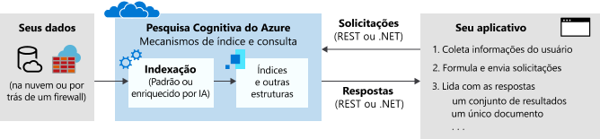

# O que é a Pesquisa Cognitiva do Azure?

O Azure Cognitive Search ([chamado anteriormente de “Azure Search”](whats-new.md#new-service-name)) é um serviço de pesquisa de nuvem que oferece aos desenvolvedores APIs e ferramentas para criar uma experiência de pesquisa avançada para conteúdo privado e heterogêneo em aplicativos Web, móveis e empresariais. 

A pesquisa é fundamental para aplicativos que apresentam conteúdos com cenários comuns aos usuários, incluindo: pesquisa de catálogo ou documentos, pesquisa de site de comércio eletrônico ou mineração de conhecimento para ciência de dados. As APIs e a arquitetura do Cognitive Search simplificam a tarefa de adicionar uma recuperação sofisticada de informações em todas as soluções.

Um serviço de pesquisa tem os seguintes componentes:

+ Mecanismo de pesquisa para pesquisa de texto completo
+ Armazenamento persistente de conteúdo indexado de propriedade do usuário
+ APIs para obter conteúdo de indexação e consulta
+ [Enriquecimentos opcionais baseados em IA](cognitive-search-concept-intro.md): criam um conteúdo pesquisável com base em imagens, textos brutos não estruturados e arquivos de aplicativos
+ Integração opcional a outros serviços do Azure para obter dados, machine learning/IA, monitoramento e segurança
+ Implementação opcional de [pesquisa semântica (versão prévia)](semantic-search-overview.md) para obter uma relevância aprimorada

Em termos de arquitetura, um serviço de pesquisa reside entre os armazenamentos de dados externos que contêm seus dados não indexados e o seu aplicativo cliente que envia solicitações de consulta para um índice de pesquisa e processa a resposta.

Externamente, a pesquisa pode se integrar a outros serviços do Azure na forma de *indexadores* que automatizam a ingestão/recuperação de dados de fontes de dados do Azure e os *conjuntos de habilidades* que incorporam a IA consumível por meio de Serviços Cognitivos, como análise de imagem e texto, ou a IA personalizada criada por você no Azure Machine Learning ou encapsula no Azure Functions.

## Dentro de um serviço de pesquisa

No próprio serviço de pesquisa, as duas principais cargas de trabalho são *indexação* e *consulta*. 

+ [indexação](search-what-is-an-index.md) é um processo de entrada que carrega o conteúdo no seu serviço de pesquisa e o torna pesquisável. Internamente, o texto de entrada é processado em tokens e armazenados em índices invertidos para verificações rápidas. Você pode carregar qualquer texto que esteja no formato de documentos JSON.

  Além disso, se o conteúdo incluir arquivos mistos, você terá a opção de adicionar o *enriquecimento de IA* por meio de [habilidades cognitivas](cognitive-search-working-with-skillsets.md). O enriquecimento de IA pode extrair um texto inserido em arquivos de aplicativos e inferir o texto e a estrutura de arquivos que não são de texto analisando o conteúdo. 

  As habilidades que fornecem a análise são predefinidas da Microsoft ou habilidades personalizadas criadas por você. A análise e as transformações subsequentes podem resultar em novas informações e estruturas que não existiam, fornecendo grande utilidade para vários cenários de mineração de pesquisa e conhecimento.

+ A [consulta](search-query-overview.md) pode ocorrer depois que um índice é preenchido com um texto pesquisável, quando seu aplicativo cliente envia solicitações de consulta para um serviço de pesquisa e processa as respostas. Toda a execução da consulta é feita em um índice de pesquisa que você cria, detém e armazena em seu serviço. No aplicativo cliente, a experiência de pesquisa é definida usando APIs do Azure Cognitive Search e pode incluir ajuste de relevância, preenchimento automático, correspondência de sinônimos, correspondência difusa, correspondência de padrões, filtro e classificação.

A funcionalidade é exposta por meio de uma [API REST](/rest/api/searchservice/) ou um [SDK do .NET](search-howto-dotnet-sdk.md) simples que mascara a complexidade inerente da tecnologia de pesquisa. Você também pode usar o portal do Azure para administração de serviços e gerenciamento de conteúdo, com ferramentas para protótipo e consulta de seus índices e habilidades. Porque o serviço é executado na nuvem, infraestrutura e disponibilidade são gerenciados pela Microsoft.

## Por que usar o Cognitive Search

A Pesquisa Cognitiva do Azure é adequada para os seguintes cenários de aplicativo:

+ Consolide um conteúdo heterogêneo em um índice de pesquisa particular definido pelo usuário.

+ Implemente facilmente recursos relacionados a pesquisa: ajuste de relevância, faceted navigation, filtros (incluindo pesquisa geoespacial), mapeamento de sinônimos e preenchimento automático.

+ Transforme grandes arquivos de texto ou imagens não diferenciados ou arquivos de aplicativo armazenados no Armazenamento de Blobs do Azure ou no Cosmos DB em documentos JSON pesquisáveis. Isso é obtido durante a indexação por meio de [habilidades cognitivas](cognitive-search-concept-intro.md) que adicionam processamento externo.

+ Adicione análise linguística ou de texto personalizado. Se você tiver conteúdo que não está em inglês, a Pesquisa Cognitiva do Azure será compatível com os analisadores Lucene e com os processadores de linguagem natural da Microsoft. Você também pode configurar analisadores para obter processamento especializado de conteúdo bruto, como filtragem de sinais diacríticos ou reconhecimento e preservação de padrões em cadeias de caracteres.

Para obter mais informações sobre funcionalidades específicas, confira [Recursos do Azure Cognitive Search](search-features-list.md)

## Como começar

Uma exploração de ponta a ponta dos principais recursos de pesquisa pode ser obtida em quatro etapas:

1. [**Crie um serviço de pesquisa**](search-create-service-portal.md) na camada Gratuita compartilhada ou uma [camada paga](https://azure.microsoft.com/pricing/details/search/) para recursos dedicados usados apenas pelo seu serviço. Todos os tutoriais e guias início rápido podem ser concluídos no serviço compartilhado.

1. [**Crie um índice de pesquisa**](search-what-is-an-index.md) usando o portal, a [API REST](/rest/api/searchservice/create-index), o [SDK do .NET](search-howto-dotnet-sdk.md) ou outro SDK. O esquema de índice define a estrutura do conteúdo pesquisável.

1. [**Carregue conteúdo**](search-what-is-data-import.md) usando o [modelo de "push"](tutorial-optimize-indexing-push-api.md) para enviar documentos JSON por push de qualquer origem ou use o [modelo de "pull" (indexares)](search-indexer-overview.md) se os seus dados de origem estiverem no Azure.

1. [**Consulte um índice**](search-query-overview.md) usando o [Gerenciador de pesquisa](search-explorer.md) no portal, na [API REST](search-get-started-rest.md), no [SDK do .NET](/dotnet/api/azure.search.documents.searchclient.search) ou em outro SDK.

Para uma exploração inicial, comece com a opção [**Importar assistente de dados**](search-get-started-portal.md) e uma fonte de dados interna do Azure para criar, carregar e consultar um índice em minutos.

Para obter ajuda com soluções complexas ou personalizadas, [**entre em contato com um parceiro**](resource-partners-knowledge-mining.md) que seja especializado na tecnologia do Cognitive Search.

## Comparar opções de pesquisa

Os clientes frequentemente perguntam como a Pesquisa Cognitiva do Azure se compara a outras soluções relacionadas a pesquisa. A tabela a seguir resume as principais diferenças.

| Em comparação com | Principais diferenças |
|-------------|-----------------|
| Pesquisa da Microsoft | [A Pesquisa da Microsoft](/microsoftsearch/overview-microsoft-search) é para usuários do Microsoft 365 autenticados que precisam consultar o conteúdo no SharePoint. Ela é oferecida como uma experiência de pesquisa pronta para uso, habilitada e configurada por administradores, com a capacidade de aceitar conteúdo externo por meio de conectores da Microsoft e de outras fontes. Se isso descrever seu cenário, a Pesquisa da Microsoft com Microsoft 365 é uma opção atraente para explorar.  Em contraste, a Azure Cognitive Search faz consultas em um índice que você define, preenchido com os dados e documentos que você tem, geralmente de diversas fontes. A Azure Cognitive Search tem funcionalidades de rastreador para algumas fontes de dados do Azure por meio de [indexadores](search-indexer-overview.md), mas você pode enviar por push qualquer documento JSON que esteja de acordo com seu esquema de índice em um recurso pesquisável único e consolidado. Você também pode personalizar o pipeline de indexação para incluir aprendizado de máquina e analisadores léxicos. Como a Cognitive Search é criada para ser um componente de plug-in em soluções maiores, você pode integrá-la em praticamente qualquer aplicativo e plataforma.|
|Bing | A [API de Pesquisa na Web do Bing](../cognitive-services/bing-web-search/index.yml) pesquisa os índices no Bing.com para os termos correspondentes que você enviar. Os índices são criados de HTML, XML e outros conteúdos da web em sites públicos. Usando o mesmo conceito, a [Pesquisa Personalizada do Bing](/azure/cognitive-services/bing-custom-search/) oferece a mesma tecnologia de rastreador para tipos de conteúdo da Web no escopo para sites individuais.  Na Cognitive Search, você pode definir e preencher o índice. Você pode usar [indexadores](search-indexer-overview.md) para rastrear dados em fontes de dados do Azure ou enviar por push qualquer documento JSON de acordo com o índice para o serviço de pesquisa. |
|Pesquisa de banco de dados | Muitas plataformas de banco de dados incluem uma experiência de pesquisa interna. O SQL Server possui uma [pesquisa de texto completa](/sql/relational-databases/search/full-text-search). O Cosmos DB e tecnologias semelhantes possuem índices passíveis de consulta. Ao avaliar os produtos que combinam pesquisa e armazenamento, pode ser difícil determinar qual a forma de proceder. Muitas soluções usam ambos: O DBMS para armazenamento e a Pesquisa Cognitiva do Azure para recursos de pesquisa especializados.  Em comparação com a pesquisa DBMS, a Pesquisa Cognitiva do Azure armazena conteúdo de fontes heterogêneas e oferece recursos de processamento de texto especializados, como processamento de texto linguístico (derivação, lematização, formas de palavra) em [56 idiomas](/rest/api/searchservice/language-support). Ele também suporta correção automática de ortografia, [sinônimos](/rest/api/searchservice/synonym-map-operations), [sugestões](/rest/api/searchservice/suggestions), [controles de pontuação](/rest/api/searchservice/add-scoring-profiles-to-a-search-index), [facetas](./search-filters-facets.md) e [geração de tokens personalizada](/rest/api/searchservice/custom-analyzers-in-azure-search). O [mecanismo de pesquisa de texto completo](search-lucene-query-architecture.md) na Pesquisa Cognitiva do Azure se baseia no Apache Lucene, um padrão de recuperação de informações do setor. No entanto, embora o Azure Cognitive Search persista os dados na forma de um índice invertido, ele não substitui o verdadeiro armazenamento de dados e não é recomendável usá-lo nessa capacidade. Para saber mais, consulte este [post do fórum](https://stackoverflow.com/questions/40101159/can-azure-search-be-used-as-a-primary-database-for-some-data).   Utilização de recursos é outro ponto de inflexão nesta categoria. Algumas operações de consulta e indexação costumam exigir bastante computação. Descarregar pesquisa do DBMS para uma solução dedicada na nuvem preserva recursos do sistema para processamento de transações. Além disso, ao externalizar a pesquisa, é possível dimensionar facilmente para encontrar uma correspondência ao volume da consulta.|
|Solução de pesquisa dedicada | Supondo que você decidiu usar a pesquisa dedicada com todas as funcionalidades, uma comparação categórica final seria entre soluções locais ou um serviço de nuvem. Muitas tecnologias de pesquisa oferecem controle sobre pipelines de indexação e consulta, acesso à consulta mais avançada e sintaxe de filtragem, controle sobre a classificação e a relevância e recursos para pesquisa autodirecionada e inteligente.   Um serviço de nuvem é a escolha certa se você deseja uma solução completa com sobrecarga e manutenção mínimas e escala ajustável.   No paradigma da nuvem, diversos provedores oferecem recursos de linha de base comparáveis, com a pesquisa de texto completo, pesquisa geográfica e a capacidade de lidar com algum nível de ambiguidade nas entradas de pesquisa. Normalmente, é um [recurso especializado](search-features-list.md) ou a facilidade e simplicidade geral das APIs, ferramentas e gerenciamento que determinam o melhor ajuste. |

Entre os provedores de nuvem, a Pesquisa Cognitiva do Azure é mais forte para cargas de trabalho de pesquisa de texto completo em relação aos repositórios de conteúdo e bancos de dados do Azure, para aplicativos que se baseiam principalmente na pesquisa para recuperação de informações e navegação de conteúdo. 

As principais vantagens incluem:

+ Integração dos dados do Azure (rastreadores) na camada de indexação
+ Integração ao Link Privado do Azure para dar suporte a requisitos de segurança fora da Internet
+ Integração ao processamento de IA para tornar pesquisáveis de texto os tipos de conteúdo não pesquisáveis.
+ Análise linguística e personalizada, com analisadores para a pesquisa sólida de texto completo em 56 idiomas
+ [Recursos críticos](search-features-list.md): linguagem de consulta avançada, ajuste de relevância, facetamento, preenchimento automático, sinônimos, pesquisa geográfica e composição de resultado.
+ Escala do Azure, confiabilidade e disponibilidade superior

Entre nossos clientes, aqueles que conseguem aproveitar a mais ampla gama de recursos da Pesquisa Cognitiva do Azure incluem catálogos online, programas de linha de negócios e aplicativos de descoberta de documentos.

## Assista a este vídeo

Neste vídeo de 15 minutos, o Gerenciador de programas Luis Cabrera apresenta o Azure Cognitive Search.

>[!VIDEO https://www.youtube.com/embed/kOJU0YZodVk?version=3]