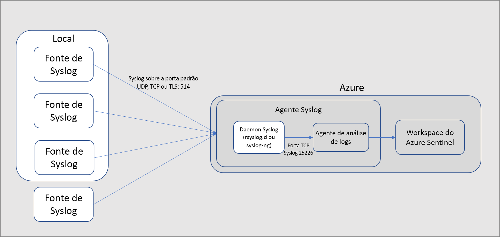
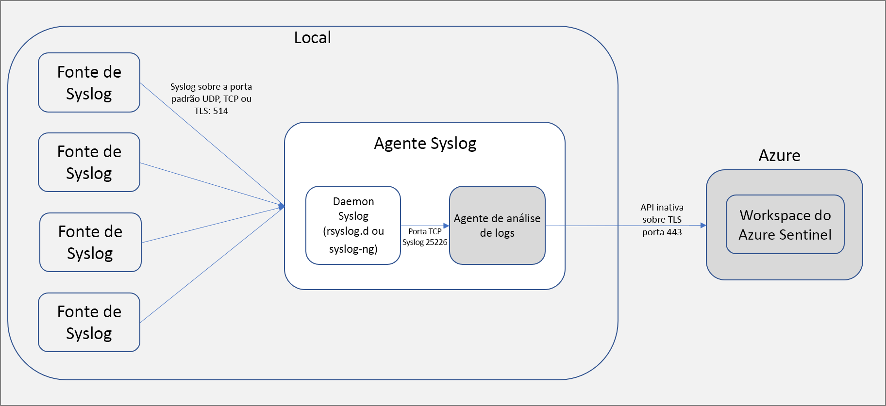

# Conectar fontes de dados

Depois de habilitar o Azure Sentinel, a primeira coisa que você precisa fazer é conectar suas fontes de dados. O Azure Sentinel vem com vários conectores para soluções da Microsoft, disponíveis prontamente e fornecendo integração em tempo real, incluindo as soluções do Microsoft 365 defender (anteriormente conhecido como proteção contra ameaças da Microsoft), Microsoft 365 fontes (incluindo o Office 365), o Azure AD, o Microsoft defender for Identity (anteriormente chamado de Azure ATP), Microsoft Cloud App Security e muito mais. Além disso, existem conectores internos no ecossistema de segurança mais amplo para soluções que não são da Microsoft. Use também o CEF (Formato Comum de Evento), o Syslog ou a API REST para conectar suas fontes de dados ao Azure Sentinel.

1. No menu, selecione **Conectores de dados**. Essa página permite ver a lista completa dos conectores fornecidos pelo Azure Sentinel e seus status. Selecione o conector que deseja conectar e selecione **Abrir página do conector**. 

   

1. Na página do conector específico, verifique se você atendeu a todos os pré-requisitos e siga as instruções para conectar os dados ao Azure Sentinel. Pode levar algum tempo para que a sincronização do logs com o Azure Sentinel seja iniciada. Depois de se conectar, você verá um resumo dos dados no grafo **Dados recebidos** e o status de conectividade dos tipos de dados.

   
  
1. Clique na guia **Próximas etapas** para obter uma lista do conteúdo pronto para uso fornecido pelo Azure Sentinel para o tipo de dados específico.

   
 

## Métodos de conexão de dados

O Azure Sentinel dá suporte aos métodos de conexão de dados a seguir:

- **Integração de serviço a serviço**:  alguns serviços são conectados nativamente, como serviços da AWS e da Microsoft. Esse serviços utilizam a base do Azure para integração pronta para o uso. É possível conectar as soluções a seguir em poucos cliques:
    - [Amazon Web Services – CloudTrail](connect-aws.md)
    - [Azure Active Directory](connect-azure-active-directory.md) -logs de auditoria e logs de entrada
    - [Atividades do Azure](connect-azure-activity.md)
    - [Azure AD Identity Protection](connect-azure-ad-Identity-protection.md)
    - [Proteção contra DDoS do Azure](connect-azure-ddos-protection.md)
    - [Azure defender para IOT](connect-asc-iot.md) (antiga central de segurança do Azure para IOT)
    - [Proteção de Informações do Azure](connect-azure-information-protection.md)
    - [Firewall do Azure](connect-azure-firewall.md)
    - [Central de segurança do Azure](connect-azure-security-center.md) -alertas de soluções do Azure defender
    - [Firewall do aplicativo Web do Azure (WAF)](connect-azure-waf.md) (anteriormente Microsoft WAF)
    - [Cloud App Security](connect-cloud-app-security.md)
    - [Servidor de nomes de domínio](connect-dns.md)
    - [Microsoft 365 defender](connect-microsoft-365-defender.md) -inclui dados brutos do MDATP
    - [Microsoft defender para ponto de extremidade](connect-microsoft-defender-advanced-threat-protection.md) (anteriormente chamado de proteção avançada contra ameaças do Microsoft defender)
    - [Microsoft defender para identidade](connect-azure-atp.md) (anteriormente, proteção avançada contra ameaças do Azure)
    - [Microsoft defender para Office 365](connect-office-365-advanced-threat-protection.md) (anteriormente chamado de proteção avançada contra ameaças do Office 365)
    - [Office 365](connect-office-365.md) (agora com equipes!)
    - [Firewall do Windows](connect-windows-firewall.md)
    - [Eventos de segurança do Windows](connect-windows-security-events.md)

- **Soluções externas por meio de API**: algumas fontes de dados são conectados por meio de APIs fornecidas pela fonte de dados conectada. Normalmente, a maioria das tecnologias de segurança fornece um conjunto de APIs por meio das quais os logs de eventos podem ser recuperados. As APIs se conectam ao Azure Sentinel e reúnem tipos de dados específicos e os enviam à Análise de Logs do Azure. Os dispositivos conectados por meio de API incluem:
    
    - [Proteção contra identidades e defesa do Agari phishing](connect-agari-phishing-defense.md)
    - [Alcide kAudit](connect-alcide-kaudit.md)
    - [WAF do Barracuda](connect-barracuda.md)
    - [Firewall do Barracuda CloudGen](connect-barracuda-cloudgen-firewall.md)
    - [MELHOR Defesa Contra Ameaças Móveis](connect-better-mtd.md)
    - [Beyond Security beSECURE](connect-besecure.md)
    - [Cisco Umbrella](connect-cisco-umbrella.md)
    - [Citrix Analytics (Security)](connect-citrix-analytics.md)
    - [F5 BIG-IP](connect-f5-big-ip.md)
    - [Forcepoint DLP](connect-forcepoint-dlp.md)
    - [SSO do Okta](connect-okta-single-sign-on.md)
    - [Orca Security](connect-orca-security-alerts.md)
    - [Logs do Perimeter 81](connect-perimeter-81-logs.md)
    - [Segurança de email de POD (proofpoint on Demand)](connect-proofpoint-pod.md)
    - [Proofpoint TAP](connect-proofpoint-tap.md)
    - [Qualys VM](connect-qualys-vm.md)
    - [Nuvem de serviço Salesforce](connect-salesforce-service-cloud.md)
    - [secRMM da Squadra Technologies](connect-squadra-secrmm.md)
    - [Symantec ICDX](connect-symantec.md)
    - [Ponto de extremidade na nuvem padrão do VMware Carbon Black](connect-vmware-carbon-black.md)
    - [Zimperium](connect-zimperium-mtd.md)

- **Soluções externas por meio do agente**: o Azure Sentinel pode ser conectado por meio de um agente para qualquer outra fonte de dados que possa executar o streaming de log em tempo real usando o protocolo syslog.

    A maioria dos dispositivos usa o protocolo Syslog para enviar mensagens de eventos que incluem o próprio log e dados sobre o log. O formato dos logs varia, mas a maioria dos dispositivos dá suporte à formatação baseada em CEF para dados de log. 

    O agente do Azure Sentinel, que é, na verdade, o agente de Log Analytics, converte os logs formatados por CEF em um formato que pode ser ingerido pelo Log Analytics. Dependendo do tipo de dispositivo, o agente é instalado diretamente no dispositivo ou em um encaminhador de log baseado em Linux dedicado. O agente para Linux recebe eventos do daemon Syslog por UDP. Porém, se um computador Linux deve coletar um alto volume de eventos de Syslog, eles são enviados por meio de TCP do daemon Syslog para o agente e de lá para o Log Analytics.

    - **Firewalls, proxies e pontos de extremidade – CEF:**
        - [Detecção de IA da Vectra](connect-ai-vectra-detect.md)
        - [Eventos de segurança da Akamai](connect-akamai-security-events.md)
        - [Check Point](connect-checkpoint.md)
        - [Cisco ASA](connect-cisco.md)
        - [Citrix WAF](connect-citrix-waf.md)
        - [CyberArk Enterprise Password Vault](connect-cyberark.md)
        - [ExtraHop Reveal(x)](connect-extrahop.md)
        - [F5 ASM](connect-f5.md)
        - [Produtos Forcepoint](connect-forcepoint-casb-ngfw.md)
        - [Fortinet](connect-fortinet.md)
        - [Illusive redes AMS](connect-illusive-attack-management-system.md)
        - [Imperva WAF gateway](connect-imperva-waf-gateway.md)
        - [One Identity Safeguard](connect-one-identity.md)
        - [Palo Alto Networks](connect-paloalto.md)
        - [Servidor secreto Thycotic](connect-thycotic-secret-server.md)
        - [Deep Security da Trend Micro](connect-trend-micro.md)
        - [Trend Micro TippingPoint](connect-trend-micro-tippingpoint.md)
        - [Plataforma de perícia de rede WireX](connect-wirex-systems.md)
        - [Zscaler](connect-zscaler.md)
        - [Outros dispositivos baseados em CEF](connect-common-event-format.md)
    - **Firewalls, proxies e pontos de extremidade – syslog:**
        - [Alsid para Active Directory](connect-alsid-active-directory.md)
        - [UCS (sistema de computação unificada da Cisco)](connect-cisco-ucs.md)
        - [Infoblox NIOS](connect-infoblox.md)
        - [Juniper SRX](connect-juniper-srx.md)
        - [Pulse Connect Secure](connect-pulse-connect-secure.md)
        - [Sophos XG](connect-sophos-xg-firewall.md)
        - [Proxy da Squid](connect-squid-proxy.md)
        - [Proxy SG da Symantec](connect-symantec-proxy-sg.md)
        - [Symantec VIP](connect-symantec-vip.md)
        - [Outros dispositivos baseados em syslog](connect-syslog.md)
    - [Apache HTTP Server](connect-apache-http-server.md)
    - Soluções de DLP
    - [Provedores de inteligência contra ameaças](connect-threat-intelligence.md)
    - [Computadores DNS](connect-dns.md) - agente instalado diretamente no computador DNS
    - [Azure Stack VMs](connect-azure-stack.md)
    - Servidores Linux
    - Outras nuvens
    
## Opções de conexão de agente

Para conectar seu dispositivo externo ao Azure Sentinel, o agente precisa ser implantado em um computador dedicado (VM ou local) para dar suporte à comunicação entre o dispositivo e o Azure Sentinel. Você pode implantar o agente manualmente ou automaticamente. A implantação automática só estará disponível se o computador dedicado for uma nova VM que você está criando no Azure. 

Como alternativa, você pode implantar o agente manualmente em uma VM do Azure existente em uma VM em outra nuvem ou em um computador local.

## Mapear tipos de dados com opções de conexão do Azure Sentinel

| **Data type** | **Como se conectar** | **Conector de dados?** | **Comentários** |
|------|---------|-------------|------|
| AWSCloudTrail | [Conectar AWS](connect-aws.md) | &#10003; | |
| AzureActivity | [Conectar Atividades do Azure](connect-azure-activity.md) e [Visão geral dos logs de atividade](../azure-monitor/platform/platform-logs-overview.md)| &#10003; | |
| AuditLogs | [Conectar o Azure AD](connect-azure-active-directory.md)  | &#10003; | |
| SigninLogs | [Conectar o Azure AD](connect-azure-active-directory.md)  | &#10003; | |
| AzureFirewall |[Diagnóstico do Azure](../firewall/firewall-diagnostics.md) | &#10003; | |
| InformationProtectionLogs_CL  | [Relatórios da Proteção de Informações do Azure](/azure/information-protection/reports-aip) [Conectar a Proteção de Informações do Azure](connect-azure-information-protection.md)  | &#10003; | Isso normalmente usa a função **InformationProtectionEvents** além do tipo de dados. Para saber mais, confira [Como modificar os relatórios e criar consultas personalizadas](/azure/information-protection/reports-aip#how-to-modify-the-reports-and-create-custom-queries)|
| AzureNetworkAnalytics_CL  | [Esquema de análise de tráfego](../network-watcher/traffic-analytics.md) [Análise de tráfego](../network-watcher/traffic-analytics.md)  | | |
| CommonSecurityLog  | [Conectar CEF](connect-common-event-format.md)  | &#10003; | |
| OfficeActivity | [Conectar Office 365](connect-office-365.md) | &#10003; | |
| SecurityEvents | [Conectar eventos de segurança do Windows](connect-windows-security-events.md)  | &#10003; | Para as pastas de trabalho Protocolos Inseguros, confira [Configuração da pasta de trabalho de protocolos inseguros](./quickstart-get-visibility.md#use-built-in-workbooks)  |
| syslog | [Conectar Syslog](connect-syslog.md) | &#10003; | |
| WAF (Firewall do Aplicativo Web) da Microsoft – (AzureDiagnostics) |[Conectar Firewall do Aplicativo Web da Microsoft](./connect-azure-waf.md) | &#10003; | |
| SymantecICDx_CL | [Conectar Symantec](connect-symantec.md) | &#10003; | |
| ThreatIntelligenceIndicator  | [Conectar inteligência contra ameaças](connect-threat-intelligence.md)  | &#10003; | |
| VMConnection   ServiceMapComputer_CL  ServiceMapProcess_CL|  [Mapa do Serviço do Azure Monitor](../azure-monitor/insights/service-map.md) [Integração de insights de VM do Azure Monitor](../azure-monitor/insights/vminsights-enable-overview.md)   [Habilitar insights de VM do Azure Monitor](../azure-monitor/insights/vminsights-enable-overview.md)   [Usar integração de VM única](../azure-monitor/insights/vminsights-enable-portal.md)   [Usar integração pela política](../azure-monitor/insights/vminsights-enable-policy.md)| &#10007; | Pasta de trabalho de insights de VM  |
| DnsEvents | [Conectar DNS](connect-dns.md) | &#10003; | |
| W3CIISLog | [Conectar logs do IIS](../azure-monitor/platform/data-sources-iis-logs.md)  | &#10007; | |
| WireData | [Conectar Wire Data](../azure-monitor/insights/wire-data.md) | &#10007; | |
| WindowsFirewall | [Conectar Firewall do Windows](connect-windows-firewall.md) | &#10003; | |
| AADIP SecurityAlert  | [Conectar Azure AD Identity Protection](connect-azure-ad-identity-protection.md)  | &#10003; | |
| AATP SecurityAlert  | [Conectar o Microsoft defender para identidade](connect-azure-atp.md) (anteriormente Azure ATP) | &#10003; | |
| ASC SecurityAlert  | [Conectar alertas do Azure defender](connect-azure-security-center.md) da central de segurança do Azure  | &#10003; | |
| MCAS SecurityAlert  | [Conectar Microsoft Cloud App Security](connect-cloud-app-security.md)  | &#10003; | |
| SecurityAlert | | | |
| Sysmon (Evento) | [Conectar Sysmon](https://azure.microsoft.com/blog/detecting-in-memory-attacks-with-sysmon-and-azure-security-center)  [Conectar Eventos do Windows](../azure-monitor/platform/data-sources-windows-events.md)   [Obter o Analisador Sysmon](https://github.com/Azure/Azure-Sentinel/blob/master/Parsers/Sysmon/Sysmon-v10.42-Parser.txt)| &#10007; | A coleção do Sysmon não está instalada por padrão em máquinas virtuais. Para obter mais informações sobre como instalar o Agente do Sysmon, confira [Sysmon](/sysinternals/downloads/sysmon). |
| ConfigurationData  | [Automatizar inventário de VM](../automation/change-tracking/overview.md)| &#10007; | |
| ConfigurationChange  | [Automatizar acompanhamento de VM](../automation/change-tracking/overview.md) | &#10007; | |
| F5 BIG-IP | [Conectar F5 BIG-IP](https://devcentral.f5.com/s/articles/Integrating-the-F5-BIGIP-with-Azure-Sentinel)  | &#10007; | |
| McasShadowItReporting  |  | &#10007; | |
| Barracuda_CL | [Conectar Barracuda](connect-barracuda.md) | &#10003; | |

## Próximas etapas

- Para começar a usar o Azure Sentinel, você precisa ter uma assinatura do Microsoft Azure. Se você não tiver uma assinatura, você pode se inscrever em uma [avaliação gratuita](https://azure.microsoft.com/free/).
- Saiba como [integrar seus dados ao Azure Sentinel](quickstart-onboard.md) e [obtenha visibilidade de seus dados e de possíveis ameaças](quickstart-get-visibility.md).