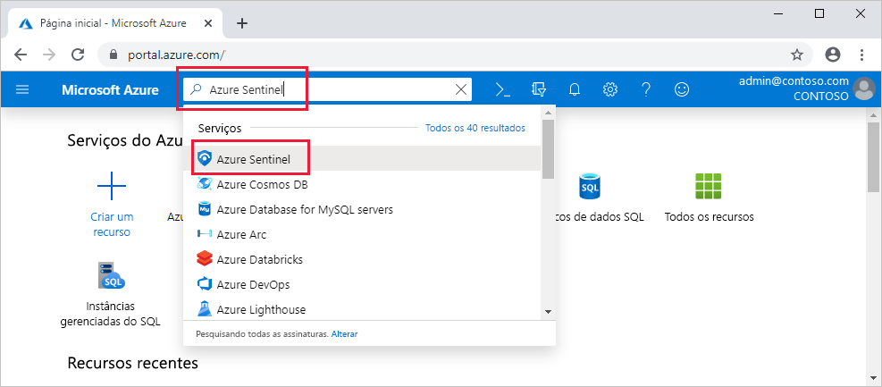

# Início Rápido: Integração do Azure Sentinel

Neste início rápido, saiba como integrar o Azure Sentinel. 

Para a integração do Azure Sentinel, primeiro você precisa habilitar o Azure Sentinel e depois conectar suas fontes de dados. O Azure Sentinel vem com vários conectores para soluções da Microsoft, disponíveis prontamente e fornecendo integração em tempo real, incluindo as soluções do Microsoft 365 Defender (anteriormente conhecido como Proteção contra Ameaças da Microsoft), fontes do Microsoft 365 (incluindo o Office 365), Azure AD, Microsoft Defender para Identidade (anteriormente, ATP do Azure), Microsoft Cloud App Security, alertas do Azure Defender da Central de Segurança do Azure e muito mais. Além disso, existem conectores internos no ecossistema de segurança mais amplo para soluções que não são da Microsoft. Use também o CEF (Formato Comum de Evento), o Syslog ou a API REST para conectar suas fontes de dados ao Azure Sentinel. 

Depois de conectar suas fontes de dados, escolha em uma galeria de pastas de trabalho criadas por especialistas que mostram insights com base em seus dados. Essas pastas de trabalho podem ser facilmente personalizadas de acordo com suas necessidades.

>[!IMPORTANT] 
> Para obter informações sobre os encargos incorridos ao usar o Azure Sentinel, confira [preços do Azure Sentinel](https://azure.microsoft.com/pricing/details/azure-sentinel/).

## Pré-requisitos globais

- Assinatura ativa do Azure, se você não tiver uma, crie uma [conta gratuita](https://azure.microsoft.com/free/?WT.mc_id=A261C142F) antes de começar.

- Workspace do Log Analytics. Saiba como [criar um espaço de trabalho do Log Analytics](../azure-monitor/logs/quick-create-workspace.md). Para saber mais sobre workspaces do Log Analytics, confira [Criar sua implantação de logs do Azure Monitor](../azure-monitor/logs/design-logs-deployment.md).

- Para habilitar o Azure Sentinel, você precisa de permissões de colaborador na assinatura na qual reside o workspace do Azure Sentinel. 
- Para usar o Azure Sentinel, você precisa de permissões de colaborador ou leitor no grupo de recursos ao qual o workspace pertence.
- Talvez você precise de permissões adicionais para conectar fontes de dados específicas.
- O Azure Sentinel é um serviço pago. Para saber mais sobre preços, confira [Sobre o Azure Sentinel](https://go.microsoft.com/fwlink/?linkid=2104058).

### Disponibilidade de geográfica e residência de dados

- O Azure Sentinel pode ser executado em workspaces na maioria das [regiões de GA do Log Analytics](https://azure.microsoft.com/global-infrastructure/services/?products=monitor), exceto nas regiões China e Alemanha (soberanas). Às vezes, as novas regiões do Log Analytics podem levar algum tempo para se integrarem ao serviço Azure Sentinel. 

- Os dados gerados pelo Azure Sentinel, como incidentes, indicadores e regras de análise, podem conter alguns dados do cliente provenientes dos workspaces do Log Analytics do cliente. Esses dados gerados pelo Azure Sentinel são salvos na geografia listada na seguinte tabela, de acordo com a geografia na qual o workspace está localizado:

    | Geografia do workspace | Geografia de dados gerada pelo Azure Sentinel |
    | --- | --- |
    | Estados Unidos Índia Brasil África Coreia do Sul Emirados Árabes Unidos | Estados Unidos |
    | Europa França Suíça | Europa |
    | Austrália | Austrália |
    | United Kingdom | United Kingdom |
    | Canada | Canada |
    | Japão | Japão |
    |

## Habilitar o Azure Sentinel 

1. Entre no portal do Azure. Verifique se a assinatura na qual o Azure Sentinel foi criado está selecionada.

1. Pesquise e selecione o **Azure Sentinel**.

   

1. Selecione **Adicionar**.

1. Selecione o workspace que você quer usar ou crie um novo. Você pode executar o Azure Sentinel em mais de um workspace, mas os dados são isolados em um único workspace.

   

   >[!NOTE] 
   > - Os workspaces padrão criados pela Central de Segurança do Azure não serão exibidos na lista. Você não pode instalar o Azure Sentinel neles.
   >

   >[!IMPORTANT]
   >
   > - Após a implantação em um workspace, atualmente o Azure Sentinel **não dá suporte** para mover o workspace para outros grupos de recursos ou assinaturas. 
   >
   >   Se você já tiver movido o workspace, desabilite todas as regras ativas em **Análise** e habilite-as novamente após cinco minutos. Isso deve ser eficaz na maioria dos casos, porém, para reiterar, não há suporte para esse procedimento e ele traz riscos.

1. Selecione **Adicionar o Azure Sentinel**.

## Conectar fontes de dados

O Azure Sentinel ingere os dados dos serviços e aplicativos, conectando-se ao serviço e encaminhando os eventos e logs ao Azure Sentinel. Para computadores e máquinas virtuais, você pode instalar o agente do Log Analytics que coleta os logs e os encaminha para o Azure Sentinel. Para Firewalls e proxies, o Azure Sentinel instala o agente do Log Analytics em um servidor Syslog do Linux, do qual o agente coleta os arquivos de log e os encaminha para o Azure Sentinel. 
 
1. No menu principal, selecione **Conectores de dados**. Isso abre a galeria de conectores de dados.

1. A galeria é uma lista de todas as fontes de dados que você pode conectar. Selecione uma fonte de dados e clique no botão **Abrir página do conector**.

1. A página do conector mostra instruções para configurar o conector e todas as instruções adicionais que possam ser necessárias. 
Por exemplo, se você selecionar a fonte de dados do **Azure Active Directory**, que permite transmitir logs do Azure AD para o Azure Sentinel, poderá selecionar o tipo de logs deseja: de conexão ou de auditoria.   Siga as instruções de instalação ou [consulte o guia de conexão relevante](connect-data-sources.md) para saber mais. Para saber mais sobre conectores de dados, confira [Conectar serviços da Microsoft](connect-data-sources.md).

1. A guia **Próximas etapas** na página do conector mostra pastas de trabalho internas relevantes, consultas de exemplo e modelos de regra de análise que acompanham o conector de dados. Você pode usá-los no estado em que se encontram ou modificá-los, mas das duas maneiras é possível obter imediatamente insights interessantes sobre os seus dados.  

Após a conexão das fontes de dados, seus dados começarão a ser transmitidos para o Azure Sentinel e estarão prontos para você começar a trabalhar com eles. Você pode ver os logs nas [pastas de trabalho internas](quickstart-get-visibility.md) e começar a criar consultas no Log Analytics para [investigar os dados](tutorial-investigate-cases.md).

## Próximas etapas
Neste documento, você aprendeu a conectar e integrar fontes de dados ao Azure Sentinel. Para saber mais sobre o Azure Sentinel, consulte os seguintes artigos:
- Saiba como [obter visibilidade dos seus dados e possíveis ameaças](quickstart-get-visibility.md).
- Comece a [detectar ameaças com o Azure Sentinel](tutorial-detect-threats-built-in.md).
- Transmita dados de [dispositivos com Formato Comum de Evento](connect-common-event-format.md) para o Azure Sentinel.
