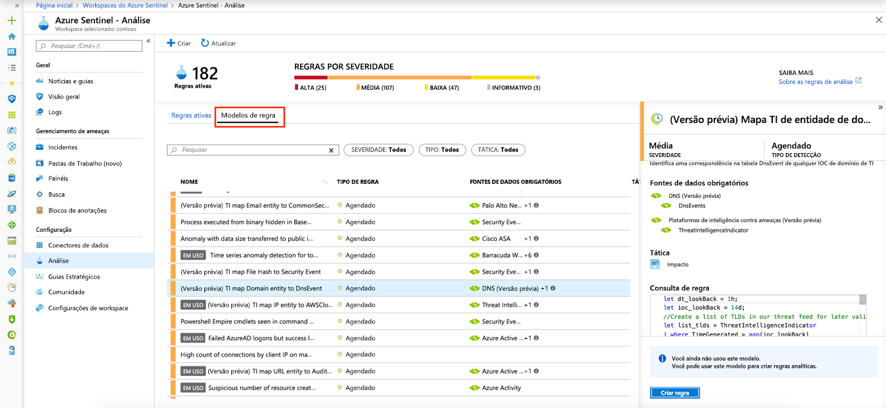

# Tutorial: Detecte ameaças fora da caixa

> [!IMPORTANT]
> A detecção de ameaças fora da caixa está atualmente em visualização pública.
> Este recurso é fornecido sem um contrato de nível de serviço, e não é recomendado para cargas de trabalho de produção.
> Para obter mais informações, consulte [Termos de Uso Suplementares para Visualizações do Microsoft Azure](https://azure.microsoft.com/support/legal/preview-supplemental-terms/).

Depois [de conectar suas fontes](quickstart-onboard.md) de dados ao Azure Sentinel, você deseja ser notificado quando algo suspeito acontecer. Para permitir que você faça isso, o Azure Sentinel fornece modelos embutidos fora da caixa. Esses modelos foram projetados pela equipe de especialistas e analistas de segurança da Microsoft com base em ameaças conhecidas, vetores de ataque comuns e cadeias de escalonamento de atividades suspeitas. Depois de habilitar esses modelos, eles procurarão automaticamente qualquer atividade que pareça suspeita em todo o seu ambiente. Muitos dos modelos podem ser personalizados para pesquisar ou filtrar atividades, de acordo com suas necessidades. Os alertas gerados por esses modelos criarão incidentes que você pode atribuir e investigar em seu ambiente.

Este tutorial ajuda você a detectar ameaças com o Azure Sentinel:

> [!div class="checklist"]
> * Use detecções fora da caixa
> * Automatizar as respostas a ameaças

## Sobre detecções prontas para uso

Para exibir todas as detecções prontas para uso, acesse **Análise** e **Modelos de regra**. Esta guia contém todas as regras internas do Azure Sentinel.

   

Os seguintes tipos de modelo estão disponíveis:

- **Segurança da Microsoft** - Os modelos de segurança da Microsoft criam automaticamente incidentes do Azure Sentinel a partir dos alertas gerados em outras soluções de segurança da Microsoft, em tempo real. Você pode usar as regras de segurança da Microsoft como um modelo para criar novas regras com lógica semelhante. Para obter mais informações sobre regras de segurança, consulte [Criar automaticamente incidentes a partir de alertas de segurança da Microsoft](create-incidents-from-alerts.md).
- **Fusion** - Baseado na tecnologia Fusion, a detecção avançada de ataques multiestágiono Azure Sentinel usa algoritmos escaláveis de aprendizado de máquina que podem correlacionar muitos alertas e eventos de baixa fidelidade em vários produtos em incidentes de alta fidelidade e acionáveis. A fusão é ativada por padrão. Como a lógica está oculta, você não pode usar isso como modelo para criar mais de uma regra.
- **Análise comportamental de aprendizado de** máquina - Esses modelos são baseados em algoritmos proprietários de aprendizado de máquina da Microsoft, então você não pode ver a lógica interna de como eles funcionam e quando eles funcionam. Como a lógica está oculta, você não pode usar isso como modelo para criar mais de uma regra.
-   **Programado** – Regras analíticas programadas são consultas agendadas escritas por especialistas em segurança da Microsoft. Você pode ver a lógica de consulta e fazer alterações nela. Você pode usar regras programadas como modelo para criar novas regras com lógica semelhante.

## Use detecções fora da caixa

1. Para usar um modelo incorporado, clique em **Criar regra** para criar uma nova regra ativa com base nesse modelo. Cada entrada tem uma lista de fontes de dados necessárias que são verificadas automaticamente e isso pode resultar na desativação da **regra Create.**
  
   
 
1. Isso abre o assistente de criação de regras, com base no modelo selecionado. Todos os detalhes são preenchidos automaticamente, e para **regras programadas** ou regras de **segurança da Microsoft,** você pode personalizar a lógica para melhor se adequar à sua organização ou criar regras adicionais com base no modelo incorporado. Depois de seguir as etapas do assistente de criação de regras e terminar de criar uma regra com base no modelo, a nova regra aparece na guia **Regras Ativas.**

Para obter mais informações sobre os campos no assistente, consulte [Tutorial: Crie regras analíticas personalizadas para detectar ameaças suspeitas](tutorial-detect-threats-custom.md).

## Próximas etapas
Neste tutorial, você aprendeu como começar a detectar ameaças usando o Azure Sentinel. 

Para saber como automatizar suas respostas a ameaças, [configure respostas automatizadas de ameaças no Azure Sentinel](tutorial-respond-threats-playbook.md).

