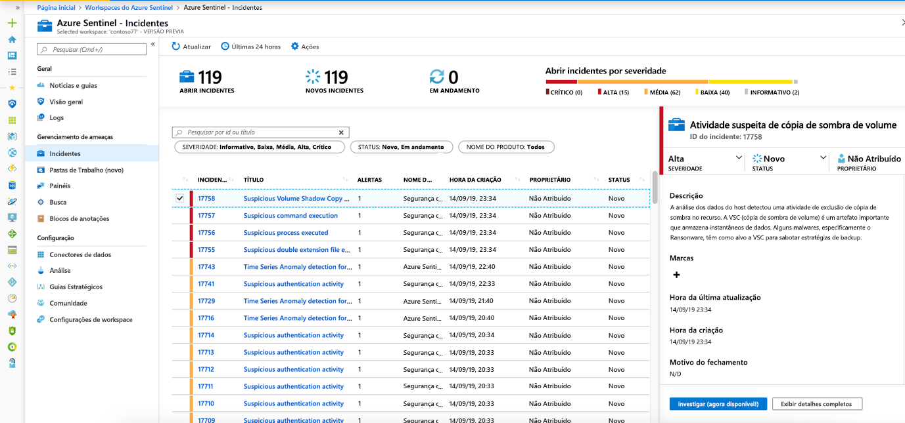
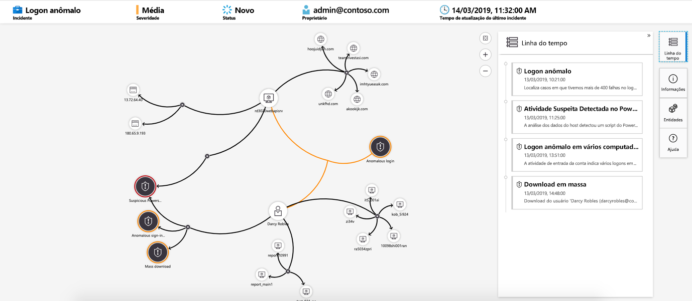

# Tutorial: investigar incidentes com o Azure Sentinel

> [!IMPORTANT]
> O grafo de investigação agora está em **disponibilidade geral**. 

Este tutorial ajuda você a investigar incidentes com o Azure Sentinel. Depois de conectar suas fontes de dados ao Azure Sentinel, você deseja ser notificado quando algo suspeito acontecer. Para permitir que você faça isso, o Azure Sentinel permite que você crie regras de alerta avançadas, que geram incidentes que você pode atribuir e investigar.

Este artigo cobre:
> [!div class="checklist"]
> * Investigar incidentes
> * Usar o grafo de investigação
> * Responda às ameaças

Um incidente pode incluir vários alertas. É uma agregação de todas as evidências relevantes para uma investigação específica. Um incidente é criado com base nas regras de análise que você criou na página de **análise** . As propriedades relacionadas aos alertas, como severidade e status, são definidas no nível do incidente. Depois de permitir que o Azure Sentinel saiba quais tipos de ameaças você está procurando e como encontrá-las, você pode monitorar ameaças detectadas investigando incidentes.

## Pré-requisitos
- Você só poderá investigar o incidente se tiver usado os campos de mapeamento de entidade ao configurar sua regra de análise. O grafo de investigação requer que seu incidente original inclua entidades.

- Se você tiver um usuário convidado que precisa atribuir incidentes, o usuário deverá ser atribuído à função de [leitor de diretório](../active-directory/roles/permissions-reference.md#directory-readers) em seu locatário do Azure AD. Usuários regulares (não convidados) têm essa função atribuída por padrão.

## Como investigar incidentes

1. Selecione **incidentes**. A página **incidentes** permite que você saiba quantos incidentes você tem, quantas estão abertas, quantos você definiu **em andamento** e quantas estão fechadas. Para cada incidente, você pode ver a hora em que ocorreu e o status do incidente. Examine a severidade para decidir quais incidentes tratar primeiro.

    

1. Você pode filtrar os incidentes conforme necessário, por exemplo, por status ou severidade.

1. Para iniciar uma investigação, selecione um incidente específico. À direita, você pode ver informações detalhadas para o incidente, incluindo sua gravidade, o resumo do número de entidades envolvidas, os eventos brutos que dispararam esse incidente e a ID exclusiva do incidente.

1. Para exibir mais detalhes sobre os alertas e entidades no incidente, selecione **Exibir detalhes completos** na página incidente e examine as guias relevantes que resumem as informações do incidente. Na guia **alertas** , examine o próprio alerta. Você pode ver todas as informações relevantes sobre o alerta – a consulta que disparou o alerta, o número de resultados retornados por consulta e a capacidade de executar guias estratégicos nos alertas. Para detalhar ainda mais o incidente, selecione o número de **eventos**. Isso abre a consulta que gerou os resultados e os eventos que dispararam o alerta no Log Analytics. Na guia **entidades** , você pode ver todas as entidades que você mapeou como parte da definição da regra de alerta.

    

1. Se você estiver investigando um incidente ativamente, é uma boa ideia definir o status do incidente como **em andamento** até fechá-lo.

1. Os incidentes podem ser atribuídos a um usuário específico. Para cada incidente, você pode atribuir um proprietário, definindo o campo **proprietário do incidente** . Todos os incidentes começam como não atribuídos. Você também pode adicionar comentários para que outros analistas possam entender o que você investigou e quais são suas preocupações em relação ao incidente.

    

1. Selecione **investigar** para exibir o mapa de investigação.

## Use o grafo de investigação para aprofundar-se

O grafo de investigação permite que os analistas façam as perguntas certas para cada investigação. O grafo de investigação ajuda você a entender o escopo e a identificar a causa raiz de uma possível ameaça à segurança correlacionando os dados relevantes com qualquer entidade envolvida. Você pode aprofundar-se e investigar qualquer entidade apresentada no grafo selecionando-a e escolhendo entre diferentes opções de expansão.  
  
O grafo de investigação fornece:

- **Contexto visual de dados brutos**: o Visual Graph dinâmico exibe as relações de entidade extraídas automaticamente dos dados brutos. Isso permite que você veja facilmente as conexões entre diferentes fontes de dados.

- **Descoberta completa de escopo de investigação**: expanda seu escopo de investigação usando consultas de exploração internas para trazer o escopo completo de uma violação.

- **Etapas de investigação internas**: Use opções de exploração predefinidas para verificar se você está fazendo as perguntas certas diante de uma ameaça.

Para usar o grafo de investigação:

1. Selecione um incidente e, em seguida, selecione **investigar**. Isso levará você ao grafo de investigação. O grafo fornece um mapa ilustrativo das entidades conectadas diretamente ao alerta e a cada recurso conectado.

   > [!IMPORTANT] 
   > - Você só poderá investigar o incidente se tiver usado os campos de mapeamento de entidade ao configurar sua regra de análise. O grafo de investigação requer que seu incidente original inclua entidades.
   >
   > - Atualmente, o Azure Sentinel dá suporte à investigação de **incidentes de até 30 dias**.

   

1. Selecione uma entidade para abrir o painel **entidades** para que você possa examinar as informações sobre essa entidade.

    
  
1. Expanda sua investigação passando o mouse sobre cada entidade para revelar uma lista de perguntas projetadas por nossos especialistas em segurança e analistas por tipo de entidade para aprofundar sua investigação. Chamamos essas consultas de **exploração** de opções.

    

   Por exemplo, em um computador, você pode solicitar alertas relacionados. Se você selecionar uma consulta de exploração, os direitos resultantes serão adicionados de volta ao grafo. Neste exemplo, a seleção de **alertas relacionados** retornou os seguintes alertas para o grafo:

    

1. Para cada consulta de exploração, você pode selecionar a opção para abrir os resultados do evento bruto e a consulta usada em Log Analytics, selecionando **eventos \>**.

1. Para entender o incidente, o grafo fornece uma linha do tempo paralela.

    

1. Passe o mouse sobre a linha do tempo para ver quais coisas no grafo ocorreram em que ponto no tempo.

    

## Fechando um incidente

Depois de resolver um incidente específico (por exemplo, quando sua investigação tiver atingido sua conclusão), defina o status do incidente como **fechado**. Ao fazer isso, você será solicitado a classificar o incidente especificando o motivo pelo qual está fechando-o. Esta etapa é obrigatória. Clique em **selecionar classificação** e escolha uma das opções a seguir na lista suspensa:

- Verdadeiro Positivo – atividade suspeita
- Benigno Positivo – suspeito, mas esperado
- Falso Positivo – lógica do alerta incorreta
- Falso Positivo – dados incorretos
- Indeterminado

:::image type="content" source="media/tutorial-investigate-cases/closing-reasons-dropdown.png" alt-text="Captura de tela que realça as classificações disponíveis na lista Selecionar classificação.":::

Depois de escolher a classificação apropriada, adicione um texto descritivo no campo **Comentário** . Isso será útil no caso de você precisar fazer referência a esse incidente. Clique em **aplicar** quando terminar e o incidente será fechado.

:::image type="content" source="media/tutorial-investigate-cases/closing-reasons-comment-apply.png" alt-text="{alt-text}":::

## Próximas etapas
Neste tutorial, você aprendeu como começar a investigar incidentes usando o Azure Sentinel. Continue no tutorial sobre [como responder a ameaças usando guias estratégicos automatizados](tutorial-respond-threats-playbook.md).
> [!div class="nextstepaction"]
> [Responda às ameaças](tutorial-respond-threats-playbook.md) para automatizar suas respostas a ameaças.

