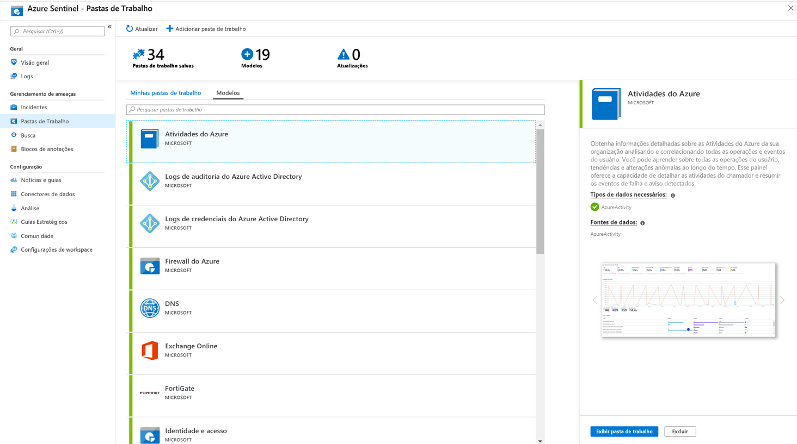

# Tutorial: Visualização e monitoramento dos dados

Depois de [conectar suas fontes de dados](quickstart-onboard.md) ao Azure Sentinel, você poderá visualizar e monitorar os dados usando a adoção do Azure sentinel de Azure monitor pastas de trabalho, que fornece versatilidade na criação de painéis personalizados. Embora as Pastas de Trabalho sejam exibidas de diferentes maneiras no Azure Sentinel, pode ser útil ver como [criar relatórios interativos com as Pastas de Trabalho do Azure Monitor](../azure-monitor/visualize/workbooks-overview.md). O Azure Sentinel permite que você crie pastas de trabalho personalizadas em seus dados e também vem com modelos de pasta de trabalho internos para que você possa obter insights rapidamente em seus dados assim que você conectar uma fonte de dados.

Este tutorial ajuda a visualizar os dados no Azure Sentinel.
> [!div class="checklist"]
> * Uso de pastas de trabalho internas
> * Criar pastas de trabalho

## Pré-requisitos

- Você deve ter pelo menos as permissões de colaborador de Pasta de Trabalho ou de leitor de Pasta de Trabalho no grupo de recursos do workspace do Azure Sentinel.

> [!NOTE]
> As pastas de trabalho exibidas no Azure Sentinel são salvas no grupo de recursos do workspace do Azure Sentinel e são marcadas pelo workspace no qual foram criadas.

## Uso de pastas de trabalho internas

1. Acesse **Pastas de Trabalho** e, em seguida, selecione **Modelos** para ver a lista completa de pastas de trabalho internas do Azure Sentinel. Para ver quais são relevantes para os tipos de dados que você conectou, o campo **Tipos de dados necessários** em cada pasta de trabalho listará o tipo de dados ao lado de uma marca de seleção verde, se você já transmite dados relevantes para o Azure Sentinel.
  
1. Clique em **Exibir modelo** para ver o modelo preenchido com seus dados.
  
1. Para editar a pasta de trabalho, selecione **salvar** e, em seguida, selecione o local onde você deseja salvar o arquivo JSON para o modelo. 

   > [!NOTE]
   > Isso cria um recurso do Azure com base no modelo relevante e salva o arquivo JSON da pasta de trabalho e não os dados.

1. Selecione **Exibir pasta de trabalho salva**. Em seguida, clique no botão **Editar** na parte superior. Agora você pode editar a pasta de trabalho e personalizá-la de acordo com as suas necessidades. Para obter mais informações sobre como personalizar a pasta de trabalho, veja como [Criar relatórios interativos com as pastas de trabalho do Azure Monitor](../azure-monitor/visualize/workbooks-overview.md).

1. Salve a pasta de trabalho depois de fazer as alterações. 

1. Também é possível clonar a pasta de trabalho: Selecione **Editar** e, em seguida, **Salvar como**, salve-a com outro nome, na mesma assinatura e grupo de recursos. Essas pastas de trabalho clonadas são exibidas na guia **minhas pastas de trabalho** .

## Criação de uma nova pasta de trabalho

1. Acesse **Pastas de Trabalho** e. em seguida, selecione **Adicionar pasta de trabalho** para criar uma nova pasta de trabalho do zero.
  

1. Para editar a pasta de trabalho, selecione **Editar** e, em seguida, adicione texto, consultas e parâmetros conforme necessário. Para obter mais informações sobre como personalizar a pasta de trabalho, veja como [Criar relatórios interativos com as pastas de trabalho do Azure Monitor](../azure-monitor/visualize/workbooks-overview.md). 

1. Ao criar uma consulta, verifique se a **fonte de dados** está definida **como logs** e se o **tipo de recurso** está definido como **log Analytics** e, em seguida, escolha os espaços de trabalho relevantes. 

1. Depois de criar sua pasta de trabalho, salve a pasta de trabalho, salvando-a na assinatura e no grupo de recursos do seu espaço de trabalho do Azure Sentinel.

1. Se quiser permitir que outras pessoas em sua organização usem a pasta de trabalho, em **Salvar para** selecione **Relatórios compartilhados**. Se quiser que essa pasta de trabalho esteja disponível apenas para você, selecione **Meus relatórios**.

1. Para alternar entre pastas de trabalho em seu espaço de trabalho,  você pode selecionar  no painel superior de qualquer pasta de trabalho. Na janela que abre à direita, alterne entre as pastas de trabalho.

   

## Como excluir pastas de trabalho

Para excluir uma pasta de trabalho salva (um modelo salvo ou uma pasta de trabalho personalizada), na página pastas de trabalho, selecione a pasta de trabalho salva que você deseja excluir e selecione **excluir**. Isso remove a pasta de trabalho salva.

> [!NOTE]
> Isso remove o recurso de pasta de trabalho, bem como as alterações feitas no modelo. O modelo original permanece disponível.

## Próximas etapas

Neste tutorial, você aprendeu a visualizar seus dados no Azure Sentinel, usando pastas de trabalho do Azure.

Para saber como automatizar respostas a ameaças, veja [Configuração de respostas a ameaças automatizadas no Azure Sentinel](tutorial-respond-threats-playbook.md).
