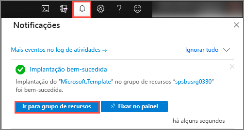
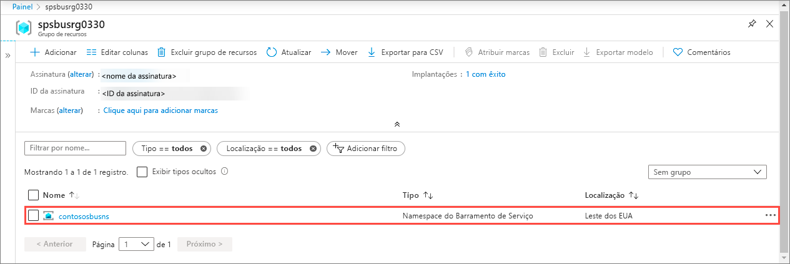
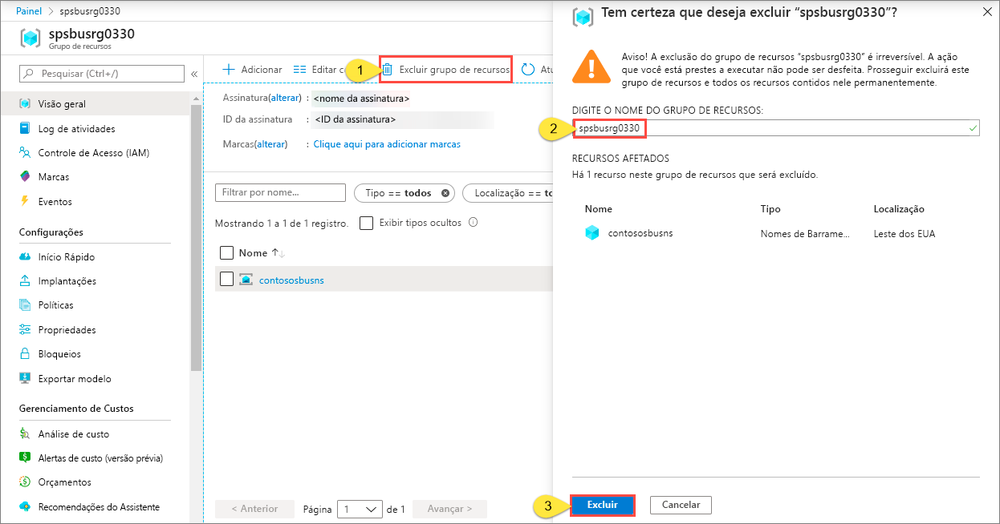

# Início Rápido: Criar um namespace e fila de Barramento de Serviço usando um modelo do ARM

Este artigo mostra como usar um modelo do ARM (Azure Resource Manager) que cria uma fila e um namespace do Barramento de Serviço nesse namespace. O artigo explica como definir quais recursos são implantados e como definir os parâmetros que são especificados quando a implantação é executada. Você pode usar este modelo para suas próprias implantações ou personalizá-lo para atender às suas necessidades.

[!INCLUDE [About Azure Resource Manager](../../includes/resource-manager-quickstart-introduction.md)]

Se seu ambiente atender aos pré-requisitos e você estiver familiarizado com o uso de modelos ARM, selecione o botão **Implantar no Azure**. O modelo será aberto no portal do Azure.

## Pré-requisitos

Se você não tiver uma assinatura do Azure, [crie uma conta gratuita](https://azure.microsoft.com/free/) antes de começar.

## Examinar o modelo

O modelo usado neste início rápido é proveniente dos [Modelos de Início Rápido do Azure](https://azure.microsoft.com/resources/templates/201-servicebus-create-queue).

:::code language="json" source="~/quickstart-templates/201-servicebus-create-queue/azuredeploy.json":::

Os recursos definidos no modelo incluem:

- [**Microsoft.ServiceBus/namespaces**](/azure/templates/microsoft.servicebus/namespaces)
- [**Microsoft.ServiceBus/namespaces/queues**](/azure/templates/microsoft.servicebus/namespaces/queues)

> [!NOTE]
> Os seguintes modelos do ARM estão disponíveis para download e implantação.
>
> * [Create a Service Bus namespace with queue and authorization rule (Criar um namespace de Barramento de Serviço com fila e regra de autorização)](service-bus-resource-manager-namespace-auth-rule.md)
> * [Criar um namespace do Barramento de Serviço com tópico e assinatura](service-bus-resource-manager-namespace-topic.md)
> * [Criar um namespace do Barramento de Serviço](service-bus-resource-manager-namespace.md)
> * [Criar um namespace do Barramento de Serviço com tópico, assinatura e regra](service-bus-resource-manager-namespace-topic-with-rule.md)

É possível encontrar mais modelos em [Modelos de Início Rápido do Azure](https://azure.microsoft.com/resources/templates/?resourceType=Microsoft.Servicebus&pageNumber=1&sort=Popular)

## Implantar o modelo

Com este modelo, você implantará um namespace de Barramento de Serviço com uma fila.

As [filas do Barramento de Serviço](service-bus-queues-topics-subscriptions.md#queues) oferecem entrega de mensagem do tipo PEPS (primeiro a entrar, primeiro a sair) para um ou mais consumidores concorrentes.

Para executar a implantação automaticamente, clique no seguinte botão: Crie um grupo de recursos para a implantação, de modo que você possa fazer a limpeza com mais facilidade posteriormente.

## Validar a implantação

1. Selecione **Notificações** na parte superior para ver o status da implantação. Aguarde até que a implantação seja realizada com sucesso. Em seguida, selecione **Ir para o grupo de recursos** na mensagem de notificação para navegar até a página do grupo de recursos que contém o namespace do Barramento de Serviço. 

    
2. Confirme se você vê o namespace do Barramento de Serviço na lista de recursos. 

    
3. Selecione o namespace na lista para ver a página **Namespace do Barramento de Serviço**. 

## Limpar os recursos

1. No portal do Azure, navegue até a página **Grupo de recursos** do seu grupo de recursos.
2. Selecione **Excluir grupo de recursos** na barra de ferramentas. 
3. Digite o nome do grupo de recursos e selecione **Excluir**. 

    

## Próximas etapas

Consulte o tópico a seguir que mostra como criar uma regra de autorização para namespace/fila:

[Criar uma regra de autorização do Barramento de Serviço para namespace e fila usando um modelo do ARM](service-bus-resource-manager-namespace-auth-rule.md)

Saiba como gerenciar esses recursos analisando estes artigos:

* [Gerenciar o Barramento de Serviço com o PowerShell](service-bus-manage-with-ps.md)
* [Gerenciar recursos do Barramento de Serviço com o Service Bus Explorer](https://github.com/paolosalvatori/ServiceBusExplorer/releases)

[Authoring Azure Resource Manager templates]: ../azure-resource-manager/templates/template-syntax.md
[Service Bus namespace and queue template]: https://github.com/Azure/azure-quickstart-templates/blob/master/201-servicebus-create-queue/
[Azure Quickstart Templates]: https://azure.microsoft.com/documentation/templates/?term=service+bus
[Learn more about Service Bus queues]: service-bus-queues-topics-subscriptions.md
[Using Azure PowerShell with Azure Resource Manager]: ../azure-resource-manager/management/manage-resources-powershell.md
[Using the Azure CLI for Mac, Linux, and Windows with Azure Resource Management]: ../azure-resource-manager/management/manage-resources-cli.md
