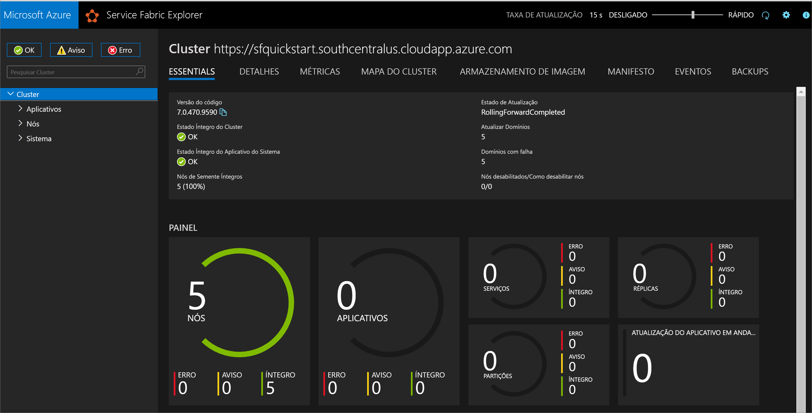
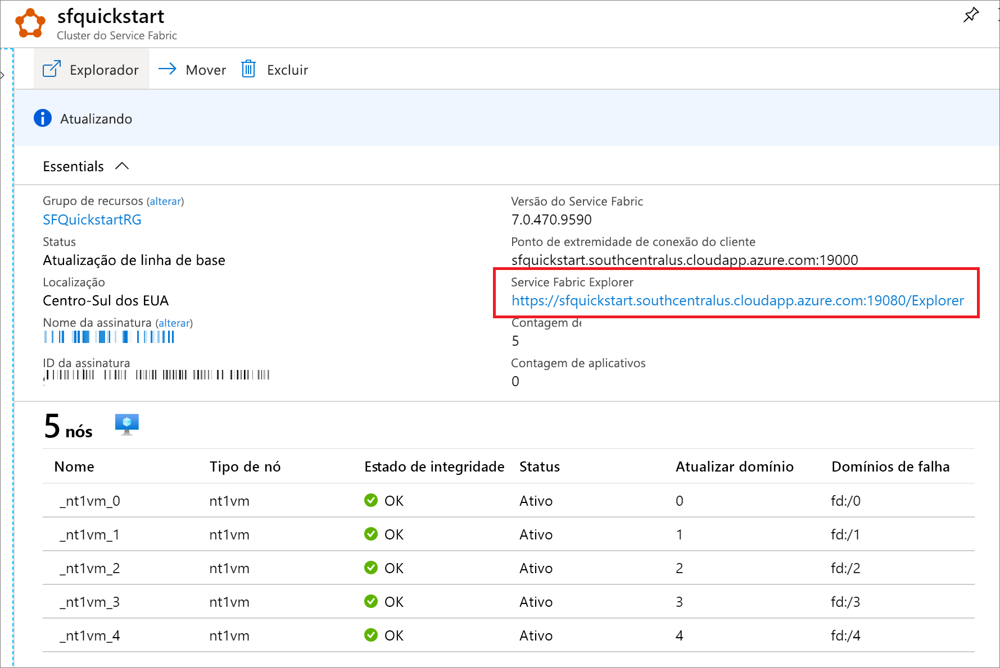

# <a name="quickstart-create-a-service-fabric-cluster-using-arm-template"></a>Início Rápido: Criar um cluster do Service Fabric usando um modelo do Resource Manager

O Azure Service Fabric é uma plataforma de sistemas distribuídos que facilita o empacotamento, implantação e gerenciamento de microsserviços e contêineres escalonáveis e confiáveis. Um *cluster* do Service Fabric é um conjunto conectado por rede de máquinas virtuais no qual os microsserviços são implantados e gerenciados. Este artigo descreve como implantar um cluster de teste do Service Fabric no Azure usando um modelo do Azure Resource Manager.

[!INCLUDE [About Azure Resource Manager](../../includes/resource-manager-quickstart-introduction.md)]

Esse cluster do Windows de cinco nós é protegido com um certificado autoassinado e, portanto, destina-se apenas a fins de instrução (e não a cargas de trabalho de produção). Usaremos o Azure PowerShell para implantar o modelo. Além do Azure PowerShell, você também pode usar o portal do Azure, a CLI do Azure e a API REST. Para saber mais sobre outros métodos de implantação, confira [Implantar modelos](../azure-resource-manager/templates/deploy-portal.md).

Se seu ambiente atender aos pré-requisitos e você estiver familiarizado com o uso de modelos ARM, selecione o botão **Implantar no Azure**. O modelo será aberto no portal do Azure.

[](https://portal.azure.com/#create/Microsoft.Template/uri/https%3A%2F%2Fraw.githubusercontent.com%2FAzure%2Fazure-quickstart-templates%2Fmaster%2Fservice-fabric-secure-cluster-5-node-1-nodetype%2Fazuredeploy.json)

## <a name="prerequisites"></a>Pré-requisitos

Se você não tiver uma assinatura do Azure, crie uma conta [gratuita](https://azure.microsoft.com/free/) antes de começar.

### <a name="install-service-fabric-sdk-and-powershell-modules"></a>Instalar o SDK do Service Fabric e os módulos do PowerShell

Para concluir este início rápido, você precisará:

* Instale o [SDK do Service Fabric e o módulo do PowerShell](service-fabric-get-started.md).

* Instale o [Azure PowerShell](/powershell/azure/install-az-ps).

### <a name="download-the-sample-template-and-certificate-helper-script"></a>Baixar o modelo de exemplo e o script auxiliar de certificado

Clone ou baixe o repositório de [Modelos de início rápido do Azure Resource Manager](https://github.com/Azure/azure-quickstart-templates). Como alternativa, copie localmente da pasta *service-fabric-secure-cluster-5-node-1-nodetype* os seguintes arquivos que usaremos:

* [New-ServiceFabricClusterCertificate.ps1](https://raw.githubusercontent.com/Azure/azure-quickstart-templates/master/service-fabric-secure-cluster-5-node-1-nodetype/scripts/New-ServiceFabricClusterCertificate.ps1)
* [azuredeploy.json](https://raw.githubusercontent.com/Azure/azure-quickstart-templates/master/service-fabric-secure-cluster-5-node-1-nodetype/azuredeploy.json)
* [azuredeploy.parameters.json](https://raw.githubusercontent.com/Azure/azure-quickstart-templates/master/service-fabric-secure-cluster-5-node-1-nodetype/azuredeploy.parameters.json)

### <a name="sign-in-to-azure"></a>Entrar no Azure

Entre no Azure e designe a assinatura a ser usada para criar seu cluster do Service Fabric.

```powershell
# Sign in to your Azure account
Login-AzAccount -SubscriptionId "<subscription ID>"
```

### <a name="create-a-self-signed-certificate-stored-in-key-vault"></a>Crie um certificado autoassinado armazenado no Key Vault

O Service Fabric usa certificados x.509 para [proteger um cluster](./service-fabric-cluster-security.md) e fornecer recursos de segurança do aplicativo e usa o [Key Vault](../key-vault/general/overview.md) para gerenciar esses certificados. Uma criação de cluster bem-sucedida requer um certificado de cluster para habilitar a comunicação entre nós diferentes. Para a finalidade de criar este cluster de teste de início rápido, criaremos um certificado autoassinado para autenticação de cluster. Cargas de trabalho de produção requerem certificados criados usando um serviço de certificado do Windows Server configurado corretamente ou um obtido por meio de uma AC (Autoridade de Certificação) aprovada.

```powershell
# Designate unique (within cloudapp.azure.com) names for your resources
$resourceGroupName = "SFQuickstartRG"
$keyVaultName = "SFQuickstartKV"

# Create a new resource group for your Key Vault and Service Fabric cluster
New-AzResourceGroup -Name $resourceGroupName -Location SouthCentralUS

# Create a Key Vault enabled for deployment
New-AzKeyVault -VaultName $keyVaultName -ResourceGroupName $resourceGroupName -Location SouthCentralUS -EnabledForDeployment

# Generate a certificate and upload it to Key Vault
.\scripts\New-ServiceFabricClusterCertificate.ps1
```

O script solicitará o seguinte (lembre-se de modificar *CertDNSName* e *KeyVaultName* dos valores de exemplo abaixo):

* **Senha:** Password!1
* **CertDNSName:** *sfquickstart*.southcentralus.cloudapp.azure.com
* **KeyVaultName:** *SFQuickstartKV*
* **KeyVaultSecretName:** clustercert

Após a conclusão, o script fornecerá os valores de parâmetro necessários para a implantação de modelo. Lembre-se de armazená-los nas seguinte variáveis, pois eles serão necessários para implantar o modelo de cluster:

```powershell
$sourceVaultId = "<Source Vault Resource Id>"
$certUrlValue = "<Certificate URL>"
$certThumbprint = "<Certificate Thumbprint>"
```

## <a name="review-the-template"></a>Examinar o modelo

O modelo usado neste início rápido é proveniente dos [Modelos de Início Rápido do Azure](https://azure.microsoft.com/resources/templates/service-fabric-secure-cluster-5-node-1-nodetype/). O modelo deste artigo é muito longo para ser mostrado aqui. Para ver o modelo, confira o arquivo [azuredeploy.json](https://raw.githubusercontent.com/Azure/azure-quickstart-templates/master/service-fabric-secure-cluster-5-node-1-nodetype/azuredeploy.json).

Vários recursos do Azure foram definidos no modelo:

* [Microsoft.Storage/storageAccounts](/azure/templates/microsoft.storage/storageaccounts)
* [Microsoft.Network/virtualNetworks](/azure/templates/microsoft.network/virtualnetworks)
* [Microsoft.Network/publicIPAddresses](/azure/templates/microsoft.network/publicipaddresses)
* [Microsoft.Network/loadBalancers](/azure/templates/microsoft.network/loadbalancers)
* [Microsoft.Compute/virtualMachineScaleSets](/azure/templates/microsoft.compute/virtualmachinescalesets)
* [Microsoft.ServiceFabric/clusters](/azure/templates/microsoft.servicefabric/clusters)

Para encontrar mais modelos relacionados ao Azure Service Fabric, confira [Modelos de Início Rápido do Azure](https://azure.microsoft.com/resources/templates/?sort=Popular&term=service+fabric).

### <a name="customize-the-parameters-file"></a>Personalizar o arquivo de parâmetros

Abra *azuredeploy.parameters.json* e edite os valores de parâmetro de modo que:

* **clusterName** corresponda ao valor fornecido para *CertDNSName* ao criar o certificado do cluster
* **adminUserName** seja um valor diferente do token *GEN-UNIQUE* padrão
* **adminPassword** seja um valor diferente do token *GEN-PASSWORD* padrão
* **certificateThumbprint**, **sourceVaultResourceId** e **certificateUrlValue** são todos cadeias de caracteres vazias (`""`)

Por exemplo:

```json
{
  "$schema": "https://schema.management.azure.com/schemas/2019-04-01/deploymentParameters.json#",
  "contentVersion": "1.0.0.0",
  "parameters": {
    "clusterName": {
      "value": "sfquickstart"
    },
    "adminUsername": {
      "value": "testadm"
    },
    "adminPassword": {
      "value": "Password#1234"
    },
    "certificateThumbprint": {
      "value": ""
    },
    "sourceVaultResourceId": {
      "value": ""
    },
    "certificateUrlValue": {
      "value": ""
    }
  }
}
```

## <a name="deploy-the-template"></a>Implantar o modelo

Armazene os caminhos dos arquivos de parâmetro e de modelo do Resource Manager em variáveis e implante o modelo.

```powershell
$templateFilePath = "<full path to azuredeploy.json>"
$parameterFilePath = "<full path to azuredeploy.parameters.json>"

New-AzResourceGroupDeployment `
    -ResourceGroupName $resourceGroupName `
    -TemplateFile $templateFilePath `
    -TemplateParameterFile $parameterFilePath `
    -CertificateThumbprint $certThumbprint `
    -CertificateUrlValue $certUrlValue `
    -SourceVaultResourceId $sourceVaultId `
    -Verbose
```

## <a name="review-deployed-resources"></a>Examinar os recursos implantados

Quando a implantação for concluída, localize o valor `managementEndpoint` na saída e abra o endereço em um navegador da Web para exibir o cluster no [Service Fabric Explorer](./service-fabric-visualizing-your-cluster.md).



Você também pode encontrar o ponto de extremidade do Service Fabric Explorer na folha de recursos do Service Explorer no portal do Azure.



## <a name="clean-up-resources"></a>Limpar os recursos

Quando não for mais necessário, exclua o grupo de recursos, que excluirá os recursos no grupo de recursos.

```powershell
$resourceGroupName = Read-Host -Prompt "Enter the Resource Group name"
Remove-AzResourceGroup -Name $resourceGroupName
Write-Host "Press [ENTER] to continue..."
```

Em seguida, remova o certificado do cluster do armazenamento local. Liste os certificados instalados a fim de encontrar a impressão digital de seu cluster:

```powershell
Get-ChildItem Cert:\CurrentUser\My\
```

Em seguida, remova o certificado:

```powershell
Get-ChildItem Cert:\CurrentUser\My\{THUMBPRINT} | Remove-Item
```

## <a name="next-steps"></a>Próximas etapas

Para saber mais sobre como criar um modelo de cluster personalizado do Azure Service Fabric, confira:

> [!div class="nextstepaction"]
> [Criar um modelo do Resource Manager do cluster do Service Fabric](service-fabric-cluster-creation-create-template.md)
