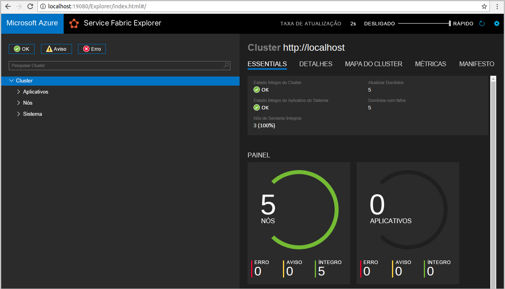
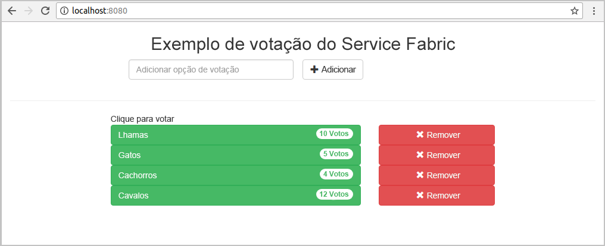
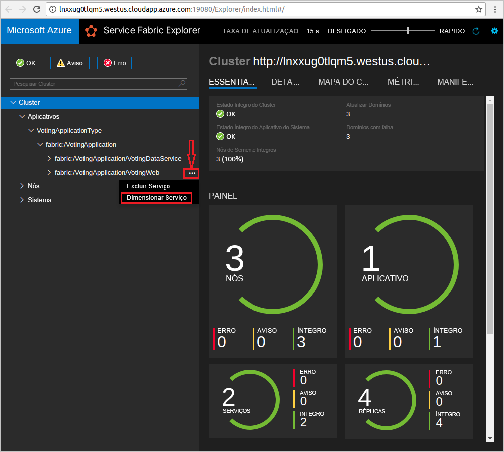
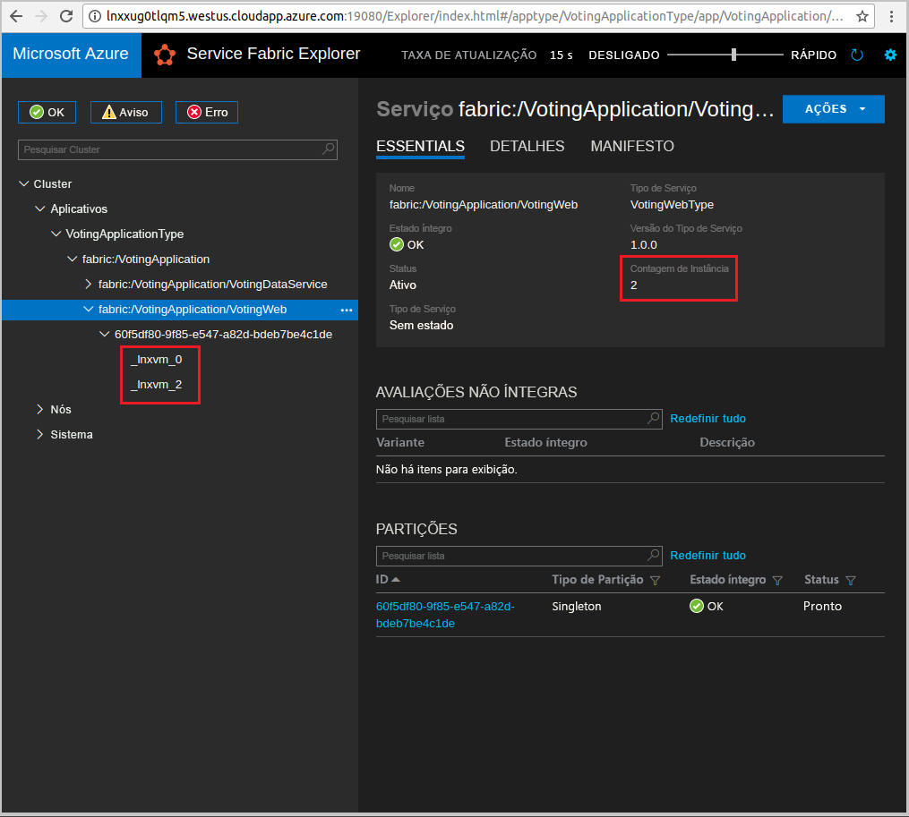

# <a name="quickstart--deploy-a-java-app-to-azure-service-fabric-on-linux"></a>Guia de início rápido: implantar um aplicativo Java no Azure Service Fabric do Linux

Neste início rápido, você implantará um aplicativo Java no Azure Service Fabric usando o IDE do Eclipse em um computador de desenvolvedor Linux. Ao terminar, você terá um aplicativo de votação com um front-end da Web em Java que salva os resultados da votação em um serviço de back-end com estado do cluster.

O Azure Service Fabric é uma plataforma de sistemas distribuídos para implantação e gerenciamento de contêineres e microsserviços.

## <a name="prerequisites"></a>Pré-requisitos

- [Ambiente Java](./service-fabric-get-started-linux.md#set-up-java-development) e [Yeoman](./service-fabric-get-started-linux.md#set-up-yeoman-generators-for-containers-and-guest-executables)
- [Eclipse Neon (4.6 e posterior)](https://www.eclipse.org/downloads/packages/) e [plug-in do Eclipse para Service Fabric](./service-fabric-get-started-linux.md#install-the-eclipse-plug-in-optional)
- [SDK e CLI (interface de linha de comando) do Service Fabric](./service-fabric-get-started-linux.md#installation-methods)
- [Git](https://git-scm.com/downloads)

## <a name="download-the-sample"></a>Baixar o exemplo

Em uma janela de comando, execute o comando a seguir para clonar o repositório de aplicativos de exemplo no computador local.

```bash
git clone https://github.com/Azure-Samples/service-fabric-java-quickstart.git
```

## <a name="run-the-application-locally"></a>Executar o aplicativo localmente

1. Inicie seu cluster local executando o seguinte comando:

    ```bash
    sudo /opt/microsoft/sdk/servicefabric/common/clustersetup/devclustersetup.sh
    ```
    A inicialização do cluster local leva algum tempo. Para confirmar se o cluster está totalmente funcional, acesse o Service Fabric Explorer em `http://localhost:19080`. Os cinco nós íntegros indicam que o cluster local está em execução.

    

2. Abra o Eclipse.
3. Selecione **Arquivo** > **Importar** > **Gradle** > **Projeto Gradle Existente** e siga o assistente.
4. Selecione **Diretório** e escolha o diretório **Votação** na pasta **service-fabric-java-quickstart** clonada do GitHub. Selecione **Concluir**.

    

5. Agora você tem o projeto `Voting` no Explorador de Pacote para o Eclipse.
6. Clique com o botão direito do mouse no projeto e selecione **Publicar Aplicativo** na lista suspensa **Service Fabric**. Escolha **PublishProfiles/Local.json** como o Perfil de Destino e selecione **Publicar**.

    

7. Abra seu navegador da Web favorito e acesse o aplicativo em `http://localhost:8080`.

    

Agora, você pode adicionar um conjunto de opções de votação e começar a votar. O aplicativo é executado e armazena todos os dados no cluster do Service Fabric, sem a necessidade de um banco de dados separado.



## <a name="scale-applications-and-services-in-a-cluster"></a>Dimensionar aplicativos e serviços em um cluster

Os serviços do Service Fabric podem ser facilmente colocados em escala em um cluster para acomodar uma alteração na carga dos serviços. Dimensione um serviço alterando o número de instâncias em execução no cluster. Há várias maneiras de dimensionar seus serviços. Por exemplo, você pode usar scripts ou comandos na CLI do Service Fabric (`sfctl`). As etapas a seguir usam o Service Fabric Explorer.

O Service Fabric Explorer é executado em todos os clusters do Service Fabric e pode ser acessado em um navegador na porta de gerenciamento HTTP do cluster (19080). Por exemplo, `http://localhost:19080`.

Para dimensionar o serviço de front-end da Web, faça o seguinte:

1. Abra o Service Fabric Explorer no cluster. Por exemplo, `https://localhost:19080`.
2. Selecione as reticências (**...**) ao lado do nó **fabric:/Voting/VotingWeb** no modo de exibição de árvore e selecione **Dimensionar Serviço**.

    

    Agora, você pode optar por dimensionar o número de instâncias do serviço de front-end da Web.

3. Altere o número para **2** e selecione **Dimensionar Serviço**.
4. Selecione o nó **fabric:/Voting/VotingWeb** do modo de exibição de árvore e expanda o nó de partição (representado por um GUID).

    

    Agora, você pode ver que o serviço tem duas instâncias e no modo de exibição de árvore, você vê em quais nós as instâncias são executadas.

Com essa tarefa de gerenciamento simples, você dobrou o número de recursos disponíveis para o serviço de front-end processar a carga do usuário. É importante entender que você não precisa de várias instâncias de um serviço para que ele seja executado de forma confiável. Se um serviço falhar, o Service Fabric fará com que uma nova instância de serviço seja executada no cluster.

## <a name="next-steps"></a>Próximas etapas

Neste guia de início rápido, você aprendeu a:

* Usar o Eclipse como uma ferramenta para seus aplicativos Java do Service Fabric
* Implantar aplicativos Java no cluster local
* Expandir o aplicativo para vários nós

Para saber mais sobre como trabalhar com aplicativos Java no Service Fabric, continue o tutorial para os aplicativos Java.

> [!div class="nextstepaction"]
> [Implantar um aplicativo Java](./service-fabric-tutorial-create-java-app.md)
