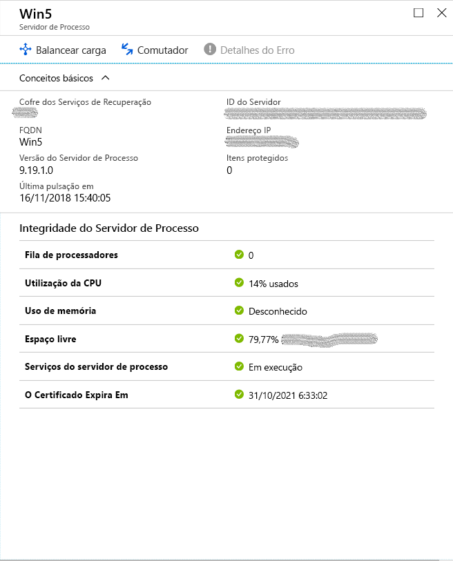
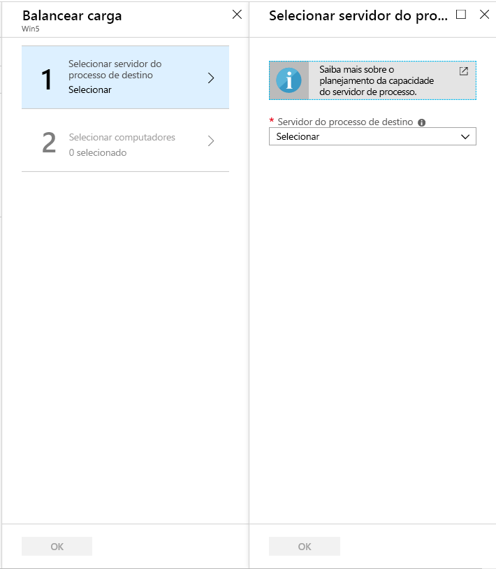
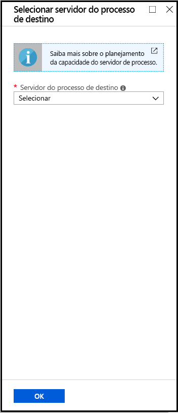

# <a name="manage-process-servers"></a>Gerenciar servidores de processo

Este artigo descreve tarefas comuns para gerenciar o servidor de processo de recuperação de site.

O servidor de processo é usado para receber, otimizar e enviar dados de replicação para o Azure. Ele também executa uma instalação push do serviço de mobilidade em VMs VMware e servidores físicos que você deseja replicar, e realiza a descoberta automática de máquinas no local. Para replicar VMMs VMware ou servidores físicos no local para o Azure, o servidor de processo é instalado por padrão na máquina do servidor de configuração. 

- Para implantações grandes, você pode precisar de servidores em processo locais adicionais para dimensionar a capacidade.
- Para failback do Azure para o local, você deve configurar um servidor de processo temporário no Azure. Você pode excluir essa VM após o failback. 

Saiba mais sobre o servidor de processos.


## <a name="upgrade-a-process-server"></a>Atualizar um servidor em processo

Quando você implanta um servidor de processo no local ou como uma VM Azure para failback, a versão mais recente do servidor de processo é instalada. As equipes do Site Recovery liberam correções e melhorias regularmente, e recomendamos que você mantenha os servidores em processo atualizados. Você pode atualizar um servidor de processo da seguinte forma:

[!INCLUDE [site-recovery-vmware-upgrade -process-server](../../includes/site-recovery-vmware-upgrade-process-server-internal.md)]


## <a name="move-vms-to-balance-the-process-server-load"></a>Mova VMs para equilibrar a carga do servidor de processo

Equilibre a carga movendo VMs entre dois servidores de processo, da seguinte forma:

1. No cofre, em **Gerenciar clique em 'Infra-estrutura** **de recuperação de site'.** Em **Para máquinas de & Física VMware,** clique **em Servidores de configuração**.
2. Clique no servidor de configuração com o qual os servidores de processo estão registrados.
3. Clique no servidor de processo para o qual deseja carregar o tráfego de equilíbrio.

    

4. Clique **em 'Carregar saldo'** e selecione o servidor de processo de destino para o qual deseja mover as máquinas. Em seguida, clique em **OK**

    

2. Clique **em Selecionar máquinas**e escolha as máquinas que deseja mover da corrente para o servidor de processo de destino. Detalhes de alteração de dados médio são exibidos em cada máquina virtual. Em seguida, clique em **OK**. 
3. No cofre, monitore o andamento do trabalho em**trabalhos de recuperação de sites de** **monitoramento.** > 

Levará cerca de 15 minutos para que as mudanças sejam refletidas no portal. Para obter um efeito mais rápido, [atualize o servidor de configuração](vmware-azure-manage-configuration-server.md#refresh-configuration-server).

## <a name="switch-an-entire-workload-to-another-process-server"></a>Mude toda uma carga de trabalho para outro servidor de processo

Mova toda a carga de trabalho manipulada por um servidor de processo para um servidor de processo diferente, da seguinte forma:

1. No cofre, em **Gerenciar clique em 'Infra-estrutura** **de recuperação de site'.** Em **Para máquinas de & Física VMware,** clique **em Servidores de configuração**.
2. Clique no servidor de configuração com o qual os servidores de processo estão registrados.
3. Clique no servidor de processo do qual deseja alternar a carga de trabalho.
4. Clique em **'Switch'** e selecione o servidor de processo de destino para o qual deseja mover a carga de trabalho. Em seguida, clique em **OK**

    

5. No cofre, monitore o andamento do trabalho em**trabalhos de recuperação de sites de** **monitoramento.** > 

Levará cerca de 15 minutos para que as mudanças sejam refletidas no portal. Para obter um efeito mais rápido, [atualize o servidor de configuração](vmware-azure-manage-configuration-server.md#refresh-configuration-server).

## <a name="register-a-master-target-server"></a>Registre um servidor de destino mestre

O servidor de destino mestre reside em servidores de configuração e servidores de processo de escala. Ele deve ser registrado com servidor de configuração. Caso haja uma falha nesse registro, pode impactar a saúde dos itens protegidos. Para registrar o servidor de destino mestre com servidor de configuração, faça login no servidor de processo de configuração específica/servidor de dimensionamento no qual o registro é necessário. Navegue até a pasta **%PROGRAMDATA%\ASR\Agent**e execute o seguinte no prompt de comando do administrador.

   ```
   cmd
   cdpcli.exe --registermt

   net stop obengine

   net start obengine

   exit
   ```

## <a name="reregister-a-process-server"></a>Registrar um servidor em processo novamente

Reregistre um servidor de processo em execução no local ou em uma VM do Azure com o servidor de configuração da seguinte forma:

[!INCLUDE [site-recovery-vmware-register-process-server](../../includes/site-recovery-vmware-register-process-server.md)]

Depois de salvar as configurações, faça o seguinte:

1. No servidor em processo, abra um prompt de comando do administrador.
2. Navegue para a pasta **%PROGRAMDATA%\ASR\Agent** e execute o comando:

    ```
    cdpcli.exe --registermt
    net stop obengine
    net start obengine
    ```

## <a name="modify-proxy-settings-for-an-on-premises-process-server"></a>Modificar as configurações de proxy de um servidor em processo local

Se um servidor de processo local usar um proxy para se conectar ao Azure, você poderá modificar as configurações do proxy da seguinte forma:

1. Inscreva-se na máquina do servidor de processo. 
2. Abra uma janela de comando do PowerShell de administrador e execute o comando a seguir:
   ```powershell
   $pwd = ConvertTo-SecureString -String MyProxyUserPassword
   Set-OBMachineSetting -ProxyServer http://myproxyserver.domain.com -ProxyPort PortNumber –ProxyUserName domain\username -ProxyPassword $pwd
   net stop obengine
   net start obengine
   ```
2. Navegue até a pasta **%PROGRAMDATA%\ASR\Agent**e execute este comando:
   ```
   cmd
   cdpcli.exe --registermt

   net stop obengine

   net start obengine

   exit
   ```

## <a name="remove-a-process-server"></a>Remover um servidor em processo

[!INCLUDE [site-recovery-vmware-unregister-process-server](../../includes/site-recovery-vmware-unregister-process-server.md)]

## <a name="exclude-folders-from-anti-virus-software"></a>Excluir pastas de software antivírus

Se o software antivírus estiver sendo executado em um servidor de processo de saída de escala (ou servidor de destino mestre), exclua as seguintes pastas de operações antivírus:


- C:\Arquivos de Programas\Microsoft Azure Recovery Services Agent
- C:\ProgramData\ASR
- C:\ProgramData\ASRLogs
- C:\ProgramData\ASRSetupLogs
- C:\ProgramData\LogUploadServiceLogs
- C:\ProgramData\Microsoft Azure Site Recovery
- Diretório de instalação do servidor de processo. Por exemplo: C:\Arquivos de programa (x86)\Recuperação do site do Microsoft Azure