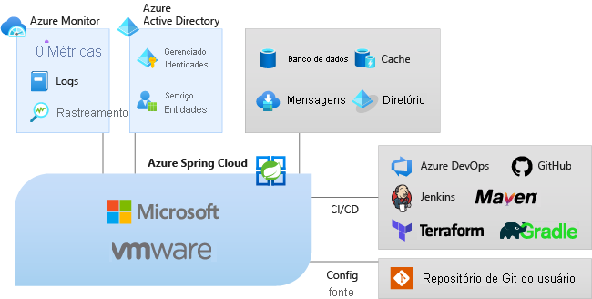

# O que é o Azure Spring Cloud?

O Azure Spring Cloud facilita a implantação de aplicativos de microsserviço do Spring Boot no Azure sem alterações de código.  O serviço gerencia a infraestrutura dos aplicativos do Spring Cloud para que os desenvolvedores possam se concentrar no código.  O Azure Spring Cloud fornece gerenciamento de ciclo de vida usando monitoramento e diagnóstico abrangentes, gerenciamento de configuração, descoberta de serviços, integração de CI/CD, implantações em “blue-green” e muito mais.

## Por que usar o Azure Spring Cloud?

A implantação de aplicativos no Azure Spring Cloud tem muitos benefícios.  Você pode:
* Migre com eficiência os aplicativos Spring existentes e gerencie os custos e a escala de nuvem.
* Modernize aplicativos com padrões do Spring Cloud para aprimorar a agilidade e a velocidade de entrega.
* Execute o Java em escala de nuvem e gere maior uso sem infraestrutura complicada.
* Desenvolva e faça implantações rapidamente sem dependências de transporte em contêineres.
* Monitore cargas de trabalho de produção com eficiência e facilidade.

O Azure Spring Cloud dá suporte a aplicativos Java [Spring Boot](https://spring.io/projects/spring-boot) e ASP.NET Core [Steeltoe](https://steeltoe.io/). O suporte a Steeltoe é oferecido atualmente em versão prévia pública. As ofertas em versão prévia pública permitem que você experimente os novos recursos antes do lançamento oficial. Os serviços e recursos de visualização pública não são destinados ao uso em produção. Para obter mais informações, confira as [perguntas frequentes](https://azure.microsoft.com/support/faq/) ou registre uma [Solicitação de suporte](../azure-portal/supportability/how-to-create-azure-support-request.md).

## Visão geral do serviço

Como parte do ecossistema do Azure, o Azure Spring Cloud permite fácil associação a outros serviços do Azure, incluindo armazenamento, bancos de dados, monitoramento e mais.  

  

* O Azure Spring Cloud é um serviço totalmente gerenciado para aplicativos Spring Boot que permite que você se concentre na criação e na execução de aplicativos sem a complicação de gerenciar a infraestrutura.

* Basta implantar seus JARs ou seu código, e o Azure Spring Cloud conectará automaticamente seus aplicativos com o ciclo de vida de aplicativo interno e o runtime de serviço do Spring.

* O monitoramento é simples. Após a implantação, você pode monitorar o desempenho do aplicativo, corrigir erros e aprimorar rapidamente os aplicativos. 

* Integração completa aos ecossistemas e serviços do Azure.

* O Azure Spring Cloud é pronto para empresas com infraestrutura totalmente gerenciada, gerenciamento de ciclo de vida interno e facilidade de monitoramento.

## Visão geral do documento
Esta documentação inclui seções que explicam como começar a usar e aproveitar os serviços do Azure Spring Cloud.

* Introdução
    * [Iniciar seu primeiro aplicativo](spring-cloud-quickstart.md)
    * [Provisionar o serviço do Azure Spring Cloud](spring-cloud-quickstart-provision-service-instance.md)
    * [Configurar o servidor de configuração]()
    * [Compilar e implantar aplicativos](spring-cloud-quickstart-deploy-apps.md)
    * [Usar métricas de logs e rastreamento](spring-cloud-quickstart-logs-metrics-tracing.md)
* Como fazer
    * [Desenvolver](how-to-prepare-app-deployment.md): prepare um aplicativo Java Spring existente para implantação no Azure Spring Cloud. Quando configurado corretamente, o Azure Spring Cloud fornecerá serviços robustos para monitorar, dimensionar e atualizar aplicativos Java Spring Cloud.
    * [Implantar](spring-cloud-howto-staging-environment.md): como configurar uma implantação de preparo usando o padrão de implantação "blue-green" no Azure Spring Cloud. A implantação em azul / verde é um padrão de entrega contínua do DevOps do Azure que se baseia em manter uma versão existente (azul) ativa, enquanto uma nova (verde) é implantada.
    * [Configurar aplicativos](spring-cloud-howto-start-stop-delete.md):  inicie, pare e exclua seu aplicativo Azure Spring Cloud. Altere o estado de um aplicativo no Azure Spring Cloud usando o portal do Azure ou a CLI do Azure.
    * [Escala](spring-cloud-howto-scale-manual.md): Dimensione aplicativos de microsserviço usando o painel do Azure Spring Cloud no portal do Azure ou usando configurações de dimensionamento automático. Os IPs públicos estão disponíveis para comunicação com recursos externos, como bancos de dados, armazenamento e cofres de chaves.
    * [Monitorar aplicativos](spring-cloud-howto-distributed-tracing.md): ferramentas de rastreamento distribuído para depurar e monitorar problemas complexos com facilidade. O Azure Spring Cloud integra o Spring Cloud Sleuth ao Application Insights do Azure. Essa integração fornece uma funcionalidade avançada de rastreamento distribuído no portal do Azure.
    * [Aplicativos seguros](spring-cloud-howto-enable-system-assigned-managed-identity.md): os recursos do Azure fornecem uma identidade gerenciada automaticamente no Azure Active Directory. Você pode usar essa identidade para autenticar em qualquer serviço que dá suporte à autenticação do Azure AD, incluindo o Key Vault, sem ter as credenciais no seu código.
    * [Integração a outros serviços do Azure](spring-cloud-howto-bind-cosmos.md): em vez de configurar manualmente seus aplicativos Spring Boot, você pode associar automaticamente serviços do Azure selecionados aos seus aplicativos, por exemplo, associando seu aplicativo a um banco de dados do Azure Cosmos DB.
    * [Automatizar](spring-cloud-howto-cicd.md): as ferramentas de entrega contínua e integração contínua permitem que você implante rapidamente atualizações em aplicativos existentes com esforço e risco mínimos. O Azure DevOps ajuda a organizar e controlar essas tarefas principais. 
    * [Solucionar problemas](spring-cloud-howto-self-diagnose-solve.md): Os diagnósticos do Azure Spring Cloud fornecem uma experiência interativa para ajudar a solucionar problemas de aplicativos. Nenhuma configuração é necessária. Quando você encontrar problemas, o diagnóstico do Azure Spring Cloud identificará problemas e orientará você nas informações que ajudam a solucionar problemas.
    * [Migração](/azure/developer/java/migration/migrate-spring-boot-to-azure-spring-cloud): Como migrar um aplicativo Spring Cloud ou Spring Boot existente para ser executado no Azure Spring Cloud.

 Para começar. confira:

> [!div class="nextstepaction"]
> [Guia de início rápido do Spring Cloud](spring-cloud-quickstart.md)

As amostras estão disponíveis no GitHub: [Exemplos do Azure Spring Cloud](https://github.com/Azure-Samples/Azure-Spring-Cloud-Samples/tree/master/).