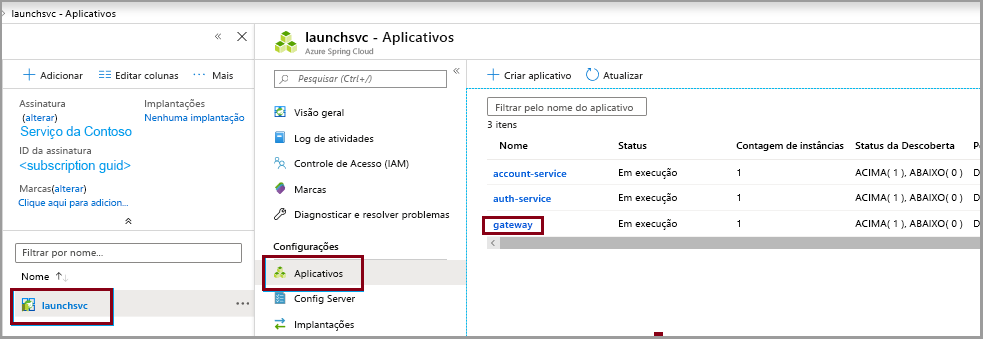

# <a name="quickstart-build-and-deploy-apps-to-azure-spring-cloud"></a>Início Rápido: Criar e implantar aplicativos no Azure Spring Cloud

::: zone pivot="programming-language-csharp"
Neste guia de início rápido, você cria e implanta aplicativos de microatendimento no Azure Spring Cloud usando o CLI do Azure.

## <a name="prerequisites"></a>Pré-requisitos

* Conclua os guias de início rápido anteriores nesta série:

  * [Provisionar o serviço Azure Spring Cloud](spring-cloud-quickstart-provision-service-instance.md).
  * [Configurar o servidor de configuração do Azure Spring Cloud](spring-cloud-quickstart-setup-config-server.md).

## <a name="download-the-sample-app"></a>Baixar o aplicativo de exemplo

Se você estiver usando o Azure Cloud Shell até este ponto, alterne para um prompt de comando local para as etapas a seguir.

1. Crie uma pasta e clone o repositório de aplicativo de exemplo.

   ```console
   mkdir source-code
   ```

   ```console
   cd source-code
   ```

   ```console
   git clone https://github.com/Azure-Samples/Azure-Spring-Cloud-Samples
   ```

1. Navegue até o diretório do repositório.

   ```console
   cd Azure-Spring-Cloud-Samples
   ```

## <a name="deploy-planetweatherprovider"></a>Implantar PlanetWeatherProvider

1. Crie um aplicativo para o projeto PlanetWeatherProvider em sua instância do Azure Spring Cloud.

   ```azurecli
   az spring-cloud app create --name planet-weather-provider --runtime-version NetCore_31
   ```

   Para habilitar o registro de serviço automático, você deu ao aplicativo o mesmo nome que o valor de `spring.application.name` no arquivo *appsettings.json* do projeto:

   ```json
   "spring": {
     "application": {
       "name": "planet-weather-provider"
     }
   }
   ```

   Este comando pode levar vários minutos para ser executado.

1. Altere o diretório para a pasta do projeto `PlanetWeatherProvider`.

   ```console
   cd steeltoe-sample/src/planet-weather-provider
   ```

1. Crie os binários e o arquivo *.zip* a ser implantado.

   ```console
   dotnet publish -c release -o ./publish
   ```

   > [!TIP]
   > O arquivo de projeto contém o seguinte XML para empacotar os binários em um arquivo *.zip* depois de gravá-los na pasta *./publish*:
   >
   > ```xml
   > <Target Name="Publish-Zip" AfterTargets="Publish">
   >   <ZipDirectory SourceDirectory="$(PublishDir)" DestinationFile="$(MSBuildProjectDirectory)/publish-deploy-planet.zip" Overwrite="true" />
   > </Target>
   > ```

1. Implantar no Azure.

   Verifique se o prompt de comando está na pasta do projeto antes de executar o comando a seguir.

   ```console
   az spring-cloud app deploy -n planet-weather-provider --runtime-version NetCore_31 --main-entry Microsoft.Azure.SpringCloud.Sample.PlanetWeatherProvider.dll --artifact-path ./publish-deploy-planet.zip
   ```

   A opção `--main-entry` especifica o caminho relativo da pasta raiz do arquivo *.zip* para o arquivo *.dll* que contém o ponto de entrada do aplicativo. Depois que o serviço carrega o arquivo *.zip*, ele extrai todos os arquivos e pastas e tenta executar o ponto de entrada no arquivo *.dll* especificado.

   Este comando pode levar vários minutos para ser executado.

## <a name="deploy-solarsystemweather"></a>Implantar SolarSystemWeather

1. Crie outro aplicativo em sua instância do Azure Spring Cloud, desta vez, para o projeto SolarSystemWeather:

   ```azurecli
   az spring-cloud app create --name solar-system-weather --runtime-version NetCore_31
   ```

   `solar-system-weather` é o nome especificado no arquivo *appsettings.json* do projeto `SolarSystemWeather`.

   Este comando pode levar vários minutos para ser executado.

1. Altere o diretório para o projeto `SolarSystemWeather`.

   ```console
   cd ../solar-system-weather
   ```

1. Crie os binários e o arquivo *.zip* a ser implantado.

   ```console
   dotnet publish -c release -o ./publish
   ```

1. Implantar no Azure.

   ```console
   az spring-cloud app deploy -n solar-system-weather --runtime-version NetCore_31 --main-entry Microsoft.Azure.SpringCloud.Sample.SolarSystemWeather.dll --artifact-path ./publish-deploy-solar.zip
   ```
   
   Este comando pode levar vários minutos para ser executado.

## <a name="assign-public-endpoint"></a>Atribuir ponto de extremidade público

Para testar o aplicativo, envie uma solicitação HTTP GET para o aplicativo `solar-system-weather` de um navegador.  Para fazer isso, você precisa de um ponto de extremidade público para a solicitação.

1. Para atribuir o ponto de extremidade, execute o comando a seguir.

   ```azurecli
   az spring-cloud app update -n solar-system-weather --assign-endpoint true
   ```

1. Para obter a URL do ponto de extremidade, execute o comando a seguir.

   Windows:

   ```azurecli
   az spring-cloud app show -n solar-system-weather -o table
   ```

   Linux:

   ```azurecli
   az spring-cloud app show --name solar-system-weather | grep url
   ```

## <a name="test-the-application"></a>Testar o aplicativo

Envie uma solicitação GET para o aplicativo `solar-system-weather`. Em um navegador, vá até a URL pública com `/weatherforecast` acrescentado ao final dela. Por exemplo:

```
https://servicename-solar-system-weather.azuremicroservices.io/weatherforecast
```

A saída é JSON:

```json
[{"Key":"Mercury","Value":"very warm"},{"Key":"Venus","Value":"quite unpleasant"},{"Key":"Mars","Value":"very cool"},{"Key":"Saturn","Value":"a little bit sandy"}]
```

essa resposta mostra que ambos os aplicativos de microsserviço estão funcionando. O aplicativo `SolarSystemWeather` retorna os dados recuperados do aplicativo `PlanetWeatherProvider`.
::: zone-end

::: zone pivot="programming-language-java"
Este documento explica como criar e implantar aplicativos de microsserviço no Azure Spring Cloud usando:
* CLI do Azure
* Plug-in Maven
* IntelliJ

Antes da implantação com a CLI do Azure ou o Maven, conclua os exemplos que [provisionam uma instância do Azure Spring Cloud](spring-cloud-quickstart-provision-service-instance.md) e [configuram o Config Server](spring-cloud-quickstart-setup-config-server.md).

## <a name="prerequisites"></a>Pré-requisitos

* [Instalar o JDK 8](/java/azure/jdk/)
* [Inscrever-se em uma assinatura do Azure](https://azure.microsoft.com/free/)
* (Opcional) [Instale a CLI do Azure versão 2.0.67 ou superior](/cli/azure/install-azure-cli) e instale a extensão do Azure Spring Cloud com o comando: `az extension add --name spring-cloud`
* (Opcional) [Instalar o Azure Toolkit for IntelliJ](https://plugins.jetbrains.com/plugin/8053-azure-toolkit-for-intellij/) e [conectar-se](/azure/developer/java/toolkit-for-intellij/create-hello-world-web-app#installation-and-sign-in)

## <a name="deployment-procedures"></a>Procedimentos de implantação

#### <a name="cli"></a>[CLI](#tab/Azure-CLI)

### <a name="build-the-microservices-applications-locally"></a>Criar os aplicativos de microsserviços localmente

1. Clone o repositório de aplicativos de exemplo para a sua conta do Azure Cloud.  

    ```azurecli
    git clone https://github.com/Azure-Samples/piggymetrics
    ```

2. Altere o diretório e crie o projeto.

    ```azurecli
    cd piggymetrics
    mvn clean package -DskipTests
    ```

A compilação do projeto leva cerca de 5 minutos. Depois de concluída, você deverá ter arquivos JAR individuais para cada serviço em suas respectivas pastas.

### <a name="create-and-deploy-the-apps"></a>Criar e implantar os aplicativos

1. Defina o nome do grupo de recursos padrão e o nome do cluster usando os seguintes comandos:

    ```azurecli
    az configure --defaults group=<resource group name>
    az configure --defaults spring-cloud=<service instance name>
    ```

1. Crie os microsserviços do Azure Spring Cloud usando os arquivos JAR criados na etapa anterior. Você criará três aplicativos: **gateway**, **auth-service** e **account-service**.

    ```azurecli
    az spring-cloud app create --name gateway
    az spring-cloud app create --name auth-service
    az spring-cloud app create --name account-service
    ```

1. Precisamos implantar aplicativos criados na etapa anterior para o Azure. Use os seguintes comandos para implantar todos os três aplicativos:

    ```azurecli
    az spring-cloud app deploy -n gateway --jar-path ./gateway/target/gateway.jar
    az spring-cloud app deploy -n account-service --jar-path ./account-service/target/account-service.jar
    az spring-cloud app deploy -n auth-service --jar-path ./auth-service/target/auth-service.jar
    ```

### <a name="assign-public-endpoint-to-gateway"></a>Atribuir um ponto de extremidade público ao gateway

Precisamos de uma maneira de acessar o aplicativo por meio de um navegador da Web. Nosso aplicativo de gateway precisa de um ponto de extremidade voltado para o público.

1. Atribua o ponto de extremidade usando o seguinte comando:

    ```azurecli
    az spring-cloud app update -n gateway --assign-endpoint true
    ```

2. Consulte o aplicativo de **gateway** quanto ao IP público dele para você poder verificar se ele está em execução:

    ```azurecli
    az spring-cloud app show --name gateway --query properties.url
    ```

#### <a name="maven"></a>[Maven](#tab/Maven)

### <a name="clone-and-build-the-sample-application-repository"></a>Clonar e criar o repositório do aplicativo de exemplo

1. Clone o repositório Git executando o seguinte comando:

    ```
    git clone https://github.com/Azure-Samples/piggymetrics
    ```
  
1. Altere o diretório e crie o projeto executando o seguinte comando:

    ```
    cd piggymetrics
    mvn clean package -DskipTests
    ```

### <a name="generate-configurations-and-deploy-to-the-azure-spring-cloud"></a>Gerar configurações e implantar no Azure Spring Cloud

1. Gere configurações executando o comando a seguir na pasta raiz de PiggyMetrics que contém o POM pai. Se você já tiver entrado com a CLI do Azure, o comando selecionará automaticamente as credenciais. Caso contrário, ele fará com que você entre com as instruções de prompt. Para obter mais informações, confira nossa [página do wiki](https://github.com/microsoft/azure-maven-plugins/wiki/Authentication).

    ```
    mvn com.microsoft.azure:azure-spring-cloud-maven-plugin:1.3.0:config
    ```
    
    Você precisará selecionar:
    * **Módulos:** Selecione `gateway`, `auth-service` e `account-service`.
    * **Assinatura:** Essa é a sua assinatura usada para criar uma instância do Azure Spring Cloud.
    * **Instância de Serviço:** Esse é o nome da sua instância do Azure Spring Cloud.
    * **Ponto de extremidade público:** Na lista de projetos fornecidos, insira o número que corresponde ao `gateway`.  Isso faz com que ela tenha acesso público.

1. Agora o POM contém as dependências e configurações do plug-in. Implante os aplicativos usando o comando a seguir. 

    ```
    mvn azure-spring-cloud:deploy
    ```

#### <a name="intellij"></a>[IntelliJ](#tab/IntelliJ)

### <a name="import-sample-project-in-intellij"></a>Importar o projeto de exemplo no IntelliJ

1. Baixe e descompacte o repositório de origem deste tutorial ou clone-o usando Git: `git clone https://github.com/Azure-Samples/piggymetrics` 

1. Abra a caixa de diálogo **Bem-vindo(a)** do IntelliJ e selecione **Importar Projeto** para abrir o assistente de importação.

1. Selecione a pasta `piggymetric`.

    

### <a name="deploy-gateway-app-to-azure-spring-cloud"></a>Implantar o aplicativo de gateway no Azure Spring Cloud
Para implantar no Azure, você precisa entrar com a sua conta do Azure com o Azure Toolkit for IntelliJ e escolher a sua assinatura. Para obter detalhes de entrada, confira [Instalação e entrada](/azure/developer/java/toolkit-for-intellij/create-hello-world-web-app#installation-and-sign-in).

1. Clique com o botão direito do mouse no seu projeto no explorador de projeto do IntelliJ e selecione **Azure** -> **Implantar no Azure Spring Cloud**.

    

1. No campo **Nome**, acrescente *:gateway* ao **Nome** existente.
1. Na caixa de texto **Artefato**, selecione *com.piggymetrics:gateway:1.0-SNAPSHOT*.
1. Na caixa de texto **Assinatura**, verifique a sua assinatura.
1. Na caixa de texto **Spring Cloud**, selecione a instância do Azure Spring Cloud criada em [Provisionar a instância do Azure Spring Cloud](./spring-cloud-quickstart-provision-service-instance.md).
1. Defina **Ponto de Extremidade Público** como *Habilitar*.
1. Na caixa de texto **Aplicativo:** , selecione **Criar aplicativo...** .
1. Insira *gateway* e clique em **OK**.

    

1. Na seção **Antes da inicialização** da caixa de diálogo, clique duas vezes em *Executar Meta do Maven*.
1. Na caixa de texto **Diretório de trabalho**, navegue até a pasta *piggymetrics/gateway*.
1. Na caixa de texto **Linha de comando**, insira *package -DskipTests*. Clique em **OK**.
1. Inicie a implantação clicando no botão **Executar** na parte inferior da caixa de diálogo **Implantar aplicativo do Azure Spring Cloud**. O plug-in executará o comando `mvn package` no aplicativo `gateway` e implantará o JAR gerado pelo comando `package`.

### <a name="deploy-auth-service-and-account-service-apps-to-azure-spring-cloud"></a>Implantar o auth-service e o account-service no Azure Spring Cloud
Você pode repetir as etapas acima para implantar `auth-service` e os aplicativos `account-service` no Azure Spring Cloud:

1. Modifique o **Nome** e o **Artefato** para identificar o aplicativo `auth-service`.
1. Na caixa de texto **Aplicativo:** , selecione **Criar aplicativo...** para criar aplicativos `auth-service`.
1. Verifique se a opção **Ponto de Extremidade Público** está definida como *Desabilitado*.
1. Na seção **Antes da inicialização** da caixa de diálogo, alterne o **Diretório de trabalho** para a pasta *piggymetrics/auth-service*.
1. Inicie a implantação clicando no botão **Executar** na parte inferior da caixa de diálogo **Implantar aplicativo do Azure Spring Cloud**. 
1. Repita esses procedimentos para configurar e implantar o `account-service`.
---

Navegue até a URL fornecida na saída das etapas anteriores para acessar o aplicativo PiggyMetrics. Por exemplo: `https://<service instance name>-gateway.azuremicroservices.io`


Também é possível navegar pelo portal do Azure para localizar a URL. 
1. Navegue até o serviço
2. Selecione **Aplicativos**
3. Selecione **Gateway**

    
    
4. Localize a URL na página **gateway | Visão geral**

    

::: zone-end

## <a name="next-steps"></a>Próximas etapas

Neste guia de início rápido, você criou recursos do Azure que continuarão acumulando encargos se permanecerem em sua assinatura. Se você não pretende prosseguir para o próximo início rápido, confira [Limpar recursos](spring-cloud-quickstart-logs-metrics-tracing.md#clean-up-resources). Caso contrário, avance para o próximo início rápido:

> [!div class="nextstepaction"]
> [Logs, Métricas e Rastreamento](spring-cloud-quickstart-logs-metrics-tracing.md)
