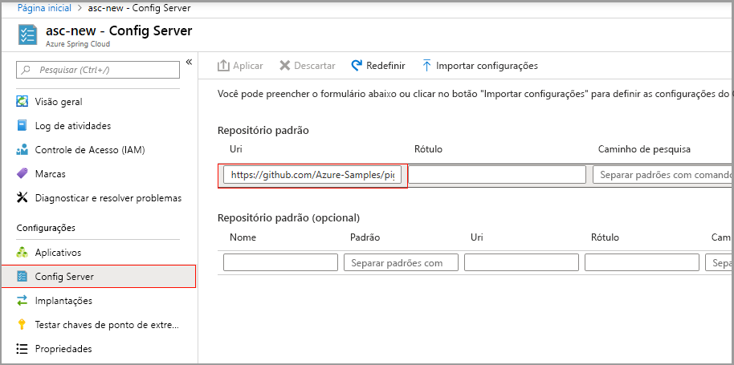

# <a name="quickstart-set-up-azure-spring-cloud-configuration-server"></a>Início Rápido: Configurar o servidor de configuração do Azure Spring Cloud

O Azure Spring Cloud Config Server é um serviço de configuração centralizado para sistemas distribuídos. Ele usa uma camada de repositório conectável que atualmente dá suporte a armazenamento local, Git e Subversion. Neste guia de início rápido, você configura o Config Server para obter dados de um repositório Git.

::: zone pivot="programming-language-csharp"

## <a name="prerequisites"></a>Pré-requisitos

* Conclua o guia de início rápido anterior nesta série: [Provisionar o serviço Azure Spring Cloud](spring-cloud-quickstart-provision-service-instance.md).

## <a name="azure-spring-cloud-config-server-procedures"></a>Procedimentos do Azure Spring Cloud Config Server

Configure seu servidor de configuração com o local do repositório Git para o projeto executando o comando a seguir. Substitua `<service instance name>` pelo nome do serviço criado anteriormente. O valor padrão para o nome da instância de serviço que você definiu no guia de início rápido anterior não funciona com esse comando.

```azurecli
az spring-cloud config-server git set -n <service instance name> --uri https://github.com/Azure-Samples/Azure-Spring-Cloud-Samples --search-paths steeltoe-sample/config
```

Esse comando diz para o servidor de configuração para localizar os dados de configuração na pasta [steeltoe-sample/config](https://github.com/Azure-Samples/Azure-Spring-Cloud-Samples/tree/master/steeltoe-sample/config) do repositório de aplicativos de exemplo. Como o nome do aplicativo que obterá os dados de configuração é `planet-weather-provider`, o arquivo que será usado é [planet-weather-provider.yml](https://github.com/Azure-Samples/Azure-Spring-Cloud-Samples/blob/master/steeltoe-sample/config/planet-weather-provider.yml).

::: zone-end

::: zone pivot="programming-language-java"
O Azure Spring Cloud Config Server é um serviço de configuração centralizado para sistemas distribuídos. Ele usa uma camada de repositório conectável que atualmente dá suporte a armazenamento local, Git e Subversion.  Configure o Config Server para implantar aplicativos de microsserviço no Azure Spring Cloud.

## <a name="prerequisites"></a>Pré-requisitos

* [Instalar o JDK 8](/java/azure/jdk/)
* [Inscrever-se em uma assinatura do Azure](https://azure.microsoft.com/free/)
* (Opcional) [Instale a CLI do Azure versão 2.0.67 ou superior](/cli/azure/install-azure-cli) e instale a extensão do Azure Spring Cloud com o comando: `az extension add --name spring-cloud`
* (Opcional) [Instale o Azure Toolkit for IntelliJ](https://plugins.jetbrains.com/plugin/8053-azure-toolkit-for-intellij/) e [conecte-se](/azure/developer/java/toolkit-for-intellij/create-hello-world-web-app#installation-and-sign-in)

## <a name="azure-spring-cloud-config-server-procedures"></a>Procedimentos do Azure Spring Cloud Config Server

#### <a name="portal"></a>[Portal](#tab/Azure-portal)

O procedimento a seguir configura o Config Server usando o portal do Azure para implantar o [exemplo de Piggymetrics](spring-cloud-quickstart-sample-app-introduction.md).

1. Acesse a página **Visão Geral** do serviço e selecione o **Servidor de Configuração**.

2. Na seção **Repositório padrão**, defina **URI** como "https://github.com/Azure-Samples/piggymetrics-config".

3. Clique em **Validar**.

    

4. Quando a validação for concluída, clique em **Aplicar** para salvar as alterações.

    

5. A atualização da configuração pode levar alguns minutos.
 
     

6. Você deverá receber uma notificação quando a configuração for concluída.

#### <a name="cli"></a>[CLI](#tab/Azure-CLI)

O procedimento a seguir usa a CLI do Azure para configurar o Config Server para implantar o [exemplo de Piggymetrics](spring-cloud-quickstart-sample-app-introduction.md).

Configurar o config-server com a localização do repositório git do projeto:

```azurecli
az spring-cloud config-server git set -n <service instance name> --uri https://github.com/Azure-Samples/piggymetrics-config
```
---
::: zone-end

> [!TIP]
> Se estiver usando um repositório privado para o servidor de configuração, veja nosso [tutorial sobre como configurar a autenticação](./spring-cloud-howto-config-server.md).

## <a name="troubleshooting-of-azure-spring-cloud-config-server"></a>Solução de problemas do Config Server do Azure Spring Cloud

O procedimento a seguir explica como solucionar problemas de configurações do Config Server.

1. No portal do Azure, acesse a página **Visão Geral** do serviço e selecione **Logs**. 
1. Selecione **Consultas** e **Mostrar os logs de aplicativo que contêm os termos "erro" ou "exceção"** . 
1. Clique em **Executar**. 
1. Se você encontrar o erro **java.lang.illegalStateException** nos logs, isso indica que o serviço Spring Cloud não foi capaz de localizar as propriedades do Config Server.

    [  ](media/spring-cloud-quickstart-setup-config-server/setup-config-server-query.png)

1. Vá para a página **Visão Geral** do serviço.
1. Selecione **Diagnosticar e solucionar problemas**. 
1. Selecione o detector do **Config Server**.

    [  ](media/spring-cloud-quickstart-setup-config-server/setup-config-server-diagnose.png)

3. Clique em **Verificação de Integridade do Config Server**.

    [  ](media/spring-cloud-quickstart-setup-config-server/setup-config-server-genie.png)

4. Clique em **Status do Config Server** para ver mais detalhes por meio do detector.

    [  ](media/spring-cloud-quickstart-setup-config-server/setup-config-server-health-status.png)

## <a name="next-steps"></a>Próximas etapas

Neste guia de início rápido, você criou recursos do Azure que continuarão acumulando encargos se permanecerem em sua assinatura. Se você não pretende prosseguir para o próximo início rápido, confira [Limpar recursos](spring-cloud-quickstart-logs-metrics-tracing.md#clean-up-resources). Caso contrário, avance para o próximo início rápido:

> [!div class="nextstepaction"]
> [Compilar e implantar aplicativos](spring-cloud-quickstart-deploy-apps.md)