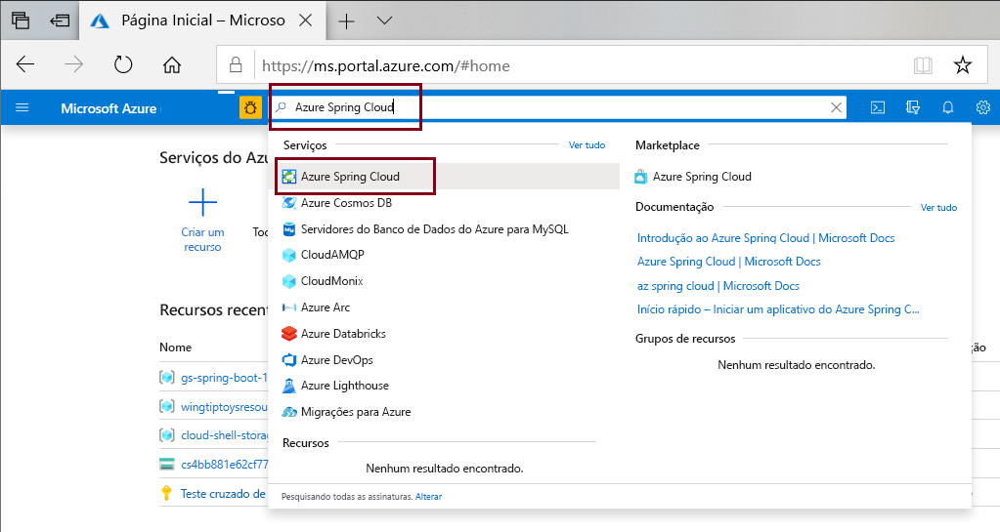
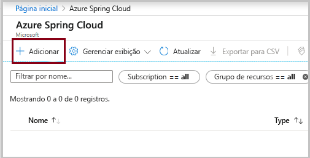
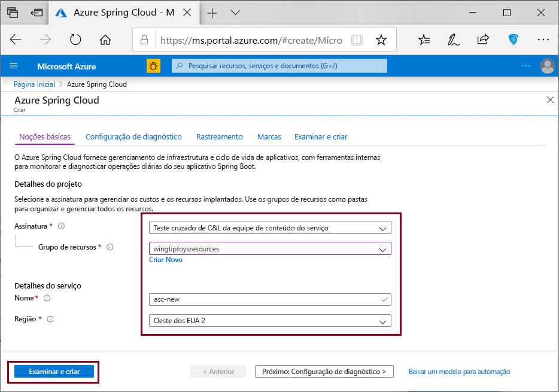
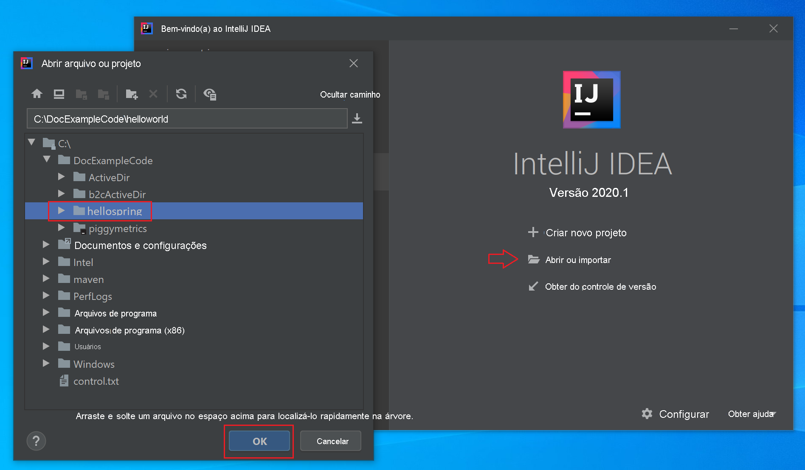
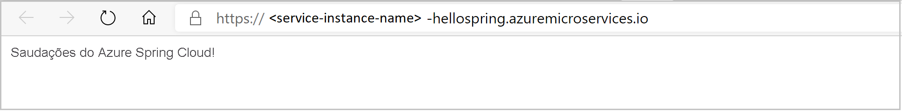

# <a name="quickstart-deploy-your-first-azure-spring-cloud-application"></a>Início Rápido: Implantar seu primeiro aplicativo do Azure Spring Cloud

::: zone pivot="programming-language-csharp"
Este guia de início rápido explica como implantar aplicativos de microsserviço simples do Azure Spring Cloud para execução no Azure.

>[!NOTE]
> O suporte do Steeltoe para o Azure Spring Cloud é oferecido atualmente como uma versão prévia pública. As ofertas de visualização pública permitem que os clientes experimentem os novos recursos antes do lançamento oficial.  Os serviços e recursos de visualização pública não são destinados ao uso em produção.  Para obter mais informações sobre o suporte durante as versões prévias, confira as [perguntas frequentes](https://azure.microsoft.com/support/faq/) ou registre uma [Solicitação de suporte](../azure-portal/supportability/how-to-create-azure-support-request.md).

Seguindo este início rápido, você aprenderá a:

> [!div class="checklist"]
> * Gerar um projeto básico do .NET Core Steeltoe
> * Provisionar uma instância de serviço do Azure Spring Cloud
> * Criar e implantar o aplicativo com um ponto de extremidade público
> * Transmitir logs em tempo real

O código do aplicativo usado neste guia de início rápido é um aplicativo simples criado com um modelo de projeto de API Web do .NET Core. Quando você concluir este exemplo, o aplicativo estará acessível online e poderá ser gerenciado por meio do portal do Azure e a CLI do Azure.

## <a name="prerequisites"></a>Pré-requisitos

* Uma conta do Azure com uma assinatura ativa. [Crie uma conta gratuitamente](https://azure.microsoft.com/free/?WT.mc_id=A261C142F).
* [SDK do .NET Core 3.1](https://dotnet.microsoft.com/download/dotnet-core/3.1). O serviço Azure Spring Cloud dá suporte ao .NET Core 3.1 e versões posteriores.
* [CLI do Azure](/cli/azure/install-azure-cli) versão 2.0.67 ou posterior.
* [Git](https://git-scm.com/).

## <a name="install-azure-cli-extension"></a>Instalar a extensão de CLI do Azure

Verifique se a sua versão da CLI do Azure é 2.0.67 ou posterior:

```azurecli
az --version
```

Instalar a extensão do Azure Spring Cloud para a CLI do Azure usando o seguinte comando:

```azurecli
az extension add --name spring-cloud
```

## <a name="log-in-to-azure"></a>Fazer logon no Azure

1. Faça logon na CLI do Azure

    ```azurecli
    az login
    ```

1. Se você tiver mais de uma assinatura, escolha a que deseja usar para este guia de início rápido.

   ```azurecli
   az account list -o table
   ```

   ```azurecli
   az account set --subscription <Name or ID of a subscription from the last step>
   ```

## <a name="generate-a-steeltoe-net-core-project"></a>Gerar um projeto do .NET Core do Steeltoe

No Visual Studio, crie um aplicativo Web ASP.NET Core chamado "Olá, mundo" com o modelo de projeto de API. Observe que haverá um WeatherForecastController gerado automaticamente, que será nosso teste de ponto de extremidade mais tarde.

1. Crie uma pasta para o código-fonte do projeto e gere o projeto.
 
   ```console
   mkdir source-code
   ```

   ```console
   cd source-code
   ```

   ```dotnetcli
   dotnet new webapi -n hello-world --framework netcoreapp3.1
   ```

1. Navegue até o diretório do projeto.

   ```console
   cd hello-world
   ```

1. Edite o arquivo do *appSettings.json* para adicionar as seguintes configurações:

   ```json
   "spring": {
     "application": {
       "name": "hello-world"
     }
   },
   "eureka": {
     "client": {
       "shouldFetchRegistry": true,
       "shouldRegisterWithEureka": true
     }
   }
   ```

1. Também em *appSettings.json*, altere o nível de log da categoria `Microsoft` de `Warning` para `Information`. Essa alteração garante que os logs serão produzidos quando você exibir os logs de streaming em uma etapa posterior.

   O arquivo *appSettings.json* agora é semelhante ao exemplo a seguir:

   ```json
   {
     "Logging": {
       "LogLevel": {
         "Default": "Information",
         "Microsoft": "Information",
         "Microsoft.Hosting.Lifetime": "Information"
       }
     },
     "AllowedHosts": "*",
     "spring": {
       "application": {
         "name": "hello-world"
       }
     },
     "eureka": {
       "client": {
         "shouldFetchRegistry": true,
         "shouldRegisterWithEureka": true
       }
     }
   }
   ```
   
1. Adicione dependências e uma tarefa de `Zip` ao arquivo de *.csproj*:

   ```xml
   <ItemGroup>
     <PackageReference Include="Steeltoe.Discovery.ClientCore" Version="3.0.0" />
     <PackageReference Include="Microsoft.Azure.SpringCloud.Client" Version="2.0.0-preview.1" />
   </ItemGroup>
   <Target Name="Publish-Zip" AfterTargets="Publish">
       <ZipDirectory SourceDirectory="$(PublishDir)" DestinationFile="$(MSBuildProjectDirectory)/deploy.zip" Overwrite="true" />
   </Target>
   ```

   Os pacotes são para a Descoberta de Serviço Steeltoe e para a biblioteca de clientes do Azure Spring Cloud. A tarefa `Zip` é para implantação no Azure. Quando você executa o comando `dotnet publish`, ele gera os binários na pasta *publicar* e essa tarefa compacta a pasta *Publicar* em um arquivo *.zip* que você carrega para o Azure.

3. No arquivo *Program.cs*, adicione uma diretiva `using` e o código que usa a biblioteca de clientes do Azure Spring Cloud:

   ```csharp
   using Microsoft.Azure.SpringCloud.Client;
   ```

   ```csharp
   public static IHostBuilder CreateHostBuilder(string[] args) =>
               Host.CreateDefaultBuilder(args)
                   .UseAzureSpringCloudService()
                   .ConfigureWebHostDefaults(webBuilder =>
                   {
                       webBuilder.UseStartup<Startup>();
                   });
   ```

4. No arquivo *Startup.cs*, adicione uma diretiva `using` e um código que usa a Descoberta de Serviço Steeltoe no final dos métodos `ConfigureServices` e `Configure`:

   ```csharp
   using Steeltoe.Discovery.Client;
   ```

   ```csharp
   public void ConfigureServices(IServiceCollection services)
   {
       // Template code not shown.

       services.AddDiscoveryClient(Configuration);
   }
   ```

   ```csharp
   public void Configure(IApplicationBuilder app, IWebHostEnvironment env)
   {
       // Template code not shown.

       app.UseDiscoveryClient();
   }
   ```

1. Crie o projeto para garantir se não há erros de compilação.

   ```dotnetcli
   dotnet build
   ```
 
## <a name="provision-a-service-instance"></a>Provisionar uma instância de serviço

O procedimento a seguir cria uma instância do Azure Spring Cloud usando o portal do Azure.

1. Abra o [Portal do Azure](https://ms.portal.azure.com/). 

1. Na caixa de pesquisa superior, pesquise *Azure Spring Cloud*.

1. Selecione *Azure Spring Cloud* nos resultados.

   

1. Na página do Azure Spring Cloud, clique em **+ Adicionar**.

   

1. Preencha o formulário na página **Criar** do Azure Spring Cloud.  Considere as seguintes diretrizes:

   * **Assinatura**: selecione a assinatura da qual você deseja que este recurso seja cobrado.
   * **Grupo de recursos**: Crie um novo grupo de recursos. O nome que você inserir aqui será usado em etapas posteriores, como **\<resource group name\>** .
   * **Nome/Detalhes do Serviço**: Especifique o **\<service instance name\>** .  O nome deve ter entre 4 e 32 caracteres e pode conter apenas letras minúsculas, números e hifens.  O primeiro caractere do nome do serviço deve ser uma letra e o último caractere deve ser uma letra ou um número.
   * **Região**: selecione a região da instância de serviço.

   

6. Selecione **Examinar e criar**.

## <a name="build-and-deploy-the-app"></a>Compilar e implantar o aplicativo

O procedimento a seguir cria e implanta o projeto que você criou anteriormente.

1. Verifique se o prompt de comando ainda está na pasta do projeto.

1. Execute o comando a seguir para criar o projeto, publicar os binários e armazenar os binários em um arquivo *.zip* na pasta do projeto.

   ```dotnetcorecli
   dotnet publish -c release -o ./publish
   ```

1. Crie um aplicativo em sua instância do Azure Spring Cloud com um ponto de extremidade público atribuído. Use o mesmo nome de aplicativo "olá-mundo" especificado em *appsettings.json*.

   ```console
   az spring-cloud app create -n hello-world -s <service instance name> -g <resource group name> --assign-endpoint --runtime-version NetCore_31
   ```

1. Implante o arquivo *.zip* no aplicativo.

   ```azurecli
   az spring-cloud app deploy -n hello-world -s <service instance name> -g <resource group name> --runtime-version NetCore_31 --main-entry hello-world.dll --artifact-path ./deploy.zip
   ```

   A opção `--main-entry` identifica o arquivo *.dll* que contém o ponto de entrada do aplicativo. Depois que o serviço carrega o arquivo *.zip*, ele extrai todos os arquivos e pastas e tenta executar o ponto de entrada no arquivo *.dll* especificado por `--main-entry`.

   A implantação do aplicativo leva alguns minutos para ser concluída. Para confirmar se ele foi implantado, acesse a folha **Aplicativos** no portal do Azure.

## <a name="test-the-app"></a>Testar o aplicativo

Após a conclusão da implantação, acesse o aplicativo na seguinte URL:

```http
https://<service instance name>-hello-world.azuremicroservices.io/weatherforecast
```

O aplicativo retorna dados JSON semelhantes ao seguinte exemplo:

```json
[{"date":"2020-09-08T21:01:50.0198835+00:00","temperatureC":14,"temperatureF":57,"summary":"Bracing"},{"date":"2020-09-09T21:01:50.0200697+00:00","temperatureC":-14,"temperatureF":7,"summary":"Bracing"},{"date":"2020-09-10T21:01:50.0200715+00:00","temperatureC":27,"temperatureF":80,"summary":"Freezing"},{"date":"2020-09-11T21:01:50.0200717+00:00","temperatureC":18,"temperatureF":64,"summary":"Chilly"},{"date":"2020-09-12T21:01:50.0200719+00:00","temperatureC":16,"temperatureF":60,"summary":"Chilly"}]
```

## <a name="stream-logs-in-real-time"></a>Transmitir logs em tempo real

Use o comando a seguir para obter os logs em tempo real do aplicativo.

```azurecli
az spring-cloud app logs -n hello-world -s <service instance name> -g <resource group name> --lines 100 -f
```

Os logs são exibidos na saída:

```output
[Azure Spring Cloud] The following environment variables are loaded:
2020-09-08 20:58:42,432 INFO supervisord started with pid 1
2020-09-08 20:58:43,435 INFO spawned: 'event-gather_00' with pid 9
2020-09-08 20:58:43,436 INFO spawned: 'dotnet-app_00' with pid 10
2020-09-08 20:58:43 [Warning] No managed processes are running. Wait for 30 seconds...
2020-09-08 20:58:44,843 INFO success: event-gather_00 entered RUNNING state, process has stayed up for > than 1 seconds (startsecs)
2020-09-08 20:58:44,843 INFO success: dotnet-app_00 entered RUNNING state, process has stayed up for > than 1 seconds (startsecs)
←[40m←[32minfo←[39m←[22m←[49m: Steeltoe.Discovery.Eureka.DiscoveryClient[0]
      Starting HeartBeat
info: Microsoft.Hosting.Lifetime[0]
      Now listening on: http://[::]:1025
info: Microsoft.Hosting.Lifetime[0]
      Application started. Press Ctrl+C to shut down.
info: Microsoft.Hosting.Lifetime[0]
      Hosting environment: Production
info: Microsoft.Hosting.Lifetime[0]
      Content root path: /netcorepublish/6e4db42a-b160-4b83-a771-c91adec18c60
2020-09-08 21:00:13 [Information] [10] Start listening...
info: Microsoft.AspNetCore.Hosting.Diagnostics[1]
      Request starting HTTP/1.1 GET http://asc-svc-hello-world.azuremicroservices.io/weatherforecast
info: Microsoft.AspNetCore.Routing.EndpointMiddleware[0]
      Executing endpoint 'hello_world.Controllers.WeatherForecastController.Get (hello-world)'
info: Microsoft.AspNetCore.Mvc.Infrastructure.ControllerActionInvoker[3]
      Route matched with {action = "Get", controller = "WeatherForecast"}. Executing controller action with signature System.Collections.Generic.IEnumerable`1[hello_world.WeatherForecast] Get() on controller hello_world.Controllers.WeatherForecastController (hello-world).
info: Microsoft.AspNetCore.Mvc.Infrastructure.ObjectResultExecutor[1]
      Executing ObjectResult, writing value of type 'hello_world.WeatherForecast[]'.
info: Microsoft.AspNetCore.Mvc.Infrastructure.ControllerActionInvoker[2]
      Executed action hello_world.Controllers.WeatherForecastController.Get (hello-world) in 1.8902ms
info: Microsoft.AspNetCore.Routing.EndpointMiddleware[1]
      Executed endpoint 'hello_world.Controllers.WeatherForecastController.Get (hello-world)'
info: Microsoft.AspNetCore.Hosting.Diagnostics[2]
      Request finished in 4.2591ms 200 application/json; charset=utf-8
```

> [!TIP]
> Use `az spring-cloud app logs -h` para explorar mais parâmetros e funcionalidades de fluxo de log.

Para obter recursos avançados de análise de logs, acesse a guia **Logs** do menu no [portal do Azure](https://portal.azure.com/). Os logs aqui têm uma latência de alguns minutos.
[  ](media/spring-cloud-quickstart-java/logs-analytics.png#lightbox)
::: zone-end

::: zone pivot="programming-language-java"
Este guia de início rápido explica como implantar aplicativos de microsserviço simples do Azure Spring Cloud para execução no Azure. 

O código do aplicativo usado neste tutorial é um aplicativo simples criado com o Spring Initializr. Quando você concluir este exemplo, o aplicativo estará acessível online e poderá ser gerenciado por meio do portal do Azure.

Este guia de início rápido explica como:

> [!div class="checklist"]
> * Gerar um projeto básico do Spring Cloud
> * Provisionar uma instância de serviço
> * Criar e implantar o aplicativo com um ponto de extremidade público
> * Transmitir logs em tempo real

## <a name="prerequisites"></a>Pré-requisitos

Para concluir este guia de início rápido:

* [Instalar o JDK 8](/java/azure/jdk/)
* [Inscrever-se em uma assinatura do Azure](https://azure.microsoft.com/free/)
* (Opcional) [Instale a CLI do Azure versão 2.0.67 ou superior](/cli/azure/install-azure-cli) e a extensão do Azure Spring Cloud com o comando: `az extension add --name spring-cloud`
* (Opcional) [Instale o Azure Toolkit for IntelliJ](https://plugins.jetbrains.com/plugin/8053-azure-toolkit-for-intellij/) e [conecte-se](/azure/developer/java/toolkit-for-intellij/create-hello-world-web-app#installation-and-sign-in)

## <a name="generate-a-spring-cloud-project"></a>Gerar um projeto do Spring Cloud

Comece com o [Spring Initializr](https://start.spring.io/#!type=maven-project&language=java&platformVersion=2.3.9.RELEASE&packaging=jar&jvmVersion=1.8&groupId=com.example&artifactId=hellospring&name=hellospring&description=Demo%20project%20for%20Spring%20Boot&packageName=com.example.hellospring&dependencies=web,cloud-eureka,actuator,cloud-starter-sleuth,cloud-starter-zipkin,cloud-config-client) para gerar um projeto de exemplo com as dependências recomendadas para o Azure Spring Cloud. A imagem a seguir mostra o Initializr configurado para este projeto de exemplo.
```url
https://start.spring.io/#!type=maven-project&language=java&platformVersion=2.3.4.RELEASE&packaging=jar&jvmVersion=1.8&groupId=com.example&artifactId=hellospring&name=hellospring&description=Demo%20project%20for%20Spring%20Boot&packageName=com.example.hellospring&dependencies=web,cloud-eureka,actuator,cloud-starter-sleuth,cloud-starter-zipkin,cloud-config-client
```
Observe que este exemplo usa o Java versão 8.  Se quiser usar o Java versão 11, altere a opção em **Metadados do projeto**.

  

1. Clique em **Gerar** quando todas as dependências forem definidas. Baixe e descompacte o pacote e crie um controlador da Web para um aplicativo Web simples adicionando `src/main/java/com/example/hellospring/HelloController.java` da seguinte maneira:

    ```java
    package com.example.hellospring;
    
    import org.springframework.web.bind.annotation.RestController;
    import org.springframework.web.bind.annotation.RequestMapping;
    
    @RestController
    public class HelloController {
    
        @RequestMapping("/")
        public String index() {
            return "Greetings from Azure Spring Cloud!";
        }
    
    }
    ```
## <a name="provision-an-instance-of-azure-spring-cloud"></a>Provisionar uma instância do Azure Spring Cloud

O procedimento a seguir cria uma instância do Azure Spring Cloud usando o portal do Azure.

1. Em uma nova guia, abra o [portal do Azure](https://ms.portal.azure.com/). 

2. Na caixa de pesquisa superior, pesquise *Azure Spring Cloud*.

3. Selecione *Azure Spring Cloud* nos resultados.

    

4. Na página do Azure Spring Cloud, clique em **+ Adicionar**.

    

5. Preencha o formulário na página **Criar** do Azure Spring Cloud.  Considere as seguintes diretrizes:
    - **Assinatura**: selecione a assinatura da qual você deseja que este recurso seja cobrado.
    - **Grupo de recursos**: a criação de grupos de recursos para novos recursos é uma melhor prática. Isso será usado em uma etapa posterior como **\<resource group name\>** .
    - **Nome/Detalhes do Serviço**: Especifique o **\<service instance name\>** .  O nome deve ter entre 4 e 32 caracteres e pode conter apenas letras minúsculas, números e hifens.  O primeiro caractere do nome do serviço deve ser uma letra e o último caractere deve ser uma letra ou um número.
    - **Localização**: selecione a região da instância de serviço.

    

6. Clique em **Examinar e criar**.

## <a name="build-and-deploy-the-app"></a>Compilar e implantar o aplicativo
    
#### <a name="cli"></a>[CLI](#tab/Azure-CLI)
O procedimento a seguir cria e implanta o aplicativo usando a CLI do Azure. Execute o comando a seguir na raiz do projeto.

1. Compile o projeto usando o Maven:

    ```console
    mvn clean package -DskipTests
    ```

1. Caso ainda não tenha feito isso, instale a extensão do Azure Spring Cloud para a CLI do Azure:

    ```azurecli
    az extension add --name spring-cloud
    ```
    
1. Crie o aplicativo com o ponto de extremidade público atribuído. Se estiver usando o Java 11, inclua a opção `--runtime-version=Java_11`.

    ```azurecli
    az spring-cloud app create -n hellospring -s <service instance name> -g <resource group name> --assign-endpoint true
    ```

1. Implante o arquivo JAR para o aplicativo (`target\hellospring-0.0.1-SNAPSHOT.jar` no Windows):

    ```azurecli
    az spring-cloud app deploy -n hellospring -s <service instance name> -g <resource group name> --jar-path <jar file path>
    ```
    
1. A implantação do aplicativo leva alguns minutos para ser concluída. Para confirmar se ele foi implantado, acesse a folha **Aplicativos** no portal do Azure. Você verá o status do aplicativo.

#### <a name="intellij"></a>[IntelliJ](#tab/IntelliJ)

O procedimento a seguir usa o plug-in do IntelliJ para Azure Spring Cloud a fim de implantar o aplicativo de exemplo no IntelliJ IDEA.  

### <a name="import-project"></a>Projeto de importação

1. Abra a caixa de diálogo **Bem-vindo(a)** do IntelliJ e selecione **Importar Projeto** para abrir o assistente de importação.
1. Selecione a pasta `hellospring`.

    

### <a name="deploy-the-app"></a>Implantar o aplicativo
Para a implantação no Azure, você precisará entrar com a sua conta do Azure e escolher sua assinatura.  Para obter detalhes de entrada, confira [Instalação e entrada](/azure/developer/java/toolkit-for-intellij/create-hello-world-web-app#installation-and-sign-in).

1. Clique com o botão direito do mouse no seu projeto no explorador de projeto do IntelliJ e selecione **Azure** -> **Implantar no Azure Spring Cloud**.

    [  ](media/spring-cloud-quickstart-java/intellij-deploy-azure-1.png#lightbox)

1. Aceite o nome do aplicativo no campo **Nome**. **Nome** refere-se à configuração, não ao nome do aplicativo. Normalmente, os usuários não precisam alterá-lo.
1. Na caixa de texto **Artefato**, selecione *hellospring-0.0.1-SNAPSHOT.jar*.
1. Na caixa de texto **Assinatura**, verifique a sua assinatura.
1. Na caixa de texto **Spring Cloud**, selecione a instância do Azure Spring Cloud criada em [Provisionar a instância do Azure Spring Cloud](./spring-cloud-quickstart-provision-service-instance.md).
1. Defina **Ponto de Extremidade Público** como *Habilitar*.
1. Na caixa de texto **Aplicativo:** , selecione **Criar aplicativo...** .
1. Insira *hellospring* e clique em **OK**.

    [  ](media/spring-cloud-quickstart-java/intellij-deploy-to-azure.png#lightbox)

1. Inicie a implantação clicando no botão **Executar** na parte inferior da caixa de diálogo **Implantar aplicativo do Azure Spring Cloud**. O plug-in executará o comando `mvn package` no aplicativo `hellospring` e implantará o JAR gerado pelo comando `package`.
---

Depois que a implantação for concluída, acesse o aplicativo em `https://<service instance name>-hellospring.azuremicroservices.io/`.

  [  ](media/spring-cloud-quickstart-java/access-app-browser.png#lightbox)

## <a name="streaming-logs-in-real-time"></a>Como transmitir logs em tempo real

#### <a name="cli"></a>[CLI](#tab/Azure-CLI)

Use o comando a seguir para obter os logs em tempo real do aplicativo.

```azurecli
az spring-cloud app logs -n hellospring -s <service instance name> -g <resource group name> --lines 100 -f

```
Os logs serão exibidos nos resultados:

[  ](media/spring-cloud-quickstart-java/streaming-logs.png#lightbox)

>[!TIP]
> Use `az spring-cloud app logs -h` para explorar mais parâmetros e funcionalidades de fluxo de log.

#### <a name="intellij"></a>[IntelliJ](#tab/IntelliJ)

1. Selecione **Azure Explorer** e, em seguida, **Spring Cloud**.
1. Clique com o botão direito do mouse no aplicativo em execução.
1. Selecione **Logs de Streaming** na lista suspensa.
1. Selecione a instância.

    [  ](media/spring-cloud-quickstart-java/intellij-get-streaming-logs.png)

1. O log de streaming ficará visível na janela de saída.

    [  ](media/spring-cloud-quickstart-java/intellij-streaming-logs-output.png)
---

Para obter recursos avançados de análise de logs, acesse a guia **Logs** do menu no [portal do Azure](https://portal.azure.com/). Os logs aqui têm uma latência de alguns minutos.

[  ](media/spring-cloud-quickstart-java/logs-analytics.png#lightbox)
::: zone-end

## <a name="clean-up-resources"></a>Limpar os recursos

Nas etapas anteriores, você criou recursos do Azure que continuarão a acumular encargos enquanto permanecerem em sua assinatura. Se você acredita que não precisará desses recursos no futuro, exclua o grupo de recursos por meio do portal ou executando o seguinte comando na CLI do Azure:

```azurecli
az group delete --name <your resource group name; for example: hellospring-1558400876966-rg> --yes
```

## <a name="next-steps"></a>Próximas etapas

Neste guia de início rápido, você aprendeu a:

> [!div class="checklist"]
> * Gerar um projeto básico do Azure Spring Cloud
> * Provisionar uma instância de serviço
> * Criar e implantar o aplicativo com um ponto de extremidade público
> * Transmitir logs em tempo real

Para saber como usar mais funcionalidades do Azure Spring, avance para a série de início rápido que implanta um aplicativo de exemplo para o Azure Spring Cloud:

> [!div class="nextstepaction"]
> [Criar e executar microsserviços](spring-cloud-quickstart-sample-app-introduction.md)

Mais exemplos estão disponíveis no GitHub: [Exemplos do Azure Spring Cloud](https://github.com/Azure-Samples/Azure-Spring-Cloud-Samples).
