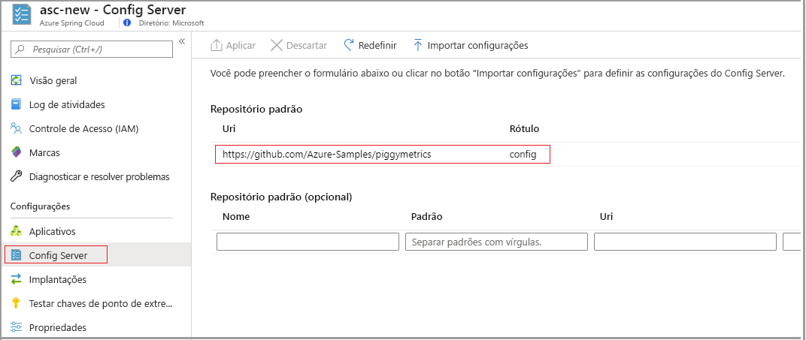
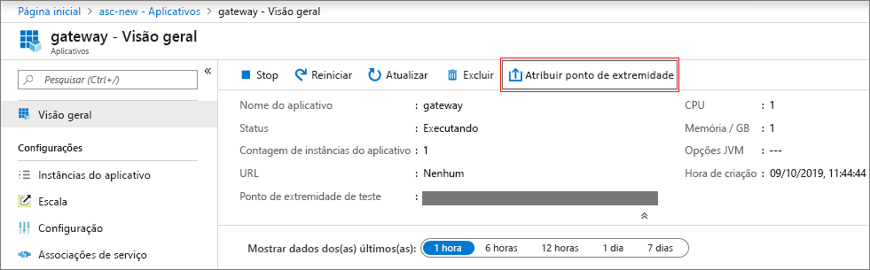
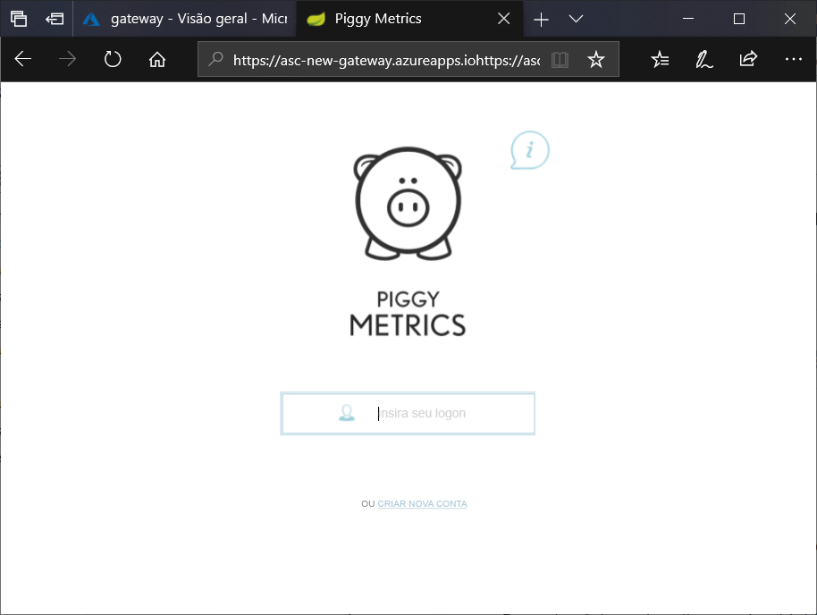

# <a name="quickstart-launch-an-azure-spring-cloud-application-using-the-azure-portal"></a>Início Rápido: Iniciar um aplicativo do Azure Spring Cloud usando o portal do Azure

O Azure Spring Cloud permite que você execute facilmente aplicativos de microsserviço baseados no Spring Cloud no Azure.

Este início rápido mostra como implantar um aplicativo do Spring Cloud existente no Azure.  É possível encontrar o código do aplicativo de exemplo usado neste tutorial em nosso [repositório de exemplos do GitHub](https://github.com/Azure-Samples/PiggyMetrics). Quando você tiver terminado, o aplicativo de exemplo fornecido estará acessível online e pronto para ser gerenciado usando o portal do Azure.

Seguindo este início rápido, você aprenderá a:

> [!div class="checklist"]
> * Provisionar uma instância de serviço
> * Definir um servidor de configuração para uma instância
> * Criar um aplicativo de microsserviço localmente
> * Implantar cada microsserviço
> * Atribuir um ponto de extremidade público para seu aplicativo

## <a name="prerequisites"></a>Pré-requisitos

>[!Note]
> Atualmente, o Azure Spring Cloud é oferecido como visualização pública. As ofertas de visualização pública permitem que os clientes experimentem os novos recursos antes do lançamento oficial.  Os serviços e recursos de visualização pública não são destinados ao uso em produção.  Para saber mais sobre o suporte durante as visualizações, confira as [Perguntas frequentes](https://azure.microsoft.com/support/faq/) ou envie uma [Solicitação de suporte](https://docs.microsoft.com/azure/azure-supportability/how-to-create-azure-support-request) para saber mais.

>[!TIP]
> O Azure Cloud Shell é um shell interativo grátis que pode ser usado para executar as etapas neste artigo.  Ele tem ferramentas comuns do Azure pré-instaladas, incluindo as versões mais recentes do Git, do JDK, do Maven e da CLI do Azure. Se você fez logon na assinatura do Azure, inicie o [Azure Cloud Shell](https://shell.azure.com) em shell.azure.com.  Você pode saber mais sobre o Azure Cloud Shell [lendo nossa documentação](../cloud-shell/overview.md)

Para concluir este guia de início rápido:

1. [Instalar o Git](https://git-scm.com/)
2. [Instalar o JDK 8](https://docs.microsoft.com/java/azure/jdk/?view=azure-java-stable)
3. [Instalar o Maven 3.0 ou posterior](https://maven.apache.org/download.cgi)
4. [Instalar a CLI do Azure versão 2.0.67 ou posterior](https://docs.microsoft.com/cli/azure/install-azure-cli?view=azure-cli-latest)
5. [Inscrever-se em uma assinatura do Azure](https://azure.microsoft.com/free/)

## <a name="install-the-azure-cli-extension"></a>Instalar a extensão da CLI do Azure

Instalar a extensão do Azure Spring Cloud para a CLI do Azure usando o seguinte comando

```Azure CLI
az extension add --name spring-cloud
```

## <a name="provision-a-service-instance-on-the-azure-portal"></a>Provisionar uma instância de serviço no portal do Azure

1. Em um navegador da Web, abra [este link para o Azure Spring Cloud no portal do Azure](https://ms.portal.azure.com/#create/Microsoft.AppPlatform).

1. Selecione **Azure Spring Cloud** para ir para a página de visão geral. Selecione o botão **Criar** para começar.

1. Preencha o formulário, considerando as seguintes diretrizes:
    - Nome do Serviço: especifique o nome da instância de serviço.  O nome deve ter entre 4 e 32 caracteres e pode conter apenas letras minúsculas, números e hifens.  O primeiro caractere do nome do serviço deve ser uma letra e o último caractere deve ser uma letra ou um número.
    - Assinatura: selecione a assinatura da qual você deseja que este recurso seja cobrado.  Verifique se essa assinatura foi adicionada à nossa lista de permissões do Azure Spring Cloud.
    - Grupo de recursos: a criação de grupos de recursos para novos recursos é uma melhor prática.
    - Localização: selecione a localização de sua instância de serviço. No momento, os locais com suporte incluem o Leste dos EUA, Oeste dos EUA 2, Oeste da Europa e Sudeste Asiático.
    
Leva cerca de 5 minutos para o serviço ser implantado.  Depois de implantada, a página **Visão Geral** da instância de serviço será exibida.

## <a name="set-up-your-configuration-server"></a>Definir seu servidor de configuração

1. Acesse a página **Visão Geral** do serviço e selecione o **Servidor de Configuração**.

1. Na seção **Repositório padrão**, defina **URI** como "https\://github.com/Azure-Samples/piggymetrics", defina **RÓTULO** como "config" e selecione **Aplicar** para salvar as alterações.

    

## <a name="build-and-deploy-microservice-applications"></a>Compilar e implantar aplicativos de microsserviço

1. Abra um [Azure Cloudshell](https://shell.azure.com) e clone o repositório do aplicativo de exemplo em seu computador local.  Aqui, primeiro criamos um diretório temporário chamado `source-code`, antes de clonar o aplicativo.

    ```azurecli
    mkdir source-code
    cd source-code
    git clone https://github.com/Azure-Samples/piggymetrics
    ```

1. Crie o pacote clonado.

    ```azurecli
    cd piggymetrics
    mvn clean package -DskipTests
    ```

1. Faça logon na CLI do Azure e defina sua assinatura ativa.

    ```azurecli
    # Login to Azure CLI
    az login

    # List all subscriptions
    az account list -o table

    # Set active subscription
    az account set --subscription <target subscription ID>
    ```

1. Atribua nomes ao seu grupo de recursos e ao seu serviço. Certifique-se de substituir os espaços reservados abaixo pelo nome do grupo de recursos e pelo nome do serviço que você provisionou anteriormente neste tutorial.

    ```azurecli
    az configure --defaults group=<resource group name>
    az configure --defaults spring-cloud=<service instance name>
    ```

1. Crie o aplicativo `gateway` e implante o arquivo JAR.

    ```azurecli
    az spring-cloud app create -n gateway
    az spring-cloud app deploy -n gateway --jar-path ./gateway/target/gateway.jar
    ```

1. Seguindo o mesmo padrão, crie os aplicativos `account-service` e `auth-service` e implante seus arquivos JAR.

    ```azurecli
    az spring-cloud app create -n account-service
    az spring-cloud app deploy -n account-service --jar-path ./account-service/target/account-service.jar
    az spring-cloud app create -n auth-service
    az spring-cloud app deploy -n auth-service --jar-path ./auth-service/target/auth-service.jar
    ```

1. São necessários alguns minutos para concluir a implantação dos aplicativos. Para confirmar que eles foram implantados, acesse a folha **Aplicativos** no portal do Azure. Você deverá ver uma linha de cada um dos três aplicativos.

## <a name="assign-a-public-endpoint-to-gateway"></a>Atribuir um ponto de extremidade público ao gateway

1. Abra a guia **Aplicativos** no menu à esquerda.

1. Selecione o aplicativo `gateway` para mostrar a página **Visão geral**.

1. Selecione **Atribuir Domínio** para atribuir um ponto de extremidade público ao gateway. Isso pode demorar alguns minutos.

    

1. Insira o ponto de extremidade público atribuído (rotulado **URL**) em seu navegador para exibir o aplicativo em execução.

    


## <a name="next-steps"></a>Próximas etapas

Neste guia de início rápido, você aprendeu a:

> [!div class="checklist"]
> * Provisionar uma instância de serviço
> * Definir um servidor de configuração para uma instância
> * Criar um aplicativo de microsserviço localmente
> * Implantar cada microsserviço
> * Atribuir um ponto de extremidade público para seu gateway de aplicativo

> [!div class="nextstepaction"]
> [Prepare seu aplicativo Azure Spring Cloud para implantação](spring-cloud-tutorial-prepare-app-deployment.md)
