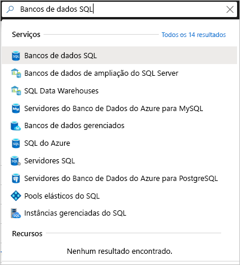
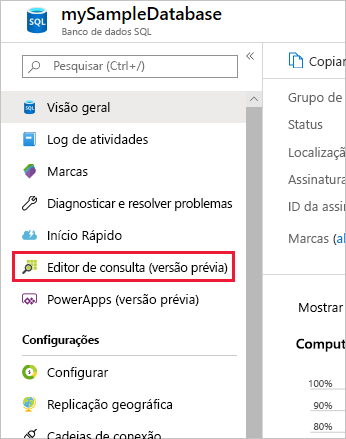
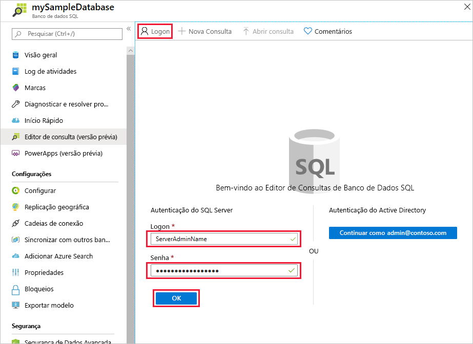
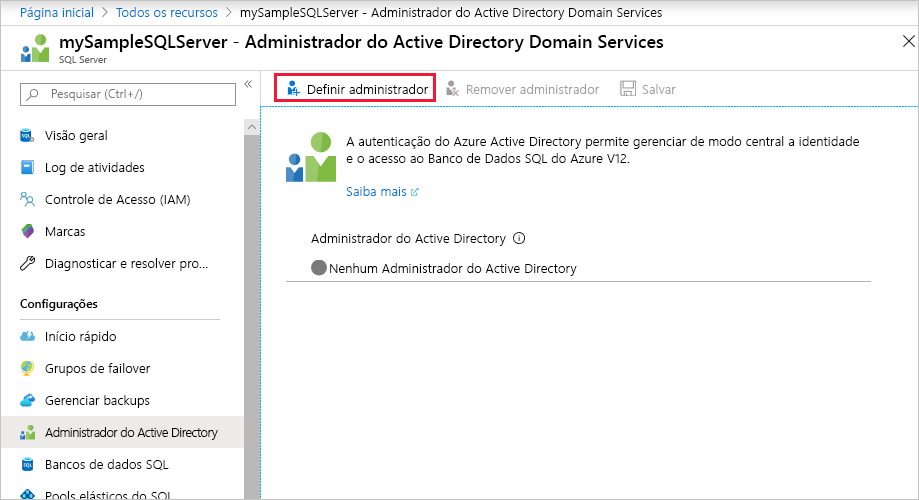
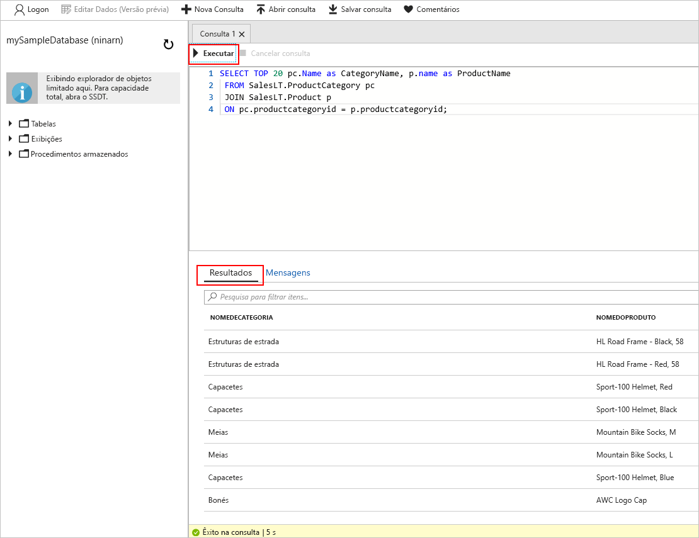

# <a name="quickstart-use-the-azure-portals-sql-query-editor-to-connect-and-query-data"></a>Início Rápido: Use o editor de consultas SQL do portal do Azure para se conectar e consultar dados

O editor de consultas SQL é uma ferramenta de navegador do portal do Azure que fornece uma maneira fácil de executar consultas SQL em seu Banco de Dados SQL do Azure ou SQL Data Warehouse do Azure. Neste guia rápido, você usará o editor de consultas para se conectar a um Banco de Dados SQL e executar instruções Transact-SQL para consultar, inserir, atualizar e excluir dados.

## <a name="prerequisites"></a>Pré-requisitos

Para concluir este tutorial, você precisará:

- Um banco de dados SQL do Azure. Você pode usar um destes guias de início rápido para criar e, em seguida, configurar um banco de dados no Banco de Dados SQL do Azure:

  || Banco de dados individual |
  |:--- |:--- |
  | Criar| [Portal](sql-database-single-database-get-started.md) |
  || [CLI](scripts/sql-database-create-and-configure-database-cli.md) |
  || [PowerShell](scripts/sql-database-create-and-configure-database-powershell.md) |
  | Configurar | [Regra de firewall de IP no nível do servidor](sql-database-server-level-firewall-rule.md)|
  |||

> [!NOTE]
> O editor de consultas usa as portas 443 e 1443 para se comunicar.  Verifique se que você habilitou o tráfego HTTPS de saída nessas portas. Você também precisará adicionar o endereço IP de saída para regras de firewall permitido do servidor para acessar seus bancos de dados e data warehouses.

## <a name="sign-in-the-azure-portal"></a>Entre no Portal do Azure

Entre no [Portal do Azure](https://portal.azure.com/).

## <a name="connect-using-sql-authentication"></a>Conectar-se usando a autenticação do SQL

1. Vá para o portal do Azure a fim de se conectar a um banco de dados SQL. Pesquise e selecione **bancos de dados SQL**.

    

2. Selecione o seu banco de dados SQL.

    

3. No menu **Banco de dados SQL**, selecione **Editor de consultas (versão prévia)** .

    

4. Na página **Logon**, no rótulo **Autenticação do SQL Server**, insira a ID e a **Senha** de **Logon** da conta de administrador do servidor usada para criar o banco de dados. Depois, selecione **OK**.

    

## <a name="connect-using-azure-active-directory"></a>Conectar-se usando o Azure Active Directory

Configurar um administrador do Azure AD (Azure Active Directory) permite que você use uma única identidade para entrar no portal do Azure e no seu banco de dados SQL. Siga as etapas abaixo para configurar um administrador do Azure AD para o SQL Server.

> [!NOTE]
> * Ainda não há suporte para contas de email (por exemplo, outlook.com, gmail.com, yahoo.com e assim por diante) serem usadas como administradores do Azure AD. Escolha um usuário criado nativamente no Azure AD ou federado no Azure AD.
> * A conexão do administrador do Azure AD não funciona com contas que têm a autenticação de dois fatores habilitada.

1. No menu do portal do Azure ou na página **Início**, selecione **Todos os recursos**.

2. Selecione o seu SQL Server.

3. No menu **SQL Server**, em **Configurações**, selecione **Administrador do Active Directory**.

4. Na barra de ferramentas da página de **administrador do Active Directory** do SQL Server, selecione **Definir administrador** e escolha o usuário ou o grupo como o administrador do Azure AD.

    

5. Na página **Adicionar administrador**, na caixa de pesquisa, insira um usuário ou grupo a ser localizado, selecione-o como administrador e, em seguida, escolha o botão **Selecionar**.

6. De volta à barra de ferramentas da página de **administrador do Active Directory** do SQL Server, selecione **salvar**.

7. No menu **SQL Server**, selecione **bancos de dados SQL** e, em seguida, selecione o seu banco de dados SQL.

8. No menu **Banco de dados SQL**, selecione **Editor de consultas (versão prévia)** . Na página **Logon**, no rótulo **autenticação do Active Directory**, uma mensagem será exibida informando que você foi conectado se você for um administrador do Azure AD. Em seguida, selecione o botão **Continuar como** *\<sua ID de usuário ou grupo>* .

## <a name="view-data"></a>Exibir dados

1. Depois de você estar autenticado, cole o SQL a seguir no editor de consultas para recuperar os 20 principais produtos por categoria.

   ```sql
    SELECT TOP 20 pc.Name as CategoryName, p.name as ProductName
    FROM SalesLT.ProductCategory pc
    JOIN SalesLT.Product p
    ON pc.productcategoryid = p.productcategoryid;
   ```

2. Na barra de ferramentas, selecione **Executar** e, em seguida, examine a saída no painel **Resultados**.

   

## <a name="insert-data"></a>Inserir dados

Execute a instrução Transact-SQL [INSERT](https://msdn.microsoft.com/library/ms174335.aspx) a seguir para adicionar um novo produto à tabela `SalesLT.Product`.

1. Substitua a consulta anterior por esta.

    ```sql
    INSERT INTO [SalesLT].[Product]
           ( [Name]
           , [ProductNumber]
           , [Color]
           , [ProductCategoryID]
           , [StandardCost]
           , [ListPrice]
           , [SellStartDate]
           )
    VALUES
           ('myNewProduct'
           ,123456789
           ,'NewColor'
           ,1
           ,100
           ,100
           ,GETDATE() );
   ```


2. Selecione **Executar** para inserir uma nova linha na tabela `Product`. O painel **Mensagens** exibe **Êxito na consulta: Linhas afetadas: 1**.


## <a name="update-data"></a>Atualizar dados

Execute a instrução Transact-SQL [UPDATE](https://msdn.microsoft.com/library/ms177523.aspx) a seguir para modificar o novo produto.

1. Substitua a consulta anterior por esta.

   ```sql
   UPDATE [SalesLT].[Product]
   SET [ListPrice] = 125
   WHERE Name = 'myNewProduct';
   ```

2. Selecione **Executar** para atualizar a linha especificada na tabela `Product`. O painel **Mensagens** exibe **Êxito na consulta: Linhas afetadas: 1**.

## <a name="delete-data"></a>Excluir dados

Execute a instrução Transact-SQL [DELETE](https://msdn.microsoft.com/library/ms189835.aspx) a seguir para remover o novo produto.

1. Substitua a consulta anterior por esta:

   ```sql
   DELETE FROM [SalesLT].[Product]
   WHERE Name = 'myNewProduct';
   ```

2. Selecione **Executar** para excluir a linha especificada da tabela `Product`. O painel **Mensagens** exibe **Êxito na consulta: Linhas afetadas: 1**.


## <a name="query-editor-considerations"></a>Considerações sobre o editor de consultas

Há algumas coisas que se deve saber ao trabalhar com o editor de consultas.

* O editor de consultas usa as portas 443 e 1443 para se comunicar.  Verifique se que você habilitou o tráfego HTTPS de saída nessas portas. Você também precisará adicionar o endereço IP de saída para regras de firewall permitido do servidor para acessar seus bancos de dados e data warehouses.

* Pressionar F5 atualiza a página do editor de consultas e qualquer consulta em que se esteja trabalhando é perdida.

* O editor de consultas não dá suporte à conexão com o banco de dados `master`.

* Há um tempo limite de 5 minutos para a execução da consulta.

* O editor de consultas só dá suporte à projeção cilíndrica para tipos de dados geográficos.

* Não há suporte para IntelliSense para tabelas e exibições de banco de dados. No entanto, o editor oferece suporte para preenchimento automático de nomes que já foram digitados.


## <a name="next-steps"></a>Próximas etapas

Para saber mais sobre o Transact-SQL com suporte em bancos de dados SQL do Azure, confira [Resolvendo diferenças do Transact-SQL durante a migração para o Banco de Dados SQL](sql-database-transact-sql-information.md).
