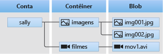

<!-- Customer intent: As a web application developer I want to interface with Azure Blob storage entirely on the client so that I can build a SPA application that is able to upload and delete files on blob storage. -->

# <a name="quickstart-manage-blobs-with-javascript-v12-sdk-in-a-browser"></a>Início Rápido: Gerenciar blobs com o SDK do JavaScript v12 em um navegador

O Armazenamento de Blobs do Azure é otimizado para armazenar grandes quantidades de dados não estruturados. Os blobs são objetos que podem conter texto ou dados binários, incluindo imagens, documentos, mídia de streaming e dados de arquivos. Neste início rápido, você aprenderá a gerenciar blobs usando o JavaScript em um navegador. Você carregará e listará os blobs e criará e excluirá contêineres.

Recursos adicionais:

* [Documentação de referência da API](/javascript/api/@azure/storage-blob)
* [Código-fonte da biblioteca](https://github.com/Azure/azure-sdk-for-js/tree/master/sdk/storage/storage-blob)
* [Pacote (npm)](https://www.npmjs.com/package/@azure/storage-blob)
* [Amostras](../common/storage-samples-javascript.md?toc=%2fazure%2fstorage%2fblobs%2ftoc.json#blob-samples)

## <a name="prerequisites"></a>Pré-requisitos

* [Uma conta do Azure com uma assinatura ativa](https://azure.microsoft.com/free/?ref=microsoft.com&utm_source=microsoft.com&utm_medium=docs&utm_campaign=visualstudio)
* [Uma conta de Armazenamento do Azure](../common/storage-account-create.md)
* [Node.js](https://nodejs.org)
* [Microsoft Visual Studio Code](https://code.visualstudio.com)
* Uma extensão do Visual Studio Code para depuração do navegador, como:
    * [Depurador para o Microsoft Edge](https://marketplace.visualstudio.com/items?itemName=msjsdiag.debugger-for-edge)
    * [Depurador para o Chrome](https://marketplace.visualstudio.com/items?itemName=msjsdiag.debugger-for-chrome)
    * [Depurador para o Firefox](https://marketplace.visualstudio.com/items?itemName=firefox-devtools.vscode-firefox-debug)


[!INCLUDE [storage-multi-protocol-access-preview](../../../includes/storage-multi-protocol-access-preview.md)]

## <a name="object-model"></a>Modelo de objeto

O Armazenamento de Blobs oferece três tipos de recursos:

* A conta de armazenamento
* Um contêiner na conta de armazenamento
* Um blob no contêiner

O diagrama a seguir mostra a relação entre esses recursos.



Neste início rápido, você usará as seguintes classes de JavaScript para interagir com esses recursos:

* [BlobServiceClient](/javascript/api/@azure/storage-blob/blobserviceclient): a classe `BlobServiceClient` permite manipular os recursos do Armazenamento do Azure e os contêineres do blob.
* [ContainerClient](/javascript/api/@azure/storage-blob/containerclient): a classe `ContainerClient` permite manipular os contêineres do Armazenamento do Azure e seus blobs.
* [BlockBlobClient](/javascript/api/@azure/storage-blob/blockblobclient): a classe `BlockBlobClient` permite manipular os blobs do Armazenamento do Azure.

## <a name="setting-up"></a>Configurando

Esta seção o orienta na preparação de um projeto para trabalhar com a biblioteca de clientes do Armazenamento de Blobs do Azure v12 para JavaScript.

### <a name="create-a-cors-rule"></a>Criar uma regra CORS

Antes de seu aplicativo Web poder acessar um Armazenamento de Blobs do cliente, a conta precisará ser configurada para habilitar o [Compartilhamento de recursos entre origens](/rest/api/storageservices/cross-origin-resource-sharing--cors--support-for-the-azure-storage-services), ou CORS.

No portal do Azure, selecione a conta de armazenamento. Para definir uma nova regra de CORS, navegue até a seção **Configurações** e selecione **CORS**. Para este início rápido, crie uma regra de CORS aberta:


A tabela a seguir descreve cada configuração de CORS e explica os valores usados para definir a regra.

|Configuração  |Valor  | Descrição |
|---------|---------|---------|
| **ORIGENS PERMITIDAS** | **\** _ | Aceita uma lista de domínios definidos como origens aceitáveis delimitada por vírgulas. Definir o valor como `_` permite o acesso de todos os domínios à conta de armazenamento. |
| **MÉTODOS PERMITIDOS** | **DELETE**, **GET**, **HEAD**, **MERGE**, **POST**, **OPTIONS** e **PUT** | Lista os verbos HTTP que podem ser executados na conta de armazenamento. Para este início rápido, selecione todas as opções disponíveis. |
| **CABEÇALHOS PERMITIDOS** | **\** _ | Define uma lista de cabeçalhos de solicitação (inclusive cabeçalhos prefixados) permitidos pela conta de armazenamento. Definir o valor como `_` permite o acesso de todos os cabeçalhos. |
| **CABEÇALHOS EXPOSTOS** | **\** _ | Lista os cabeçalhos de resposta permitidos pela conta. Definir o valor como `_` permite que a conta envie qualquer cabeçalho. |
| **IDADE MÁX.** | **86400** | O tempo máximo em segundos pelo qual o navegador armazena em cache a solicitação OPTIONS de simulação. Um valor de *86.400* permite que o cache permaneça um dia inteiro. |

Depois de preencher os campos com os valores dessa tabela, clique no botão **Salvar**.

> [!IMPORTANT]
> Verifique se as configurações que você usa na produção expõem o mínimo de acesso à conta de armazenamento necessário para manter o acesso seguro. As configurações de CORS descritas aqui são mais adequadas para um início rápido, já que elas definem uma política de segurança branda. No entanto, essas configurações não são recomendadas para um contexto no mundo real.

### <a name="create-a-shared-access-signature"></a>Criar uma assinatura de acesso compartilhado

A SAS (assinatura de acesso compartilhado) é usada pelo código em execução no navegador para autorizar solicitações para o Armazenamento de Blobs do Azure. Ao usar a SAS, o cliente pode autorizar o acesso a recursos de armazenamento sem a cadeia de conexão ou chave de acesso da conta. Para saber mais, confira [Usando SAS (Assinaturas de Acesso Compartilhado)](../common/storage-sas-overview.md).

Siga estas etapas para obter a URL SAS do serviço Blob:

1. No portal do Azure, selecione a conta de armazenamento.
2. Navegue até a seção **Configurações** e selecione **Assinatura de Acesso Compartilhado**.
3. Role para baixo e clique no botão **Gerar a cadeia de conexão e de SAS**.
4. Role para baixo e localize o campo **URL da SAS do serviço Blob**
5. Clique no botão **Copiar para a área de transferência** na extrema direita do campo **URL da SAS do serviço Blob**.
6. Salve a URL copiada em algum lugar para uso em uma etapa futura.

### <a name="add-the-azure-blob-storage-client-library"></a>Adicionar a biblioteca de clientes do Armazenamento de Blobs do Azure

No computador local, crie uma pasta chamada *azure-blobs-js-browser* e abra-a no Visual Studio Code.

Selecione **Exibir > Terminal** para abrir uma janela de console dentro do Visual Studio Code. Execute o comando a seguir do npm (Gerenciador de Pacotes do Node.js) na janela do terminal para criar um arquivo [package.json](https://docs.npmjs.com/files/package.json).

```console
npm init -y
```

O SDK do Azure é composto por vários pacotes separados. Você pode escolher quais pacotes são necessários com base nos serviços que pretende usar. Execute o comando `npm` a seguir na janela do terminal para instalar o pacote `@azure/storage-blob`.

```console
npm install --save @azure/storage-blob
```

#### <a name="bundle-the-azure-blob-storage-client-library"></a>Agrupar a biblioteca de clientes do Armazenamento de Blobs do Azure

Para usar as bibliotecas do SDK do Azure em um site, converta seu código para que ele funcione dentro do navegador. Você faz isso usando uma ferramenta chamada de empacotador. O agrupamento usa o código JavaScript escrito usando as convenções do [Node.js](https://nodejs.org) e o converte em um formato compreendido pelos navegadores. Este artigo de início rápido usa o empacotador [Parcel](https://parceljs.org/).

Instale o Parcel executando o seguinte comando `npm` na janela do terminal:

```console
npm install -g parcel-bundler
```

No Visual Studio Code, abra o arquivo *package.json* e adicione um `browserlist` entre as entradas `license` e `dependencies`. Esse `browserlist` destina-se à versão mais recente de três navegadores populares. O arquivo *package.json* completo deve ter esta aparência:

:::code language="json" source="~/azure-storage-snippets/blobs/quickstarts/JavaScript/V12/azure-blobs-js-browser/package.json" highlight="12-16":::

Salve o arquivo *package.json*.

### <a name="import-the-azure-blob-storage-client-library"></a>Importe a biblioteca de clientes do Armazenamento de Blobs do Azure

Para usar as bibliotecas do SDK do Azure dentro do JavaScript, importe o pacote `@azure/storage-blob`. Crie um arquivo no Visual Studio Code que contenha o código JavaScript a seguir.

:::code language="javascript" source="~/azure-storage-snippets/blobs/quickstarts/JavaScript/V12/azure-blobs-js-browser/index.js" id="snippet_ImportLibrary":::

Salve o arquivo como *index.js* no diretório *azure-blobs-js-browser*.

### <a name="implement-the-html-page"></a>Implementar a página HTML

Crie um arquivo no Visual Studio Code e adicione o código HTML a seguir.

:::code language="html" source="~/azure-storage-snippets/blobs/quickstarts/JavaScript/V12/azure-blobs-js-browser/index.html":::

Salve o arquivo como *index.html* na pasta *azure-blobs-js-browser*.

## <a name="code-examples"></a>Exemplos de código

O código de exemplo mostra como executar as seguintes tarefas com a biblioteca de clientes do Armazenamento de Blobs do Azure para JavaScript:

* [Declarar campos para elementos da interface do usuário](#declare-fields-for-ui-elements)
* [Adicionar informações de sua conta de armazenamento](#add-your-storage-account-info)
* [Criar objetos de cliente](#create-client-objects)
* [Criar e excluir um contêiner de armazenamento](#create-and-delete-a-storage-container)
* [Listar blobs](#list-blobs)
* [Carregar blobs](#upload-blobs)
* [Excluir blobs](#delete-blobs)

Você executará o código depois de adicionar todos os snippets ao arquivo *index.js*.

### <a name="declare-fields-for-ui-elements"></a>Declarar campos para elementos da interface do usuário

Adicione o código a seguir ao final do arquivo *index.js*.

:::code language="JavaScript" source="~/azure-storage-snippets/blobs/quickstarts/JavaScript/V12/azure-blobs-js-browser/index.js" id="snippet_DeclareVariables":::

Salve o arquivo *index.js*.

Esse código declara campos para cada elemento HTML e implementa uma função `reportStatus` para exibir a saída.

Nas seções a seguir, adicione cada novo bloco de código JavaScript após o bloco anterior.

### <a name="add-your-storage-account-info"></a>Adicionar informações de sua conta de armazenamento

Adicione o código para acessar sua conta de armazenamento. Substitua o espaço reservado pela URL da SAS do serviço Blob que você gerou anteriormente. Adicione o código a seguir ao final do arquivo *index.js*.

:::code language="javascript" source="~/azure-storage-snippets/blobs/quickstarts/JavaScript/V12/azure-blobs-js-browser/index.js" id="snippet_StorageAcctInfo":::

Salve o arquivo *index.js*.

### <a name="create-client-objects"></a>Criar objetos de cliente

Crie objetos [BlobServiceClient](/javascript/api/@azure/storage-blob/blobserviceclient) e [ContainerClient](/javascript/api/@azure/storage-blob/containerclient) para interagir com o serviço de Armazenamento de Blobs do Azure. Adicione o código a seguir ao final do arquivo *index.js*.

:::code language="javascript" source="~/azure-storage-snippets/blobs/quickstarts/JavaScript/V12/azure-blobs-js-browser/index.js" id="snippet_CreateClientObjects":::

Salve o arquivo *index.js*.

### <a name="create-and-delete-a-storage-container"></a>Criar e excluir um contêiner de armazenamento

Crie e exclua o contêiner de armazenamento clicando no botão correspondente na página da Web. Adicione o código a seguir ao final do arquivo *index.js*.

:::code language="javascript" source="~/azure-storage-snippets/blobs/quickstarts/JavaScript/V12/azure-blobs-js-browser/index.js" id="snippet_CreateDeleteContainer":::

Salve o arquivo *index.js*.

### <a name="list-blobs"></a>Listar blobs

Liste o conteúdo do contêiner de armazenamento clicando no botão **Listar arquivos**. Adicione o código a seguir ao final do arquivo *index.js*.

:::code language="javascript" source="~/azure-storage-snippets/blobs/quickstarts/JavaScript/V12/azure-blobs-js-browser/index.js" id="snippet_ListBlobs":::

Salve o arquivo *index.js*.

Esse código chama a função [ContainerClient.listBlobsFlat](/javascript/api/@azure/storage-blob/containerclient#listblobsflat-containerlistblobsoptions-) e, em seguida, usa um iterador para recuperar o nome de cada [BlobItem](/javascript/api/@azure/storage-blob/blobitem) retornado. Para cada `BlobItem`, ele atualiza a lista **Arquivos** com o valor da propriedade [nome](/javascript/api/@azure/storage-blob/blobitem#name).

### <a name="upload-blobs"></a>Carregar blobs

Carregue arquivos para o contêiner de armazenamento clicando no botão **Escolher e carregar arquivos**. Adicione o código a seguir ao final do arquivo *index.js*.

:::code language="javascript" source="~/azure-storage-snippets/blobs/quickstarts/JavaScript/V12/azure-blobs-js-browser/index.js" id="snippet_UploadBlobs":::

Salve o arquivo *index.js*.

Este código conecta o botão **Escolher e carregar arquivos** ao elemento oculto `file-input`. O evento `click` do botão aciona o evento `click` da entrada do arquivo e exibe o seletor de arquivos. Depois de escolher arquivos e fechar a caixa de diálogo, o evento `input` ocorrerá e a função `uploadFiles` será chamada. Essa função cria o objeto [BlockBlobClient](/javascript/api/@azure/storage-blob/blockblobclient), depois chama a função [uploadBrowserData](/javascript/api/@azure/storage-blob/blockblobclient#uploadbrowserdata-blob---arraybuffer---arraybufferview--blockblobparalleluploadoptions-) somente para navegador para cada arquivo escolhido. Cada chamada retorna uma `Promise`. Cada `Promise` é adicionada a uma lista para que todos os arquivos possam ser esperados de uma só vez. Dessa forma, os arquivos são carregados em paralelo.

### <a name="delete-blobs"></a>Excluir blobs

Exclua arquivos do contêiner de armazenamento clicando no botão **Excluir arquivos selecionados**. Adicione o código a seguir ao final do arquivo *index.js*.

:::code language="javascript" source="~/azure-storage-snippets/blobs/quickstarts/JavaScript/V12/azure-blobs-js-browser/index.js" id="snippet_DeleteBlobs":::

Salve o arquivo *index.js*.

Esse código chama a função [ContainerClient.deleteBlob](/javascript/api/@azure/storage-blob/containerclient#deleteblob-string--blobdeleteoptions-) para remover cada arquivo escolhido na lista. Ele chama a função `listFiles` mostrada anteriormente para atualizar o conteúdo da lista **Arquivos**.

## <a name="run-the-code"></a>Executar o código

Para executar o código dentro do depurador do Visual Studio Code, configure o arquivo *launch.json* para seu navegador.

### <a name="configure-the-debugger"></a>Configurar o depurador

Para configurar a extensão do depurador no Visual Studio Code:

1. Selecione **Executar > Adicionar Configuração**
2. Selecione **Microsoft Edge**, **Chrome** ou **Firefox**, dependendo de qual extensão você instalou anteriormente na seção [Pré-requisitos](#prerequisites).

A adição de uma nova configuração cria um arquivo *launch.json* e abre-o no editor. Modifique o arquivo *launch.json* para que o valor `url` seja `http://localhost:1234/index.html` conforme mostrado aqui:

:::code language="json" source="~/azure-storage-snippets/blobs/quickstarts/JavaScript/V12/azure-blobs-js-browser/.vscode/launch.json" highlight="11":::

Após atualizar, salve o arquivo *launch.json*. Essa configuração informa ao Visual Studio Code qual navegador abrir e qual URL carregar.

### <a name="launch-the-web-server"></a>Iniciar o servidor Web

Para iniciar o servidor Web de desenvolvimento local, selecione **Exibir > Terminal** para abrir uma janela de console dentro do Visual Studio Code, depois insira o comando a seguir.

```console
parcel index.html
```

O Parcel empacota seu código e inicia um servidor de desenvolvimento local para sua página em `http://localhost:1234/index.html`. As alterações que você fez no *index.js* serão automaticamente compiladas e refletidas no servidor de desenvolvimento sempre que você salvar o arquivo.

Se você receber uma mensagem dizendo que **a porta configurada 1234 não pôde ser usada**, poderá alterar a porta executando o comando `parcel -p <port#> index.html`. No arquivo *launch.json*, atualize a porta no caminho da URL para corresponder.

### <a name="start-debugging"></a>Iniciar a depuração

Execute a página no depurador e tenha uma ideia de como o Armazenamento de Blobs funciona. Se ocorrerem erros, o painel **Status** na página da Web exibirá a mensagem de erro recebida.

Para abrir *index.html* no navegador com o depurador do Visual Studio Code anexado, selecione **Executar > Iniciar Depuração** ou pressione F5 no Visual Studio Code.

### <a name="use-the-web-app"></a>Usar o aplicativo Web

No [portal do Azure](https://portal.azure.com), você poderá verificar os resultados das chamadas à API seguindo as etapas abaixo.

#### <a name="step-1---create-a-container"></a>Etapa 1: criar um contêiner

1. No aplicativo Web, selecione **Criar contêiner**. O status indica que um contêiner foi criado.
2. Para verificar no portal do Azure, selecione a conta de armazenamento. Em **Serviço Blob**, selecione **Contêineres**. Verifique se o novo contêiner é exibido. (Talvez seja necessário selecionar **Atualizar**.)

#### <a name="step-2---upload-a-blob-to-the-container"></a>Etapa 2: carregar um blob para o contêiner

1. No computador local, crie e salve um arquivo de teste, como *test.txt*.
2. No aplicativo Web, clique em **Selecionar e carregar arquivos**.
3. Navegue até seu arquivo de teste e selecione **Abrir**. O status indica que o arquivo foi carregado e a lista de arquivos foi recuperada.
4. No portal do Azure, selecione o nome do contêiner que você criou anteriormente. Verifique se o arquivo de teste é exibido.

#### <a name="step-3---delete-the-blob"></a>Etapa 3: excluir o blob

1. No aplicativo Web, em **Arquivos**, selecione o arquivo de teste.
2. Selecione **Excluir arquivos selecionados**. O status indica que o arquivo foi excluído e que o contêiner não contém nenhum arquivo.
3. No portal do Azure, selecione **Atualizar**. Verifique se você vê a mensagem **Nenhum blob encontrado**.

#### <a name="step-4---delete-the-container"></a>Etapa 4: excluir o contêiner

1. No aplicativo Web, selecione **Excluir contêiner**. Esse status indica que o contêiner foi excluído.
2. No portal do Azure, selecione o link **\<account-name\> | Contêineres** na parte superior esquerda do painel do portal.
3. Selecione **Atualizar**. O novo contêiner desaparece.
4. Feche o aplicativo Web.

### <a name="clean-up-resources"></a>Limpar os recursos

Clique no console do **Terminal** no Visual Studio Code e pressione CTRL + C para interromper o servidor Web.

Para limpar os recursos criados durante este início rápido, volte para o [portal do Azure](https://portal.azure.com) e exclua o grupo de recursos criado na seção [Pré-requisitos](#prerequisites).

## <a name="next-steps"></a>Próximas etapas

Neste início rápido você aprendeu a carregar, listar e excluir blobs usando JavaScript. Você também aprendeu a criar e excluir um contêiner de Armazenamento de Blobs.

Para obter tutoriais, amostras, inícios rápidos e outros tipos de documentação, acesse:

> [!div class="nextstepaction"]
> [Documentação do Azure para JavaScript](/azure/developer/javascript/)

* Para saber mais, confira a [Biblioteca de clientes do Armazenamento de Blobs do Azure para JavaScript](https://github.com/Azure/azure-sdk-for-js/blob/master/sdk/storage/storage-blob).
* Para ver aplicativos de exemplo do Armazenamento de Blobs, prossiga para [Amostras de JavaScript da biblioteca de clientes do Armazenamento de Blobs do Azure v12](https://github.com/Azure/azure-sdk-for-js/tree/master/sdk/storage/storage-blob/samples).