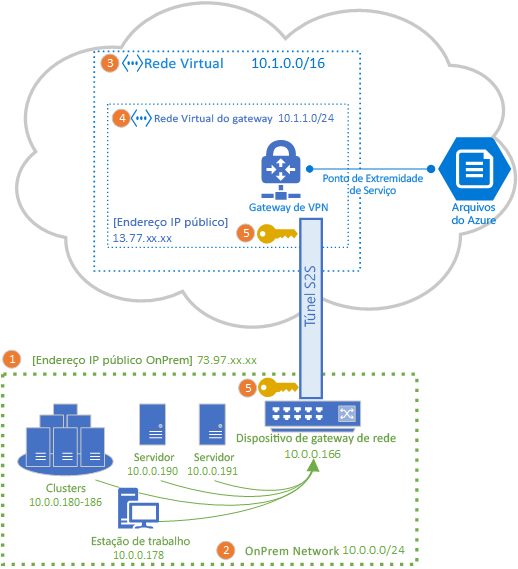
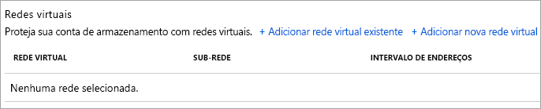

# Configurar uma VPN Site a Site para uso com os Arquivos do Azure
Você pode usar uma conexão de VPN S2S (Site a Site) para montar compartilhamentos de arquivo do Azure de sua rede local, sem precisar abrir a porta 445. Você pode configurar uma VPN Site a Site usando o [Gateway de VPN do Azure](../../vpn-gateway/vpn-gateway-about-vpngateways.md), que é um recurso do Azure que oferece serviços de VPN e é implantado em um grupo de recursos em conjunto com contas de armazenamento ou outros recursos do Azure.

Recomendamos que você leia [Visão geral da rede nos Arquivos do Azure](storage-files-networking-overview.md) antes de continuar este tutorial para ver uma discussão completa a respeito das opções de rede disponíveis para os Arquivos do Azure.

O artigo detalha as etapas de configuração de uma VPN Site a Site para montar compartilhamentos de arquivo do Azure diretamente no local. Se você deseja encaminhar o tráfego de sincronização para a Sincronização de Arquivos do Azure usando uma VPN Site a Site, confira [Definir configurações de proxy e firewall da Sincronização de Arquivos do Azure](storage-sync-files-firewall-and-proxy.md).

## Pré-requisitos
- Um compartilhamento de arquivos do Azure que você gostaria de montar no local. Os compartilhamentos de arquivo do Azure são implantados em contas de armazenamento, que são constructos de gerenciamento que representam um pool compartilhado de armazenamento no qual você pode implantar vários compartilhamentos de arquivo bem como outros recursos de armazenamento, como filas ou contêineres de blobs. Você pode aprender mais sobre como implantar compartilhamentos de arquivo do Azure e contas de armazenamento em [Criar um compartilhamento de arquivo do Azure](storage-how-to-create-file-share.md).

- Um ponto de extremidade privado para a conta de armazenamento contendo o compartilhamento de arquivo do Azure que você deseja montar localmente. Para saber mais sobre como criar um ponto de extremidade privado, consulte [Configuração de pontos de extremidades de rede do serviço Arquivos do Azure](storage-files-networking-endpoints.md?tabs=azure-portal). 

- Um dispositivo de rede ou servidor em seu datacenter local compatível com o Gateway de VPN do Azure. Os Arquivos do Azure são independentes do dispositivo de rede local escolhido, mas o Gateway de VPN do Azure mantém uma [lista de dispositivos testados](../../vpn-gateway/vpn-gateway-about-vpn-devices.md). Dispositivos de rede diferentes oferecem recursos, características de desempenho e funcionalidades de gerenciamento diferentes, portanto, considere isso ao selecionar um dispositivo de rede.

    Se você não tiver um dispositivo de rede, o Windows Server tem uma Função de Servidor interna, o RRAS (Roteamento e Acesso Remoto), que poderá ser usada como o dispositivo de rede local. Para saber mais sobre como configurar o Roteamento e Acesso Remoto no Windows Server, consulte [Gateway de RAS](/windows-server/remote/remote-access/ras-gateway/ras-gateway).

## Adicionar conta de armazenamento à VNet
Na portal do Azure, navegue até a conta de armazenamento que contém o compartilhamento de arquivo do Azure que você deseja montar no local. No sumário da conta de armazenamento, selecione a entrada **Firewalls e redes virtuais**. A menos que você tenha adicionado uma rede virtual à sua conta de armazenamento quando ela foi criada, o painel resultante deverá ter o botão de opção **Permitir acesso de** para **Todas as redes** selecionado.

Para adicionar sua conta de armazenamento à rede virtual desejada, selecione **Redes selecionadas**. No subtítulo **Redes virtuais** , clique em **+ Adicionar rede virtual existente** ou **+ Adicionar nova rede virtual** , dependendo do estado desejado. A criação de uma nova rede virtual resultará na criação de um novo recurso do Azure. O recurso de VNet novo ou existente não precisa estar no mesmo grupo de recursos ou assinatura que a conta de armazenamento. No entanto, ele precisa estar na mesma região que a conta de armazenamento, e o grupo de recursos e a assinatura em que você implantar a VNet deverão corresponder àqueles em que você implantará o Gateway de VPN. 

Se você adicionar uma rede virtual existente, será solicitado que selecione uma ou mais sub-redes da rede virtual à qual a conta de armazenamento deverá ser adicionada. Se selecionar uma nova rede virtual, você criará uma sub-rede como parte da criação da rede virtual e posteriormente poderá adicionar mais usando o recurso do Azure resultante para a rede virtual.

Se você não tiver adicionado uma conta de armazenamento à sua assinatura, o ponto de extremidade do serviço Microsoft.Storage precisará ser adicionado à rede virtual. Isso pode levar algum tempo, e até que a operação seja concluída, você não poderá acessar os compartilhamentos de arquivos do Azure dentro dessa conta de armazenamento, nem mesmo usando a conexão VPN. 

## Implantar um Gateway de VPN do Azure
No sumário do portal do Azure, selecione **Criar um novo recurso** e pesquise *Gateway de rede virtual*. O gateway de rede virtual deve estar na mesma assinatura, região do Azure e grupo de recursos que a rede virtual implantada na etapa anterior (observe que o grupo de recursos é selecionado automaticamente quando a rede virtual é escolhida). 

Para implantação de um Gateway de VPN do Azure, você deve preencher os seguintes campos:

- **Name** : o nome do recurso do Azure para o Gateway de VPN. Esse nome pode ser qualquer nome que você acha útil para seu gerenciamento.
- **Região** : a região na qual o Gateway de VPN será implantado.
- **Tipo de gateway** : para implantar uma VPN Site a Site, você precisa selecionar **VPN**.
- **Tipo de VPN** : você pode escolher *Baseado em Rota* * ou **Baseado em Política** , dependendo de seu dispositivo VPN. VPNs baseadas em rota dão suporte a IKEv2, enquanto VPNs baseadas em política dão suporte apenas a IKEv1. Para saber mais sobre os dois tipos de gateways de VPN, confira [Sobre gateways VPN com base em políticas e rotas](../../vpn-gateway/vpn-gateway-connect-multiple-policybased-rm-ps.md#about)
- **SKU** : a SKU controla o número de túneis de Site a Site permitidos e o desempenho desejado da VPN. Para selecionar o SKU apropriado para seu caso de uso, consulte a lista [SKU do Gateway](../../vpn-gateway/vpn-gateway-about-vpngateways.md#gwsku). A SKU do Gateway de VPN pode ser alterada posteriormente se necessário.
- **Rede virtual** : a rede virtual que você criou na etapa anterior.
- **Endereço IP público** : o endereço IP do Gateway de VPN que será exposto à Internet. Provavelmente, você precisará criar um novo endereço IP. No entanto, você também poderá usar um endereço IP não utilizado existente se isso for apropriado. Se você optar por **Criar novo** , um novo recurso do Azure de endereço IP será criado no mesmo grupo de recursos que o Gateway de VPN, e o **nome do endereço IP público** será o nome do endereço IP recém-criado. Se selecionar **Usar existente** , você deverá selecionar o endereço IP não utilizado existente.
- **Habilitar o modo ativo-ativo** : selecione **Habilitado** apenas se você estiver criando uma configuração de gateway ativa-ativa; caso contrário, deixe **Desabilitado** selecionado. Para saber mais sobre o modo ativo-ativo, confira [Conectividade Altamente Disponível entre os Locais e VNet com VNet](../../vpn-gateway/vpn-gateway-highlyavailable.md).
- **Configurar BGP ASN** : selecione **Habilitado** apenas se sua configuração exigir essa configuração especificamente. Para saber mais sobre essa configuração, confira [Sobre o BGP com o Gateway de VPN do Azure](../../vpn-gateway/vpn-gateway-bgp-overview.md).

Selecione **Examinar + criar** para criar o Gateway de VPN. Um Gateway de VPN pode levar até 45 minutos para ser criado e implantado totalmente.

### Criar um gateway de rede local para seu gateway local 
Um gateway de rede local é um recurso do Azure que representa seu dispositivo de rede local. No sumário do portal do Azure, selecione **Criar um novo recurso** e pesquise *Gateway de rede local*. O gateway de rede local é um recurso do Azure que será implantado em conjunto com sua conta de armazenamento, rede virtual e Gateway de VPN, mas não precisa estar no mesmo grupo de recursos ou assinatura que a conta de armazenamento. 

Para implantação do recurso de gateway de rede local, você deve preencher os seguintes campos:

- **Name** : o nome do recurso do Azure para o gateway de rede local. Esse nome pode ser qualquer nome que você acha útil para seu gerenciamento.
- **Endereço IP** : o endereço IP público do seu gateway local.
- **Espaço de endereço** : os intervalos de endereços para a rede que é representada por esse gateway de rede local. Você pode adicionar vários intervalos de endereços, mas verifique se os intervalos que você especificar aqui não se sobrepõem aos intervalos de outras redes com que você deseja se conectar. 
- **Configurar as definições de BGP ASN** : defina configurações de BGP somente se sua configuração exigir. Para saber mais sobre essa configuração, confira [Sobre o BGP com o Gateway de VPN do Azure](../../vpn-gateway/vpn-gateway-bgp-overview.md).
- **Assinatura** : a assinatura desejada. Ela não precisa corresponder à assinatura usada para o Gateway de VPN ou a conta de armazenamento.
- **Grupo de recursos** : o grupo de recursos desejado. Ele não precisa corresponder ao grupo de recursos usado para o Gateway de VPN ou a conta de armazenamento.
- **Localização** : a região do Azure em que o recurso de gateway de rede local deve ser criado. Ela deve corresponder à região que você selecionou para o Gateway de VPN e a conta de armazenamento.

Selecione **Criar** para criar o gateway de rede local.  

## Configurar um dispositivo de rede local
As etapas específicas para configurar seu dispositivo de rede local dependem do dispositivo de rede selecionado pela sua organização. Dependendo do dispositivo que sua organização escolheu, a [lista de dispositivos testados](../../vpn-gateway/vpn-gateway-about-vpn-devices.md) pode ter um link para as instruções do fornecedor do dispositivo para configuração com o Gateway de VPN do Azure.

## Criar a conexão Site a Site
Para concluir a implantação de uma VPN S2S, você precisa criar uma conexão entre o dispositivo de rede local (representado pelo recurso de gateway de rede local) e o Gateway de VPN. Para fazer isso, navegue até o Gateway de VPN que você criou acima. No sumário do Gateway de VPN, selecione **Conexões** e clique em **Adicionar**. O painel **Adicionar conexão** resultante exige os seguintes campos:

- **Name** : o nome da conexão. Um Gateway de VPN pode hospedar várias conexões, portanto, escolha um nome útil para seu gerenciamento, que diferenciará essa conexão específica.
- **Tipo de conexão** : como essa é uma conexão site a site, selecione **Site a Site (IPSec)** na lista suspensa.
- **Gateway de rede virtual** : este campo é selecionado automaticamente para o Gateway de VPN com que você está fazendo a conexão e não pode ser alterado.
- **Gateway de rede local** : é o gateway de rede local que você deseja conectar ao seu Gateway de VPN. O painel de seleção resultante deve ter o nome do gateway de rede local que você criou acima.
- **Chave compartilhada (PSK)** : uma mistura de letras e números, usada para estabelecer a criptografia para a conexão. A mesma chave compartilhada deve ser usada tanto na rede virtual quanto nos gateways de rede local. Se o seu dispositivo de gateway não fornecer um, você poderá criar um aqui e fornecê-lo ao seu dispositivo.

Selecione **OK** para criar a conexão. Você pode verificar se a conexão foi criada com êxito na página **Conexões**.

## Montar o compartilhamento de arquivo do Azure 
A etapa final da configuração de uma VPN S2S é verificar se ela funciona para os Arquivos do Azure. Você pode fazer isso montando o compartilhamento de arquivo do Azure localmente com o sistema operacional de sua preferência. Consulte as instruções de montagem segundo o sistema operacional aqui:

- [Windows](storage-how-to-use-files-windows.md)
- [macOS](storage-how-to-use-files-mac.md)
- [Linux](storage-how-to-use-files-linux.md)

## Confira também
- [Visão geral da rede dos Arquivos do Azure](storage-files-networking-overview.md)
- [Configurar uma VPN P2S (ponto a site) no Windows para uso com os Arquivos do Azure](storage-files-configure-p2s-vpn-windows.md)
- [Configurar uma VPN P2S (Ponto a Site) no Linux para usar com os Arquivos do Azure](storage-files-configure-p2s-vpn-linux.md)