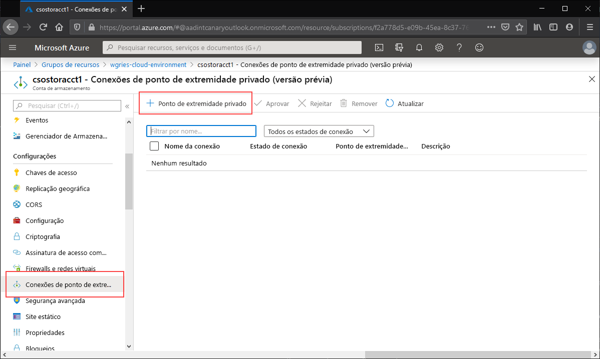
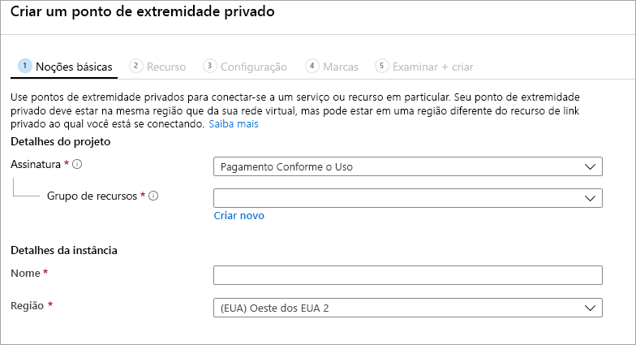
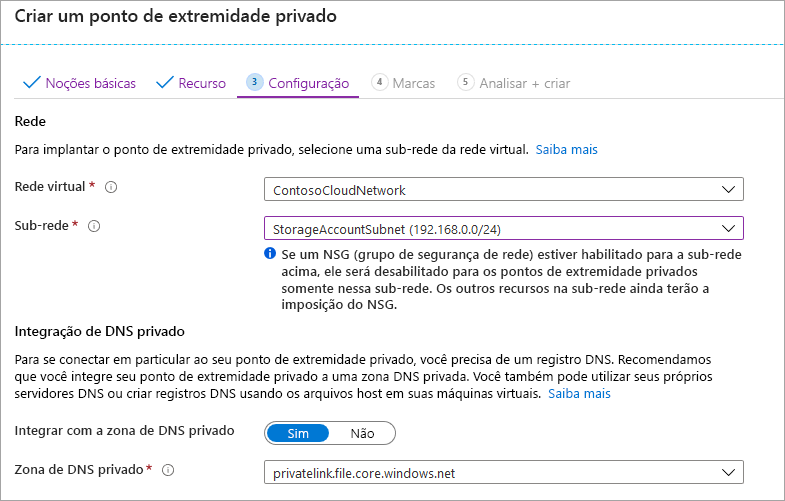
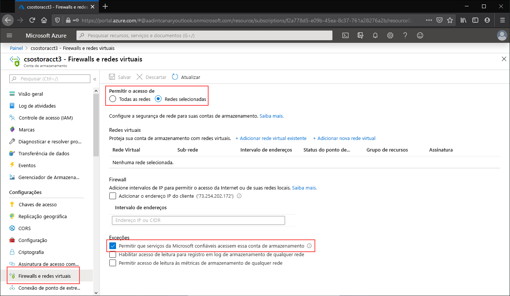
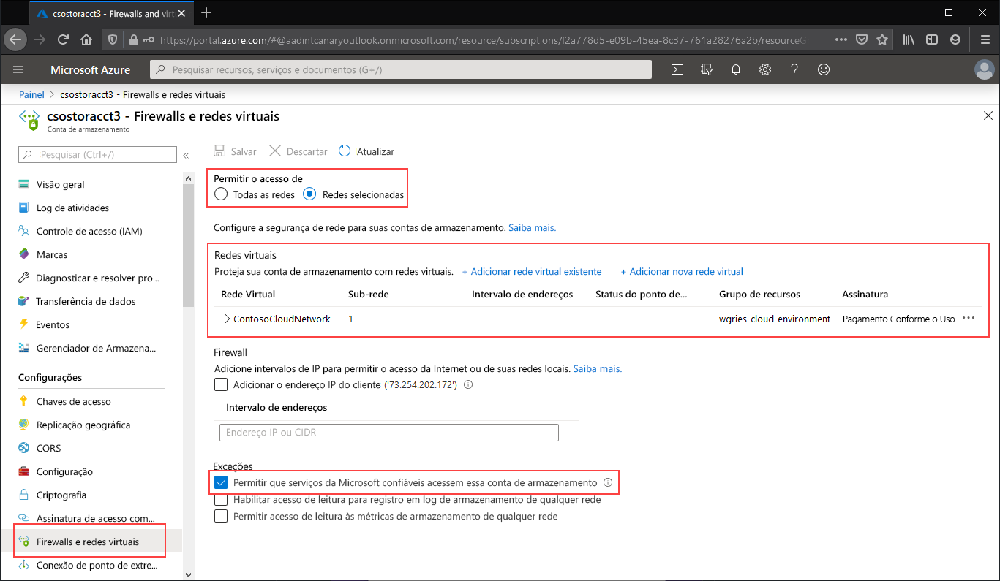

# <a name="configuring-azure-files-network-endpoints"></a>Configurar pontos de extremidade de rede dos Arquivos do Azure
Os Arquivos do Azure fornecem dois tipos principais de pontos de extremidade para acessar compartilhamentos de arquivos do Azure: 
- Pontos de extremidade públicos, que têm um endereço IP público e podem ser acessados de qualquer lugar do mundo.
- Pontos de extremidade privados, que existem em uma rede virtual e têm um endereço IP privado dentro do espaço de endereço dessa rede virtual.

Pontos de extremidade públicos e privados existem na conta de armazenamento do Azure. Uma conta de armazenamento é um constructo de gerenciamento que representa um pool compartilhado de armazenamento no qual você pode implantar vários compartilhamentos de arquivos bem como outros recursos de armazenamento, como filas ou contêineres de blob.

Este artigo se concentra em como configurar os pontos de extremidade de uma conta de armazenamento para acessar o compartilhamento de arquivos do Azure diretamente. A maior parte dos detalhes fornecidos neste documento também se aplica a como a Sincronização de Arquivos do Azure interopera com pontos de extremidade públicos e privados para a conta de armazenamento. No entanto, para saber mais sobre as considerações de rede para uma implantação da Sincronização de Arquivos do Azure, confira [Configurações de proxy e firewall da Sincronização de Arquivos do Azure](storage-sync-files-firewall-and-proxy.md).

É recomendável ler as [Considerações de rede dos Arquivos do Azure](storage-files-networking-overview.md) antes de ler este guia de instruções.

## <a name="prerequisites"></a>Pré-requisitos
- Este artigo pressupõe que você já tenha criado uma assinatura do Azure. Se você ainda não tiver uma assinatura, crie uma [conta gratuita](https://azure.microsoft.com/free/?WT.mc_id=A261C142F) antes de começar.
- Este artigo pressupõe que você já tenha criado um compartilhamento de arquivo do Azure em uma conta de armazenamento à qual deseja se conectar do local. Para saber como criar um compartilhamento de arquivo do Azure, confira [Criar um compartilhamento de arquivo do Azure](storage-how-to-create-file-share.md).
- Se pretende usar o Azure PowerShell, [instale a versão mais recente](https://docs.microsoft.com/powershell/azure/install-az-ps).
- Se pretende usar a CLI do Azure, [instale a versão mais recente](https://docs.microsoft.com/cli/azure/install-azure-cli?view=azure-cli-latest).

## <a name="create-a-private-endpoint"></a>Criar um ponto de extremidade privado
A criação de um ponto de extremidade privado para sua conta de armazenamento resultará na implantação dos seguintes recursos do Azure:

- **Um ponto de extremidade privado**: um recurso do Azure que representa o ponto de extremidade privado da conta de armazenamento. Considere-o como um recurso que conecta uma conta de armazenamento e uma interface de rede.
- **Uma NIC (adaptador de rede)** : o adaptador de rede que mantém um endereço IP privado dentro da rede virtual/sub-rede especificada. É exatamente o mesmo recurso que é implantado quando você implanta uma máquina virtual. No entanto, em vez de ser atribuído a uma VM, ele pertence ao ponto de extremidade privado.
- **Uma zona DNS privada**: se você nunca tiver implantado um ponto de extremidade privado para essa rede virtual, uma nova zona DNS privada será implantada em sua rede virtual. Um registro DNS A também será criado para a conta de armazenamento nesta zona DNS. Se você já tiver implantado um ponto de extremidade privado nessa rede virtual, um novo registro A para a conta de armazenamento será adicionado à zona DNS existente. A implantação da zona DNS é opcional, mas altamente recomendada e necessária se você estiver montando os compartilhamentos de arquivo do Azure com uma entidade de serviço do AD ou usando a API FileREST.

> [!Note]  
> Este artigo usa o sufixo DNS da conta de armazenamento para as regiões Públicas do Azure, `core.windows.net`. Esse comentário também se aplica a nuvens soberanas do Azure, como a nuvem do Governo dos EUA para Azure e a nuvem do Azure China – só substitua os sufixos apropriados para seu ambiente. 

# <a name="portal"></a>[Portal](#tab/azure-portal)
Navegue até a conta de armazenamento para a qual gostaria de criar o ponto de extremidade privado. Na sumário da conta de armazenamento, selecione **Conexões de ponto de extremidade privado** e, em seguida, **+ Ponto de extremidade privado** para criar um ponto de extremidade privado. 



O assistente resultante tem várias páginas a serem preenchidas.

Na folha **Básico**, selecione o grupo de recursos, o nome e a região desejados para o ponto de extremidade privado. Essas configurações podem ter o valor que você quiser, elas não precisam corresponder à conta de armazenamento, embora seja necessário criar o ponto de extremidade privado na mesma região que a rede virtual na qual você deseja criá-lo.



Na folha **Recurso**, selecione o botão de opção para **Conectar-se a um recurso do Azure em meu diretório**. Em **Tipo de recurso**, selecione **Microsoft.Storage/storageAccounts**. O campo **Recurso** é a conta de armazenamento com o compartilhamento de arquivo do Azure ao qual você deseja se conectar. O sub-recurso de destino é **arquivo**, uma vez que se trata dos Arquivos do Azure.

A folha **Configuração** permite que você selecione a rede virtual específica e a sub-rede à qual deseja adicionar o ponto de extremidade privado. Selecione a rede virtual criada acima. Você precisa selecionar uma sub-rede diferente daquela à qual adicionou o ponto de extremidade de serviço acima. A folha Configuração também contém as informações para criar/atualizar a zona DNS privada. Recomendamos usar a zona `privatelink.file.core.windows.net` padrão.



Clique em **Examinar + Criar** para criar o ponto de extremidade privado. 

Se tiver uma máquina virtual dentro de sua rede virtual ou se tiver configurado o encaminhamento de DNS conforme descrito [aqui](storage-files-networking-dns.md), você poderá testar se o ponto de extremidade privado foi instalado corretamente executando os seguintes comandos do PowerShell, na linha de comando ou no terminal (funciona para Windows, Linux e macOS). Substitua `<storage-account-name>` pelo nome da conta de armazenamento apropriada:

```
nslookup <storage-account-name>.file.core.windows.net
```

Se tudo tiver funcionado corretamente, você deverá ver a seguinte saída, em que `192.168.0.5` é o endereço IP privado do ponto de extremidade privado em sua rede virtual (saída mostrada para o Windows):

```Output
Server:  UnKnown
Address:  10.2.4.4

Non-authoritative answer:
Name:    storageaccount.privatelink.file.core.windows.net
Address:  192.168.0.5
Aliases:  storageaccount.file.core.windows.net
```

# <a name="powershell"></a>[PowerShell](#tab/azure-powershell)
Para criar um ponto de extremidade privado para sua conta de armazenamento, primeiro você precisa obter uma referência à sua conta de armazenamento e à sub-rede da rede virtual à qual deseja adicionar o ponto de extremidade privado. Substitua `<storage-account-resource-group-name>`, `<storage-account-name>`, `<vnet-resource-group-name>`, `<vnet-name>` e `<vnet-subnet-name>` abaixo:

```PowerShell
$storageAccountResourceGroupName = "<storage-account-resource-group-name>"
$storageAccountName = "<storage-account-name>"
$virtualNetworkResourceGroupName = "<vnet-resource-group-name>"
$virtualNetworkName = "<vnet-name>"
$subnetName = "<vnet-subnet-name>"

# Get storage account reference, and throw error if it doesn't exist
$storageAccount = Get-AzStorageAccount `
        -ResourceGroupName $storageAccountResourceGroupName `
        -Name $storageAccountName `
        -ErrorAction SilentlyContinue

if ($null -eq $storageAccount) {
    $errorMessage = "Storage account $storageAccountName not found "
    $errorMessage += "in resource group $storageAccountResourceGroupName."
    Write-Error -Message $errorMessage -ErrorAction Stop
}

# Get virtual network reference, and throw error if it doesn't exist
$virtualNetwork = Get-AzVirtualNetwork `
        -ResourceGroupName $virtualNetworkResourceGroupName `
        -Name $virtualNetworkName `
        -ErrorAction SilentlyContinue

if ($null -eq $virtualNetwork) {
    $errorMessage = "Virtual network $virtualNetworkName not found "
    $errorMessage += "in resource group $virtualNetworkResourceGroupName."
    Write-Error -Message $errorMessage -ErrorAction Stop
}

# Get reference to virtual network subnet, and throw error if it doesn't exist
$subnet = $virtualNetwork | `
    Select-Object -ExpandProperty Subnets | `
    Where-Object { $_.Name -eq $subnetName }

if ($null -eq $subnet) {
    Write-Error `
            -Message "Subnet $subnetName not found in virtual network $virtualNetworkName." `
            -ErrorAction Stop
}
```

Para criar um ponto de extremidade privado, você precisa criar uma conexão de serviço de link privado com a conta de armazenamento. A conexão do serviço de link privado é uma entrada para a criação do ponto de extremidade privado. 

```PowerShell
# Disable private endpoint network policies
$subnet.PrivateEndpointNetworkPolicies = "Disabled"
$virtualNetwork | Set-AzVirtualNetwork | Out-Null

# Create a private link service connection to the storage account.
$privateEndpointConnection = New-AzPrivateLinkServiceConnection `
        -Name "$storageAccountName-Connection" `
        -PrivateLinkServiceId $storageAccount.Id `
        -GroupId "file"

# Create a new private endpoint.
$privateEndpoint = New-AzPrivateEndpoint `
        -ResourceGroupName $storageAccountResourceGroupName `
        -Name "$storageAccountName-PrivateEndpoint" `
        -Location $virtualNetwork.Location `
        -Subnet $subnet `
        -PrivateLinkServiceConnection $privateEndpointConnection `
        -ErrorAction Stop
```

A criação de uma zona DNS privada do Azure permite que o nome original da conta de armazenamento, como `storageaccount.file.core.windows.net`, seja resolvido para o IP privado dentro da rede virtual. Embora seja opcional do ponto de vista da criação de um ponto de extremidade privado, ela é explicitamente necessária para montar o compartilhamento de arquivo do Azure usando uma entidade de usuário do AD ou acessando pela API REST.  

```PowerShell
# Get the desired storage account suffix (core.windows.net for public cloud).
# This is done like this so this script will seamlessly work for non-public Azure.
$storageAccountSuffix = Get-AzContext | `
    Select-Object -ExpandProperty Environment | `
    Select-Object -ExpandProperty StorageEndpointSuffix

# For public cloud, this will generate the following DNS suffix:
# privatelink.file.core.windows.net.
$dnsZoneName = "privatelink.file.$storageAccountSuffix"

# Find a DNS zone matching desired name attached to this virtual network.
$dnsZone = Get-AzPrivateDnsZone | `
    Where-Object { $_.Name -eq $dnsZoneName } | `
    Where-Object {
        $privateDnsLink = Get-AzPrivateDnsVirtualNetworkLink `
                -ResourceGroupName $_.ResourceGroupName `
                -ZoneName $_.Name `
                -ErrorAction SilentlyContinue
        
        $privateDnsLink.VirtualNetworkId -eq $virtualNetwork.Id
    }

if ($null -eq $dnsZone) {
    # No matching DNS zone attached to virtual network, so create new one.
    $dnsZone = New-AzPrivateDnsZone `
            -ResourceGroupName $virtualNetworkResourceGroupName `
            -Name $dnsZoneName `
            -ErrorAction Stop

    $privateDnsLink = New-AzPrivateDnsVirtualNetworkLink `
            -ResourceGroupName $virtualNetworkResourceGroupName `
            -ZoneName $dnsZoneName `
            -Name "$virtualNetworkName-DnsLink" `
            -VirtualNetworkId $virtualNetwork.Id `
            -ErrorAction Stop
}
```

Agora que tem uma referência à zona DNS privada, você precisa criar um registro A para sua conta de armazenamento.

```PowerShell
$privateEndpointIP = $privateEndpoint | `
    Select-Object -ExpandProperty NetworkInterfaces | `
    Select-Object @{ 
        Name = "NetworkInterfaces"; 
        Expression = { Get-AzNetworkInterface -ResourceId $_.Id } 
    } | `
    Select-Object -ExpandProperty NetworkInterfaces | `
    Select-Object -ExpandProperty IpConfigurations | `
    Select-Object -ExpandProperty PrivateIpAddress

$privateDnsRecordConfig = New-AzPrivateDnsRecordConfig `
        -IPv4Address $privateEndpointIP

New-AzPrivateDnsRecordSet `
        -ResourceGroupName $virtualNetworkResourceGroupName `
        -Name $storageAccountName `
        -RecordType A `
        -ZoneName $dnsZoneName `
        -Ttl 600 `
        -PrivateDnsRecords $privateDnsRecordConfig `
        -ErrorAction Stop | `
    Out-Null
```

Se tiver uma máquina virtual dentro de sua rede virtual ou se tiver configurado o encaminhamento de DNS conforme descrito [aqui](storage-files-networking-dns.md), você poderá testar se o ponto de extremidade privado foi instalado corretamente executando os seguintes comandos:

```PowerShell
$storageAccountHostName = [System.Uri]::new($storageAccount.PrimaryEndpoints.file) | `
    Select-Object -ExpandProperty Host

Resolve-DnsName -Name $storageAccountHostName
```

Se tudo tiver funcionado corretamente, você deverá ver a seguinte saída, em que `192.168.0.5` é o endereço IP privado do ponto de extremidade privado em sua rede virtual:

```Output
Name                             Type   TTL   Section    NameHost
----                             ----   ---   -------    --------
storageaccount.file.core.windows CNAME  60    Answer     storageaccount.privatelink.file.core.windows.net
.net

Name       : storageaccount.privatelink.file.core.windows.net
QueryType  : A
TTL        : 600
Section    : Answer
IP4Address : 192.168.0.5
```

# <a name="azure-cli"></a>[CLI do Azure](#tab/azure-cli)
Para criar um ponto de extremidade privado para sua conta de armazenamento, primeiro você precisa obter uma referência à sua conta de armazenamento e à sub-rede da rede virtual à qual deseja adicionar o ponto de extremidade privado. Substitua `<storage-account-resource-group-name>`, `<storage-account-name>`, `<vnet-resource-group-name>`, `<vnet-name>` e `<vnet-subnet-name>` abaixo:

```bash
storageAccountResourceGroupName="<storage-account-resource-group-name>"
storageAccountName="<storage-account-name>"
virtualNetworkResourceGroupName="<vnet-resource-group-name>"
virtualNetworkName="<vnet-name>"
subnetName="<vnet-subnet-name>"

# Get storage account ID 
storageAccount=$(az storage account show \
        --resource-group $storageAccountResourceGroupName \
        --name $storageAccountName \
        --query "id" | \
    tr -d '"')

# Get virtual network ID
virtualNetwork=$(az network vnet show \
        --resource-group $virtualNetworkResourceGroupName \
        --name $virtualNetworkName \
        --query "id" | \
    tr -d '"')

# Get subnet ID
subnet=$(az network vnet subnet show \
        --resource-group $virtualNetworkResourceGroupName \
        --vnet-name $virtualNetworkName \
        --name $subnetName \
        --query "id" | \
    tr -d '"')
```

Para criar um ponto de extremidade privado, primeiro você precisa garantir que a política de rede do ponto de extremidade privado da sub-rede esteja configurada como desabilitada. Em seguida, você pode criar o ponto de extremidade privado com o comando `az network private-endpoint create`

```bash
# Disable private endpoint network policies
az network vnet subnet update \
        --ids $subnet \
        --disable-private-endpoint-network-policies \
        --output none

# Get virtual network location
region=$(az network vnet show \
        --ids $virtualNetwork \
        --query "location" | \
    tr -d '"')

# Create a private endpoint
privateEndpoint=$(az network private-endpoint create \
        --resource-group $virtualNetworkResourceGroupName \
        --name "$storageAccountName-PrivateEndpoint" \
        --location $region \
        --subnet $subnet \
        --private-connection-resource-id $storageAccount \
        --group-ids "file" \
        --connection-name "$storageAccountName-Connection" \
        --query "id" | \
    tr -d '"')
```

A criação de uma zona DNS privada do Azure permite que o nome original da conta de armazenamento, como `storageaccount.file.core.windows.net`, seja resolvido para o IP privado dentro da rede virtual. Embora seja opcional do ponto de vista da criação de um ponto de extremidade privado, ela é explicitamente necessária para montar o compartilhamento de arquivo do Azure usando uma entidade de usuário do AD ou acessando pela API REST.  

```bash
# Get the desired storage account suffix (core.windows.net for public cloud).
# This is done like this so this script will seamlessly work for non-public Azure.
storageAccountSuffix=$(az cloud show \
        --query "suffixes.storageEndpoint" | \
    tr -d '"')

# For public cloud, this will generate the following DNS suffix:
# privatelink.file.core.windows.net.
dnsZoneName="privatelink.file.$storageAccountSuffix"

# Find a DNS zone matching desired name attached to this virtual network.
possibleDnsZones=$(az network private-dns zone list \
        --query "[?name == '$dnsZoneName'].id" \
        --output tsv)

for possibleDnsZone in $possibleDnsZones
do
    possibleResourceGroupName=$(az resource show \
            --ids $possibleDnsZone \
            --query "resourceGroup" | \
        tr -d '"')
    
    link=$(az network private-dns link vnet list \
            --resource-group $possibleResourceGroupName \
            --zone-name $dnsZoneName \
            --query "[?virtualNetwork.id == '$virtualNetwork'].id" \
            --output tsv)
    
    if [ -z $link ]
    then
        1 > /dev/null
    else 
        dnsZoneResourceGroup=$possibleResourceGroupName
        dnsZone=$possibleDnsZone
        break
    fi  
done

if [ -z $dnsZone ]
then
    # No matching DNS zone attached to virtual network, so create a new one
    dnsZone=$(az network private-dns zone create \
            --resource-group $virtualNetworkResourceGroupName \
            --name $dnsZoneName \
            --query "id" | \
        tr -d '"')
    
    az network private-dns link vnet create \
            --resource-group $resourceGroupName \
            --zone-name $zoneName \
            --name "$virtualNetworkName-DnsLink" \
            --virtual-network $virtualNetwork \
            --registration-enabled false \
            --output none
fi
```

Agora que tem uma referência à zona DNS privada, você precisa criar um registro A para sua conta de armazenamento.

```bash
privateEndpointNIC=$(az network private-endpoint show \
        --ids $privateEndpoint \
        --query "networkInterfaces[0].id" | \
    tr -d '"')

privateEndpointIP=$(az network nic show \
        --ids $privateEndpointNIC \
        --query "ipConfigurations[0].privateIpAddress" | \
    tr -d '"')

az network private-dns record-set a create \
        --resource-group $dnsZoneResourceGroup \
        --zone-name $dnsZoneName \
        --name $storageAccountName \
        --output none

az network private-dns record-set a add-record \
        --resource-group $dnsZoneResourceGroup \
        --zone-name $dnsZoneName \
        --record-set-name $storageAccountName \
        --ipv4-address $privateEndpointIP \
        --output none
```

Se tiver uma máquina virtual dentro de sua rede virtual ou se tiver configurado o encaminhamento de DNS conforme descrito [aqui](storage-files-networking-dns.md), você poderá testar se o ponto de extremidade privado foi instalado corretamente executando os seguintes comandos:

```bash
httpEndpoint=$(az storage account show \
        --resource-group $storageAccountResourceGroupName \
        --name $storageAccountName \
        --query "primaryEndpoints.file" | \
    tr -d '"')

hostName=$(echo $httpEndpoint | cut -c7-$(expr length $httpEndpoint) | tr -d "/")
nslookup $hostName
```

Se tudo tiver funcionado corretamente, você deverá ver a saída a seguir, em que `192.168.0.5` é o endereço IP privado do ponto de extremidade privado em sua rede virtual. Observe que, você ainda deve usar storageaccount.file.core.windows.net para contar com o insread do compartilhamento de arquivo do caminho privatelink.

```Output
Server:         127.0.0.53
Address:        127.0.0.53#53

Non-authoritative answer:
storageaccount.file.core.windows.net      canonical name = storageaccount.privatelink.file.core.windows.net.
Name:   storageaccount.privatelink.file.core.windows.net
Address: 192.168.0.5
```

---

## <a name="restrict-access-to-the-public-endpoint"></a>Restringir o acesso ao ponto de extremidade público
Você pode restringir o acesso ao ponto de extremidade público usando as configurações de firewall da conta de armazenamento. Em geral, a maioria das políticas de firewall para uma conta de armazenamento restringirá o acesso de rede a uma ou mais redes virtuais. Há duas abordagens para a restrição do acesso a uma conta de armazenamento a uma rede virtual:

- [Criar um ou mais pontos de extremidade privados para a conta de armazenamento](#create-a-private-endpoint) e restringir todo o acesso ao ponto de extremidade público. Com isso, apenas o tráfego proveniente de dentro das redes virtuais desejadas poderá acessar os compartilhamentos de arquivo do Azure dentro da conta de armazenamento.
- Restrinja o ponto de extremidade público a uma ou mais redes virtuais. Isso funciona usando uma funcionalidade da rede virtual denominada *pontos de extremidade de serviço*. Quando você restringir o tráfego a uma conta de armazenamento por meio de um ponto de extremidade de serviço, você ainda acessará a conta de armazenamento por meio do endereço IP público.

### <a name="restrict-all-access-to-the-public-endpoint"></a>Restringir todo o acesso ao ponto de extremidade público
Quando todo o acesso ao ponto de extremidade público está restrito, a conta de armazenamento ainda pode ser acessada por meio de seus pontos de extremidade privados. Caso contrário, as solicitações válidas para o ponto de extremidade público da conta de armazenamento serão rejeitadas. 

# <a name="portal"></a>[Portal](#tab/azure-portal)
Navegue até a conta de armazenamento para a qual gostaria de restringir todo o acesso ao ponto de extremidade público. No sumário da conta de armazenamento, selecione **Firewalls e redes virtuais**.

Na parte superior da página, selecione o botão de opção **Redes selecionadas**. Isso exibirá várias configurações para controlar a restrição do ponto de extremidade público. Marque **Permitir que serviços Microsoft confiáveis acessem esta conta de serviço** para permitir que serviços Microsoft confiáveis, como a Sincronização de Arquivos do Azure, acessem a conta de armazenamento.



# <a name="powershell"></a>[PowerShell](#tab/azure-powershell)
O comando do PowerShell a seguir negará todo o tráfego para o ponto de extremidade público da conta de armazenamento. Observe que esse comando tem o parâmetro `-Bypass` definido como `AzureServices`. Isso permitirá que serviços próprios confiáveis, como a Sincronização de Arquivos do Azure, acessem a conta de armazenamento por meio do ponto de extremidade público.

```PowerShell
# This assumes $storageAccount is still defined from the beginning of this of this guide.
$storageAccount | Update-AzStorageAccountNetworkRuleSet `
        -DefaultAction Deny `
        -Bypass AzureServices `
        -WarningAction SilentlyContinue `
        -ErrorAction Stop | `
    Out-Null
```

# <a name="azure-cli"></a>[CLI do Azure](#tab/azure-cli)
O comando da CLI a seguir negará todo o tráfego para o ponto de extremidade público da conta de armazenamento. Observe que esse comando tem o parâmetro `-bypass` definido como `AzureServices`. Isso permitirá que serviços próprios confiáveis, como a Sincronização de Arquivos do Azure, acessem a conta de armazenamento por meio do ponto de extremidade público.

```bash
# This assumes $storageAccountResourceGroupName and $storageAccountName 
# are still defined from the beginning of this guide.
az storage account update \
    --resource-group $storageAccountResourceGroupName \
    --name $storageAccountName \
    --bypass "AzureServices" \
    --default-action "Deny" \
    --output none
```
---

### <a name="restrict-access-to-the-public-endpoint-to-specific-virtual-networks"></a>Restringir o acesso ao ponto de extremidade público para redes virtuais específicas
Ao restringir a conta de armazenamento para redes virtuais específicas, você permite solicitações ao ponto de extremidade público de dentro das redes virtuais especificadas. Isso funciona usando uma funcionalidade da rede virtual denominada *pontos de extremidade de serviço*. Isso pode ser usado com ou sem pontos de extremidade privados.

# <a name="portal"></a>[Portal](#tab/azure-portal)
Navegue até a conta de armazenamento para a qual gostaria de restringir o ponto de extremidade público para redes virtuais específicas. No sumário da conta de armazenamento, selecione **Firewalls e redes virtuais**. 

Na parte superior da página, selecione o botão de opção **Redes selecionadas**. Isso exibirá várias configurações para controlar a restrição do ponto de extremidade público. Clique em **+ Adicionar rede virtual existente** para selecionar a rede virtual específica que deve ter permissão para acessar a conta de armazenamento por meio do ponto de extremidade público. Para isso, será necessário selecionar uma rede virtual e uma sub-rede para essa rede virtual. 

Marque **Permitir que serviços Microsoft confiáveis acessem esta conta de serviço** para permitir que serviços Microsoft confiáveis, como a Sincronização de Arquivos do Azure, acessem a conta de armazenamento.



# <a name="powershell"></a>[PowerShell](#tab/azure-powershell)
Para restringir o acesso ao ponto de extremidade público da conta de armazenamento para redes virtuais específicas usando pontos de extremidades de serviço, primeiro precisamos coletar informações sobre a conta de armazenamento e a rede virtual. Preencha `<storage-account-resource-group>`, `<storage-account-name>`, `<vnet-resource-group-name>`, `<vnet-name>` e `<subnet-name>` para coletar essas informações.

```PowerShell
$storageAccountResourceGroupName = "<storage-account-resource-group>"
$storageAccountName = "<storage-account-name>"
$restrictToVirtualNetworkResourceGroupName = "<vnet-resource-group-name>"
$restrictToVirtualNetworkName = "<vnet-name>"
$subnetName = "<subnet-name>"

$storageAccount = Get-AzStorageAccount `
        -ResourceGroupName $storageAccountResourceGroupName `
        -Name $storageAccountName `
        -ErrorAction Stop

$virtualNetwork = Get-AzVirtualNetwork `
        -ResourceGroupName $restrictToVirtualNetworkResourceGroupName `
        -Name $restrictToVirtualNetworkName `
        -ErrorAction Stop

$subnet = $virtualNetwork | `
    Select-Object -ExpandProperty Subnets | `
    Where-Object { $_.Name -eq $subnetName }

if ($null -eq $subnet) {
    Write-Error `
            -Message "Subnet $subnetName not found in virtual network $restrictToVirtualNetworkName." `
            -ErrorAction Stop
}
```

Para que a malha de rede do Azure permita que o tráfego da rede virtual chegue ao ponto de extremidade público da conta de armazenamento, a sub-rede da rede virtual deverá ter o ponto de extremidade de serviço `Microsoft.Storage` exposto. Os comandos do PowerShell a seguir adicionarão o ponto de extremidade de serviço `Microsoft.Storage` à sub-rede se ele ainda não estiver lá.

```PowerShell
$serviceEndpoints = $subnet | `
    Select-Object -ExpandProperty ServiceEndpoints | `
    Select-Object -ExpandProperty Service

if ($serviceEndpoints -notcontains "Microsoft.Storage") {
    if ($null -eq $serviceEndpoints) {
        $serviceEndpoints = @("Microsoft.Storage")
    } elseif ($serviceEndpoints -is [string]) {
        $serviceEndpoints = @($serviceEndpoints, "Microsoft.Storage")
    } else {
        $serviceEndpoints += "Microsoft.Storage"
    }

    $virtualNetwork = $virtualNetwork | Set-AzVirtualNetworkSubnetConfig `
            -Name $subnetName `
            -AddressPrefix $subnet.AddressPrefix `
            -ServiceEndpoint $serviceEndpoints `
            -WarningAction SilentlyContinue `
            -ErrorAction Stop | `
        Set-AzVirtualNetwork `
            -ErrorAction Stop
}
```

A etapa final para restringir o tráfego para a conta de armazenamento é criar uma regra de rede e adicioná-la ao conjunto de regras de rede da conta de armazenamento.

```PowerShell
$networkRule = $storageAccount | Add-AzStorageAccountNetworkRule `
    -VirtualNetworkResourceId $subnet.Id `
    -ErrorAction Stop

$storageAccount | Update-AzStorageAccountNetworkRuleSet `
        -DefaultAction Deny `
        -Bypass AzureServices `
        -VirtualNetworkRule $networkRule `
        -WarningAction SilentlyContinue `
        -ErrorAction Stop | `
    Out-Null
```

# <a name="azure-cli"></a>[CLI do Azure](#tab/azure-cli)
Para restringir o acesso ao ponto de extremidade público da conta de armazenamento para redes virtuais específicas usando pontos de extremidades de serviço, primeiro precisamos coletar informações sobre a conta de armazenamento e a rede virtual. Preencha `<storage-account-resource-group>`, `<storage-account-name>`, `<vnet-resource-group-name>`, `<vnet-name>` e `<subnet-name>` para coletar essas informações.

```bash
storageAccountResourceGroupName="<storage-account-resource-group>"
storageAccountName="<storage-account-name>"
restrictToVirtualNetworkResourceGroupName="<vnet-resource-group-name>"
restrictToVirtualNetworkName="<vnet-name>"
subnetName="<subnet-name>"

storageAccount=$(az storage account show \
        --resource-group $storageAccountResourceGroupName \
        --name $storageAccountName \
        --query "id" | \
    tr -d '"')

virtualNetwork=$(az network vnet show \
        --resource-group $restrictToVirtualNetworkResourceGroupName \
        --name $restrictToVirtualNetworkName \
        --query "id" | \
    tr -d '"')

subnet=$(az network vnet subnet show \
        --resource-group $restrictToVirtualNetworkResourceGroupName \
        --vnet-name $restrictToVirtualNetworkName \
        --name $subnetName \
        --query "id" | \
    tr -d '"')
```

Para que a malha de rede do Azure permita que o tráfego da rede virtual chegue ao ponto de extremidade público da conta de armazenamento, a sub-rede da rede virtual deverá ter o ponto de extremidade de serviço `Microsoft.Storage` exposto. Os comandos da CLI a seguir adicionarão o ponto de extremidade de serviço `Microsoft.Storage` à sub-rede se ele ainda não estiver lá.

```bash
serviceEndpoints=$(az network vnet subnet show \
        --resource-group $restrictToVirtualNetworkResourceGroupName \
        --vnet-name $restrictToVirtualNetworkName \
        --name $subnetName \
        --query "serviceEndpoints[].service" \
        --output tsv)

foundStorageServiceEndpoint=false
for serviceEndpoint in $serviceEndpoints
do
    if [ $serviceEndpoint = "Microsoft.Storage" ]
    then
        foundStorageServiceEndpoint=true
    fi
done

if [ $foundStorageServiceEndpoint = false ] 
then
    serviceEndpointList=""

    for serviceEndpoint in $serviceEndpoints
    do
        serviceEndpointList+=$serviceEndpoint
        serviceEndpointList+=" "
    done
    
    serviceEndpointList+="Microsoft.Storage"

    az network vnet subnet update \
            --ids $subnet \
            --service-endpoints $serviceEndpointList \
            --output none
fi
```

A etapa final para restringir o tráfego para a conta de armazenamento é criar uma regra de rede e adicioná-la ao conjunto de regras de rede da conta de armazenamento.

```bash
az storage account network-rule add \
        --resource-group $storageAccountResourceGroupName \
        --account-name $storageAccountName \
        --subnet $subnet \
        --output none

az storage account update \
        --resource-group $storageAccountResourceGroupName \
        --name $storageAccountName \
        --bypass "AzureServices" \
        --default-action "Deny" \
        --output none
```

---

## <a name="see-also"></a>Confira também
- [Considerações de rede dos Arquivos do Azure](storage-files-networking-overview.md)
- [Como configurar o encaminhamento de DNS para Arquivos do Azure](storage-files-networking-dns.md)
- [Configurando a VPN S2S para os Arquivos do Azure](storage-files-configure-s2s-vpn.md)
