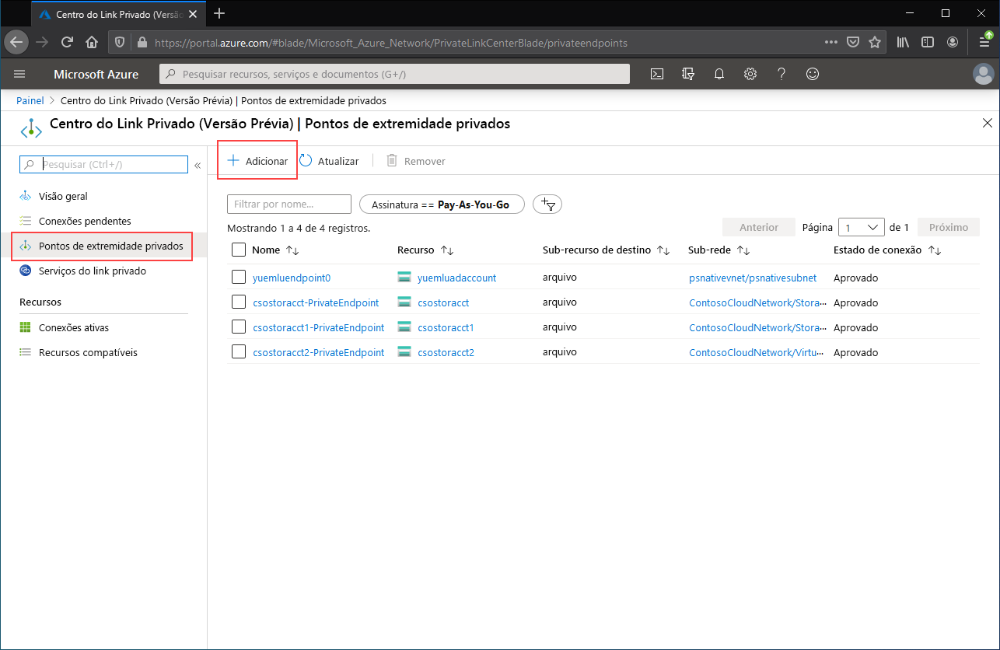
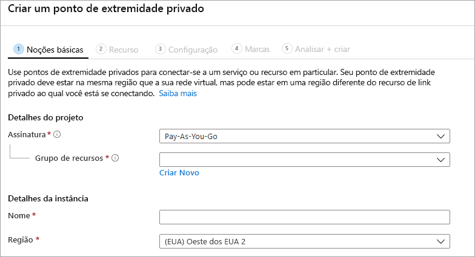

# <a name="configuring-azure-file-sync-network-endpoints"></a>Configurar pontos de extremidade de rede da Sincronização de Arquivos do Azure
Os Arquivos do Azure e a Sincronização de Arquivos do Azure fornecem dois tipos principais de pontos de extremidade para acessar compartilhamentos de arquivo do Azure: 
- Pontos de extremidade públicos, que têm um endereço IP público e podem ser acessados de qualquer lugar do mundo.
- Pontos de extremidade privados, que existem em uma rede virtual e têm um endereço IP privado dentro do espaço de endereço dessa rede virtual.

Para Arquivos do Azure e Sincronização de Arquivos do Azure, os objetos de gerenciamento do Azure, a conta de armazenamento e o serviço de sincronização de armazenamento, respectivamente, controlam os pontos de extremidade públicos e privados. A conta de armazenamento é um constructo de gerenciamento que representa um pool compartilhado de armazenamento no qual você pode implantar vários compartilhamentos de arquivos bem como outros recursos de armazenamento, como filas ou contêineres de blob. O Serviço de Sincronização de Armazenamento é um constructo de gerenciamento que representa servidores registrados, que são servidores de arquivos do Windows com uma relação de confiança estabelecida com a Sincronização de Arquivos do Azure e grupos de sincronização, que definem a topologia do relacionamento de sincronização. 

Este artigo se concentra em como configurar os pontos de extremidade de rede para Arquivos do Azure e Sincronização de Arquivos do Azure. Para saber mais sobre como configurar pontos de extremidade de rede para acessar os compartilhamentos de arquivos do Azure diretamente, em vez de armazenar em cache local com a Sincronização de Arquivos do Azure, confira [Como configurar os pontos de extremidade de rede de Arquivos do Azure](storage-files-networking-endpoints.md).

É recomendável ler as [Considerações de rede de Sincronização de Arquivos do Azure](storage-sync-files-networking-overview.md) antes de ler este guia de instruções.

## <a name="prerequisites"></a>Pré-requisitos 
Este artigo supõe que:
- Você tem uma assinatura do Azure. Se você ainda não tiver uma assinatura, crie uma [conta gratuita](https://azure.microsoft.com/free/?WT.mc_id=A261C142F) antes de começar.
- Você já criou um compartilhamento de arquivo do Azure em uma conta de armazenamento à qual deseja se conectar do local. Para saber como criar um compartilhamento de arquivo do Azure, confira [Criar um compartilhamento de arquivo do Azure](storage-how-to-create-file-share.md).
- Você já criou um Serviço de Sincronização de Armazenamento e registrou seu servidor de arquivos do Windows com ele. Para saber como implantar a Sincronização de Arquivos do Azure, confira [Implantar Sincronização de Arquivos do Azure](storage-sync-files-deployment-guide.md).

Adicionalmente:
- Se pretende usar o Azure PowerShell, [instale a versão mais recente](/powershell/azure/install-az-ps).
- Se pretende usar a CLI do Azure, [instale a versão mais recente](/cli/azure/install-azure-cli?view=azure-cli-latest&preserve-view=true).

## <a name="create-the-private-endpoints"></a>Criar os pontos de extremidade privados
Quando você cria um ponto de extremidade privado para um recurso do Azure, os seguintes recursos são implantados:

- **Um ponto de extremidade privado**: Um recurso do Azure que representa o ponto de extremidade privado para a conta de armazenamento ou o Serviço de Sincronização de Armazenamento. Você pode considerar isso como um recurso que conecta seu recurso do Azure e um adaptador de rede.
- **Uma NIC (adaptador de rede)** : o adaptador de rede que mantém um endereço IP privado dentro da rede virtual/sub-rede especificada. É exatamente o mesmo recurso que é implantado quando você implanta uma máquina virtual. No entanto, em vez de ser atribuído a uma VM, ele pertence ao ponto de extremidade privado.
- **Uma zona DNS privada**: se você nunca tiver implantado um ponto de extremidade privado para essa rede virtual, uma nova zona DNS privada será implantada em sua rede virtual. Um registro DNS A também será criado para o recurso do Azure nesta zona DNS. Se você já tiver implantado um ponto de extremidade privado nessa rede virtual, um novo registro A para o recurso do Azure será adicionado à zona DNS existente. A implantação de uma zona DNS é opcional, porém altamente recomendável para simplificar o gerenciamento de DNS necessário.

> [!Note]  
> Este artigo usa os sufixos DNS para as regiões públicas do Azure, `core.windows.net` para contas de armazenamento e `afs.azure.net` para Serviços de Sincronização de Armazenamento. Esse comentário também se aplica a nuvens soberanas do Azure, como a nuvem do Governo dos EUA para Azure – só substitua os sufixos apropriados para seu ambiente.

### <a name="create-the-storage-account-private-endpoint"></a>Criar o ponto de extremidade privado da conta de armazenamento
# <a name="portal"></a>[Portal](#tab/azure-portal)
[!INCLUDE [storage-files-networking-endpoints-private-portal](../../../includes/storage-files-networking-endpoints-private-portal.md)]

Se tiver uma máquina virtual dentro de sua rede virtual ou se tiver configurado o encaminhamento de DNS conforme descrito em [Como configurar o encaminhamento DNS para Arquivos do Azure](storage-files-networking-dns.md), você poderá testar se o ponto de extremidade privado foi instalado corretamente executando os seguintes comandos do PowerShell, na linha de comando ou no terminal (funciona para Windows, Linux e macOS). Substitua `<storage-account-name>` pelo nome da conta de armazenamento apropriada:

```console
nslookup <storage-account-name>.file.core.windows.net
```

Se tudo tiver funcionado corretamente, você deverá ver a seguinte saída, em que `192.168.0.5` é o endereço IP privado do ponto de extremidade privado em sua rede virtual (saída mostrada para o Windows):

```output
Server:  UnKnown
Address:  10.2.4.4

Non-authoritative answer:
Name:    storageaccount.privatelink.file.core.windows.net
Address:  192.168.0.5
Aliases:  storageaccount.file.core.windows.net
```

# <a name="powershell"></a>[PowerShell](#tab/azure-powershell)
[!INCLUDE [storage-files-networking-endpoints-private-powershell](../../../includes/storage-files-networking-endpoints-private-powershell.md)]

Se tiver uma máquina virtual dentro de sua rede virtual ou se tiver configurado o encaminhamento de DNS conforme descrito em [Como configurar o encaminhamento de DNS para Arquivos do Azure](storage-files-networking-dns.md), você poderá testar se o ponto de extremidade privado foi instalado corretamente executando os seguintes comandos:

```powershell
$storageAccountHostName = [System.Uri]::new($storageAccount.PrimaryEndpoints.file) | `
    Select-Object -ExpandProperty Host

Resolve-DnsName -Name $storageAccountHostName
```

Se tudo tiver funcionado corretamente, você deverá ver a seguinte saída, em que `192.168.0.5` é o endereço IP privado do ponto de extremidade privado em sua rede virtual:

```output
Name                             Type   TTL   Section    NameHost
----                             ----   ---   -------    --------
storageaccount.file.core.windows CNAME  60    Answer     storageaccount.privatelink.file.core.windows.net
.net

Name       : storageaccount.privatelink.file.core.windows.net
QueryType  : A
TTL        : 600
Section    : Answer
IP4Address : 192.168.0.5
```

# <a name="azure-cli"></a>[CLI do Azure](#tab/azure-cli)
[!INCLUDE [storage-files-networking-endpoints-private-cli](../../../includes/storage-files-networking-endpoints-private-cli.md)]

Se tiver uma máquina virtual dentro de sua rede virtual ou se tiver configurado o encaminhamento de DNS conforme descrito em [Como configurar o encaminhamento de DNS para Arquivos do Azure](storage-files-networking-dns.md), você poderá testar se o ponto de extremidade privado foi instalado corretamente executando os seguintes comandos:

```bash
httpEndpoint=$(az storage account show \
        --resource-group $storageAccountResourceGroupName \
        --name $storageAccountName \
        --query "primaryEndpoints.file" | \
    tr -d '"')

hostName=$(echo $httpEndpoint | cut -c7-$(expr length $httpEndpoint) | tr -d "/")
nslookup $hostName
```

Se tudo tiver funcionado corretamente, você deverá ver a seguinte saída, em que `192.168.0.5` é o endereço IP privado do ponto de extremidade privado em sua rede virtual:

```output
Server:         127.0.0.53
Address:        127.0.0.53#53

Non-authoritative answer:
storageaccount.file.core.windows.net      canonical name = storageaccount.privatelink.file.core.windows.net.
Name:   storageaccount.privatelink.file.core.windows.net
Address: 192.168.0.5
```

---

### <a name="create-the-storage-sync-private-endpoint"></a>Criar o ponto de extremidade privado de sincronização de armazenamento
> [!Important]  
> Para usar pontos de extremidade privados no recurso de serviço de sincronização de armazenamento, você deve usar o agente de Sincronização de Arquivos do Azure versão 10.1 ou superior. As versões do agente anteriores à 10.1 não dão suporte a pontos de extremidade privados no serviço de sincronização de armazenamento. Todas as versões anteriores de agentes dão suporte a pontos de extremidade privados no recurso da conta de armazenamento.

# <a name="portal"></a>[Portal](#tab/azure-portal)
Navegue até o **Centro de Link Privado** digitando *Link Privado* na barra de pesquisa na parte superior do portal do Azure. No sumário do Centro de Link Privado, selecione **Pontos de extremidade privados** e, em seguida, **+ Adicionar** para criar um ponto de extremidade privado.

[](media/storage-sync-files-networking-endpoints/create-storage-sync-private-endpoint-0.png#lightbox)

O assistente resultante tem várias páginas a serem preenchidas.

Na folha **Básico**, selecione o grupo de recursos, o nome e a região desejados para o ponto de extremidade privado. Essas configurações podem ter o valor que você quiser, elas não precisam corresponder ao Serviço de Sincronização de Armazenamento, embora seja necessário criar o ponto de extremidade privado na mesma região que a rede virtual na qual você deseja criá-lo.



Na folha **Recurso**, selecione o botão de opção para **Conectar-se a um recurso do Azure em meu diretório**. Em **Tipo de recurso**, selecione **Microsoft.StorageSync/storageSyncServices** para o tipo de recurso. 

A folha **Configuração** permite que você selecione a rede virtual específica e a sub-rede à qual deseja adicionar o ponto de extremidade privado. Selecione a mesma rede virtual que você usou para a conta de armazenamento acima. A folha Configuração também contém as informações para criar/atualizar a zona DNS privado.

Clique em **Examinar + Criar** para criar o ponto de extremidade privado.

Você pode testar se o ponto de extremidade privado foi configurado corretamente executando os seguintes comandos do PowerShell. 

```powershell
$privateEndpointResourceGroupName = "<your-private-endpoint-resource-group>"
$privateEndpointName = "<your-private-endpoint-name>"

Get-AzPrivateEndpoint `
        -ResourceGroupName $privateEndpointResourceGroupName `
        -Name $privateEndpointName `
        -ErrorAction Stop | `
    Select-Object -ExpandProperty NetworkInterfaces | `
    Select-Object -ExpandProperty Id | `
    ForEach-Object { Get-AzNetworkInterface -ResourceId $_ } | `
    Select-Object -ExpandProperty IpConfigurations | `
    Select-Object -ExpandProperty PrivateLinkConnectionProperties | `
    Select-Object -ExpandProperty Fqdns | `
    ForEach-Object { Resolve-DnsName -Name $_ } | `
    Format-List
```

Se tudo tiver funcionado corretamente, você deverá ver a saída a seguir, em que `192.168.1.4`, `192.168.1.5`, `192.168.1.6` e `192.168.1.7` são os endereços IP privados atribuídos ao ponto de extremidade privado:

```output
Name     : mysssmanagement.westus2.afs.azure.net
Type     : CNAME
TTL      : 60
Section  : Answer
NameHost : mysssmanagement.westus2.privatelink.afs.azure.net


Name       : mysssmanagement.westus2.privatelink.afs.azure.net
QueryType  : A
TTL        : 60
Section    : Answer
IP4Address : 192.168.1.4

Name     : myssssyncp.westus2.afs.azure.net
Type     : CNAME
TTL      : 60
Section  : Answer
NameHost : myssssyncp.westus2.privatelink.afs.azure.net


Name       : myssssyncp.westus2.privatelink.afs.azure.net
QueryType  : A
TTL        : 60
Section    : Answer
IP4Address : 192.168.1.5

Name     : myssssyncs.westus2.afs.azure.net
Type     : CNAME
TTL      : 60
Section  : Answer
NameHost : myssssyncs.westus2.privatelink.afs.azure.net


Name       : myssssyncs.westus2.privatelink.afs.azure.net
QueryType  : A
TTL        : 60
Section    : Answer
IP4Address : 192.168.1.6

Name     : mysssmonitoring.westus2.afs.azure.net
Type     : CNAME
TTL      : 60
Section  : Answer
NameHost : mysssmonitoring.westus2.privatelink.afs.azure.net


Name       : mysssmonitoring.westus2.privatelink.afs.azure.net
QueryType  : A
TTL        : 60
Section    : Answer
IP4Address : 192.168.1.7

```

# <a name="powershell"></a>[PowerShell](#tab/azure-powershell)
Para criar um ponto de extremidade privado para o Serviço de Sincronização de Armazenamento, primeiro você precisará obter uma referência para o Serviço de Sincronização de Armazenamento. Lembre-se de substituir `<storage-sync-service-resource-group>` e `<storage-sync-service>` pelos valores corretos para seu ambiente. Os comandos do PowerShell a seguir pressupõem que você já preencheu as informações da rede virtual acima. 

```powershell
$storageSyncServiceResourceGroupName = "<storage-sync-service-resource-group>"
$storageSyncServiceName = "<storage-sync-service>"

$storageSyncService = Get-AzStorageSyncService `
        -ResourceGroupName $storageSyncServiceResourceGroupName `
        -Name $storageSyncServiceName `
        -ErrorAction SilentlyContinue

if ($null -eq $storageSyncService) {
    $errorMessage = "Storage Sync Service $storageSyncServiceName not found "
    $errorMessage += "in resource group $storageSyncServiceResourceGroupName."
    Write-Error -Message $errorMessage -ErrorAction Stop
}
```

Para criar um ponto de extremidade privado, você precisa criar uma conexão de serviço de link privado com o Serviço de Sincronização de Armazenamento. A conexão do link privado é uma entrada para a criação do ponto de extremidade privado.

```powershell 
# Disable private endpoint network policies
$subnet.PrivateEndpointNetworkPolicies = "Disabled"
$virtualNetwork = $virtualNetwork | `
    Set-AzVirtualNetwork -ErrorAction Stop

# Create a private link service connection to the storage account.
$privateEndpointConnection = New-AzPrivateLinkServiceConnection `
        -Name "$storageSyncServiceName-Connection" `
        -PrivateLinkServiceId $storageSyncService.ResourceId `
        -GroupId "Afs" `
        -ErrorAction Stop

# Create a new private endpoint.
$privateEndpoint = New-AzPrivateEndpoint `
        -ResourceGroupName $storageSyncServiceResourceGroupName `
        -Name "$storageSyncServiceName-PrivateEndpoint" `
        -Location $virtualNetwork.Location `
        -Subnet $subnet `
        -PrivateLinkServiceConnection $privateEndpointConnection `
        -ErrorAction Stop
```

A criação de uma zona DNS privado do Azure habilita os nomes de host para o Serviço de Sincronização de Armazenamento, como `mysssmanagement.westus2.afs.azure.net`, para resolver os IPs privados corretos para o Serviço de Sincronização de Armazenamento dentro da rede virtual. Embora seja opcional da perspectiva da criação de um ponto de extremidade privado, é explicitamente necessário para que o agente de Sincronização de Arquivos do Azure acesse o Serviço de Sincronização de Armazenamento. 

```powershell
# Get the desired Storage Sync Service suffix (afs.azure.net for public cloud).
# This is done like this so this script will seamlessly work for non-public Azure.
$azureEnvironment = Get-AzContext | `
    Select-Object -ExpandProperty Environment | `
    Select-Object -ExpandProperty Name

switch($azureEnvironment) {
    "AzureCloud" {
        $storageSyncSuffix = "afs.azure.net"
    }

    "AzureUSGovernment" {
        $storageSyncSuffix = "afs.azure.us"
    }
    
    default {
        Write-Error 
                -Message "The Azure environment $_ is not currently supported by Azure File Sync." `
                -ErrorAction Stop
    }
}

# For public cloud, this will generate the following DNS suffix:
# privatelink.afs.azure.net
$dnsZoneName = "privatelink.$storageSyncSuffix"

# Find a DNS zone matching desired name attached to this virtual network.
$dnsZone = Get-AzPrivateDnsZone | `
    Where-Object { $_.Name -eq $dnsZoneName } | `
    Where-Object {
        $privateDnsLink = Get-AzPrivateDnsVirtualNetworkLink `
                -ResourceGroupName $_.ResourceGroupName `
                -ZoneName $_.Name `
                -ErrorAction SilentlyContinue
        
        $privateDnsLink.VirtualNetworkId -eq $virtualNetwork.Id
    }

if ($null -eq $dnsZone) {
    # No matching DNS zone attached to virtual network, so create new one.
    $dnsZone = New-AzPrivateDnsZone `
            -ResourceGroupName $virtualNetworkResourceGroupName `
            -Name $dnsZoneName `
            -ErrorAction Stop

    $privateDnsLink = New-AzPrivateDnsVirtualNetworkLink `
            -ResourceGroupName $virtualNetworkResourceGroupName `
            -ZoneName $dnsZoneName `
            -Name "$virtualNetworkName-DnsLink" `
            -VirtualNetworkId $virtualNetwork.Id `
            -ErrorAction Stop
}
```
Agora que tem uma referência à zona DNS privado, você precisa criar um registro A para seu Serviço de Sincronização de Armazenamento.

```powershell 
$privateEndpointIpFqdnMappings = $privateEndpoint | `
    Select-Object -ExpandProperty NetworkInterfaces | `
    Select-Object -ExpandProperty Id | `
    ForEach-Object { Get-AzNetworkInterface -ResourceId $_ } | `
    Select-Object -ExpandProperty IpConfigurations | `
    ForEach-Object { 
        $privateIpAddress = $_.PrivateIpAddress; 
        $_ | `
            Select-Object -ExpandProperty PrivateLinkConnectionProperties | `
            Select-Object -ExpandProperty Fqdns | `
            Select-Object `
                @{ 
                    Name = "PrivateIpAddress"; 
                    Expression = { $privateIpAddress } 
                }, `
                @{ 
                    Name = "FQDN"; 
                    Expression = { $_ } 
                } 
    }

foreach($ipFqdn in $privateEndpointIpFqdnMappings) {
    $privateDnsRecordConfig = New-AzPrivateDnsRecordConfig `
        -IPv4Address $ipFqdn.PrivateIpAddress
    
    $dnsEntry = $ipFqdn.FQDN.Substring(0, 
        $ipFqdn.FQDN.IndexOf(".", $ipFqdn.FQDN.IndexOf(".") + 1))

    New-AzPrivateDnsRecordSet `
            -ResourceGroupName $virtualNetworkResourceGroupName `
            -Name $dnsEntry `
            -RecordType A `
            -ZoneName $dnsZoneName `
            -Ttl 600 `
            -PrivateDnsRecords $privateDnsRecordConfig `
            -ErrorAction Stop | `
        Out-Null
}
```

# <a name="azure-cli"></a>[CLI do Azure](#tab/azure-cli)
Para criar um ponto de extremidade privado para o Serviço de Sincronização de Armazenamento, primeiro você precisará obter uma referência para o Serviço de Sincronização de Armazenamento. Lembre-se de substituir `<storage-sync-service-resource-group>` e `<storage-sync-service>` pelos valores corretos para seu ambiente. Os comandos da CLI a seguir pressupõem que você já preencheu as informações da rede virtual acima. 

```bash
storageSyncServiceResourceGroupName="<storage-sync-service-resource-group>"
storageSyncServiceName="<storage-sync-service>"

storageSyncService=$(az resource show \
        --resource-group $storageSyncServiceResourceGroupName \
        --name $storageSyncServiceName \
        --resource-type "Microsoft.StorageSync/storageSyncServices" \
        --query "id" | \
    tr -d '"')

storageSyncServiceRegion=$(az resource show \
        --resource-group $storageSyncServiceResourceGroupName \
        --name $storageSyncServiceName \
        --resource-type "Microsoft.StorageSync/storageSyncServices" \
        --query "location" | \
    tr -d '"')
```

Para criar um ponto de extremidade privado, primeiro você precisa garantir que a política de rede do ponto de extremidade privado da sub-rede esteja configurada como desabilitada. Em seguida, você pode criar o ponto de extremidade privado com o comando `az network private-endpoint create`.

```bash
# Disable private endpoint network policies
az network vnet subnet update \
        --ids $subnet \
        --disable-private-endpoint-network-policies \
        --output none

# Get virtual network location
region=$(az network vnet show \
        --ids $virtualNetwork \
        --query "location" | \
    tr -d '"')

# Create a private endpoint
privateEndpoint=$(az network private-endpoint create \
        --resource-group $storageSyncServiceResourceGroupName \
        --name "$storageSyncServiceName-PrivateEndpoint" \
        --location $region \
        --subnet $subnet \
        --private-connection-resource-id $storageSyncService \
        --group-id "Afs" \
        --connection-name "$storageSyncServiceName-Connection" \
        --query "id" | \
    tr -d '"')
```

A criação de uma zona DNS privado do Azure habilita os nomes de host para o Serviço de Sincronização de Armazenamento, como `mysssmanagement.westus2.afs.azure.net`, para resolver os IPs privados corretos para o Serviço de Sincronização de Armazenamento dentro da rede virtual. Embora seja opcional da perspectiva da criação de um ponto de extremidade privado, é explicitamente necessário para que o agente de Sincronização de Arquivos do Azure acesse o Serviço de Sincronização de Armazenamento. 

```bash
# Get the desired storage account suffix (afs.azure.net for public cloud).
# This is done like this so this script will seamlessly work for non-public Azure.
azureEnvironment=$(az cloud show \
        --query "name" |
    tr -d '"')

storageSyncSuffix=""
if [ $azureEnvironment == "AzureCloud" ]
then
    storageSyncSuffix="afs.azure.net"
elif [ $azureEnvironment == "AzureUSGovernment" ]
then
    storageSyncSuffix="afs.azure.us"
else
    echo "Unsupported Azure environment $azureEnvironment."
fi

# For public cloud, this will generate the following DNS suffix:
# privatelinke.afs.azure.net.
dnsZoneName="privatelink.$storageSyncSuffix"

# Find a DNS zone matching desired name attached to this virtual network.
possibleDnsZones=""
possibleDnsZones=$(az network private-dns zone list \
        --query "[?name == '$dnsZoneName'].id" \
        --output tsv)

dnsZone=""
possibleDnsZone=""
for possibleDnsZone in $possibleDnsZones
do
    possibleResourceGroupName=$(az resource show \
            --ids $possibleDnsZone \
            --query "resourceGroup" | \
        tr -d '"')
    
    link=$(az network private-dns link vnet list \
            --resource-group $possibleResourceGroupName \
            --zone-name $dnsZoneName \
            --query "[?virtualNetwork.id == '$virtualNetwork'].id" \
            --output tsv)
    
    if [ -z $link ]
    then
        echo "1" > /dev/null
    else 
        dnsZoneResourceGroup=$possibleResourceGroupName
        dnsZone=$possibleDnsZone
        break
    fi  
done

if [ -z $dnsZone ]
then
    # No matching DNS zone attached to virtual network, so create a new one
    dnsZone=$(az network private-dns zone create \
            --resource-group $virtualNetworkResourceGroupName \
            --name $dnsZoneName \
            --query "id" | \
        tr -d '"')
    
    az network private-dns link vnet create \
            --resource-group $virtualNetworkResourceGroupName \
            --zone-name $dnsZoneName \
            --name "$virtualNetworkName-DnsLink" \
            --virtual-network $virtualNetwork \
            --registration-enabled false \
            --output none
    
    dnsZoneResourceGroup=$virtualNetworkResourceGroupName
fi
```

Agora que tem uma referência à zona DNS privado, você precisa criar um registro A para seu Serviço de Sincronização de Armazenamento.

```bash
privateEndpointNIC=$(az network private-endpoint show \
        --ids $privateEndpoint \
        --query "networkInterfaces[0].id" | \
    tr -d '"')

privateIpAddresses=$(az network nic show \
        --ids $privateEndpointNIC \
        --query "ipConfigurations[].privateIpAddress" \
        --output tsv) 

hostNames=$(az network nic show \
        --ids $privateEndpointNIC \
        --query "ipConfigurations[].privateLinkConnectionProperties.fqdns[]" \
        --output tsv)

i=0
for privateIpAddress in $privateIpAddresses
do
    j=0
    targetHostName=""
    for hostName in $hostNames
    do
        if [ $i == $j ]
        then
            targetHostName=$hostName
            break
        fi

        j=$(expr $j + 1)
    done

    endpointName=$(echo $targetHostName | \
        cut -c1-$(expr $(expr index $targetHostName ".") - 1))

    az network private-dns record-set a create \
        --resource-group $dnsZoneResourceGroup \
        --zone-name $dnsZoneName \
        --name "$endpointName.$storageSyncServiceRegion" \
        --output none
    
    az network private-dns record-set a add-record \
        --resource-group $dnsZoneResourceGroup \
        --zone-name $dnsZoneName \
        --record-set-name "$endpointName.$storageSyncServiceRegion" \
        --ipv4-address $privateIpAddress \
        --output none

    i=$(expr $i + 1)
done
```
---

## <a name="restrict-access-to-the-public-endpoints"></a>Restringir o acesso aos pontos de extremidade públicos
Você pode restringir o acesso aos pontos de extremidade públicos da conta de armazenamento e dos Serviços de Sincronização de Armazenamento. O acesso restrito ao ponto de extremidade público fornece segurança adicional, garantindo que os pacotes de rede sejam aceitos apenas de locais aprovados. 

### <a name="restrict-access-to-the-storage-account-public-endpoint"></a>Restringir o acesso ao ponto de extremidade público da conta de armazenamento
A restrição de acesso ao ponto de extremidade público é feita usando as configurações de firewall da conta de armazenamento. Em geral, a maioria das políticas de firewall para uma conta de armazenamento restringirá o acesso de rede a uma ou mais redes virtuais. Há duas abordagens para a restrição do acesso a uma conta de armazenamento a uma rede virtual:

- [Criar um ou mais pontos de extremidade privados para a conta de armazenamento](#create-the-storage-account-private-endpoint) e desabilitar o acesso ao ponto de extremidade público. Com isso, apenas o tráfego proveniente de dentro das redes virtuais desejadas poderá acessar os compartilhamentos de arquivo do Azure dentro da conta de armazenamento.
- Restrinja o ponto de extremidade público a uma ou mais redes virtuais. Isso funciona usando uma funcionalidade da rede virtual denominada *pontos de extremidade de serviço*. Quando você restringir o tráfego a uma conta de armazenamento por meio de um ponto de extremidade de serviço, você ainda acessará a conta de armazenamento por meio do endereço IP público.

#### <a name="disable-access-to-the-storage-account-public-endpoint"></a>Desabilitar o acesso ao ponto de extremidade público da conta de armazenamento
Quando o acesso ao ponto de extremidade público está desabilitado, a conta de armazenamento ainda pode ser acessada por meio de seus pontos de extremidade privados. Caso contrário, as solicitações válidas para o ponto de extremidade público da conta de armazenamento serão rejeitadas. 

# <a name="portal"></a>[Portal](#tab/azure-portal)
[!INCLUDE [storage-files-networking-endpoints-public-disable-portal](../../../includes/storage-files-networking-endpoints-public-disable-portal.md)]

# <a name="powershell"></a>[PowerShell](#tab/azure-powershell)
[!INCLUDE [storage-files-networking-endpoints-public-disable-powershell](../../../includes/storage-files-networking-endpoints-public-disable-powershell.md)]

# <a name="azure-cli"></a>[CLI do Azure](#tab/azure-cli)
[!INCLUDE [storage-files-networking-endpoints-public-disable-cli](../../../includes/storage-files-networking-endpoints-public-disable-cli.md)]

---

#### <a name="restrict-access-to-the-storage-account-public-endpoint-to-specific-virtual-networks"></a>Restringir o acesso ao ponto de extremidade público da conta de armazenamento para redes virtuais específicas
Ao restringir a conta de armazenamento para redes virtuais específicas, você permite solicitações ao ponto de extremidade público de dentro das redes virtuais especificadas. Isso funciona usando uma funcionalidade da rede virtual denominada *pontos de extremidade de serviço*. Isso pode ser usado com ou sem pontos de extremidade privados.

# <a name="portal"></a>[Portal](#tab/azure-portal)
[!INCLUDE [storage-files-networking-endpoints-public-restrict-portal](../../../includes/storage-files-networking-endpoints-public-restrict-portal.md)]

# <a name="powershell"></a>[PowerShell](#tab/azure-powershell)
[!INCLUDE [storage-files-networking-endpoints-public-restrict-powershell](../../../includes/storage-files-networking-endpoints-public-restrict-powershell.md)]

# <a name="azure-cli"></a>[CLI do Azure](#tab/azure-cli)
[!INCLUDE [storage-files-networking-endpoints-public-restrict-cli](../../../includes/storage-files-networking-endpoints-public-restrict-cli.md)]

---

### <a name="disable-access-to-the-storage-sync-service-public-endpoint"></a>Desabilitar o acesso ao ponto de extremidade público do Serviço de Sincronização de Armazenamento
A Sincronização de Arquivos do Azure permite restringir o acesso a redes virtuais específicas somente por meio de pontos de extremidade privados. A Sincronização de Arquivos do Azure não dá suporte a pontos de extremidade de serviço para restringir o acesso ao ponto de extremidades público para redes virtuais específicas. Isso significa que os dois estados do ponto de extremidade público do Serviço de Sincronização de Armazenamento são habilitado e desabilitado.

# <a name="portal"></a>[Portal](#tab/azure-portal)
Isso não é possível por meio do portal do Azure. Selecione a guia Azure PowerShell para obter instruções sobre como desabilitar o ponto de extremidade público do serviço de sincronização de armazenamento. 

# <a name="powershell"></a>[PowerShell](#tab/azure-powershell)
Para desabilitar o acesso ao ponto de extremidade público do Serviço de Sincronização de Armazenamento, definiremos a propriedade `incomingTrafficPolicy` no Serviço de Sincronização de Armazenamento como `AllowVirtualNetworksOnly`. Se você quiser habilitar o acesso ao ponto de extremidade público do Serviço de Sincronização de Armazenamento, defina `incomingTrafficPolicy` como `AllowAllTraffic` em vez disso. Lembre-se de substituir `<storage-sync-service-resource-group>` e `<storage-sync-service>`.

```powershell
$storageSyncServiceResourceGroupName = "<storage-sync-service-resource-group>"
$storageSyncServiceName = "<storage-sync-service>"

$storageSyncService = Get-AzResource `
        -ResourceGroupName $storageSyncServiceResourceGroupName `
        -ResourceName $storageSyncServiceName `
        -ResourceType "Microsoft.StorageSync/storageSyncServices"

$storageSyncService.Properties.incomingTrafficPolicy = "AllowVirtualNetworksOnly"
$storageSyncService = $storageSyncService | Set-AzResource -Confirm:$false -Force -UsePatchSemantics
```

# <a name="azure-cli"></a>[CLI do Azure](#tab/azure-cli)
CLI do Azure não dá suporte à definição da `incomingTrafficPolicy` propriedade no serviço de sincronização de armazenamento. Selecione a guia Azure PowerShell para obter instruções sobre como desabilitar o ponto de extremidade público do serviço de sincronização de armazenamento.

---

## <a name="see-also"></a>Confira também
- [Planejando uma implantação da Sincronização de Arquivos do Azure](storage-sync-files-planning.md)
- [Implantar a Sincronização de Arquivos do Azure](storage-sync-files-deployment-guide.md)
