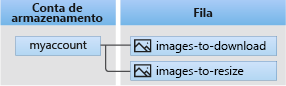

# <a name="quickstart-azure-queue-storage-client-library-v12-for-java"></a>Início Rápido: Biblioteca de clientes do Armazenamento de Filas do Azure v12 para Java

Introdução à biblioteca de clientes do Armazenamento de Filas do Azure v12 para Java. O Armazenamento de Filas do Azure é um serviço usado para armazenar grandes quantidades de mensagens para recuperação e processamento posteriores. Siga estas etapas para instalar o pacote e experimentar o código de exemplo para tarefas básicas.

Use a biblioteca de clientes do Armazenamento de Filas do Azure v12 para Java para:

- Criar uma fila
- Adicionar mensagens a uma fila
- Espiar mensagens em uma fila
- Atualizar uma mensagem em uma fila
- Receber e excluir mensagens de uma fila
- Excluir uma fila

Recursos adicionais:

- [Documentação de referência da API](/java/api/overview/azure/storage-queue-readme)
- [Código-fonte da biblioteca](https://github.com/Azure/azure-sdk-for-java/tree/master/sdk/storage/azure-storage-queue)
- [Pacote (Maven)](https://mvnrepository.com/artifact/com.azure/azure-storage-queue)
- [Amostras](../common/storage-samples-java.md?toc=%2fazure%2fstorage%2fqueues%2ftoc.json#queue-samples)

## <a name="prerequisites"></a>Pré-requisitos

- [Java Development Kit (JDK)](/java/azure/jdk/) versão 8 ou superior
- [Apache Maven](https://maven.apache.org/download.cgi)
- Assinatura do Azure - [criar uma gratuitamente](https://azure.microsoft.com/free/)
- Conta de armazenamento do Azure - [criar uma conta de armazenamento](../common/storage-account-create.md)

## <a name="setting-up"></a>Configurando

Esta seção fornece instruções sobre como preparar um projeto para funcionar com a biblioteca de clientes do Armazenamento de Filas do Azure v12 para Java.

### <a name="create-the-project"></a>Criar o projeto

Crie um aplicativo Java chamado `queues-quickstart-v12`.

1. Em uma janela do console (como cmd, PowerShell ou Bash), use o Maven para criar um novo aplicativo do console com o nome `queues-quickstart-v12`. Digite o comando `mvn` a seguir para criar um projeto "Olá, Mundo!" em Java.

    # <a name="powershell"></a>[PowerShell](#tab/powershell)

    ```powershell
    mvn archetype:generate `
        --define interactiveMode=n `
        --define groupId=com.queues.quickstart `
        --define artifactId=queues-quickstart-v12 `
        --define archetypeArtifactId=maven-archetype-quickstart `
        --define archetypeVersion=1.4
    ```

    # <a name="bash"></a>[Bash](#tab/bash)

    ```bash
    mvn archetype:generate \
        --define interactiveMode=n \
        --define groupId=com.queues.quickstart \
        --define artifactId=queues-quickstart-v12 \
        --define archetypeArtifactId=maven-archetype-quickstart \
        --define archetypeVersion=1.4
    ```

    ---

1. O resultado da geração do projeto deve ser algo similar a:

    ```console
    [INFO] Scanning for projects...
    [INFO]
    [INFO] ------------------< org.apache.maven:standalone-pom >-------------------
    [INFO] Building Maven Stub Project (No POM) 1
    [INFO] --------------------------------[ pom ]---------------------------------
    [INFO]
    [INFO] >>> maven-archetype-plugin:3.1.2:generate (default-cli) > generate-sources @ standalone-pom >>>
    [INFO]
    [INFO] <<< maven-archetype-plugin:3.1.2:generate (default-cli) < generate-sources @ standalone-pom <<<
    [INFO]
    [INFO]
    [INFO] --- maven-archetype-plugin:3.1.2:generate (default-cli) @ standalone-pom ---
    [INFO] Generating project in Batch mode
    [INFO] ----------------------------------------------------------------------------
    [INFO] Using following parameters for creating project from Archetype: maven-archetype-quickstart:1.4
    [INFO] ----------------------------------------------------------------------------
    [INFO] Parameter: groupId, Value: com.queues.quickstart
    [INFO] Parameter: artifactId, Value: queues-quickstart-v12
    [INFO] Parameter: version, Value: 1.0-SNAPSHOT
    [INFO] Parameter: package, Value: com.queues.quickstart
    [INFO] Parameter: packageInPathFormat, Value: com/queues/quickstart
    [INFO] Parameter: version, Value: 1.0-SNAPSHOT
    [INFO] Parameter: package, Value: com.queues.quickstart
    [INFO] Parameter: groupId, Value: com.queues.quickstart
    [INFO] Parameter: artifactId, Value: queues-quickstart-v12
    [INFO] Project created from Archetype in dir: C:\quickstarts\queues\queues-quickstart-v12
    [INFO] ------------------------------------------------------------------------
    [INFO] BUILD SUCCESS
    [INFO] ------------------------------------------------------------------------
    [INFO] Total time:  6.394 s
    [INFO] Finished at: 2019-12-03T09:58:35-08:00
    [INFO] ------------------------------------------------------------------------
    ```

1. Alterne para o diretório `queues-quickstart-v12` recém-criado.

   ```console
   cd queues-quickstart-v12
   ```

### <a name="install-the-package"></a>Instalar o pacote

Abra o arquivo `pom.xml` no seu editor de texto. Adicione o seguinte elemento de dependência ao grupo de dependências.

```xml
<dependency>
  <groupId>com.azure</groupId>
  <artifactId>azure-storage-queue</artifactId>
  <version>12.0.1</version>
</dependency>
```

### <a name="set-up-the-app-framework"></a>Configurar o framework de aplicativos

No diretório do projeto:

1. Navegue até o diretório `/src/main/java/com/queues/quickstart`
1. Abra o arquivo `App.java` em seu editor
1. Exclua a instrução `System.out.println("Hello, world");`
1. Adicione diretivas `import`

O código é o seguinte:

```java
package com.queues.quickstart;

/**
 * Azure Queue Storage client library v12 quickstart
 */
import com.azure.storage.queue.*;
import com.azure.storage.queue.models.*;
import java.io.*;
import java.time.*;

public class App
{
    public static void main( String[] args ) throws IOException
    {
    }
}
```

[!INCLUDE [storage-quickstart-credentials-include](../../../includes/storage-quickstart-credentials-include.md)]

## <a name="object-model"></a>Modelo de objeto

O armazenamento de Filas do Azure é um serviço usado para armazenar grandes quantidades de mensagens. Uma mensagem da fila pode ter até 64 KB. Uma fila pode conter milhões de mensagens, até o limite da capacidade total de uma conta de armazenamento. As filas são normalmente usadas para criar uma lista de pendências de trabalho para processamento assíncrono. O Armazenamento de Filas oferece três tipos de recursos:

- A conta de armazenamento
- Uma fila na conta de armazenamento
- Mensagens na fila

O diagrama a seguir mostra a relação entre esses recursos.



Use as seguintes classes Java para interagir com esses recursos:

- [`QueueClientBuilder`](/java/api/com.azure.storage.queue.queueclientbuilder): A classe `QueueClientBuilder` configura e instancia um objeto `QueueClient`.
- [`QueueServiceClient`](/java/api/com.azure.storage.queue.queueserviceclient): O `QueueServiceClient` permite que você gerencie todas as filas em sua conta de armazenamento.
- [`QueueClient`](/java/api/com.azure.storage.queue.queueclient): A classe `QueueClient` permite que você gerencie e manipule uma fila individual e as mensagens dela.
- [`QueueMessageItem`](/java/api/com.azure.storage.queue.models.queuemessageitem): A classe `QueueMessageItem` representa os objetos individuais retornados ao chamar [`ReceiveMessages`](/java/api/com.azure.storage.queue.queueclient.receivemessages) em uma fila.

## <a name="code-examples"></a>Exemplos de código

Esses snippets de código de exemplo mostram como executar seguintes ações com a biblioteca de clientes do Armazenamento de Filas do Azure para Java:

- [Obter a cadeia de conexão](#get-the-connection-string)
- [Criar uma fila](#create-a-queue)
- [Adicionar mensagens a uma fila](#add-messages-to-a-queue)
- [Espiar mensagens em uma fila](#peek-at-messages-in-a-queue)
- [Atualizar uma mensagem em uma fila](#update-a-message-in-a-queue)
- [Receber e excluir mensagens de uma fila](#receive-and-delete-messages-from-a-queue)
- [Excluir uma fila](#delete-a-queue)

### <a name="get-the-connection-string"></a>Obtenha a cadeia de conexão

O código a seguir recupera a cadeia de conexão da conta de armazenamento. A cadeia de conexão é armazenada na variável de ambiente criada na seção [Configurar a cadeia de conexão do armazenamento](#configure-your-storage-connection-string).

Adicione esse código dentro do método `main`:

```java
System.out.println("Azure Queue Storage client library v12 - Java quickstart sample\n");

// Retrieve the connection string for use with the application. The storage
// connection string is stored in an environment variable on the machine
// running the application called AZURE_STORAGE_CONNECTION_STRING. If the environment variable
// is created after the application is launched in a console or with
// Visual Studio, the shell or application needs to be closed and reloaded
// to take the environment variable into account.
String connectStr = System.getenv("AZURE_STORAGE_CONNECTION_STRING");
```

### <a name="create-a-queue"></a>Criar uma fila

Escolha um nome para a nova fila. O código a seguir acrescenta um valor de GUID ao nome da fila para garantir que ele seja exclusivo.

> [!IMPORTANT]
> Os nomes de fila podem conter apenas letras minúsculas, números e hifens e precisam começar com uma letra ou um número. Cada hífen deve ser precedido e seguido por um caractere que não seja um hífen. O nome também precisa ter entre 3 e 63 caracteres. Para obter mais informações sobre como nomear filas, confira [Nomeando filas e metadados](/rest/api/storageservices/naming-queues-and-metadata).

Crie uma instância da classe [`QueueClient`](/java/api/com.azure.storage.queue.queueclient). Em seguida, chame o método [`Create`](/java/api/com.azure.storage.queue.queueclient.create) para criar a fila na sua conta de armazenamento.

Adicione este código ao final do método `main`:

```java
// Create a unique name for the queue
String queueName = "quickstartqueues-" + java.util.UUID.randomUUID();

System.out.println("Creating queue: " + queueName);

// Instantiate a QueueClient which will be
// used to create and manipulate the queue
QueueClient queueClient = new QueueClientBuilder()
                                .connectionString(connectStr)
                                .queueName(queueName)
                                .buildClient();

// Create the queue
queueClient.create();
```

### <a name="add-messages-to-a-queue"></a>Adicionar mensagens a uma fila

O snippet de código a seguir adiciona mensagens à fila chamando o método [`sendMessage`](/java/api/com.azure.storage.queue.queueclient.sendmessage). Ele também salva um [`SendMessageResult`](/java/api/com.azure.storage.queue.models.sendmessageresult) retornado de uma chamada `sendMessage`. O resultado é usado para atualizar a mensagem posteriormente no programa.

Adicione este código ao final do método `main`:

```java
System.out.println("\nAdding messages to the queue...");

// Send several messages to the queue
queueClient.sendMessage("First message");
queueClient.sendMessage("Second message");

// Save the result so we can update this message later
SendMessageResult result = queueClient.sendMessage("Third message");
```

### <a name="peek-at-messages-in-a-queue"></a>Espiar mensagens em uma fila

Espie as mensagens na fila chamando o método [`peekMessages`](/java/api/com.azure.storage.queue.queueclient.peekmessages). Esse método recupera uma ou mais mensagens do início da fila, mas não altera a visibilidade da mensagem.

Adicione este código ao final do método `main`:

```java
System.out.println("\nPeek at the messages in the queue...");

// Peek at messages in the queue
queueClient.peekMessages(10, null, null).forEach(
    peekedMessage -> System.out.println("Message: " + peekedMessage.getMessageText()));
```

### <a name="update-a-message-in-a-queue"></a>Atualizar uma mensagem em uma fila

Atualize o conteúdo de uma mensagem chamando o método [`updateMessage`](/java/api/com.azure.storage.queue.queueclient.updatemessage). Esse método pode alterar o conteúdo e o tempo limite da visibilidade de uma mensagem. O conteúdo da mensagem precisa ser uma cadeia de caracteres codificada em UTF-8 com até 64 KB. Junto com o novo conteúdo da mensagem, passe a ID da mensagem e o recebimento pop usando o `SendMessageResult` que foi salvo anteriormente no código. A ID da mensagem e o recebimento pop identificam qual mensagem atualizar.

```java
System.out.println("\nUpdating the third message in the queue...");

// Update a message using the result that
// was saved when sending the message
queueClient.updateMessage(result.getMessageId(),
                          result.getPopReceipt(),
                          "Third message has been updated",
                          Duration.ofSeconds(1));
```

### <a name="receive-and-delete-messages-from-a-queue"></a>Receber e excluir mensagens de uma fila

Baixe as mensagens adicionadas anteriormente chamando o método [`receiveMessages`](/java/api/com.azure.storage.queue.queueclient.receivemessages). O código de exemplo também exclui mensagens da fila depois que elas são recebidas e processadas. Nesse caso, o processamento só exibe a mensagem no console.

O aplicativo pausa para a entrada do usuário chamando `System.console().readLine();` antes de receber e excluir as mensagens. Verifique no [portal do Azure](https://portal.azure.com) se os recursos foram criados corretamente antes de serem excluídos. As mensagens que não forem explicitamente excluídas acabarão se tornando visíveis na fila novamente para outra oportunidade de processamento.

Adicione este código ao final do método `main`:

```java
System.out.println("\nPress Enter key to receive messages and delete them from the queue...");
System.console().readLine();

// Get messages from the queue
queueClient.receiveMessages(10).forEach(
    // "Process" the message
    receivedMessage -> {
        System.out.println("Message: " + receivedMessage.getMessageText());

        // Let the service know we're finished with
        // the message and it can be safely deleted.
        queueClient.deleteMessage(receivedMessage.getMessageId(), receivedMessage.getPopReceipt());
    }
);
```

### <a name="delete-a-queue"></a>Excluir uma fila

O código a seguir limpa os recursos que o aplicativo criou ao excluir a fila usando o método [`Delete`](/java/api/com.azure.storage.queue.queueclient.delete).

Adicione este código ao final do método `main`:

```java
System.out.println("\nPress Enter key to delete the queue...");
System.console().readLine();

// Clean up
System.out.println("Deleting queue: " + queueClient.getQueueName());
queueClient.delete();

System.out.println("Done");
```

## <a name="run-the-code"></a>Executar o código

Esse aplicativo cria e adiciona três mensagens a uma fila do Azure. O código lista as mensagens na fila e, em seguida, recupera essas mensagens e as exclui, antes de excluir a fila.

Na janela do console, navegue até seu diretório de aplicativo e compile e execute o aplicativo.

```console
mvn compile
```

Em seguida, compile o pacote.

```console
mvn package
```

Use o comando `mvn` a seguir para executar o aplicativo.

```console
mvn exec:java -Dexec.mainClass="com.queues.quickstart.App" -Dexec.cleanupDaemonThreads=false
```

A saída do aplicativo é semelhante ao seguinte exemplo:

```output
Azure Queue Storage client library v12 - Java quickstart sample

Adding messages to the queue...

Peek at the messages in the queue...
Message: First message
Message: Second message
Message: Third message

Updating the third message in the queue...

Press Enter key to receive messages and delete them from the queue...

Message: First message
Message: Second message
Message: Third message has been updated

Press Enter key to delete the queue...

Deleting queue: quickstartqueues-fbf58f33-4d5a-41ac-ac0e-1a05d01c7003
Done
```

Quando o aplicativo pausar antes de receber mensagens, verifique sua conta de armazenamento no [portal do Azure](https://portal.azure.com). Verifique se as mensagens estão na fila.

Pressione a tecla `Enter` para receber e excluir as mensagens. Quando solicitado, pressione a tecla `Enter` novamente para excluir a fila e concluir a demonstração.

## <a name="next-steps"></a>Próximas etapas

Neste guia de início rápido, você aprendeu a criar uma fila e a adicionar mensagens a ela usando código Java. Em seguida, você aprendeu a espiar, recuperar e excluir mensagens. Por fim, você aprendeu a excluir uma fila de mensagens.

Para acessar tutoriais, amostras, inícios rápidos e outras documentações, visite:

> [!div class="nextstepaction"]
> [Azure para desenvolvedores de nuvem do Java](/azure/developer/java/)

- Para mais aplicativos de exemplo do Armazenamento de Filas do Azure, confira [Biblioteca de clientes do Armazenamento de Filas do Azure v12 para Java – exemplos](https://github.com/Azure/azure-sdk-for-java/tree/master/sdk/storage/azure-storage-queue/src/samples/java/com/azure/storage/queue).
