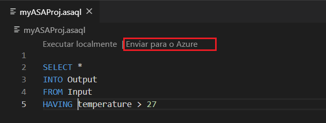

# Copiar ou fazer backup dos trabalhos do Azure Stream Analytics

Você pode copiar ou fazer backup de seus trabalhos implantados do Azure Stream Analytics usando visual studio code ou visual studio. 

## Antes de começar
* Se você não tiver uma assinatura do Azure, crie uma [conta gratuita](https://azure.microsoft.com/free/).

* Faça login no [portal Azure](https://portal.azure.com/).

* Instale [a extensão Azure Stream Analytics para ferramentas Visual Studio Code](quick-create-vs-code.md#install-the-azure-stream-analytics-tools-extension) ou [Azure Stream Analytics para Visual Studio](quick-create-vs-code.md#install-the-azure-stream-analytics-tools-extension).  

## Visual Studio Code

1. Clique no ícone **Azure** na barra de atividadede código visual do estúdio e, em seguida, expanda o nó **Stream Analytics.** Seus trabalhos devem aparecer suas assinaturas.

   

2. Para exportar um trabalho para um projeto local, localize o trabalho que deseja exportar no **Stream Analytics Explorer** em Visual Studio Code. Em seguida, selecione uma pasta para o seu projeto.

    

    O projeto é exportado para a pasta selecionada e adicionada ao seu espaço de trabalho atual.

    

3. Para publicar o trabalho em outra região ou fazer backup usando outro nome, **selecione Selecionar entre suas assinaturas para publicar** no editor de consulta (\*.asaql) e siga as instruções.

    

## Visual Studio

1. Siga a [exportação de um trabalho azure Stream Analytics implantado para uma instrução de projeto](https://docs.microsoft.com/azure/stream-analytics/stream-analytics-vs-tools#export-jobs-to-a-project).

2. Abra \*o arquivo .asaql no Editor de consulta, selecione Enviar para o **Azure** no editor de script e siga as instruções para publicar o trabalho em outra região ou fazer backup usando um novo nome.

## Próximas etapas

* [Quickstart: Crie um trabalho de Stream Analytics usando o Visual Studio Code](quick-create-vs-code.md)
* [Quickstart: Crie um trabalho de Stream Analytics usando o Visual Studio](stream-analytics-quick-create-vs.md)
* [Implantar um trabalho do Azure Stream Analytics com CI/CD usando o Azure Pipelines](stream-analytics-tools-visual-studio-cicd-vsts.md)
