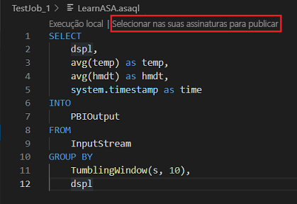

# Copiar ou fazer backup de trabalhos de Azure Stream Analytics

Você pode copiar ou fazer backup de seus trabalhos de Azure Stream Analytics implantados usando o Visual Studio Code ou o Visual Studio. 

## Antes de começar
* Se você não tiver uma assinatura do Azure, crie uma [conta gratuita](https://azure.microsoft.com/free/).

* Entre no [Portal do Azure](https://portal.azure.com/).

* Instale [a extensão de Azure Stream Analytics para Visual Studio Code](https://docs.microsoft.com/azure/stream-analytics/quick-create-vs-code#install-the-azure-stream-analytics-extension) ou [Azure Stream Analytics Tools para Visual Studio](https://docs.microsoft.com/azure/stream-analytics/quick-create-vs-code#install-the-azure-stream-analytics-extension).  

## Visual Studio Code 

1. Clique no ícone **do Azure** na barra de atividade do Visual Studio Code e, em seguida, expanda **Stream Analytics** nó. Seus trabalhos devem aparecer sob suas assinaturas.

   

2. Para exportar um trabalho para um projeto local, localize o trabalho que você deseja exportar no **Stream Analytics Explorer** em Visual Studio Code. Em seguida, selecione uma pasta para seu projeto. 

    

    O projeto é exportado para a pasta que você selecionar e adicionou ao seu espaço de trabalho atual.

    

3. Para publicar o trabalho em outra região ou backup usando outro nome, selecione **selecionar em suas assinaturas para publicar** no editor de consultas (\*. asaql) e siga as instruções. 

    

## Visual Studio 

1. Siga o [trabalho exportar um Azure Stream Analytics implantado para uma instrução de projeto](https://docs.microsoft.com/azure/stream-analytics/stream-analytics-vs-tools#export-jobs-to-a-project). 

2. Abra o arquivo \*. asaql no editor de consultas, selecione **Enviar para o Azure** no editor de scripts e siga as instruções para publicar o trabalho em outra região ou backup usando um novo nome. 

## Próximas etapas

* [Início rápido: criar um trabalho de Stream Analytics usando Visual Studio Code](quick-create-vs-code.md)
* [Início rápido: criar um trabalho de Stream Analytics usando o Visual Studio](stream-analytics-quick-create-vs.md)
* [Implantar um trabalho do Azure Stream Analytics com CI/CD usando o Azure Pipelines](stream-analytics-tools-visual-studio-cicd-vsts.md)