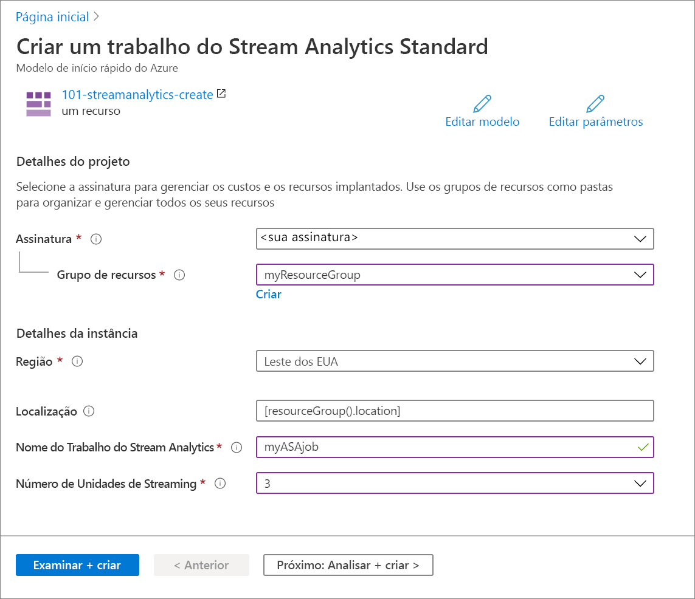

# <a name="quickstart-create-an-azure-stream-analytics-job-by-using-an-arm-template"></a>Início Rápido: Criar um trabalho do Azure Stream Analytics usando um modelo do Resource Manager

Neste guia de início rápido, você usará um modelo do Azure Resource Manager para criar um trabalho do Azure Stream Analytics. Depois que o trabalho for criado, você validará a implantação.

[!INCLUDE [About Azure Resource Manager](../../includes/resource-manager-quickstart-introduction.md)]

Se seu ambiente atender aos pré-requisitos e você estiver familiarizado com o uso de modelos ARM, selecione o botão **Implantar no Azure**. O modelo será aberto no portal do Azure.

[](https://portal.azure.com/#create/Microsoft.Template/uri/https%3A%2F%2Fraw.githubusercontent.com%2FAzure%2Fazure-quickstart-templates%2Fmaster%2F101-streamanalytics-create%2Fazuredeploy.json)

## <a name="prerequisites"></a>Pré-requisitos

Para concluir este artigo, você precisará:

* Ter uma assinatura do Azure: [crie uma gratuitamente](https://azure.microsoft.com/free/).

## <a name="review-the-template"></a>Examinar o modelo

O modelo usado neste início rápido é proveniente dos [Modelos de Início Rápido do Azure](https://azure.microsoft.com/resources/templates/101-streamanalytics-create/).

:::code language="json" source="~/quickstart-templates/101-streamanalytics-create/azuredeploy.json":::

O recurso do Azure definido no modelo é [Microsoft.StreamAnalytics/StreamingJobs](/azure/templates/microsoft.streamanalytics/streamingjobs): criar um trabalho do Azure Stream Analytics.

## <a name="deploy-the-template"></a>Implantar o modelo

Nesta seção, você criará um trabalho do Azure Stream Analytics usando o modelo do Resource Manager.

1. Selecione a imagem a seguir para entrar no Azure e abrir um modelo. O modelo criar um trabalho do Azure Stream Analytics.

   [](https://portal.azure.com/#create/Microsoft.Template/uri/https%3A%2F%2Fraw.githubusercontent.com%2FAzure%2Fazure-quickstart-templates%2Fmaster%2F101-streamanalytics-create%2Fazuredeploy.json)

2. Forneça os valores necessários para criar seu trabalho do Azure Stream Analytics.

   

   Forneça os seguintes valores:

   |Propriedade  |Descrição  |
   |---------|---------|
   |**Assinatura**     | Na lista suspensa, selecione sua assinatura do Azure.        |
   |**Grupo de recursos**     | Especifique se deseja criar um novo grupo de recursos ou usar um existente. Um grupo de recursos é um contêiner que mantém os recursos relacionados a uma solução do Azure. Para obter mais informações, consulte [Visão geral do Grupo de Recursos do Azure](../azure-resource-manager/management/overview.md). |
   |**Região**     | Selecione **Leste dos EUA**. Para outras regiões disponíveis, consulte [serviços do Azure por região](https://azure.microsoft.com/regions/services/).        |
   |**Nome do Trabalho do Stream Analytics**     | Forneça um nome para o trabalho do Stream Analytics.      |
   |**Número de unidades de streaming**     |  Escolha o número de unidades de streaming necessário. Para saber mais, confira [Compreender e ajustar unidades de streaming](stream-analytics-streaming-unit-consumption.md).       |

3. Selecione **Examinar + Criar** e **Criar**.

## <a name="review-deployed-resources"></a>Examinar os recursos implantados

Use o portal do Azure para verificar o trabalho do Azure Stream Analytics ou use o script da CLI do Azure ou do Azure PowerShell a seguir para listar o recurso.

### <a name="azure-cli"></a>CLI do Azure

```azurecli-interactive
echo "Enter your Azure Stream Analytics job name:" &&
read streamAnalyticsJobName &&
echo "Enter the resource group where the Azure Stream Analytics job exists:" &&
read resourcegroupName &&
az stream-analytics job show -g $resourcegroupName -n $streamAnalyticsJobName
```

### <a name="azure-powershell"></a>Azure PowerShell

```azurepowershell-interactive
$resourceGroupName = Read-Host -Prompt "Enter the resource group name where your Azure Stream Analytics job exists"
(Get-AzResource -ResourceType "Microsoft.StreamAnalytics/StreamingJobs" -ResourceGroupName $resourceGroupName).Name
 Write-Host "Press [ENTER] to continue..."
```

## <a name="clean-up-resources"></a>Limpar os recursos

Se você pretende prosseguir com os tutoriais seguintes, mantenha esses recursos em vigor. Quando você não precisar mais do grupo de recursos, exclua-o, o que excluirá o trabalho do Azure Stream Analytics. Para excluir o grupo de recursos usando a CLI do Azure ou o Azure PowerShell:

### <a name="azure-cli"></a>CLI do Azure

```azurecli-interactive
echo "Enter the Resource Group name:" &&
read resourceGroupName &&
az group delete --name $resourceGroupName &&
echo "Press [ENTER] to continue ..."
```

### <a name="azure-powershell"></a>Azure PowerShell

```azurepowershell-interactive
$resourceGroupName = Read-Host -Prompt "Enter the Resource Group name"
Remove-AzResourceGroup -Name $resourceGroupName
Write-Host "Press [ENTER] to continue..."
```

## <a name="next-steps"></a>Próximas etapas

Neste guia de início rápido, você criou um trabalho do Azure Stream Analytics usando um modelo do Resource Manager e validou a implantação. Avance para o próximo artigo para saber como exportar um modelo do Resource Manager de um trabalho existente usando o VS Code.

> [!div class="nextstepaction"]
> [Exportar um modelo do Resource Manager de um trabalho do Azure Stream Analytics](resource-manager-export.md)
