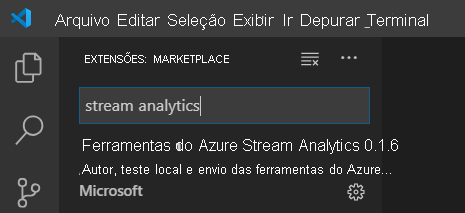
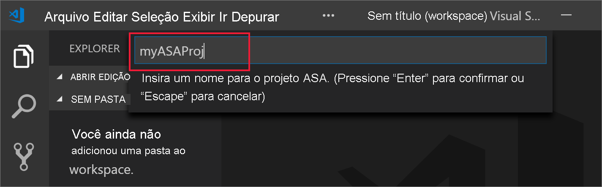
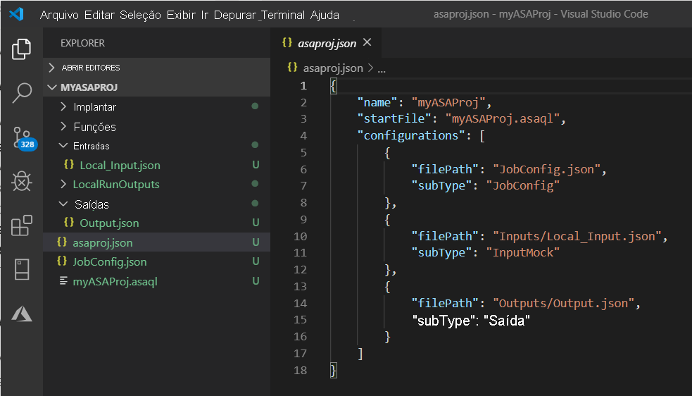
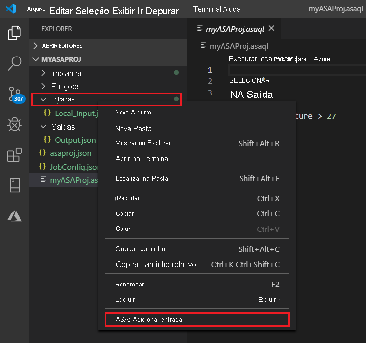
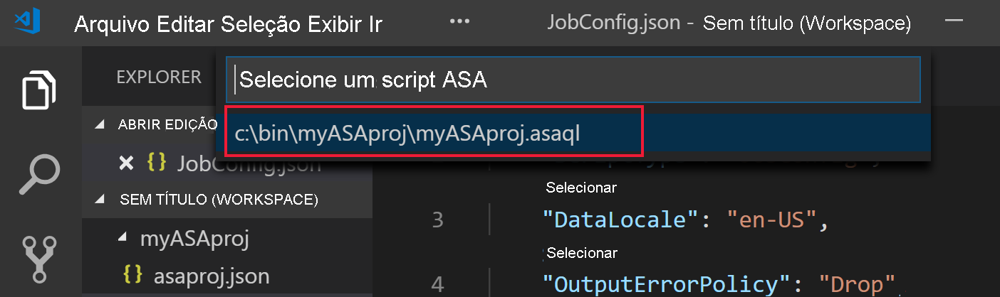
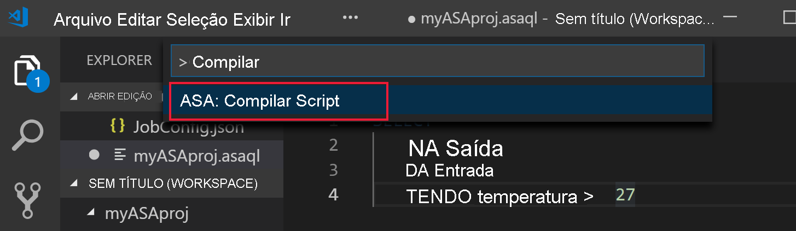
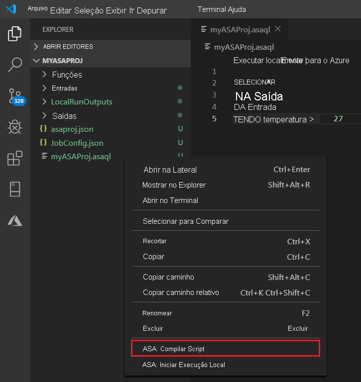
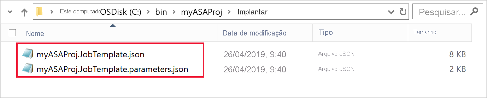
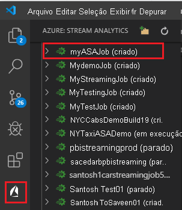
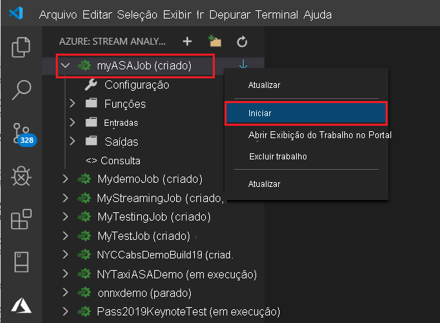

# <a name="quickstart-create-an-azure-stream-analytics-job-in-visual-studio-code-preview"></a>Início Rápido: Criar um trabalho do Azure Stream Analytics no Visual Studio Code (versão prévia)

Este início rápido mostra como criar e executar um trabalho do Azure Stream Analytics usando a extensão Ferramentas do Azure Stream Analytics para Visual Studio Code. O trabalho de exemplo lê dados de streaming de um dispositivo Hub IoT do Azure. Você definirá um trabalho que calcula a temperatura média quando ela ultrapassa 27° e que grava os eventos de saída resultantes em um novo arquivo no armazenamento de blobs.

> [!NOTE]
> As ferramentas do Visual Studio e do Visual Studio Code não são compatíveis com trabalhos nas regiões Leste da China, Norte da China, Alemanha Central e Nordeste da Alemanha.

## <a name="before-you-begin"></a>Antes de começar

* Se você não tiver uma assinatura do Azure, crie uma [conta gratuita](https://azure.microsoft.com/free/).

* Entre no [portal do Azure](https://portal.azure.com/).

* Instale o [Visual Studio Code](https://code.visualstudio.com/).

## <a name="install-the-azure-stream-analytics-tools-extension"></a>Instalar a extensão Ferramentas do Azure Stream Analytics

1. Abra o Visual Studio Code.

2. Em **Extensões** no painel esquerdo, pesquise **Stream Analytics** e selecione **Instalar** na extensão **Ferramentas do Azure Stream Analytics**.

3. Quando a extensão estiver instalada, verifique se **Ferramentas do Azure Stream Analytics** está visível nas **Extensões Habilitadas**.

   

## <a name="activate-the-azure-stream-analytics-tools-extension"></a>Ativar a extensão Ferramentas do Azure Stream Analytics

1. Selecione o ícone do **Azure** na barra de atividades do Visual Studio Code. Em **Stream Analytics** na barra lateral, selecione **Entrar no Azure**.

   

2. Quando você estiver conectado, o nome da sua conta do Azure será exibido na barra de status no canto inferior esquerdo da janela do Visual Studio Code.

> [!NOTE]
> A extensão Ferramentas do Azure Stream Analytics conectará você automaticamente na próxima vez se você não sair do serviço. Caso a sua conta tenha a autenticação de dois fatores, recomendamos o uso da autenticação por telefone em vez do uso de um PIN.
> Se tiver problemas na listagem de recursos, saia e entre novamente. Para sair, insira o comando `Azure: Sign Out`.

## <a name="prepare-the-input-data"></a>Preparar os dados de entrada

Antes de definir o trabalho do Stream Analytics, você deve preparar os dados que serão posteriormente configurados como a entrada do trabalho. Para preparar os dados de entrada exigidos pelo trabalho, conclua as seguintes etapas:

1. Entre no [portal do Azure](https://portal.azure.com/).

2. Selecione **Criar um recurso** > **Internet das Coisas** > **Hub IoT**.

3. No painel do **Hub IoT**, insira as seguintes informações:

   |**Configuração**  |**Valor sugerido**  |**Descrição**  |
   |---------|---------|---------|
   |Subscription  | \<Your subscription\> |  Selecione a assinatura do Azure que você deseja usar. |
   |Grupo de recursos   |   asaquickstart-resourcegroup  |   Selecione **Criar Novo** e insira um novo nome de grupo de recursos para a conta. |
   |Região  |  \<Select the region that is closest to your users\> | Selecione uma localização geográfica na qual você possa hospedar o hub IoT. Use a localização mais próxima dos usuários. |
   |Nome do Hub IoT  | MyASAIoTHub  |   Selecione um nome para o hub IoT.   |

   

4. Selecione **Avançar: Definir o tamanho e a escala**.

5. Faça uma seleção de **Tipo de preço e escala**. Para este início rápido, selecione a camada **F1 – Gratuita**, caso ela ainda esteja disponível em sua assinatura. Se a camada gratuita não estiver disponível, escolha a camada mais baixa disponível. Para saber mais, confira [Preço do Hub IoT do Azure](https://azure.microsoft.com/pricing/details/iot-hub/).

   

6. Selecione **Examinar + criar**. Examine as informações do hub IoT e selecione **Criar**. A criação do seu hub IoT pode levar alguns minutos. Monitore o progresso no painel **Notificações**.

7. No menu de navegação do hub IoT, selecione **Adicionar** em **Dispositivos IoT**. Adicione uma ID para **ID do Dispositivo** e selecione **Salvar**.

   

8. Depois que o dispositivo for criado, abra-o na lista **Dispositivos IoT**. Copie a cadeia de caracteres em **Cadeia de conexão (chave primária)** e salve-a em um Bloco de notas para uso futuro.

   

## <a name="run-the-iot-simulator"></a>Executar o simulador de IoT

1. Abra o [Simulador Online de IoT do Azure do Raspberry Pi](https://azure-samples.github.io/raspberry-pi-web-simulator/) em uma nova janela ou guia do navegador.

2. Substitua o espaço reservado na linha 15 pela cadeia de conexão do dispositivo hub IoT salva anteriormente.

3. Selecione **Executar**. A saída deverá exibir os dados de sensor e as mensagens que estão sendo enviadas ao hub IoT.

   

## <a name="create-blob-storage"></a>Criar o armazenamento de blobs

1. No canto superior esquerdo do portal do Azure, selecione **Criar um recurso** > **Armazenamento** > **Conta de armazenamento**.

2. No painel **Criar conta de armazenamento**, insira um nome para a conta de armazenamento, um local e um grupo de recursos. Escolha a mesma localização e o mesmo grupo de recursos do hub IoT criado. Em seguida, selecione **Examinar + criar** para criar a conta.

   

3. Depois que a sua conta de armazenamento for criada, selecione o bloco **Blobs** no painel **Visão geral**.

   

4. Na página **Serviço Blob**, selecione **Contêiner** e forneça um nome a ele, por exemplo, **conteiner1**. Mantenha o **Nível de acesso público** como **Particular (sem acesso anônimo)** e selecione **OK**.

   

## <a name="create-a-stream-analytics-project"></a>Criar um projeto do Stream Analytics

1. No Visual Studio Code, selecione **Ctrl+Shift+P** para abrir a paleta de comandos. Em seguida, insira **ASA** e selecione **ASA: Criar Novo Projeto**.

   

2. Insira o nome do projeto, como **myASAproj**, e selecione uma pasta para o projeto.

    

3. O novo projeto é adicionado ao seu workspace. Um projeto do Stream Analytics consiste em três pastas: **Entradas**, **Saídas** e **Funções**. Ele também contém o script de consulta **(*.asaql)** , um arquivo **JobConfig.json** e um arquivo de configuração **asaproj.json**.

    O arquivo de configuração **asaproj.json** contém as entradas, saídas e informações do arquivo de configuração do trabalho necessárias para enviar o trabalho do Stream Analytics ao Azure.

    

> [!Note]
> Quando você adiciona entradas e saídas por meio da paleta de comandos, os caminhos correspondentes são adicionados a **asaproj.json** automaticamente. Se você adicionar ou remover entradas ou saídas no disco de maneira direta, será necessário adicioná-las ou removê-las manualmente no **asaproj.json**. Você pode optar por colocar as entradas e as saídas em um local e, em seguida, referenciá-las em trabalhos diferentes especificando os caminhos em cada arquivo **asaproj.json**.

## <a name="define-the-transformation-query"></a>Definir a consulta de transformação

1. Abra **myASAproj.asaql** da pasta de projeto.

2. Adicione a consulta a seguir:

   ```sql
   SELECT *
   INTO Output
   FROM Input
   HAVING Temperature > 27
   ```

## <a name="define-a-live-input"></a>Definir uma entrada dinâmica

1. Clique com o botão direito do mouse na pasta **Entradas** do projeto do Stream Analytics. Em seguida, selecione **ASA: Adicionar Entrada** no menu de contexto.

    

    Ou selecione **Ctrl+Shift+P** para abrir a paleta de comandos e insira **ASA: Adicionar Entrada**.

   

2. Escolha **Hub IoT** para o tipo de entrada.

   

3. Se você adicionou a entrada por meio da paleta de comandos, escolha o script de consulta do Stream Analytics que usará a entrada. Ele deverá ser populado automaticamente com o caminho de arquivo para **myASAproj.asaql**.

   

4. Escolha **Selecionar em suas Assinaturas do Azure** no menu suspenso.

    

5. Edite o arquivo **IoTHub1.json** recém-gerado com os valores a seguir. Mantenha os valores padrão para os campos não mencionados aqui.

   |Configuração|Valor sugerido|Descrição|
   |-------|---------------|-----------|
   |Nome|Entrada|Insira um nome para identificar a entrada do trabalho.|
   |IotHubNamespace|MyASAIoTHub|Escolha ou insira o nome do hub IoT. Os nomes do hub IoT serão detectados automaticamente se eles forem criados na mesma assinatura.|
   |SharedAccessPolicyName|iothubowner| |

   Use o recurso CodeLens para ajudar você a inserir uma cadeia de caracteres, fazer uma seleção em uma lista suspensa ou alterar o texto diretamente no arquivo. A captura de tela a seguir mostra **Selecionar em suas Assinaturas** como um exemplo. As credenciais são listadas e salvas automaticamente no gerenciador de credenciais local.

   

   

## <a name="preview-input"></a>Visualizar a entrada

Selecione **Visualizar dados** em **IoTHub1.json** na linha superior. Alguns dados de entrada serão buscados do hub IoT e mostrados na janela de visualização. Esse processo pode demorar um pouco.

 

## <a name="define-an-output"></a>Definir uma saída

1. Selecione **Ctrl+Shift+P** para abrir a paleta de comandos. Em seguida, insira **ASA: Adicionar Saída**.

   

2. Escolha **Armazenamento de Blobs** como o tipo de coletor.

3. Escolha o script de consulta do Stream Analytics que usará essa entrada.

4. Insira o nome do arquivo de saída como **BlobStorage**.

5. Edite **BlobStorage** usando os valores a seguir. Mantenha os valores padrão para os campos não mencionados aqui. Use o recurso CodeLens para ajudar você a fazer uma seleção em uma lista suspensa ou inserir uma cadeia de caracteres.

   |Configuração|Valor sugerido|Descrição|
   |-------|---------------|-----------|
   |Nome|Saída| Insira um nome para identificar a saída do trabalho.|
   |Conta de Armazenamento|asaquickstartstorage|Escolha ou insira o nome da conta de armazenamento. Os nomes das contas de armazenamento serão detectados automaticamente se eles forem criados na mesma assinatura.|
   |Contêiner|container1|Selecione o contêiner existente que você criou em sua conta de armazenamento.|
   |Padrão de caminho|output|Digite o nome do caminho de arquivo a ser criado dentro do contêiner.|

   

## <a name="compile-the-script"></a>Compilar o script

A compilação de script verifica a sintaxe e gera os modelos do Azure Resource Manager para implantação automática.

Há duas maneiras para disparar a compilação de scripts:

- Selecione o script no workspace e, em seguida, faça a compilação na paleta de comandos.

   

- Clique com o botão direito do mouse no script e selecione **ASA: Compilar Script**.

    

Após a compilação, você poderá encontrar os dois modelos do Azure Resource Manager gerados na pasta **Implantar** do projeto. Esses dois arquivos são usados para implantação automática.



## <a name="submit-a-stream-analytics-job-to-azure"></a>Enviar um trabalho do Stream Analytics ao Azure

1. Na janela do Editor de Scripts do script de consulta, selecione **Enviar para o Azure**.

   

2. Selecione sua assinatura na lista pop-up.

3. Escolha **Selecionar um trabalho**. Em seguida, escolha **Criar um Trabalho**.

4. Insira o nome do trabalho, **myASAjob**. Em seguida, siga as instruções para escolher o grupo de recursos e a localização.

5. Selecione **Enviar para o Azure**. Encontre os logs na Janela de Saída. 

6. Quando o trabalho for criado, você poderá vê-lo no **Stream Analytics Explorer**.

    

## <a name="start-the-stream-analytics-job-and-check-output"></a>Inicie o trabalho do Stream Analytics e verifique a saída

1. Abra o **Stream Analytics Explorer** no Visual Studio Code e localize o trabalho **myASAJob**.

2. Clique com o botão direito do mouse no nome do trabalho. Em seguida, selecione **Iniciar** no menu de contexto.

   

3. Escolha **Agora** na janela pop-up para iniciar o trabalho.

4. Observe que o status do trabalho foi alterado para **Executando**. Clique com o botão direito do mouse no nome do trabalho e selecione **Abrir Exibição do Trabalho no Portal** para ver as métricas de evento de entrada e saída. Essa ação pode levar alguns minutos.

5. Para exibir os resultados, abra o armazenamento de blobs na extensão do Visual Studio Code ou no portal do Azure.

## <a name="clean-up-resources"></a>Limpar os recursos

Quando eles não forem mais necessários, exclua o grupo de recursos, o trabalho de streaming e todos os recursos relacionados. A exclusão do trabalho evita a cobrança das unidades de streaming consumidas por ele. 

Se você pretender usar o trabalho no futuro, poderá interrompê-lo e reiniciá-lo mais tarde. Se você não pretender usar esse trabalho novamente, use as seguintes etapas para excluir todos os recursos criados neste início rápido:

1. No menu à esquerda do portal do Azure, selecione **Grupos de recursos** e, em seguida, o nome do recurso criado.  

2. Na página do grupo de recursos, selecione **Excluir**. Insira o nome do recurso a ser excluído na caixa de texto e, em seguida, selecione **Excluir**.

## <a name="next-steps"></a>Próximas etapas

Neste início rápido, você implantou um trabalho simples do Stream Analytics usando o Visual Studio Code. Você também pode implantar trabalhos do Stream Analytics usando o [portal do Azure](stream-analytics-quick-create-portal.md), o [PowerShell](stream-analytics-quick-create-powershell.md) e o [Visual Studio](stream-analytics-quick-create-vs.md).

Para saber mais sobre as Ferramentas do Azure Stream Analytics para Visual Studio Code, prossiga para os seguintes artigos:

* [Testar consultas do Stream Analytics localmente com os dados de exemplo usando o Visual Studio Code](visual-studio-code-local-run.md)

* [Testar trabalhos do Azure Stream Analytics localmente na entrada dinâmica com o Visual Studio Code](visual-studio-code-local-run-live-input.md)

* [Usar o Visual Studio Code para exibir trabalhos do Azure Stream Analytics](visual-studio-code-explore-jobs.md)

* [Configurar pipelines da CI/CD usando o pacote npm](./cicd-overview.md)