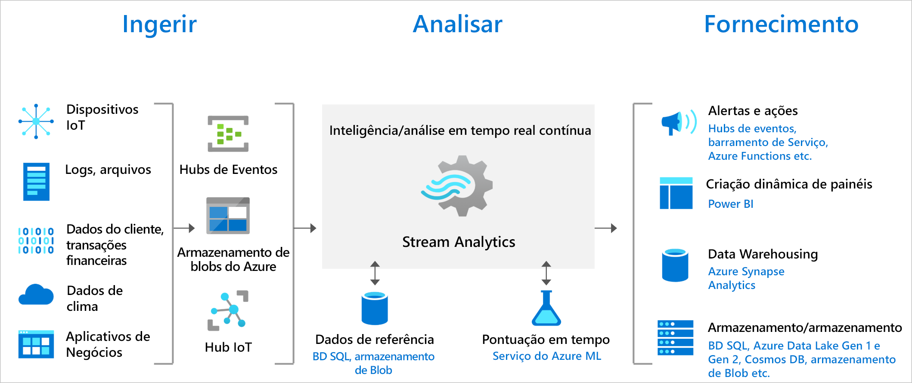

# Bem-vindo(a) ao Azure Stream Analytics

O Azure Stream Analytics é um mecanismo de processamento de eventos complexos e análise em tempo real desenvolvido para analisar e processar simultaneamente altos volumes de dados de streaming rápido a partir de várias fontes. É possível identificar padrões e relações em informações extraídas de diversas fontes de entrada, incluindo dispositivos, sensores, sequências de cliques, feeds de mídias sociais e aplicativos. Esses padrões podem ser usados para disparar ações e iniciar fluxos de trabalho, como criação de alertas, informações de feed para uma ferramenta de relatórios ou para armazenar dados transformados para uso posterior. Além disso, o Stream Analytics está disponível no runtime do Azure IoT Edge, permitindo o processamento de dados em dispositivos IoT.

Os cenários a seguir são exemplos de quando você pode usar o Azure Stream Analytics:

* Analisar streams de telemetria em tempo real de dispositivos IoT
* Análise de sequência de cliques/blogs
* Análise geoespacial para gerenciamento de frotas e veículos sem motoristas
* Monitoramento remoto e manutenção preditiva de ativos de alto valor
* Análise em tempo real em dados de pontos de venda para detecção de anomalias e controle de estoque

Experimente o Azure Stream Analytics com uma assinatura gratuita do Azure.

> [!div class="nextstepaction"]
> [Experimentar o Azure Stream Analytics](https://azure.microsoft.com/services/stream-analytics/)

## Como funciona o Stream Analytics?

Um trabalho do Azure Stream Analytics consiste em uma entrada, uma consulta e uma saída. O Stream Analytics ingere dados dos Hubs de Eventos do Azure (incluindo Hubs de Eventos do Azure do Apache Kafka), do Hub IoT do Azure ou do Armazenamento de Blobs do Azure. A consulta, que tem como base a linguagem de consulta SQL, pode ser usada para filtrar, classificar, agregar e associar dados de streaming com facilidade por um período de tempo. Também é possível estender essa linguagem SQL com UDFs (funções definidas pelo usuário) do JavaScript e do C#. Você pode ajustar com facilidade as opções de ordenação de eventos e a duração das janelas de tempo ao executar operações de agregação por meio de simples configurações e/ou constructos de linguagem.

Cada trabalho tem uma ou várias saídas para os dados transformados, e você pode controlar o que acontece em resposta às informações analisadas. Por exemplo, você pode:

* Enviar dados para serviços como Azure Functions, Filas ou Tópicos do Barramento de Serviço para disparar comunicações ou de fluxos de trabalho personalizados downstream.
* Enviar dados a um painel do Power BI para painéis em tempo real.
* Armazene dados em outros serviços de armazenamento do Azure (por exemplo, Azure Data Lake, Azure Synapse Analytics etc.) para treinar um modelo de machine learning com base em dados históricos ou para executar a análise de lote.

A imagem a seguir mostra como os dados são enviados ao Stream Analytics, analisados e enviados para outras ações, como armazenamento ou apresentação:

## Principais recursos e benefícios

O Azure Stream Analytics foi projetado para ser fácil de usar, flexível, confiável e escalonável para qualquer tamanho de trabalho. Ele está disponível em várias regiões do Azure e é executado no IoT Edge ou no Azure Stack.

## Facilidade de uso do guia de introdução

É fácil começar a usar o Azure Stream Analytics. Bastam alguns cliques para se conectar a várias fontes e coletores, assim criando um pipeline de ponta a ponta. O Stream Analytics pode se conectar a Hubs de Eventos do Azure e a Hub IoT do Azure para a ingestão de dados de fluxo, e ao Armazenamento de Blobs do Azure para ingerir dados históricos. A entrada de trabalho também pode incluir dados de referência estáticos ou com alteração lenta do Armazenamento de Blobs do Azure ou do Banco de Dados SQL, que você pode unir a dados de streaming para executar operações de pesquisa.

O Stream Analytics pode rotear a saída de trabalho para vários sistemas de armazenamento, como o Armazenamento de Blob do Azure, o Banco de Dados SQL do Azure, o Azure Data Lake Storage ou o Azure CosmosDB. Você também pode executar a análise de lote nas saídas de fluxos com o Azure Synapse Analytics ou o HDInsight ou enviar a saída para outro serviço, como os Hubs de Eventos para consumo ou o Power BI para visualização em tempo real.

Para acessar toda a lista de saídas do Stream Analytics, confira [Compreender as saídas do Azure Stream Analytics](stream-analytics-define-outputs.md).

## Produtividade do programador

O Azure Stream Analytics usa uma linguagem de consulta SQL que foi aumentada com restrições temporais avançadas para analisar os dados em movimento. Você também pode criar trabalhos usando ferramentas de desenvolvedor, como o Azure PowerShell, a CLI do Azure, as ferramentas do Visual Studio para o Stream Analytics, a [extensão do Visual Studio Code para o Stream Analytics](quick-create-visual-studio-code.md) ou os modelos do Azure Resource Manager. O uso de ferramentas de desenvolvedor permite a você criar consultas de transformação offline e usar o pipeline CI/CD para enviar trabalhos ao Azure.

A linguagem de consulta do Stream Analytics permite executar CEP (Processamento de Eventos Complexos) oferecendo uma ampla gama de funções para analisar dados de streaming. Essa linguagem de consulta dá suporte a manipulação simples de dados, funções de agregação e análise, funções geoespaciais, correspondência de padrões e detecção de anomalias. Você pode editar consultas no portal ou usando nossas ferramentas de desenvolvimento e testá-las usando os dados de exemplo extraídos de uma transmissão ao vivo.

Você pode estender os recursos da linguagem de consulta definindo e chamando funções adicionais. Você pode definir as chamadas de função no Azure Machine Learning para aproveitar as soluções desse serviço e integrar UDFs (funções definidas pelo usuário) de JavaScript ou C# ou agregações definidas pelo usuário para executar cálculos complexos como parte de uma consulta do Stream Analytics.

## Totalmente gerenciado

O Azure Stream Analytics é uma oferta (PaaS) totalmente gerenciada no Azure. Você não precisa provisionar nenhum hardware nem infraestrutura, atualizar o SO ou o software. O Azure Stream Analytics gerencia totalmente seu trabalho, de modo que você possa se concentrar na lógica de negócios e não na infraestrutura.

## Executar na nuvem ou na borda inteligente

O Azure Stream Analytics pode ser executado na nuvem, para uma análise em larga escala, ou no IoT Edge ou no Azure Stack para análise de latência extremamente baixa. O Azure Stream Analytics usa as mesmas ferramentas e linguagem de consulta na nuvem e na borda, permitindo que os desenvolvedores criem arquiteturas realmente híbridas para processamento de fluxo. 

## Custo total de propriedade baixo

Como um serviço de nuvem, o Stream Analytics é otimizado para que você possa economizar custos. Não há nenhum custo inicial envolvido; você só paga pelas [unidades de streaming consumidas](stream-analytics-streaming-unit-consumption.md). Não há nenhum compromisso ou provisionamento de cluster necessário e você pode aumentar ou reduzir verticalmente o trabalho com base em suas necessidades de negócios.

## Pronto para necessidades críticas

O Azure Stream Analytics está disponível em várias regiões em todo o mundo e foi projetado para executar cargas de trabalho críticas, dando suporte a requisitos de confiabilidade, segurança e conformidade.

### Confiabilidade

O Azure Stream Analytics garante o processamento de eventos exatamente uma vez e a entrega de eventos pelo menos uma vez, de modo que os eventos nunca são perdidos. O processamento exatamente uma vez é garantido com a saída selecionada, conforme descrito nas Garantias de Entrega de Evento.

O Azure Stream Analytics tem funcionalidades internas de recuperação no caso de falha na entrega de um evento. Além disso, o Stream Analytics fornece também pontos de verificação internos para manter o estado do trabalho e fornece resultados reproduzíveis.

Como um serviço gerenciado, o Stream Analytics garante o processamento de eventos com 99,9% de disponibilidade ao nível de granularidade do minuto. 

### Segurança

Em termos de segurança, o Azure Stream Analytics criptografa todas as comunicações de entrada e de saída e dá suporte ao TLS 1.2. Os pontos de verificação internos também são criptografados. O Stream Analytics não armazena os dados de entrada, pois todo o processamento é feito na memória. O Stream Analytics também dá suporte a VNET (Redes Virtuais do Azure) durante a execução de um trabalho em um [Cluster do Stream Analytics](./cluster-overview.md).

### Conformidade

O Azure Stream Analytics segue várias certificações de conformidade, conforme descrito na [Visão geral de conformidade do Azure](https://gallery.technet.microsoft.com/Overview-of-Azure-c1be3942). 

## Desempenho

O Stream Analytics pode processar milhões de eventos por segundo e fornecer resultados com latência ultrabaixa. Ele permite que você escale verticalmente e expanda para lidar com aplicativos grandes de processamento de eventos complexos e em tempo real. O Stream Analytics é compatível com um desempenho mais alto por meio do particionamento, permitindo que consultas complexas sejam colocadas em paralelo e executadas em vários nós de streaming. O Azure Stream Analytics é criado no [Trill](https://github.com/Microsoft/Trill), um mecanismo de análise de streaming na memória de alto desempenho desenvolvido em colaboração com a Microsoft Research.

## Próximas etapas

Agora você tem uma visão geral do Azure Stream Analytics. Em seguida, você pode se aprofundar e criar seu primeiro trabalho do Stream Analytics:

* [Criar um trabalho do Stream Analytics usando o portal do Azure](stream-analytics-quick-create-portal.md)
* [Criar um trabalho do Stream Analytics usando o Azure PowerShell](stream-analytics-quick-create-powershell.md)
* [Criar um trabalho do Stream Analytics usando o Visual Studio](stream-analytics-quick-create-vs.md)
* [Criar um trabalho do Stream Analytics usando o Visual Studio Code](quick-create-visual-studio-code.md)
