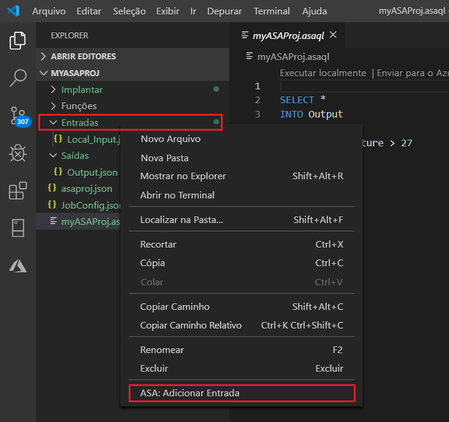
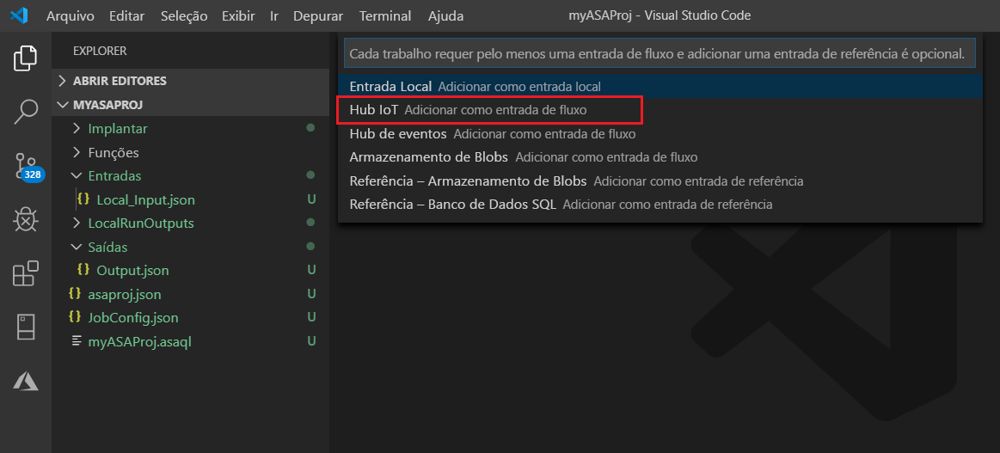
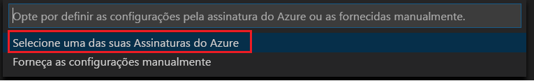
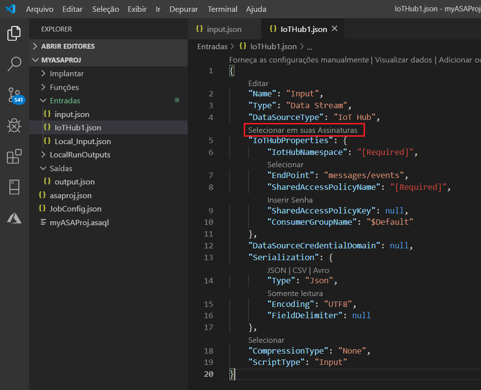
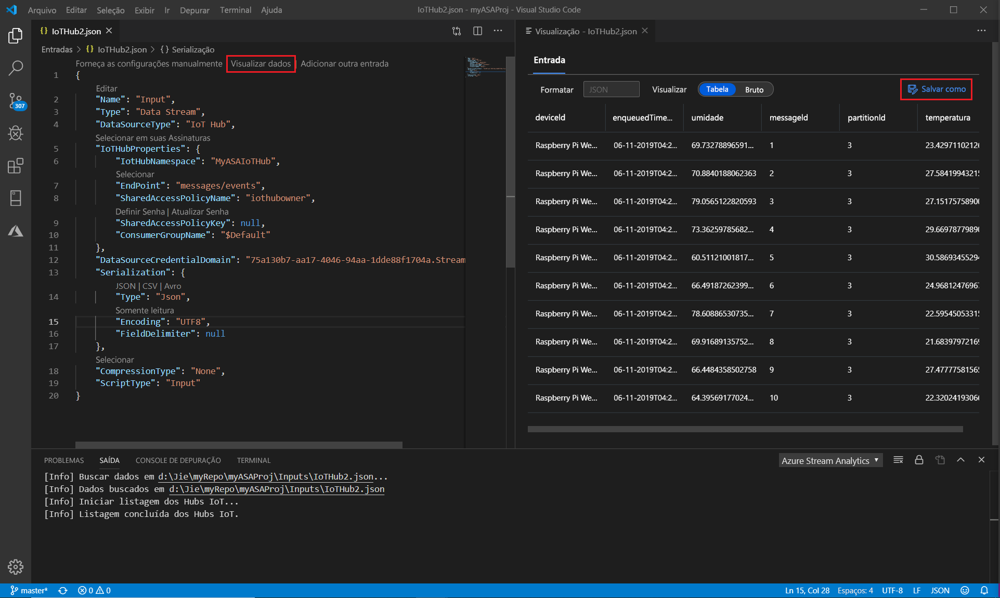

# Testar Stream Analytics consultas localmente contra entrada de fluxo ao vivo usando Visual Studio Code

Você pode usar as ferramentas de Azure Stream Analytics para Visual Studio Code para testar seus trabalhos de Stream Analytics localmente em relação à entrada de fluxo ao vivo. A entrada pode vir de uma fonte como hubs de eventos do Azure ou Hub IoT do Azure. Os resultados de saída são enviados como arquivos JSON para uma pasta em seu projeto chamada **LocalRunOutputs**.

## Pré-requisitos

* Instale o [SDK do .NET Core](https://dotnet.microsoft.com/download) e reinicie o Visual Studio Code.

* Use [este guia de início rápido](quick-create-vs-code.md) para aprender a criar um trabalho de Stream Analytics usando Visual Studio Code.

## Definir uma entrada de fluxo ao vivo

1. Clique com o botão direito do mouse na pasta **entradas** em seu projeto Stream Analytics. Em seguida, selecione **asa: Adicionar entrada** no menu de contexto.

   

   Você também pode selecionar **Ctrl + Shift + P** para abrir a paleta de comandos e inserir **asa: Adicionar entrada**.

   

2. Escolha um tipo de fonte de entrada na lista suspensa.

   

3. Se você adicionou a entrada da paleta de comandos, escolha o Stream Analytics script de consulta que usará a entrada. Ele deve ser preenchido automaticamente com o caminho do arquivo para **myASAproj. asaql**.

   

4. Escolha **selecionar em suas assinaturas do Azure** no menu suspenso.

    

5. Configure o arquivo JSON recém-gerado. Você pode usar o recurso CodeLens para ajudá-lo a inserir uma cadeia de caracteres, selecionar em uma lista suspensa ou alterar o texto diretamente no arquivo. A captura de tela a seguir mostra a **seleção de suas assinaturas** como um exemplo.

   

## Visualizar entrada

Para verificar se os dados de entrada estão chegando, selecione **Visualizar dados** em seu arquivo de configuração de entrada ao vivo na linha superior. Alguns dados de entrada vêm de um hub IoT e são mostrados na janela de visualização. A visualização pode levar alguns segundos para aparecer.

 

## Executar consultas localmente

Volte para o editor de consultas e selecione **executar localmente**. Em seguida, selecione **usar entrada ao vivo** na lista suspensa.

O resultado é mostrado na janela direita e atualizado a cada 3 segundos. Você pode selecionar **executar** para testar novamente. Você também pode selecionar **abrir na pasta** para ver os arquivos de resultado no explorador de arquivos e abri-los com Visual Studio Code ou uma ferramenta como o Excel. Observe que os arquivos de resultado estão disponíveis apenas no formato JSON.

A hora padrão para o trabalho começar a criar a saída é definida como **Now**. Você pode personalizar o tempo selecionando o botão **hora de início da saída** na janela resultado.

## Próximos passos

* [Explorar Azure Stream Analytics trabalhos com Visual Studio Code (versão prévia)](visual-studio-code-explore-jobs.md)

* [Configurar pipelines de CI/CD usando o pacote NPM](setup-cicd-vs-code.md)
