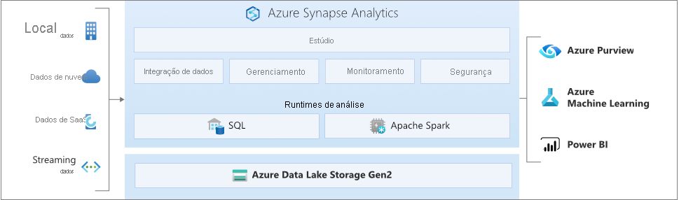

# O que é o Azure Synapse Analytics?

O **Azure Synapse** é um serviço de análise empresarial que acelera o tempo de descoberta de insights entre data warehouses e sistemas de Big Data. O Azure Synapse reúne o melhor das tecnologias de **SQL** usadas em data warehousing corporativo, tecnologias **Spark** usadas para Big Data, **Pipelines** para integração de dados e ETL/ELT e integração profunda com outros serviços do Azure, como **Power BI**, **CosmosDB** e **AzureML**.

## SQL líder do setor

O **SQL do Synapse** é um sistema de consulta distribuída para o T-SQL que permite cenários de data warehouse e virtualização de dados e estende o T-SQL para lidar com cenários de streaming e machine learning.

* O SQL do Synapse fornece modelos de recursos **sem servidor** e **dedicados**. Para obter desempenho e custo previsíveis, crie pools de SQL dedicados para reservar a capacidade de processamento para os dados armazenados em tabelas SQL. Para cargas de trabalho não planejadas ou intermitentes, use o ponto de extremidade SQL sem servidor e sempre disponível.
* Use funcionalidades internas de **streaming** para enviar dados de fontes de dados na nuvem para tabelas SQL
* Integrar a IA ao SQL usando modelos de **machine learning** para pontuar dados empregando a [função T-SQL PREDICT](/sql/t-sql/queries/predict-transact-sql?view=azure-sqldw-latest&preserve-view=true)

## Apache Spark padrão do setor

O **Apache Spark para Azure Synapse** integra-se total e perfeitamente ao Apache Spark, o mecanismo de Big Data de software livre mais popular usado para preparação de dados, engenharia de dados, ETL e aprendizado de máquina.

* Os modelos de ML com algoritmos do SparkML e integração do AzureML para Apache Spark 2.4 com suporte interno para o Linux Foundation Delta Lake.
* Modelo de recursos simplificado que libera você das preocupações com o gerenciamento de clusters.
* Inicialização rápida do Spark e dimensionamento automático agressivo.
* Suporte interno para .NET para Spark, permitindo que você reutilize sua experiência com C# e o código .NET existente em um aplicativo Spark.

## Como trabalhar com o Data Lake

O Azure Synapse remove as barreiras de tecnologia tradicionais entre o uso do SQL e do Spark juntos. Você pode fazer combinações e correspondências perfeitas de acordo com as suas necessidades e a sua experiência.

* As tabelas definidas em arquivos no data lake são consumidas continuamente pelo Spark ou pelo Hive.
* O SQL e o Spark podem explorar e analisar diretamente arquivos Parquet, CSV, TSV e JSON armazenados no data lake.
* Carregamento de dados rápido e escalonável entre bancos de dados SQL e do Spark

## Integração de dados interna

O Azure Synapse contém o mesmo mecanismo de Integração de Dados e as mesmas experiências do Azure Data Factory, permitindo que você crie pipelines de ETL avançados em escala sem sair do Azure Synapse Analytics.

* Ingira dados de mais de 90 fontes de dados
* ETL sem código com atividades de fluxo de dados
* Orquestre notebooks, trabalhos do Spark, procedimentos armazenados, scripts SQL, entre outros

## Gerenciamento unificado, monitoramento e segurança

O Azure Synapse fornece um só modo para que as empresas gerenciem recursos de análise, monitorem o uso e a atividade e imponham a segurança.

* Atribuir usuários a uma função para simplificar o acesso aos recursos de análise
* Controle de acesso refinado sobre dados e código
* Um só painel para monitorar recursos, uso e usuários no SQL e no Spark

## Experiência unificada

O **Synapse Studio** é a experiência do usuário que reúne tudo para engenheiros de dados. Ele permite que eles realizem todas as tarefas necessárias para criar uma solução de análise completa.

* As principais tarefas dos engenheiros de dados em um só lugar: ingerir, explorar, preparar, orquestrar, visualizar
* Produtividade líder do setor que trabalham com a codificação SQL ou Spark: criação, depuração e otimização de desempenho
* Fazer integração com os processos CI/CD empresariais

## Interaja com a comunidade do Azure Synapse

- [Microsoft Q&A](/answers/topics/azure-synapse-analytics.html): faça perguntas técnicas.
- [Stack Overflow](https://stackoverflow.com/questions/tagged/azure-synapse): Faça perguntas sobre desenvolvimento.

## Próximas etapas

* [Introdução ao Azure Synapse Analytics](get-started.md)
* [Criar um workspace](quickstart-create-workspace.md)
* [Usar o pool de SQL sem servidor](quickstart-sql-on-demand.md)
