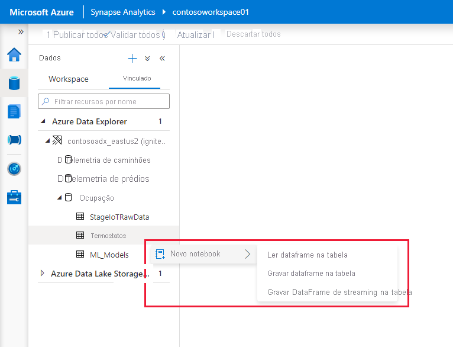

# Conectar-se ao Azure Data Explorer usando o Apache Spark para Azure Synapse Analytics

Este artigo descreve como acessar um banco de dados do Azure Data Explorer por meio do Synapse Studio com o Apache Spark para Azure Synapse Analytics.

## Pré-requisitos

* [Criar um cluster e um banco de dados no Azure Data Explorer](/azure/data-explorer/create-cluster-database-portal).
* Ter um workspace do Azure Synapse Analytics ou criar um workspace seguindo as etapas descritas em [Guia de Início Rápido: Criar um workspace do Azure Synapse](./quickstart-create-workspace.md).
* Ter um Pool do Apache Spark ou criar um pool seguindo as etapas descritas em [Guia de Início Rápido: Criar um Pool do Apache Spark usando o portal do Azure](./quickstart-create-apache-spark-pool-portal.md).
* [Crie um aplicativo do Azure AD (Azure Active Directory) provisionando um aplicativo do Azure AD](/azure/data-explorer/kusto/management/access-control/how-to-provision-aad-app).
* Conceder ao aplicativo do Azure AD acesso ao banco de dados seguindo as etapas descritas em [Gerenciar permissões de banco de dados do Azure Data Explorer](/azure/data-explorer/manage-database-permissions).

## Acessar o Synapse Studio

Em um workspace do Azure Synapse, selecione **Inicializar o Synapse Studio**. Na home page do Synapse Studio, selecione **Dados** para acessar o **Pesquisador de Objetos de Dados**.

## Conectar um banco de dados do Azure Data Explorer a um workspace do Azure Synapse

A conexão de um banco de dados do Azure Data Explorer com um workspace é feita por meio de um serviço vinculado. Com um serviço vinculado do Azure Data Explorer, você pode procurar e explorar dados, além de fazer leituras e gravações do Apache Spark para o Azure Synapse. Você também pode executar trabalhos de integração em um pipeline.

No Pesquisador de Objetos de Dados, siga estas etapas para conectar diretamente um cluster do Azure Data Explorer:

1. Selecione o ícone **+** perto de **Dados**.
1. Escolha **Conectar** para se conectar aos dados externos.
1. Selecione **Azure Data Explorer (Kusto)** .
1. Selecione **Continuar**.
1. Use um nome amigável para nomear o serviço vinculado. O nome será exibido no Pesquisador de Objetos de Dados e será usado pelos runtimes do Azure Synapse para se conectar ao banco de dados.
1. Selecione o cluster do Azure Data Explorer na sua assinatura ou insira o URI.
1. Insira a **ID da entidade de serviço** e a **Chave da entidade de serviço**. Verifique se essa entidade de serviço tem acesso de exibição no banco de dados para a operação de leitura e acesso de ingestão para a ingestão de dados.
1. Insira o nome do banco de dados do Azure Data Explorer.
1. Selecione **Testar conectividade** para verificar se você tem as permissões corretas.
1. Selecione **Criar**.

    

    > [!NOTE]
    > (Opcional) **Testar conectividade** não valida o acesso de gravação. Verifique se a ID da entidade de serviço tem acesso de gravação ao banco de dados do Azure Data Explorer.

1. Os clusters e os bancos de dados do Azure Data Explorer são exibidos na guia **Vinculados** da seção **Azure Data Explorer**.

    

    > [!NOTE]
    > Na versão atual, os objetos de banco de dados são populados com base nas permissões da sua conta do Azure AD nos bancos de dados do Azure Data Explorer. Quando você executar notebooks ou trabalhos de integração do Apache Spark, a credencial do serviço de link será usada (por exemplo, entidade de serviço).

## Interagir rapidamente com ações geradas por código

Quando você clicar com o botão direito do mouse em um banco de dados ou uma tabela, uma lista de notebooks de exemplo do Spark será exibida. Selecione uma opção para ler, gravar ou transmitir dados para o Azure Data Explorer.

Veja um exemplo de leitura de dados. Anexe o notebook ao Pool do Spark e execute a célula.

   > [!NOTE]
   > A primeira execução pode levar mais de três minutos para iniciar a sessão do Spark. As execuções subsequentes serão significativamente mais rápidas.

## Limitações

Atualmente, o conector do Azure Data Explorer não é compatível com redes virtuais gerenciadas do Azure Synapse.

## Próximas etapas

* [Código de exemplo com opções avançadas](https://github.com/Azure/azure-kusto-spark/blob/master/samples/src/main/python/SynapseSample.py)
* [Conector do Spark do Azure Data Explorer (Kusto)](https://github.com/Azure/azure-kusto-spark)