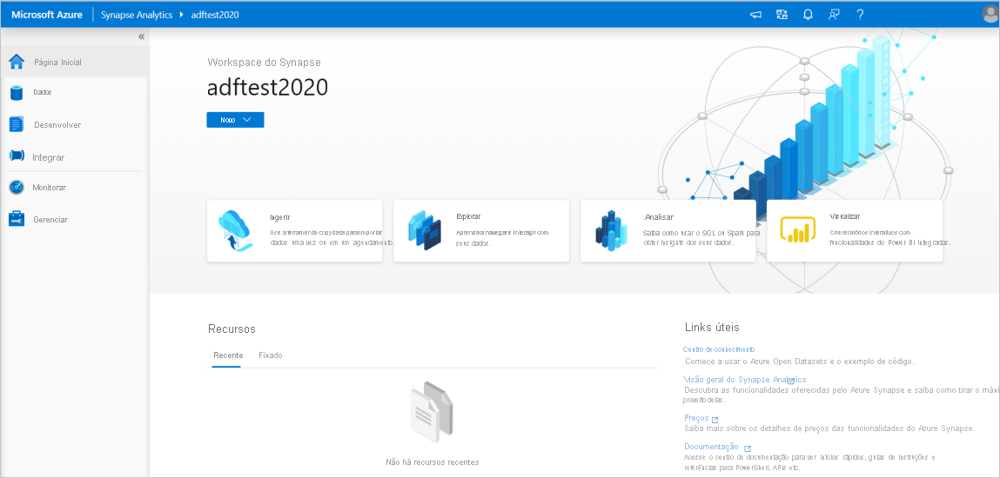
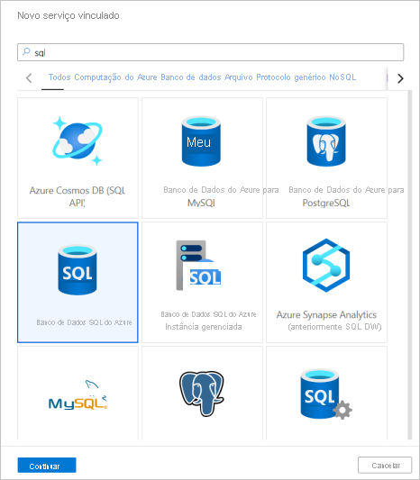
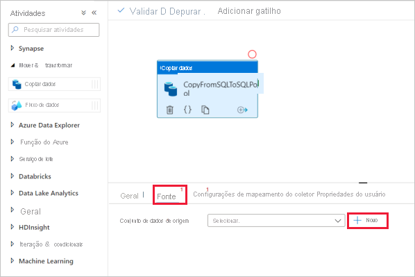
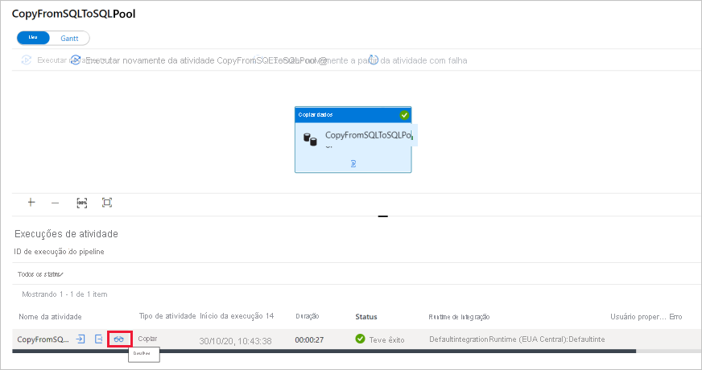

# Início rápido: Carregar dados no pool de SQL dedicado usando a atividade de cópia

O Azure Synapse Analytics oferece vários mecanismos de análise para ajudar você a ingerir, transformar, modelar e analisar seus dados. Um pool de SQL dedicado oferece recursos de computação e armazenamento baseados em T-SQL. Após a criação de um pool de SQL dedicado no workspace do Azure Synapse, os dados poderão ser carregados, modelados, processados e entregues para obter insights analíticos mais rapidamente.

Neste guia de início rápido, você aprende a *carregar dados do Banco de Dados SQL do Azure no Azure Synapse Analytics*. Você pode seguir as etapas semelhantes para copiar dados de outros tipos de armazenamentos de dados. Esse fluxo semelhante também se aplica à cópia de dados para outras fontes e coletores.

## Pré-requisitos

* Assinatura do Azure: Se você não tiver uma assinatura do Azure, crie uma [conta gratuita](https://azure.microsoft.com/free/) antes de começar.
* Workspace do Azure Synapse: Crie um workspace do Azure Synapse usando o portal do Azure e seguindo as instruções no [Guia de início rápido: Criar um workspace do Synapse](quickstart-create-workspace.md).
* Banco de Dados SQL do Azure: Este tutorial copia os dados do conjunto de dados de amostra do Adventure Works LT no Banco de Dados SQL do Azure. Você pode criar um banco de dados de exemplo no Banco de Dados SQL seguindo as instruções em [Criar um banco de dados de exemplo no Banco de Dados SQL do Azure](../azure-sql/database/single-database-create-quickstart.md). Ou você pode usar outros armazenamentos de dados seguindo as etapas semelhantes.
* Conta de armazenamento do Azure: O Armazenamento do Azure é usado como a área *de preparo* na operação de cópia. Se você não tiver uma conta de armazenamento do Azure, confira as instruções em [Criar uma conta de armazenamento](../storage/common/storage-account-create.md).
* Azure Synapse Analytics: Você usa um pool de SQL dedicado como um armazenamento de dados de coletor. Se você não tiver uma instância do Azure Synapse Analytics, confira [Criar um pool de SQL dedicado](quickstart-create-sql-pool-portal.md) para obter as etapas de como criar uma.

### Navegar até o Synapse Studio

Depois de criar o workspace do Azure Synapse, você tem duas maneiras de abrir o Synapse Studio:

* Abra o workspace do Synapse no [portal do Azure](https://ms.portal.azure.com/#home). Selecione **Abrir** no cartão Abrir o Synapse Studio em Introdução.
* Abra o [Azure Synapse Analytics](https://web.azuresynapse.net/) e entre no seu workspace.

Neste guia de início rápido, usamos o workspace chamado "adftest2020" como um exemplo. Você será direcionado automaticamente para a home page do Synapse Studio.

## Criar serviços vinculados

No Azure Synapse Analytics, um serviço vinculado é onde você define as informações de conexão com outros serviços. Nesta seção, você criará os seguintes dois tipos de serviços vinculados: Serviços vinculados do Banco de Dados SQL do Azure e do ADLS Gen2 (Azure Data Lake Storage Gen2).

1. Na home page do Synapse Studio, selecione a guia **Gerenciar** no painel de navegação à esquerda.
1. Em Conexões externas, selecione Serviços vinculados.
  
   

1. Para adicionar um serviço vinculado, selecione **Novo**.
1. Selecione **Banco de Dados SQL do Azure** por meio da galeria e, em seguida, selecione **Continuar**. Você pode digitar "SQL" na caixa de pesquisa para filtrar os conectores.

   

1. Na página Novo Serviço Vinculado, selecione o nome do servidor e nome do BD na lista suspensa e especifique o nome de usuário e a senha. Clique em **Testar conectividade** para validar as configurações e selecione **Criar**.

   

1. Repita as etapas 3 a 4, mas selecione **Azure Data Lake Storage Gen2** em vez da galeria. Na página Novo Serviço Vinculado, selecione o nome da conta de armazenamento na lista suspensa. Clique em **Testar conectividade** para validar as configurações e selecione **Criar**. 

   
 
## Criar um pipeline

Um pipeline contém o fluxo lógico para uma execução de um conjunto de atividades. Nesta seção, você criará um pipeline que contém uma atividade de cópia que ingere dados do Banco de Dados SQL do Azure em um pool de SQL dedicado.

1. Vá para a guia **Integrar**. Selecione o ícone de adição ao lado do cabeçalho de pipelines e selecione Pipeline.

   

1. Em *Mover e Transformar* no painel *Atividades*, arraste **Copiar dados** na tela do pipeline.
1. Selecione a atividade de cópia e acesse a guia Origem. Selecione **Novo** para criar um conjunto de dados de origem.

   

1. Selecione **Banco de Dados SQL do Azure** como o seu armazenamento de dados e selecione **Continuar**.
1. No painel *Definir propriedades*, selecione o serviço vinculado Banco de Dados SQL do Azure que você criou na etapa anterior. 
1. Em Nome da tabela, selecione uma tabela de exemplo a ser usada na atividade de cópia a seguir. Neste guia de início rápido, usamos a tabela "SalesLT.Customer" como exemplo. 

   
1. Selecione **OK** quando terminar.
1. Selecione a atividade de cópia e acesse a guia Coletor. Selecione **Novo** para criar um conjunto de dados do coletor.
1. Selecione o **pool de SQL dedicado do Azure Synapse** como o seu armazenamento de dados e selecione **Continuar**.
1. No painel **Definir propriedades**, selecione o pool de Análise de SQL que você criou na etapa anterior. Se você estiver escrevendo em uma tabela existente, em *Nome da tabela* selecione-a na lista suspensa. Caso contrário, marque "Editar" e insira o nome da nova tabela. Selecione **OK** quando terminar.
1. Para configurações do conjunto de dados de Coleta, habilite a **Criação automática de tabela** no campo de opção Tabela.

   

1. Na página **Configurações**, selecione a caixa de seleção **Habilitar preparo**. Essa opção se aplicará se os dados de origem não forem compatíveis com o PolyBase. Na seção **Configurações de preparo**, selecione o serviço vinculado Azure Data Lake Storage Gen2 que você criou na etapa anterior como o armazenamento de preparo. 

    O armazenamento é usado para preparar os dados antes de serem carregados no Azure Synapse Analytics usando o PolyBase. Depois que a cópia for concluída, os dados provisórios no Azure Data Lake Storage Gen2 serão limpos automaticamente.

   

1. Para validar o pipeline, selecione **Validar** na barra de ferramentas. Você verá o resultado da saída de validação do Pipeline no lado direito da página. 

## Depurar e publicar o pipeline

Depois de concluir a configuração do pipeline, você poderá efetuar uma execução de depuração antes de publicar seus artefatos para verificar se tudo está correto.

1. Para depurar o pipeline, selecione **Depurar** na barra de ferramentas. Você verá o status da execução do pipeline na guia **Saída** na parte inferior da janela. 

   

1. Depois que o pipeline for executado com sucesso, na barra de ferramentas superior, selecione **Publicar tudo**. Esta ação publica as entidades (conjuntos de dados e pipelines) criadas por você anteriormente no Synapse Analytics.
1. Aguarde até que você veja a mensagem **Publicado com êxito**. Para ver as mensagens de notificação, selecione o botão de sino no canto superior direito. 

## Acionar e monitorar o pipeline

Nesta seção, você dispara manualmente o pipeline publicado na etapa anterior. 

1. Selecione **Adicionar gatilho** na barra de ferramentas e selecione **Disparar Agora**. Na página **Execução de pipeline**, selecione **OK**.  
1. Vá para a guia **Monitorar** localizada na barra lateral esquerda. Você verá uma execução do pipeline que é disparada por um gatilho manual. 
1. Quando a execução do pipeline for concluída com êxito, selecione o link na coluna **Nome do pipeline** para exibir os detalhes da execução da atividade ou para executar novamente o pipeline. Neste exemplo, há apenas uma atividade, então você vê apenas uma entrada na lista. 
1. Para obter detalhes sobre a operação de cópia, selecione o link **Detalhes** (ícone de óculos) na coluna **Nome de atividade**. Você pode monitorar detalhes como o volume de dados copiados da fonte para o coletor, taxa de transferência de dados, etapas de execução com duração correspondente e configurações usadas.

   

1. Para voltar à exibição de execuções de pipeline, selecione o link **Todos os pipelines são executados** na parte superior. Selecione **Atualizar** para atualizar a lista.
1. Verifique se os dados estão gravados corretamente no pool de SQL dedicado.

## Próximas etapas

Vá para o seguinte artigo para saber mais sobre o suporte do Azure Synapse Analytics:

> [!div class="nextstepaction"]
> [Pipeline e atividades](../data-factory/concepts-pipelines-activities.md?bc=%2fazure%2fsynapse-analytics%2fbreadcrumb%2ftoc.json&toc=%2fazure%2fsynapse-analytics%2ftoc.json)
> [Visão geral do conector](../data-factory/connector-overview.md?bc=%2fazure%2fsynapse-analytics%2fbreadcrumb%2ftoc.json&toc=%2fazure%2fsynapse-analytics%2ftoc.json)
> [Atividade de cópia](../data-factory/copy-activity-overview.md?bc=%2fazure%2fsynapse-analytics%2fbreadcrumb%2ftoc.json&toc=%2fazure%2fsynapse-analytics%2ftoc.json)