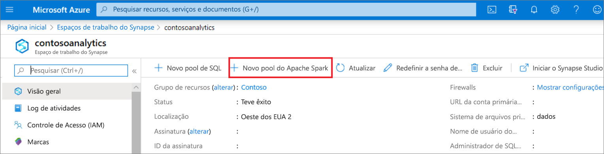
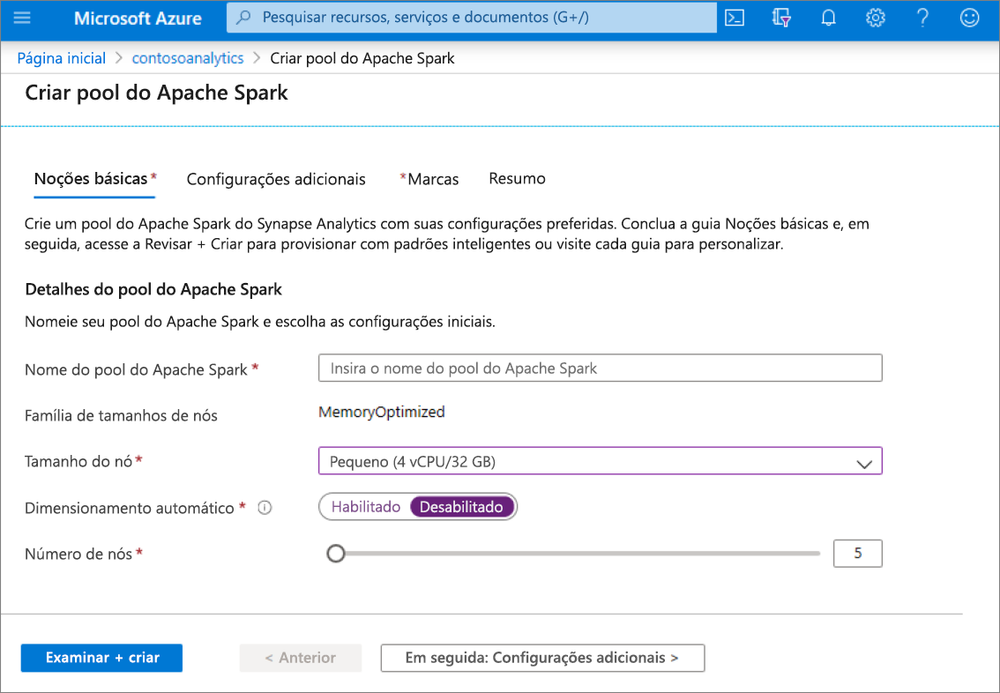
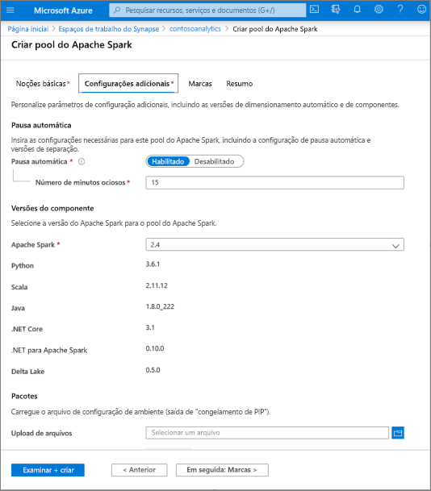
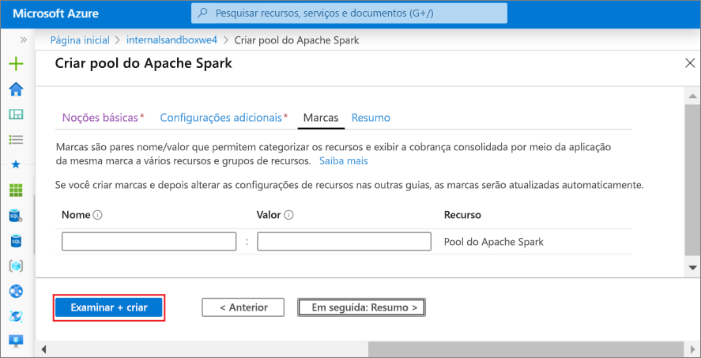
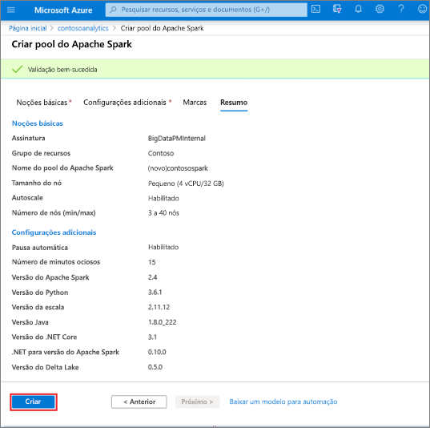
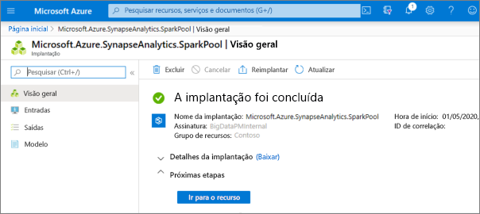
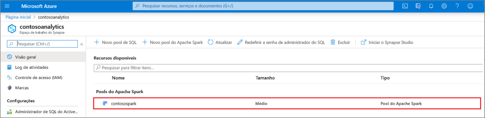
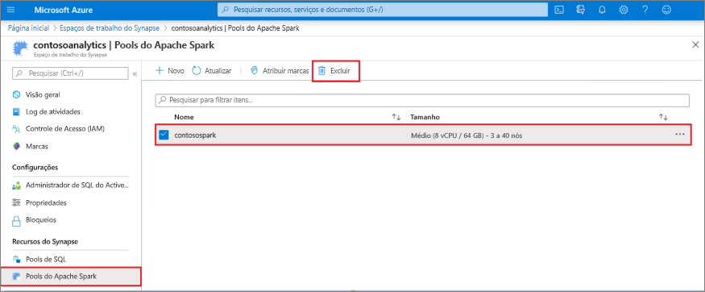
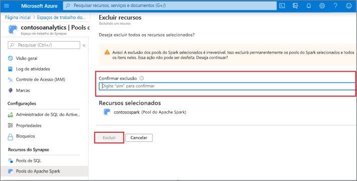

# Início Rápido: criar um pool do Apache Spark sem servidor usando o portal do Azure

O Azure Synapse Analytics oferece vários mecanismos de análise para ajudar você a ingerir, transformar, modelar, analisar e distribuir seus dados. Um Pool do Apache Spark fornece funcionalidades de software livre de computação de Big Data. Após a criação de um pool do Apache Spark em seu workspace do Synapse, os dados podem ser carregados, modelados, processados e distribuídos para chegar mais rapidamente a insights analíticos.

Neste início rápido, você aprenderá a usar o portal do Azure para criar um Pool do Apache Spark em um workspace do Synapse.

> [!IMPORTANT]
> A cobrança das instâncias do Spark será proporcional por minuto, independentemente de elas estarem sendo usadas ou não. Desligue a instância do Spark depois de terminar de usá-la ou defina um tempo limite curto. Para saber mais, confira a seção **Recursos de limpeza** deste artigo.

Se você não tiver uma assinatura do Azure, [crie uma conta gratuita antes de começar](https://azure.microsoft.com/free/).

## Pré-requisitos

- Assinatura do Azure - [criar uma gratuitamente](https://azure.microsoft.com/free/)
- [Workspace do Synapse Analytics](quickstart-create-workspace.md)

## Entre no Portal do Azure

Entre no [Portal do Azure](https://portal.azure.com/)

## Navegue até o workspace do Synapse 
1. Navegue até o workspace do Synapse em que o pool do Apache Spark será criado digitando o nome do serviço (ou o nome do recurso diretamente) na barra de pesquisa.

1. Na lista de workspaces, digite o nome (ou parte do nome) do workspace a ser aberto. Para este exemplo, vamos usar um workspace chamado **contosoanalytics**.

## Criar um Pool do Apache Spark

1. No workspace do Synapse em que deseja criar o Pool do Apache Spark, selecione em **Novo Pool do Apache Spark**.
    
2. Insira os seguintes detalhes na guia **Informações Básicas**:

    |Configuração | Valor sugerido | Descrição |
    | :------ | :-------------- | :---------- |
    | **Nome do Pool do Apache Spark** | Um nome de pool válido | Esse é o nome que o Pool do Apache Spark terá. |
    | **Tamanho do nó** | Pequeno (4 vCPU/32 GB) | Defina isso com o menor tamanho para reduzir os custos deste início rápido |
    | **Autoescala** | Desabilitado | Não precisamos de dimensionamento automático para este início rápido |
    | **Número de nós** | 5 | Use um tamanho pequeno para limitar os custos deste início rápido |

    
    > [!IMPORTANT]
    > Observe que há limitações específicas para os nomes que os pools do Apache Spark podem usar. Os nomes precisam conter apenas letras ou números, ter 15 caracteres ou menos, começar com uma letra, ser exclusivos no workspace e não devem conter palavras reservadas.

3. Selecione **Avançar: configurações adicionais** e examine as configurações padrão. Não modifique nenhuma configuração padrão.
    

4. Selecione **Avançar: marcas**. Não adicione nenhuma marca.
    

5. Selecione **Examinar + criar**.

6. Verifique se os detalhes estão corretos com base no que foi inserido anteriormente e selecione **Criar**.
    

7. Neste ponto, o fluxo de provisionamento de recursos será iniciado, indicando quando estiver concluído.
    

8. Após a conclusão do provisionamento, se você navegar novamente até o workspace, será mostrada uma nova entrada para o Pool do Apache Spark recém-criado.
    

9. Neste ponto, não há recursos em execução, nenhum custo pelo Spark e você criou metadados sobre as instâncias do Spark que deseja criar.

## Limpar os recursos

Siga as etapas abaixo para excluir o Pool do Apache Spark do workspace.
> [!WARNING]
> A exclusão de um Pool do Apache Spark removerá o mecanismo de análise do workspace. Não será mais possível se conectar ao pool e todas as consultas, os pipelines e os notebooks que usam esse Pool do Apache Spark deixarão de funcionar.

Caso deseje excluir o Pool do Apache Spark, faça o seguinte:

1. Navegue até a folha de pools do Apache Spark no workspace.
2. Escolha o pool do Apache Spark a ser excluído (neste caso, **contosospark**).
3. Selecione **delete**.
 
4. Confirme a exclusão e selecione o botão **Delete**.
 
5. Quando o processo for concluído com êxito, o Pool do Apache Spark não estará mais listado nos recursos do workspace.

## Próximas etapas

- Confira [Início Rápido: Criar um notebook do Apache Spark](quickstart-apache-spark-notebook.md).
- Confira [Início Rápido: criar um pool de SQL dedicado usando o portal do Azure](quickstart-create-sql-pool-portal.md).
