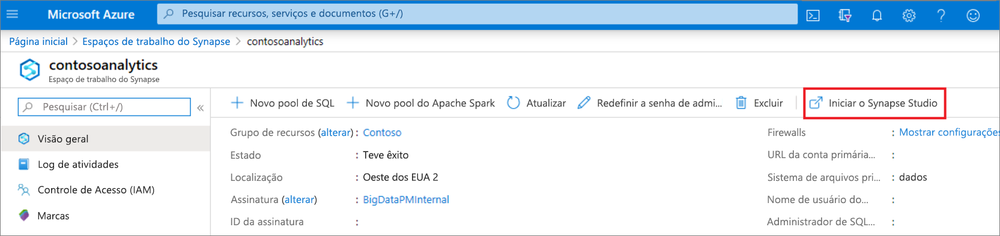
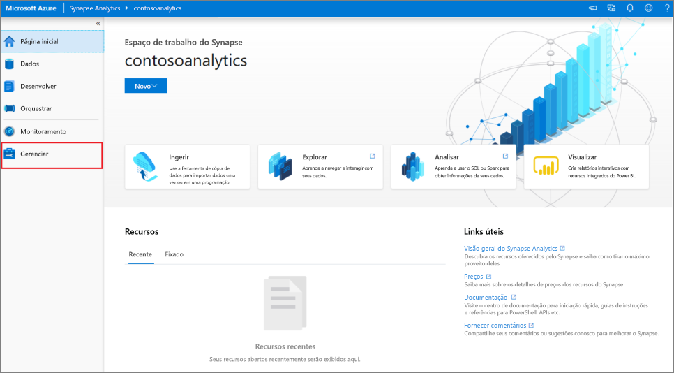
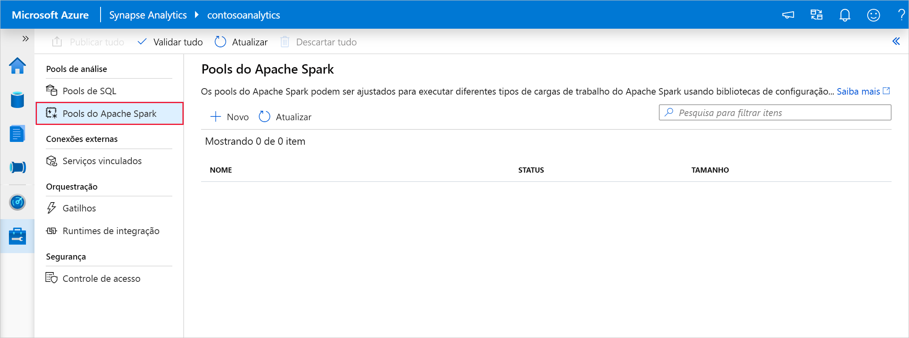
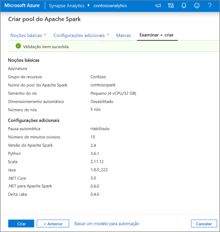
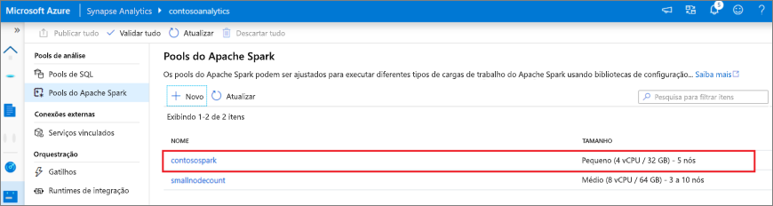
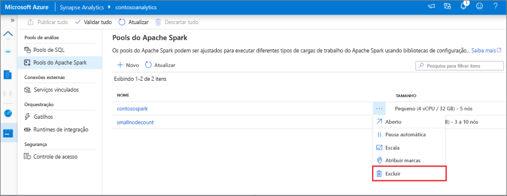

# Início rápido: Criar um Pool do Apache Spark sem servidor usando o Synapse Studio

O Azure Synapse Analytics oferece vários mecanismos de análise para ajudar você a ingerir, transformar, modelar, analisar e fornecer seus dados. O Pool do Apache Spark oferece funcionalidades de software livre de computação de Big Data. Depois que você criar um Pool do Apache Spark em seu workspace do Synapse, os dados poderão ser carregados, modelados, processados e fornecidos para obter insights.  

Este início rápido descreve as etapas para criar um pool do Apache Spark em um workspace do Synapse usando o Synapse Studio.

> [!IMPORTANT]
> A cobrança das instâncias do Spark será proporcional por minuto, independentemente de elas estarem sendo usadas ou não. Desligue a instância do Spark depois de terminar de usá-la ou defina um tempo limite curto. Para saber mais, confira a seção **Recursos de limpeza** deste artigo.

Se você não tiver uma assinatura do Azure, [crie uma conta gratuita antes de começar](https://azure.microsoft.com/free/).

## Pré-requisitos

- Assinatura do Azure - [criar uma gratuitamente](https://azure.microsoft.com/free/)
- [Workspace do Synapse](./quickstart-create-workspace.md)

## Entre no Portal do Azure

Entre no [Portal do Azure](https://portal.azure.com/)

## Navegue até o workspace do Synapse

1. Navegue até o workspace do Synapse em que o pool do Apache Spark será criado digitando o nome do serviço (ou o nome do recurso diretamente) na barra de pesquisa.

    
1. Na lista de workspaces, digite o nome (ou parte do nome) do workspace a ser aberto. Para este exemplo, vamos usar um workspace chamado **contosoanalytics**.

    

## Iniciar o Synapse Studio 

Na visão geral do workspace, selecione a **URL da Web do workspace** para abrir o Synapse Studio.

## Criar o pool do Apache Spark no Synapse Studio

1. Na home page do Synapse Studio, navegue até o **Hub de Gerenciamento** no painel de navegação esquerdo selecionando o ícone **Gerenciar**.

    

1. Uma vez no Hub de Gerenciamento, navegue até a seção **Pools do Apache Spark** para ver a lista atual de pools do Apache Spark disponíveis no workspace.
    
    

1. Selecione **+ Novo** e o novo assistente de criação de pool do Apache Spark será exibido. 

1. Insira os seguintes detalhes na guia **Informações Básicas**:

    | Configuração | Valor sugerido | Descrição |
    | :------ | :-------------- | :---------- |
    | **Nome do Pool do Apache Spark** | contosospark | Esse é o nome que o Pool do Apache Spark terá. |
    | **Tamanho do nó** | Pequeno (4 vCPU/32 GB) | Defina isso com o menor tamanho para reduzir os custos deste início rápido |
    | **Autoescala** | Desabilitado | Não precisamos de dimensionamento automático neste início rápido |
    | **Número de nós** | 8 | Use um tamanho pequeno para limitar os custos do início rápido|
       
    
    
    > [!IMPORTANT]
    > Observe que há limitações específicas para os nomes que os pools do Apache Spark podem usar. Os nomes precisam conter apenas letras ou números, ter 15 caracteres ou menos, começar com uma letra, ser exclusivos no workspace e não devem conter palavras reservadas.

1. Na próxima guia (Configurações adicionais), deixe todas as configurações padrão.

1. Não adicionaremos marcas por enquanto, portanto, selecione **Revisar + criar**.

1. Na guia **Examinar + criar**, verifique se os detalhes estão corretos com base no que foi inserido anteriormente e clique em **Criar**. 

    

1. O pool do Apache Spark iniciará o processo de provisionamento.

1. Quando o provisionamento for concluído, o novo pool do Apache Spark aparecerá na lista.
    
    

## Limpar recursos do pool do Apache Spark usando o Synapse Studio

Siga as etapas abaixo para excluir o pool do Apache Spark do workspace usando o Synapse Studio.
> [!WARNING]
> A exclusão de um pool do Spark removerá o mecanismo de análise do workspace. Não será mais possível se conectar ao pool e todas as consultas, os pipelines e os notebooks que usam esse Pool do Spark deixarão de funcionar.

Caso deseje excluir o Pool do Apache Spark, faça o seguinte:

1. Navegue até os pools do Apache Spark no Hub de Gerenciamento no Synapse Studio.
1. Selecione as reticências ao lado do pool do Apache a ser excluído (nesse caso, **contosospark**) para mostrar os comandos do pool do Apache Spark.

    

1. Selecione **delete**.
1. Confirme a exclusão e selecione o botão **Delete**.
1. Quando o processo for concluído com êxito, o Pool do Apache Spark não estará mais listado nos recursos do workspace. 

## Próximas etapas

- Confira [Início Rápido: Criar um Pool do Apache Spark no Synapse Studio usando ferramentas da Web](quickstart-apache-spark-notebook.md).
- Confira [Início Rápido: Criar um Pool do Apache Spark usando o portal do Azure](quickstart-create-apache-spark-pool-portal.md).
