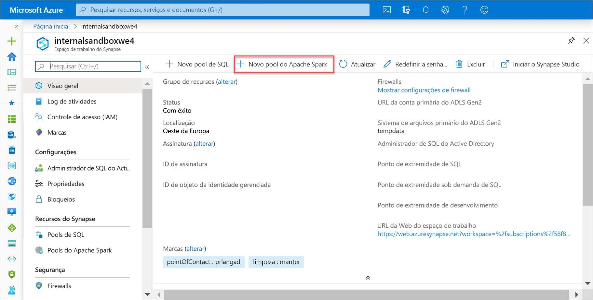
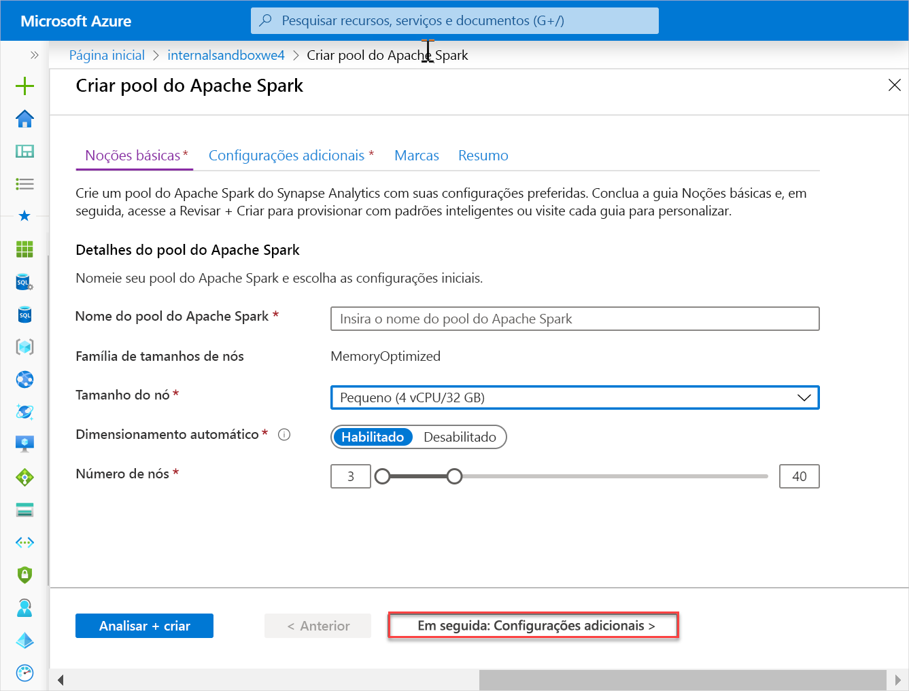
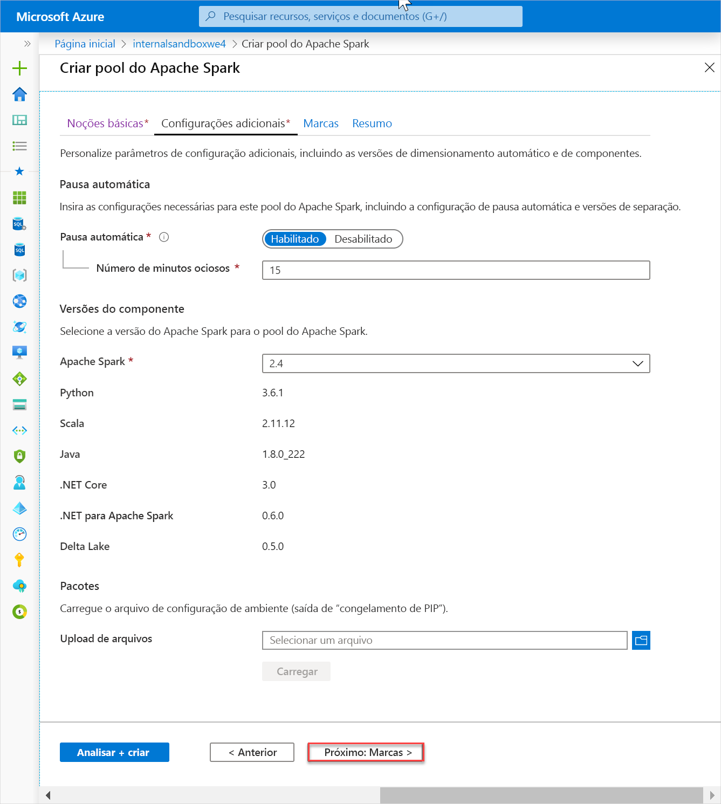
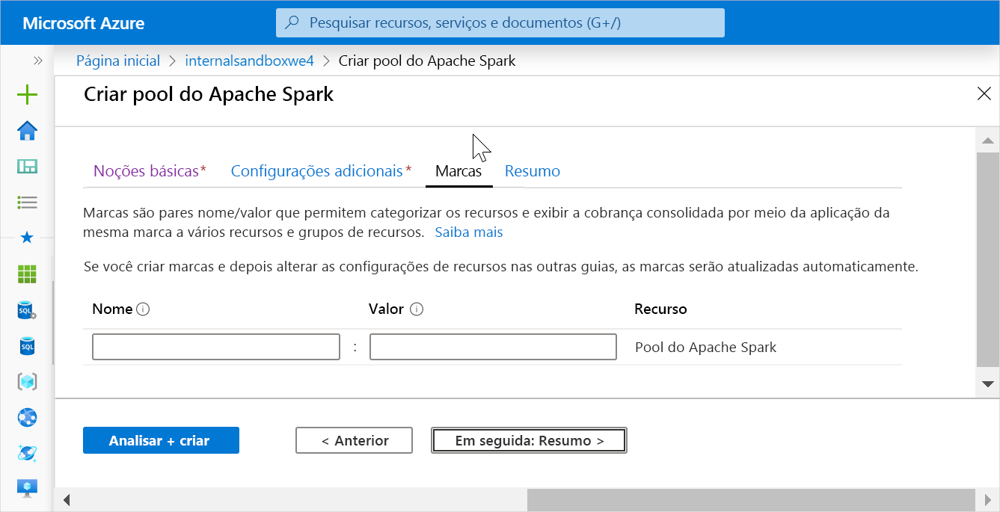
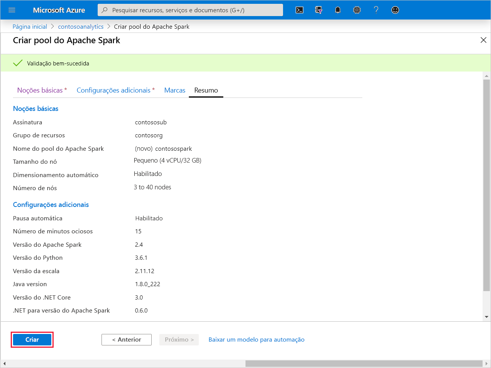
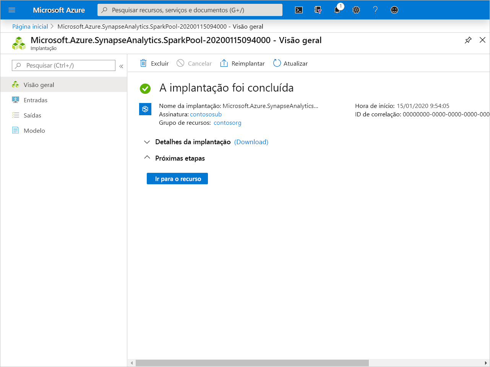
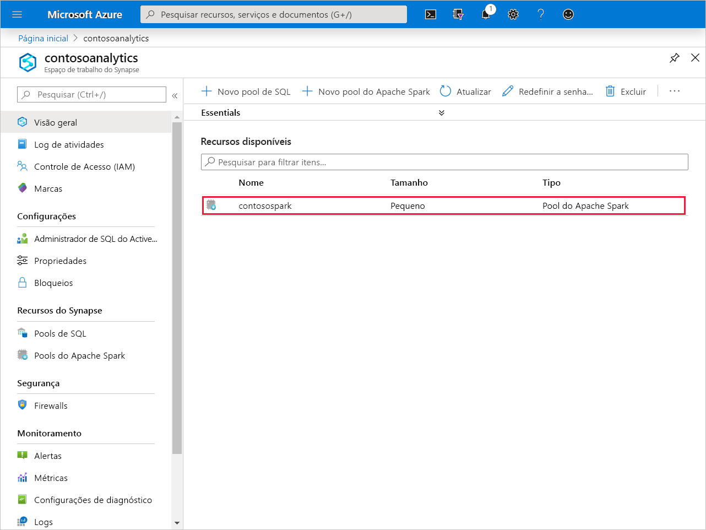
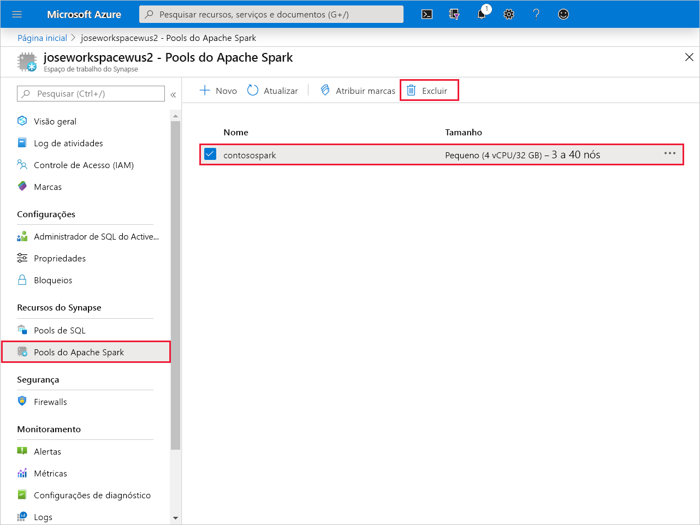
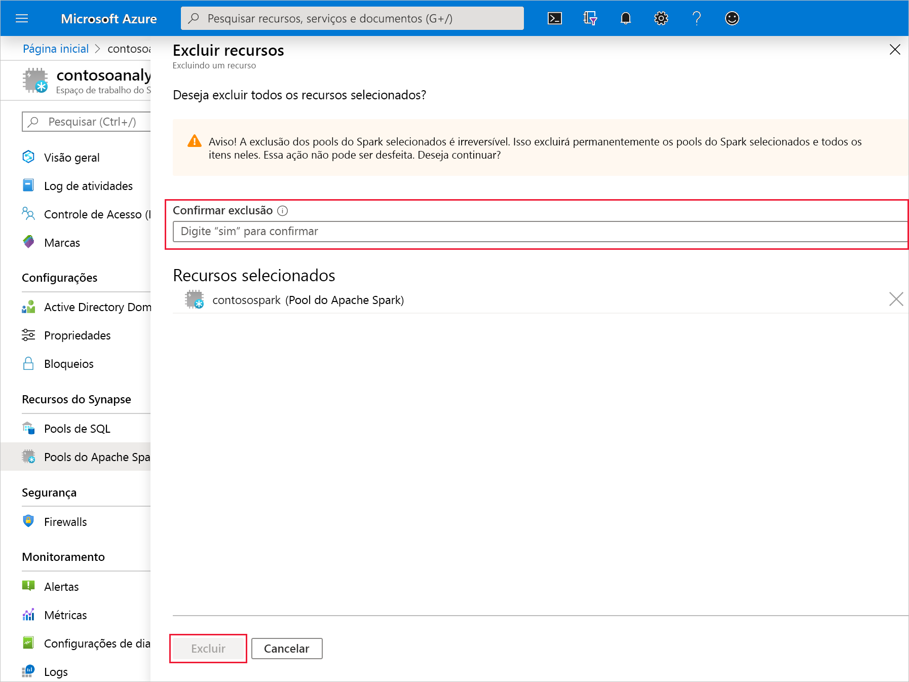

# Início Rápido: Criar um Pool do Apache Spark (versão prévia)

O Synapse Analytics oferece vários mecanismos de análise para ajudar você a ingerir, transformar, modelar, analisar e fornecer seus dados. Um Pool do Apache Spark oferece funcionalidades de software livre de computação de Big Data. Depois que você criar um Pool do Apache Spark em seu workspace do Synapse, os dados poderão ser carregados, modelados, processados e fornecidos para obter insights.

Neste início rápido, você aprenderá a usar o portal do Azure para criar um Pool do Apache Spark em um workspace do Synapse.

> [!IMPORTANT]
> A cobrança das instâncias do Spark será proporcional por minuto, independentemente de elas estarem sendo usadas ou não. Desligue a instância do Spark depois de terminar de usá-la ou defina um tempo limite curto. Para saber mais, confira a seção **Recursos de limpeza** deste artigo.

Se você não tiver uma assinatura do Azure, [crie uma conta gratuita antes de começar](https:/azure.microsoft.com/free/).

## Pré-requisitos

- Assinatura do Azure - [criar uma gratuitamente](https:/azure.microsoft.com/free/)
- [Workspace do Synapse Analytics](quickstart-create-workspace.md)

## Entre no Portal do Azure

Entre no [Portal do Azure](https:/portal.azure.com/)

## Criar um Pool do Apache Spark

1. No workspace do Synapse em que deseja criar o Pool do Apache Spark, clique em **Novo Pool do Apache Spark**.

2. Insira os seguintes detalhes na guia **Informações Básicas**:

    |Configuração | Valor sugerido | Descrição |
    | :------ | :-------------- | :---------- |
    | **Nome do Pool do Apache Spark** | Um nome de pool válido | Esse é o nome que o Pool do Apache Spark terá. |
    | **Tamanho do nó** | Pequeno (4 vCPU/32 GB) | Defina isso com o menor tamanho para reduzir os custos deste início rápido |
    | **Autoescala** | habilitado | Mantenha essa configuração padrão |
    | **Número de nós** | 3 a 40 | Mantenha essa configuração padrão |
    ||||

    
    > [!IMPORTANT]
    > Observe que há limitações específicas para os nomes que os pools do Apache Spark podem usar. Os nomes precisam conter apenas letras ou números, ter 15 caracteres ou menos, começar com uma letra, ser exclusivos no workspace e não devem conter palavras reservadas.

3. Clique em **Avançar: configurações adicionais** e examine as configurações padrão. Não modifique nenhuma configuração padrão.

4. Clique em **Avançar: marcas**. Não adicione nenhuma marca.

5. Clique em **Revisar + Criar**.

6. Verifique se os detalhes estão corretos com base no que foi inserido anteriormente e clique em **Criar**.

7. Neste ponto, o fluxo de provisionamento de recursos será iniciado, indicando, depois de concluído, 

8. Após a conclusão do provisionamento, se você navegar novamente até o workspace, será mostrada uma nova entrada para o Pool do Apache Spark recém-criado.
 

9. Neste ponto, não há recursos em execução, nenhum custo pelo Spark e você criou metadados sobre as instâncias do Spark que deseja criar.

## Limpar os recursos

Siga as etapas abaixo para excluir o Pool do Apache Spark do workspace.
> [!WARNING]
> A exclusão de um Pool do Apache Spark removerá o mecanismo de análise do workspace. Não será mais possível se conectar ao pool e todas as consultas, os pipelines e os notebooks que usam esse Pool do Apache Spark deixarão de funcionar.

Caso deseje excluir o Pool do Apache Spark, faça o seguinte:

1. Navegue até a folha de pools do Apache Spark no workspace.
2. Escolha o pool do Apache a ser excluído (neste caso, **contosospark**)
3. Selecione **delete**.
 
4. Confirme a exclusão e selecione o botão **Delete**.
 
5. Quando o processo for concluído com êxito, o Pool do Apache Spark não estará mais listado nos recursos do workspace.

Depois que o pool de SQL é criado, ele fica disponível no workspace para carregar dados, processar fluxos, fazer leituras do lake etc.

## Próximas etapas

- Confira [Início Rápido: Criar um Pool do Apache Spark no Synapse Studio usando ferramentas da Web](spark/apache-spark-notebook-create-spark-use-sql.md).
- Confira [Início Rápido: Criar um pool de SQL do Synapse usando o portal do Azure](quickstart-create-sql-pool.md).
