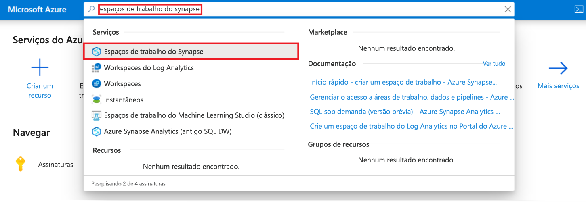
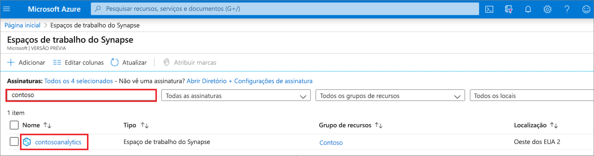
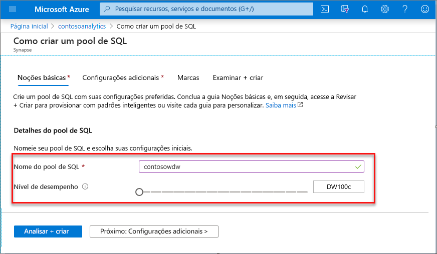
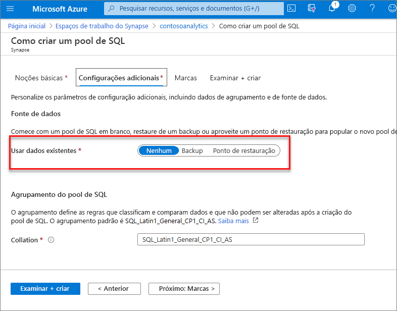
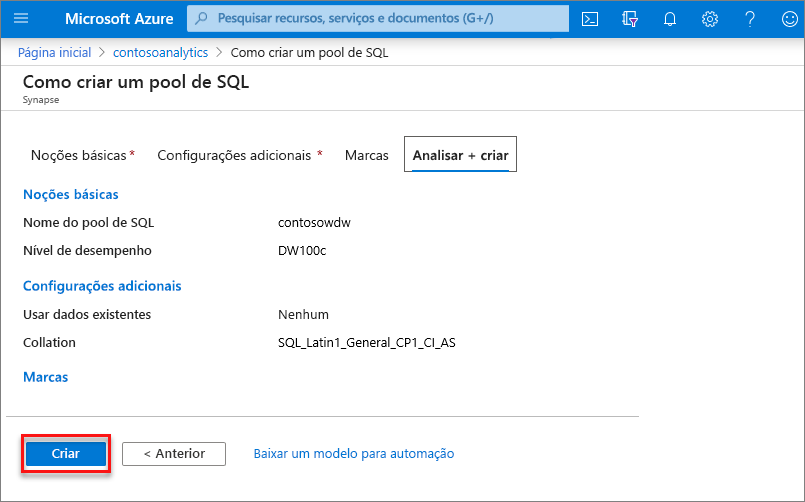
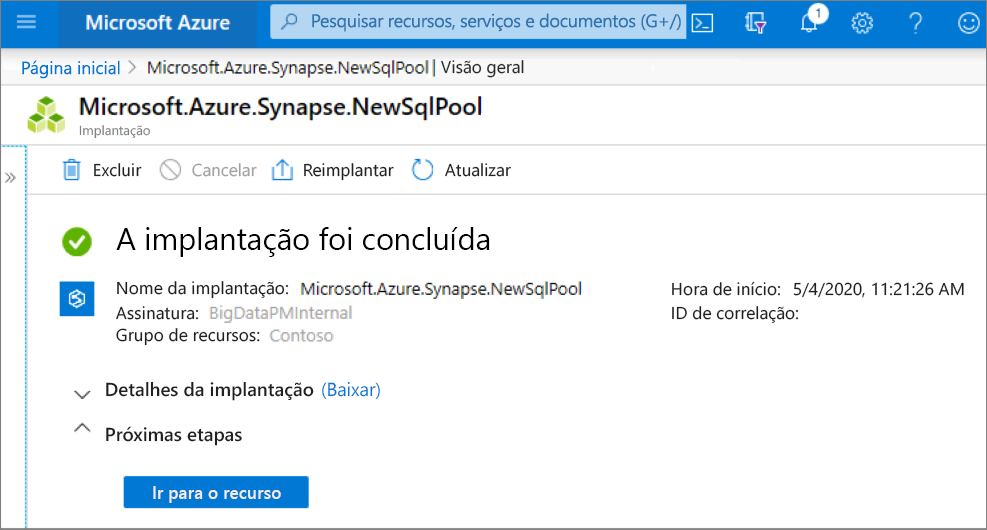
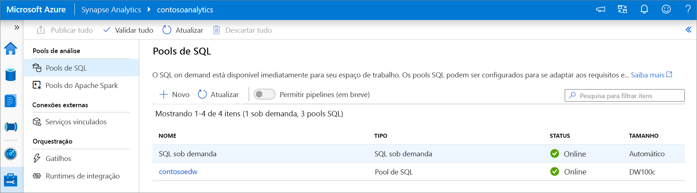
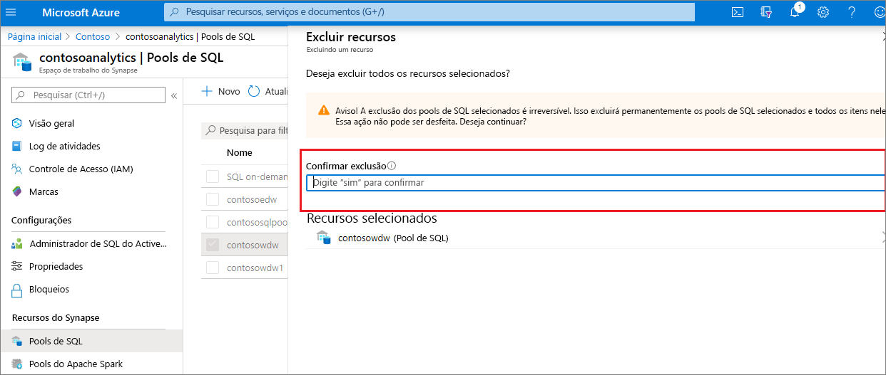

# Início rápido: Criar um pool de SQL dedicado usando o portal do Azure

O Azure Synapse Analytics oferece vários mecanismos de análise para ajudar você a ingerir, transformar, modelar e analisar seus dados. Um pool de SQL dedicado oferece recursos de computação e armazenamento baseados em T-SQL. Após a criação de um pool de SQL dedicado no workspace do Azure Synapse, os dados poderão ser carregados, modelados, processados e entregues para obter insights analíticos mais rapidamente.

Neste início rápido, você aprende a criar um pool de SQL dedicado em um workspace do Azure Synapse usando o portal do Azure.

Se você não tiver uma assinatura do Azure, [crie uma conta gratuita antes de começar](https://azure.microsoft.com/free/).

## Pré-requisitos

- Assinatura do Azure - [criar uma gratuitamente](https://azure.microsoft.com/free/)
- [Workspace do Synapse](./quickstart-create-workspace.md)

## Entre no Portal do Azure

Entre no [Portal do Azure](https://portal.azure.com/)

## Navegue até o workspace do Synapse

1. Navegue até o workspace do Azure Synapse em que o pool de SQL dedicado será criado digitando o nome do serviço (ou o nome do recurso diretamente) na barra de pesquisa.
. 
1. Na lista de workspaces, digite o nome (ou parte do nome) do workspace a ser aberto. Para este exemplo, vamos usar um workspace chamado **contosoanalytics**.

## Criar um pool de SQL dedicado

1. No workspace do Azure Synapse em que você deseja criar o pool de SQL dedicado, selecione o comando **Novo pool de SQL dedicado** na barra superior.

2. Insira os seguintes detalhes na guia **Informações Básicas**:

    | Configuração | Valor sugerido | Descrição |
    | :------ | :-------------- | :---------- |
    | **Nome do pool de SQL dedicado** | Qualquer nome válido | Nome do pool de SQL dedicado. |
    | **Nível de desempenho** | DW100c | Defina para o menor tamanho para reduzir os custos deste início rápido |

  
    

    > [!IMPORTANT]
    > Observe que há limitações específicas para os nomes que os pools de SQL dedicados podem usar. Os nomes não podem conter caracteres especiais, devem ter 15 caracteres ou menos, não conter palavras reservadas e ser exclusivos no workspace.

3. Selecione **Avançar: configurações adicionais**.
4. Selecione **Nenhum** para provisionar o pool de SQL dedicado sem dados. Deixe a ordenação padrão selecionada.

    Se você quiser restaurar o pool de SQL dedicado com base em um ponto de restauração, selecione **Ponto de restauração**. Para obter mais informações sobre como executar uma restauração, confira [Instruções: restaurar um pool de SQL dedicado existente](backuprestore/restore-sql-pool.md)

5. Selecione **Examinar + criar**.
6. Verifique se os detalhes estão corretos com base no que foi inserido anteriormente. Selecione **Criar**.

7. Neste ponto, o fluxo de provisionamento de recursos será iniciado.
 

8. Após a conclusão do provisionamento, ao navegar de volta para o workspace será exibida uma nova entrada para o pool de SQL dedicado recém-criado.
 

Depois que o pool de SQL dedicado for criado, ele estará disponível no workspace para carregar dados, processar fluxos, ler do lake etc.

## Limpar os recursos

Siga as etapas abaixo para excluir o pool de SQL dedicado do workspace.
> [!WARNING]
> A exclusão de um pool de SQL dedicado removerá o mecanismo de análise e os dados armazenados no banco de dados do pool de SQL dedicado excluído do workspace. Não será mais possível se conectar ao pool de SQL dedicado e todas as consultas, os pipelines e os notebooks que leem ou gravam nesse pool de SQL dedicado deixarão de funcionar.

Se você quiser excluir o pool de SQL dedicado, execute as seguintes etapas:

1. Navegue até a folha de pools de SQL na folha do workspace
1. Selecione o pool de SQL dedicado a ser excluído (nesse caso, **contosowdw**)
1. Depois de selecionar, clique em **excluir**
1. Confirme a exclusão e pressione o botão **Excluir** 
1. Quando o processo for concluído com sucesso, o pool de SQL dedicado não será mais listado nos recursos do workspace.

## Próximas etapas

- Confira [Início Rápido: criar um Pool do Apache Spark sem servidor no Synapse Studio usando ferramentas da Web](quickstart-apache-spark-notebook.md).
- Confira [Início Rápido: criar um pool do Apache Spark sem servidor usando o portal do Azure](quickstart-create-apache-spark-pool-portal.md).
