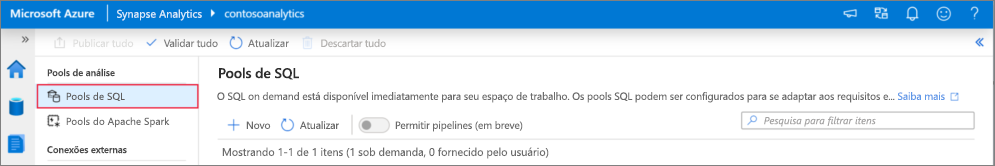
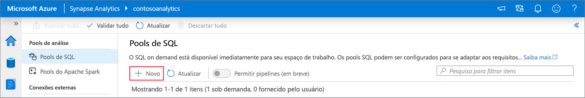
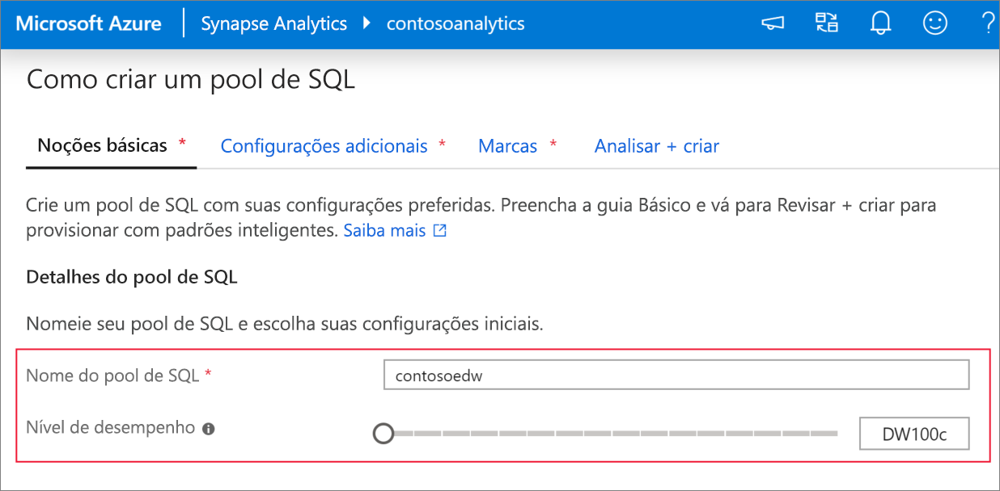
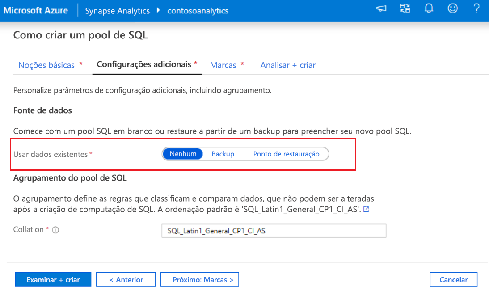
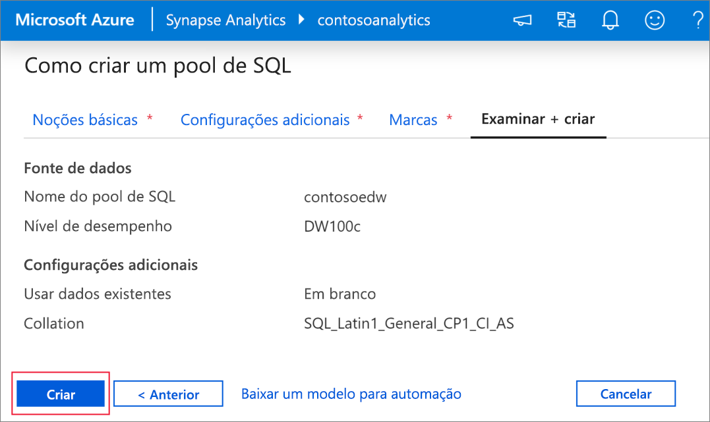
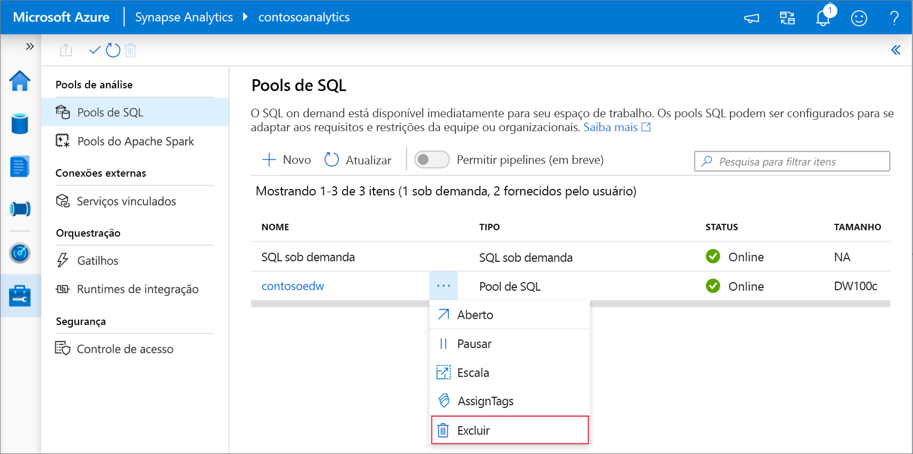

# Início Rápido: Criar um pool de SQL dedicado usando o Synapse Studio

O Azure Synapse Analytics oferece vários mecanismos de análise para ajudar você a ingerir, transformar, modelar e analisar seus dados. Um pool de SQL dedicado oferece recursos de computação e armazenamento baseados em T-SQL. Após a criação de um pool de SQL dedicado no workspace do Azure Synapse, os dados poderão ser carregados, modelados, processados e entregues para obter insights analíticos mais rapidamente.

Este início rápido descreve as etapas para criar um pool de SQL dedicado em um workspace do Azure Synapse usando o Synapse Studio.

Se você não tiver uma assinatura do Azure, [crie uma conta gratuita antes de começar](https://azure.microsoft.com/free/).

## Pré-requisitos

- Assinatura do Azure - [criar uma gratuitamente](https://azure.microsoft.com/free/)
- [Workspace do Synapse](quickstart-create-workspace.md)

## Entre no Portal do Azure

Entre no [Portal do Azure](https://portal.azure.com/)

## Navegue até o workspace do Synapse

1. Navegue até o workspace do Azure Synapse em que o pool de SQL dedicado será criado digitando o nome do serviço (ou o nome do recurso diretamente) na barra de pesquisa.

    
1. Na lista de workspaces, digite o nome (ou parte do nome) do workspace a ser aberto. Para este exemplo, vamos usar um workspace chamado **contosoanalytics**.

    

## Iniciar o Synapse Studio

1. Na visão geral do workspace, selecione a **URL da Web do workspace** para iniciar o Synapse Studio.

    

## Criar um pool de SQL dedicado no Synapse Studio

1. Na home page do Synapse Studio, navegue até o **Hub de Gerenciamento** no painel de navegação esquerdo selecionando o ícone **Gerenciar**.

    

1. Uma vez no Hub de Gerenciamento, navegue até a seção **Pools de SQL** para ver a lista atual de pools de SQL disponíveis no workspace.

    

1. Selecione o comando **+ Novo** e o novo assistente de criação de pool de SQL será exibido. 

    

1. Insira os seguintes detalhes na guia **Informações Básicas**:

    | Configuração | Valor sugerido | Descrição |
    | :------ | :-------------- | :---------- |
    | **Nome do pool de SQL** | contosoedw | Esse é o nome que o pool de SQL dedicado terá. |
    | **Nível de desempenho** | DW100c | Defina isso com o menor tamanho para reduzir os custos deste início rápido |

    
    > [!IMPORTANT]
    > Observe que há limitações específicas para os nomes que os pools de SQL dedicados podem usar. Os nomes não podem conter caracteres especiais, devem ter 15 caracteres ou menos, não conter palavras reservadas e ser exclusivos no workspace.

4. Na próxima guia, **Configurações adicionais**, selecione **nenhum** para provisionar o pool de SQL sem dados. Deixe a ordenação padrão conforme selecionada.

    Se você quiser restaurar o pool de SQL dedicado com base em um ponto de restauração, selecione **Ponto de restauração**. Para obter mais informações sobre como executar uma restauração, confira [Instruções: restaurar um pool de SQL dedicado existente](backuprestore/restore-sql-pool.md)

    

1. Por enquanto não adicionaremos marcas, assim, selecione **Examinar + criar**.

1. Na guia **Revisar + criar**, verifique se os detalhes estão corretos com base no que foi inserido anteriormente e clique em **criar**. 

    

1. Neste ponto, o fluxo de provisionamento de recursos será iniciado.

1. Após a conclusão do provisionamento, ao navegar de volta para o workspace, aparecerá uma nova entrada para o pool de SQL recém-criado.

    

1. Depois que o pool de SQL dedicado for criado, ele estará disponível no workspace para carregar dados, processar fluxos, ler do lake etc.

## Limpar um pool de SQL dedicado usando o Synapse Studio    

Siga as etapas abaixo para excluir o pool de SQL dedicado do workspace usando o Synapse Studio.
> [!WARNING]
> A exclusão de um pool de SQL dedicado removerá o mecanismo de análise do workspace. Não será mais possível se conectar ao pool e todas as consultas, os pipelines e os scripts que usam esse pool de SQL dedicado deixarão de funcionar.

Caso deseje excluir o pool de SQL dedicado, faça o seguinte:

1. Navegue até os pools de SQL no Hub de Gerenciamento no Synapse Studio.
1. Selecione as reticências no pool de SQL dedicado a ser excluído (nesse caso, **contosoedw**) para mostrar os comandos do pool de SQL dedicado:

    
1. Selecione **delete**.
1. Confirme a exclusão e selecione o botão **Delete**.
1. Quando o processo for concluído com sucesso, o pool de SQL dedicado não será mais listado nos recursos do workspace.

## Próximas etapas
 
- Confira [Início Rápido: Criar um notebook do Apache Spark](quickstart-apache-spark-notebook.md).
- Confira [Início Rápido: criar um pool de SQL dedicado usando o portal do Azure](quickstart-create-sql-pool-portal.md).
