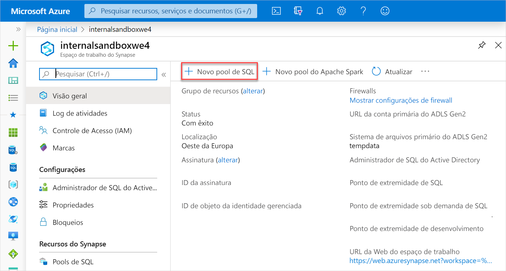
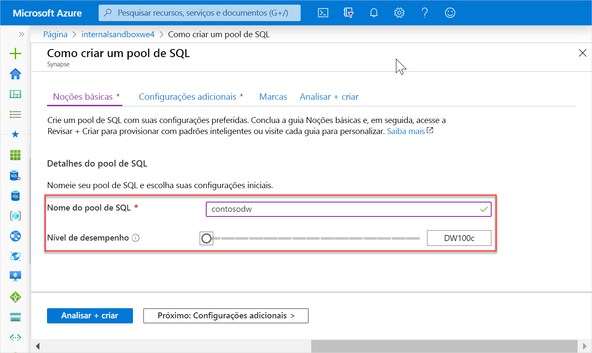
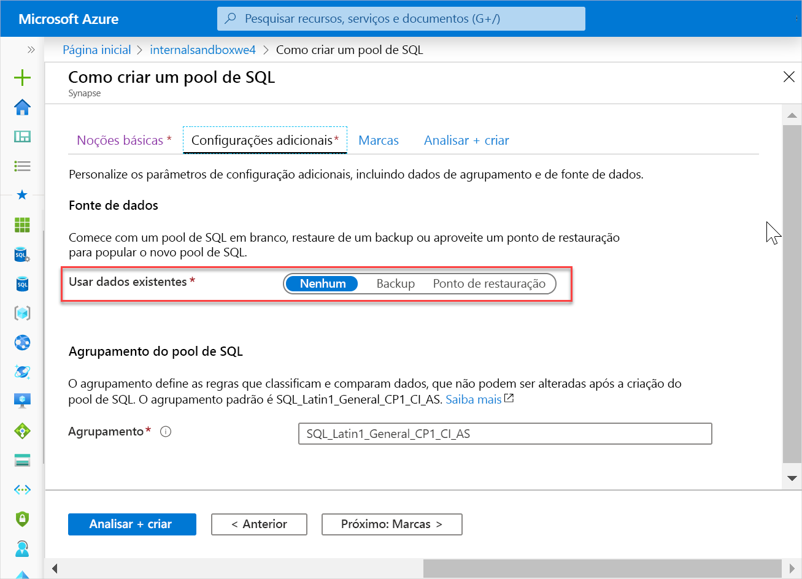
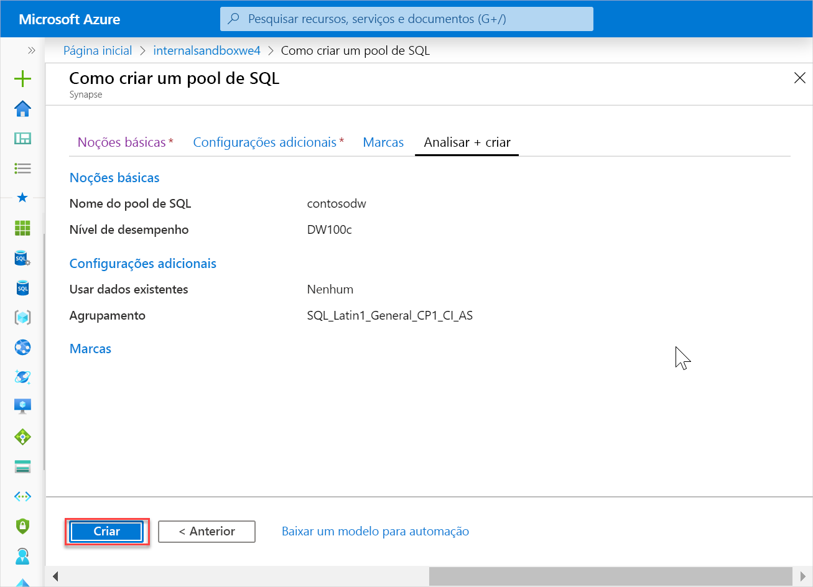
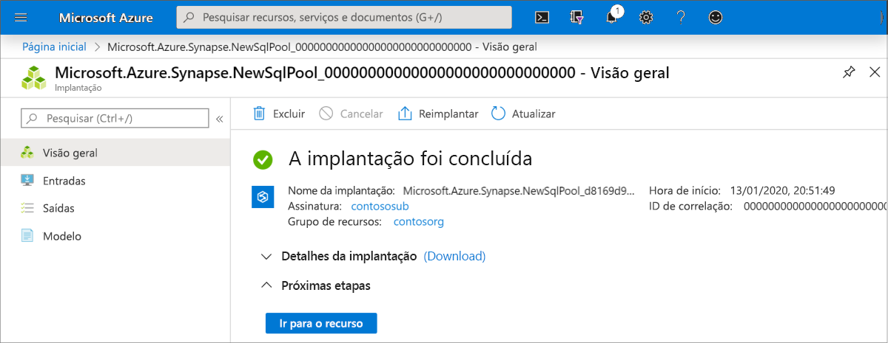
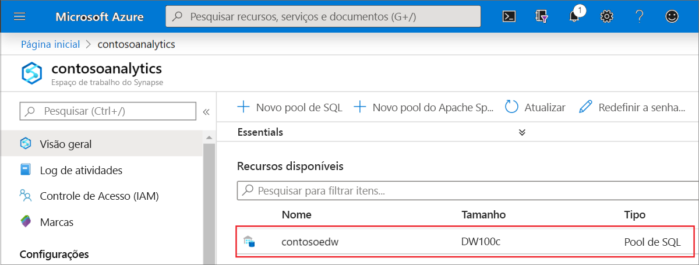
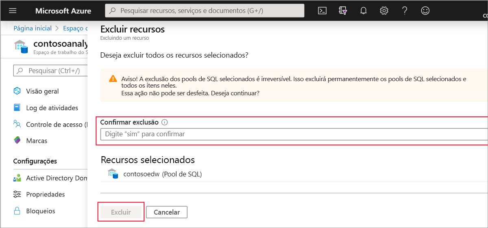

# Início Rápido: Criar um pool de SQL do Synapse

O Azure Synapse Analytics oferece vários mecanismos de análise para ajudá-lo a ingerir, transformar, modelar, analisar e fornecer seus dados. Um pool de SQL oferece recursos de computação e armazenamento baseados em T-SQL. Depois de criar um pool de SQL em seu workspace do Synapse, os dados podem ser carregados, modelados, processados e utilizados para obter informações.

Neste guia de início rápido, você aprende a criar um pool de SQL em um workspace do Synapse usando o portal do Azure.

Se você não tiver uma assinatura do Azure, [crie uma conta gratuita antes de começar](https://azure.microsoft.com/free/).

## Pré-requisitos

[Workspace do Synapse](quickstart-create-workspace.md)

## Entre no Portal do Azure

Entre no [Portal do Azure](https://portal.azure.com/)

## Criar pool de SQL

1. No workspace do Synapse em que você deseja criar o pool de SQL, clique no comando **Novo pool de SQL** na barra superior.

2. Insira os seguintes detalhes na guia **Informações Básicas**:

    | Configuração | Valor sugerido | Descrição |
    | :------ | :-------------- | :---------- |
    | **Nome do pool de SQL** | Qualquer nome válido | Nome do pool de SQL. |
    | **Nível de desempenho** | DW100c | Defina para o menor tamanho para reduzir os custos deste início rápido |
    ||||
  
    
    > [!IMPORTANT]
    > Observe que há limitações específicas para os nomes que os pools de SQL podem usar. Os nomes não podem conter caracteres especiais, devem ter 15 caracteres ou menos, não conter palavras reservadas e ser exclusivos no workspace.

3. Clique em **Avançar: configurações adicionais**.
4. Selecione **Nenhum** para provisionar o pool de SQL sem dados. Deixe a ordenação padrão selecionada.

5. Clique em **Revisar + Criar**.
6. Verifique se os detalhes estão corretos com base no que foi inserido anteriormente e clique em **Criar**.

7. Neste ponto, o fluxo de provisionamento de recursos será iniciado.
 

8. Após a conclusão do provisionamento, ao navegar de volta para o workspace, aparecerá uma nova entrada para o pool de SQL recém-criado.
 

## Limpar os recursos

Siga as etapas abaixo para excluir o pool de SQL do workspace.
> [!WARNING]
> A exclusão de um pool de SQL removerá o mecanismo de análise e os dados armazenados no banco de dados do pool de SQL excluído do workspace. Não será mais possível se conectar ao pool de SQL e todas as consultas, pipelines e notebooks que leem ou gravam nesse pool de SQL deixarão de funcionar.

Se você quiser excluir o pool de SQL, realize as seguintes etapas:

1. Navegue até a folha de pools de SQL na folha do workspace
1. Selecione o pool de SQL a ser excluído (nesse caso, **contosoedw**)
1. Selecione-o e pressione **excluir**.
1. Confirme a exclusão e selecione o botão **Delete**.
 
1. Quando o processo for concluído com êxito, o pool de SQL não será mais listado nos recursos do workspace.

Depois que o pool de SQL for criado, ele estará disponível no workspace para carregar dados, processar fluxos, ler no lake etc.

## Próximas etapas

- Confira [Início Rápido: Criar um Pool do Apache Spark no Synapse Studio usando ferramentas da Web](quickstart-apache-spark-notebook.md).
- Confira [Início Rápido: Criar um Pool do Apache Spark usando o portal do Azure](quickstart-create-apache-spark-pool.md).
