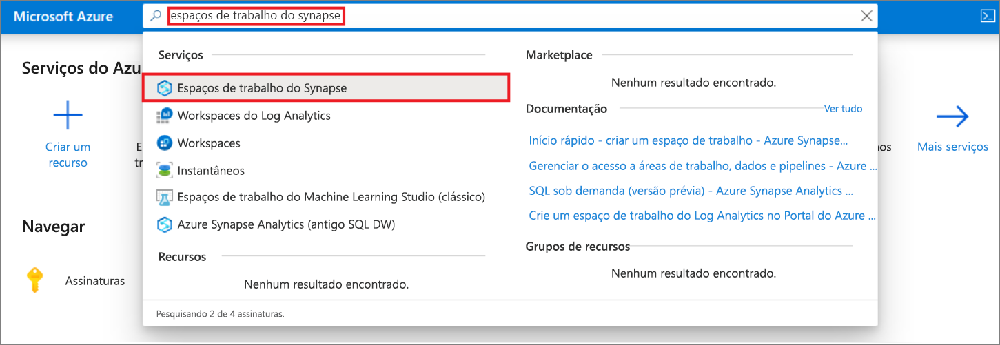
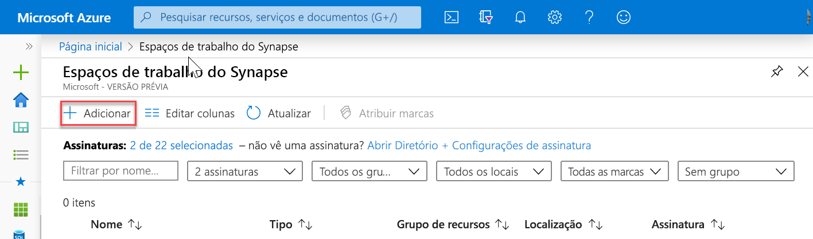
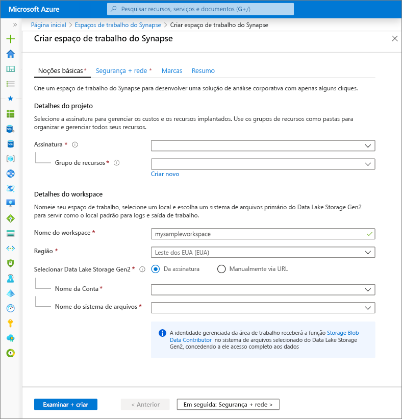
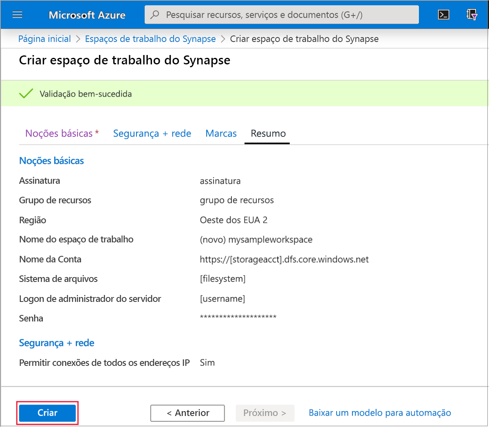
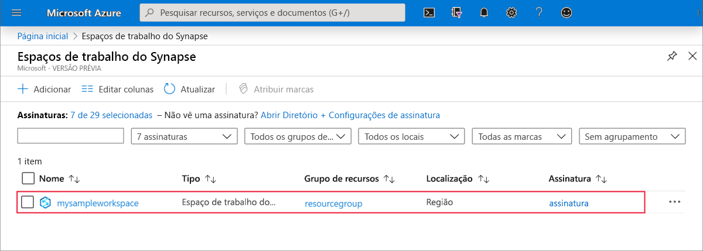
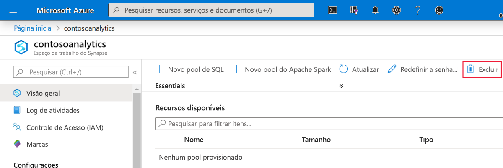
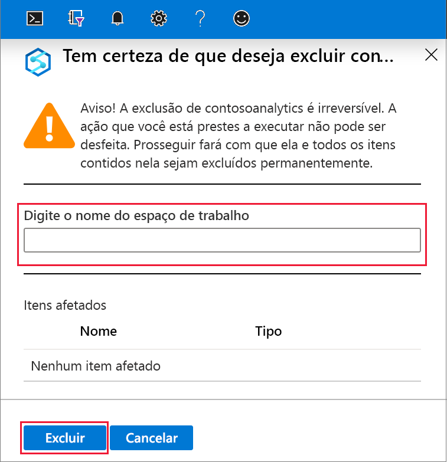

# Início Rápido: Criar um workspace do Azure Synapse Analytics (versão prévia)

Este início rápido descreve as etapas necessárias para criar um workspace do Azure Synapse usando o portal do Azure.

Se você não tiver uma assinatura do Azure, [crie uma conta gratuita antes de começar](https://azure.microsoft.com/free/).

## Pré-requisitos

- [Conta de armazenamento do Azure Data Lake Storage Gen2](../storage/common/storage-account-create.md?toc=/azure/synapse-analytics/toc.json&bc=/azure/synapse-analytics/breadcrumb/toc.json)

## Entre no Portal do Azure

Entre no [Portal do Azure](https://portal.azure.com/)

## Criar um workspace do Azure Synapse usando o portal do Azure

1. No painel de pesquisa do Microsoft Azure, insira **workspace do Synapse** e escolha esse serviço.
.
2. Na página **Workspaces do Synapse**, clique em **+ Adicionar**.
.
3. Preencha o formulário do **workspace do Azure Synapse** com as seguintes informações:

    | Configuração | Valor sugerido | Descrição |
    | :------ | :-------------- | :---------- |
    | **Assinatura** | *Sua assinatura* | Para obter detalhes sobre suas assinaturas, consulte [Assinaturas](https://account.windowsazure.com/Subscriptions). |
    | **Grupo de recursos** | *Qualquer grupo de recursos* | Para ver os nomes do grupo de recursos válidos, consulte [Regras e restrições de nomenclatura](/azure/architecture/best-practices/resource-naming?toc=/azure/synapse-analytics/toc.json&bc=/azure/synapse-analytics/breadcrumb/toc.json&view=azure-sqldw-latest). |
    | **Nome do workspace** | mysampleworkspace | Especifica o nome do workspace, que também será usado em pontos de extremidade de conexão.|
    | **Região** | Leste dos EUA 2 | Especifica a localização do workspace.|
    | **Data Lake Storage Gen2** | Conta: `storage account name`   Sistema de arquivos: `root file system to use` | Especifica o nome da conta de armazenamento do ADLS Gen2 a ser usado como armazenamento primário e o sistema de arquivos a ser usado.|
    ||||

    .

    A conta de armazenamento pode ser selecionada em:
    - Uma lista de contas do ADLS Gen2 disponíveis na sua assinatura
    - Inserida manualmente usando o nome da conta

    > [!IMPORTANT]
    > O workspace do Azure Synapse precisa conseguir fazer leituras e gravações na conta do ADLS Gen2 selecionada. Além disso, para qualquer conta de armazenamento vinculada como a conta de armazenamento primária, você precisa ter habilitado **namespace hierárquico** na criação da conta de armazenamento.
    >
    > Abaixo dos campos de seleção do ADLS Gen2, há uma observação indicando que a identidade gerenciada do workspace receberá a função **Colaborador de Dados do Blob de Armazenamento** no sistema de arquivos selecionado do Data Lake Storage Gen2, permitindo acesso completo.

4. (Opcional) Modifique um dos padrões da guia **Segurança + rede**:
5. (Opcional) Adicione marcas na guia **Marcas**.
6. A guia **Resumo** executará as validações necessárias para verificar se o workspace pode ser criado com êxito. Depois que a validação for executada com êxito, selecione **Criar** .
7. Depois que o processo de provisionamento de recursos for concluído com êxito, você verá uma entrada para o workspace criado na lista de workspaces do Synapse. .

## Limpar os recursos

Siga as etapas abaixo para excluir o workspace do Azure Synapse.
> [!WARNING]
> A exclusão de um workspace do Azure Synapse removerá os mecanismos de análise e os dados armazenados no banco de dados dos metadados do workspace e dos pools de SQL independentes. Não será mais possível se conectar aos pontos de extremidade do SQL e do Apache Spark. Todos os artefatos de código serão excluídos (consultas, notebooks, definições de trabalho e pipelines).
>
> A exclusão do workspace **não** afetará os dados do Data Lake Storage Gen2 vinculados ao workspace.

Caso deseje excluir o workspace do Azure Synapse, conclua as seguintes etapas:

1. Navegue até o workspace do Azure Synapse a ser excluído.
1. Selecione **delete** na barra de comandos.
 
1. Confirme a exclusão e selecione o botão **Delete**.
 
1. Quando o processo for concluído com êxito, o workspace do Azure Synapse não será mais mostrado na lista de workspaces.

## Próximas etapas

Em seguida, você poderá [criar pools de SQL](quickstart-create-sql-pool.md) ou [criar pools do Apache Spark](quickstart-create-apache-spark-pool.md) para começar a analisar e explorar seus dados.
