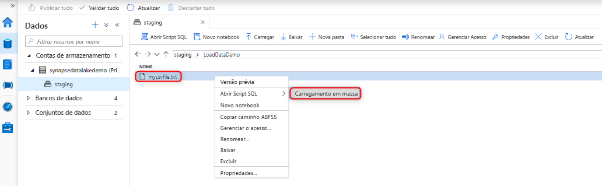
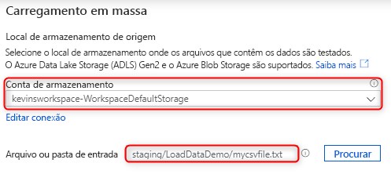
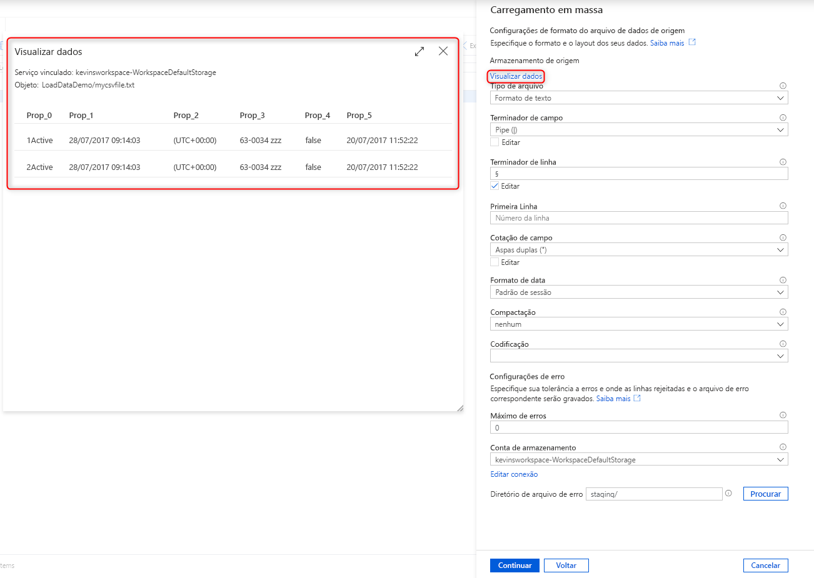
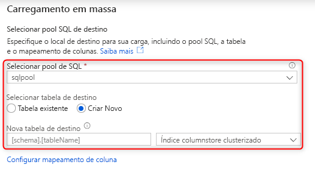
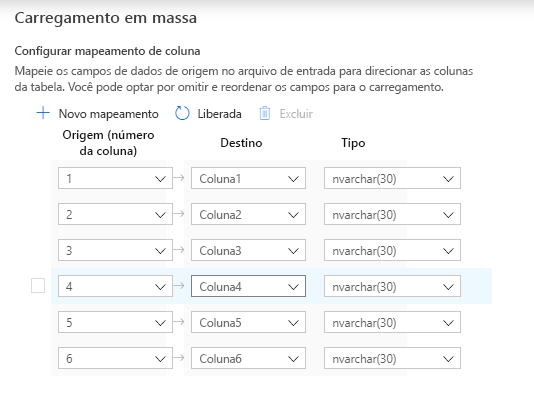
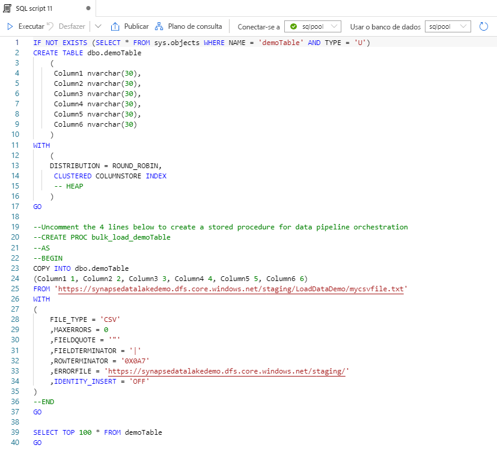

# Início Rápido: Carregamento em massa com o Synapse Studio

Carregar dados é fácil com o assistente de Carregamento em Massa no Synapse Studio. O Synapse Studio é um recurso do Azure Synapse Analytics. O assistente de Carregamento em Massa orientará você pela criação de um script T-SQL com a instrução [COPY](/sql/t-sql/statements/copy-into-transact-sql?view=azure-sqldw-latest&preserve-view=true) para carregar os dados em massa em um pool de SQL dedicado. 

## Pontos de entrada para o assistente de Carregamento em Massa

Carregue os dados em massa clicando com o botão direito do mouse na seguinte área do Synapse Studio: um arquivo ou uma pasta de uma conta de armazenamento do Azure que esteja anexada ao seu workspace.

## Pré-requisitos

- O assistente gera uma instrução COPY, que usa a passagem do Azure AD (Azure Active Directory) para autenticação. Seu [usuário do Azure AD precisará ter acesso](./sql-data-warehouse/quickstart-bulk-load-copy-tsql-examples.md#d-azure-active-directory-authentication) ao workspace com, no mínimo, a função Colaborador de Dados do Blob de Armazenamento do Azure na conta do Azure Data Lake Storage Gen2. 

- Você precisará ter as [permissões necessárias para usar a instrução COPY](/sql/t-sql/statements/copy-into-transact-sql?view=azure-sqldw-latest&preserve-view=true#permissions) e as permissões CREATE TABLE se estiver criando uma tabela na qual os dados serão carregados.

- O serviço vinculado associado à conta do Data Lake Storage Gen2 *precisará ter acesso ao arquivo ou à pasta* para carregamento. Por exemplo, se o mecanismo de autenticação do serviço vinculado for uma identidade gerenciada, a identidade gerenciada do workspace precisará ter, no mínimo, a permissão Leitor de Dados do Blob de Armazenamento na conta de armazenamento.

- Se uma rede virtual estiver habilitada no seu workspace, verifique se o runtime integrado associado aos serviços vinculados da conta do Data Lake Storage Gen2 para a localização do arquivo de erro e dos dados de origem tem a criação interativa habilitada. A criação interativa é necessária para a detecção de esquema automático, a visualização do conteúdo do arquivo de origem e a busca de contas de armazenamento do Data Lake Storage Gen2 no assistente.

## Etapas

1. No painel **Localização de armazenamento de origem**, selecione a conta de armazenamento e o arquivo ou a pasta da qual os dados estão sendo carregados. O assistente tenta automaticamente detectar arquivos Parquet e de texto delimitado (CSV), incluindo o mapeamento de campos de origem do arquivo para os tipos de dados SQL de destino apropriados. 

   

2. Selecione as configurações de formato de arquivo, incluindo as configurações de erro para quando houver linhas rejeitadas durante o processo de carregamento em massa. Selecione também **Visualizar dados** para ver como a instrução COPY analisará o arquivo a fim de ajudar você a definir as configurações de formato de arquivo. Escolha **Visualizar dados** sempre que você alterar uma configuração de formato de arquivo para ver como a instrução COPY analisará o arquivo com a configuração atualizada.

    

   > [!NOTE]  
   >
   > - O assistente de Carregamento em Massa não dá suporte à visualização dos dados com terminadores de campo de vários caracteres. Quando você especificar um terminador de campo de vários caracteres, o assistente visualizará os dados em uma só coluna. 
   > - Quando você escolher **Inferir nomes de coluna**, o assistente de Carregamento em Massa analisará os nomes das colunas da primeira linha especificada pelo campo **Primeira linha**. O assistente de Carregamento em Massa incrementará automaticamente o valor `FIRSTROW` na instrução COPY em 1 para ignorar essa linha de cabeçalho. 
   > - Há suporte para a especificação de terminadores de linha de vários caracteres na instrução COPY. No entanto, o assistente de Carregamento em Massa não dá suporte a ela e gera um erro.

3. Selecione o pool de SQL dedicado que você está usando para o carregamento, incluindo se a carga será para uma tabela nova ou existente.
   
4. Escolha **Configurar mapeamento de coluna** para verificar se você tem o mapeamento de coluna apropriado. Observe que os nomes de colunas serão detectados automaticamente se você tiver habilitado a opção **Inferir nomes de coluna**. Para novas tabelas, a configuração do mapeamento de coluna é crítica para atualizar os tipos de dados da coluna de destino.

   
5. Selecione **Abrir script**. Um script T-SQL é gerado com a instrução COPY para o carregamento por meio do seu data lake.
   

## Próximas etapas

- Confira o artigo sobre a [instrução COPY](/sql/t-sql/statements/copy-into-transact-sql?view=azure-sqldw-latest&preserve-view=true#syntax) para obter mais informações sobre as funcionalidades dela.
- Confira o artigo de [visão geral sobre o carregamento de dados](./sql-data-warehouse/design-elt-data-loading.md#what-is-elt) para obter informações sobre como usar um processo ETL (extração, transformação e carregamento).
