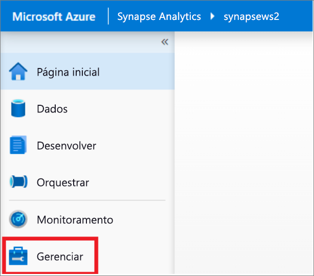
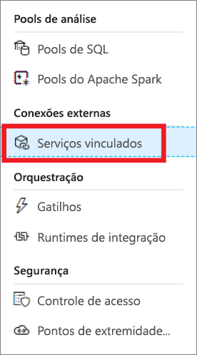
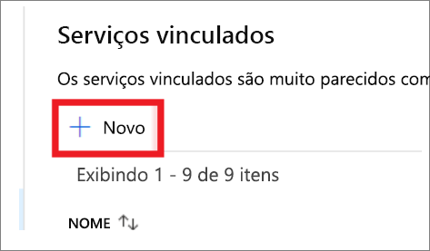
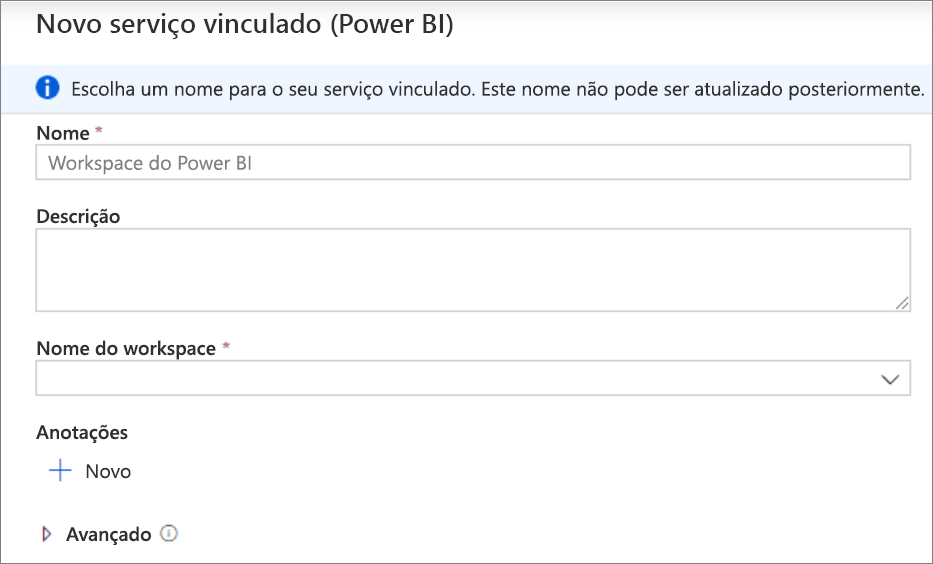
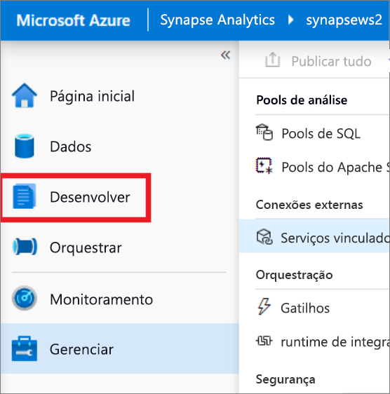
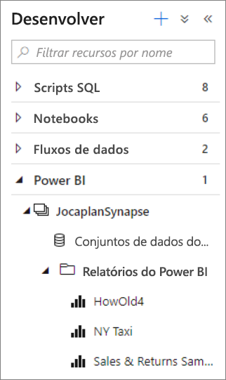
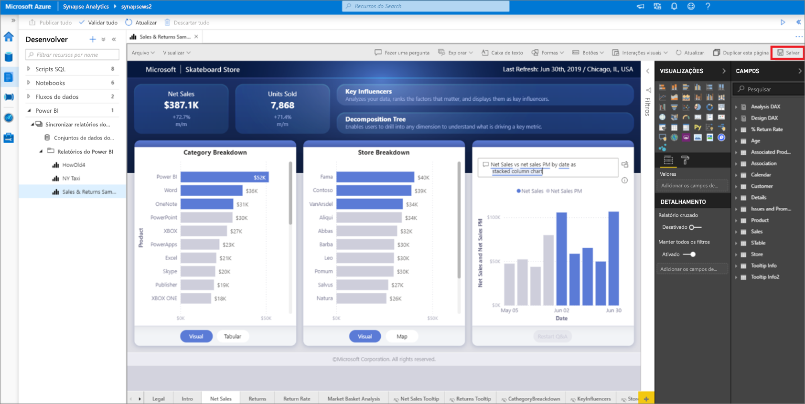

# Início Rápido: Vincular um workspace do Power BI a um workspace do Synapse

Neste início rápido, você aprenderá a conectar um workspace do Power BI a um workspace do Azure Synapse Analytics para criar relatórios e conjunto de dados do Power BI por meio do Synapse Studio.

Se você não tiver uma assinatura do Azure, [crie uma conta gratuita antes de começar](https://azure.microsoft.com/free/).

## Pré-requisitos

- [Criar um workspace do Azure Synapse e uma conta de armazenamento associada](quickstart-create-workspace.md)
- [Um workspace do Power BI Professional ou Premium](/power-bi/service-create-the-new-workspaces)

## Vincular o workspace do Power BI ao workspace do Synapse

1. Começando no Synapse Studio, clique em **Gerenciar**.

    

2. Em **Conexões externas**, clique em **Serviços vinculados**.

    

3. Clique em **+ Novo**.

    

4. Clique em **Power BI** e depois em **Continuar**.

    

5. Insira um nome para o serviço vinculado e selecione um workspace na lista suspensa.

    

6. Clique em **Criar**.

## Exibir o workspace do Power BI no Synapse Studio

Depois que seus workspaces estiverem vinculados, você poderá navegar em seus conjuntos de dados do Power BI e editar/criar relatórios do Power BI por meio do Synapse Studio.

1. Clique em **Desenvolver**.

    

2. Expanda o Power BI e o workspace que você deseja usar.

    

Novos relatórios podem ser criados clicando em **+** , na parte superior da guia **Desenvolver**. Os relatórios existentes podem ser editados clicando em seus respectivos nomes. Todas as alterações salvas serão gravadas de volta no workspace do Power BI.

## Próximas etapas

Saiba mais sobre [Como criar relatórios do Power BI em arquivos armazenados no Armazenamento do Azure](sql/tutorial-connect-power-bi-desktop.md).